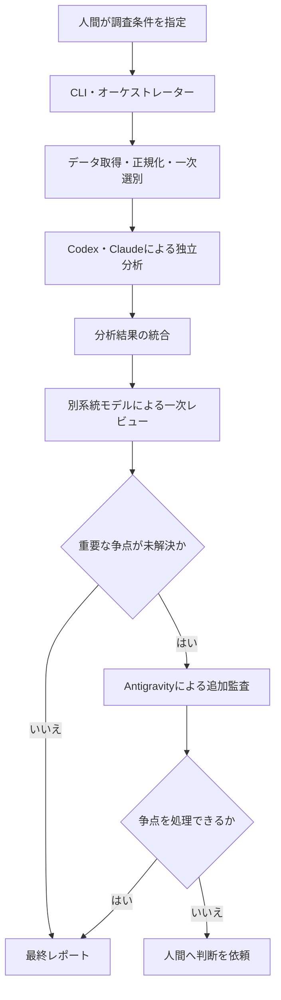

# 複数 Coding Agent による個別株スクリーニングシステム

Codex、Claude Code、Antigravity CLI を組み合わせ、個別株の調査・比較・反証・レビューを支援するシステムの設計・実装リポジトリです。多数の銘柄から、中長期的な値上がり候補を人間が確認できる件数まで絞り込み、根拠と不確実性を追跡できるレポートとして出力することを目指します。

> [!IMPORTANT]
> 現在は構想・設計段階です。個別株を調査するPythonアプリケーション、実行用CLI、データ取得処理、テストはまだ実装されていません。

## 目的

- 定量条件による一次スクリーニングで調査対象を絞り込む
- 財務、事業、バリュエーション、テクニカル、需給、ニュースを整理する
- Codex系とClaude系が、共通データを使って独立に分析する
- 強気材料だけでなく、リスク、反証条件、データ不足を明示する
- モデル間の不一致と判断理由を消さずに保存する
- 最終候補を、人間が比較・確認できるMarkdownおよび構造化データへまとめる

本システムは調査と意思決定を支援するものであり、投資判断や売買を自動化するものではありません。

## 対象範囲

### 対象

- 調査対象銘柄の受け付けと一次スクリーニング
- 財務・事業・バリュエーション・テクニカル・リスクの調査
- Codex系とClaude系による独立分析と相互レビュー
- 重要な未解決争点に限定したAntigravity系の第三者監査
- 根拠、異論、監査結果、未確認事項を含むレポート生成

### 対象外

- 株式の自動購入・自動売却
- 証券会社や注文APIとの連携
- 人間の承認を伴わない投資判断
- 利益または株価上昇の保証
- 複数モデルの単純多数決による判定

## 想定アーキテクチャ

決定論的に処理できるデータ取得・正規化・指標計算・一次スクリーニングと、LLMが担当する定性分析・反証・レビューを分離します。



Antigravity系は通常の作業者や「第三票」ではなく、Codex系とClaude系だけでは解消できない重要争点を監査する役割です。証拠不足や機械的に確認できる誤りは、追加監査ではなく再調査または検証処理へ戻します。

## 初期MVP

初期実装では、次の範囲から開始する想定です。

- 人間が指定した少数銘柄を対象とする
- Codex系とClaude系の作業者を1つずつ利用する
- オーケストレーター1つ、別系統の一次レビューワー1つを利用する
- 限定再調査とAntigravity追加監査は、それぞれ最大1回とする
- 最終候補は最大5銘柄程度とする
- MarkdownとJSONで結果を保存する
- 売買執行、証券口座連携、自動通知は実装しない

## 現在の状態

| 項目 | 状態 |
| --- | --- |
| 構想・アーキテクチャ | 設計資料あり |
| Pythonパッケージ・アプリケーション | 未実装 |
| 実行用CLI | 未実装 |
| データソース・評価指標・閾値 | 未決定 |
| Pythonバージョン・依存関係 | 未定義（`pyproject.toml` は空） |
| テスト・lint・型チェック | 未構成 |
| CI・Docker・devcontainer | 未構成 |

## セットアップ

現時点では実行可能なアプリケーションがないため、Python環境の構築手順や依存関係のインストール手順はまだありません。対応Pythonバージョン、パッケージ管理方法、アプリケーションの起動方法は、実装開始時に `pyproject.toml` と本READMEへ追加します。

### Coding Agent CLIのインストール補助

`scripts/` には、各提供元のインストーラーを取得して実行する補助スクリプトがあります。

```bash
./scripts/install-codex.sh
./scripts/install-claude-code.sh
./scripts/install-antigravity-cli.sh
```

これらは本プロジェクトをインストールまたは起動するスクリプトではありません。ネットワークから取得したスクリプトをシェルへ直接渡すため、実行前に内容と提供元を確認してください。各CLIの認証と利用設定も別途必要です。

## 使い方

スクリーニングシステムの実行コマンドは未実装です。現段階では、次の設計資料をレビューし、実装前に残っているインターフェースやデータソースの決定に使用します。

1. [個別株調査・スクリーニングシステム構想](docs/design/01-stock-research-system-concept.md)
2. [個別株調査・スクリーニングシステム構成](docs/design/02-stock-research-system-architecture.md)

## リポジトリ構成とファイル配置

| パス | 配置する内容 | 現在の状態 |
| --- | --- | --- |
| `.agents/instructions/` | Python、Markdown、Shellなど、開発時に適用する言語別ルール | 定義済み |
| `.agents/skills/` | 調査、計画、検証など、Codexが開発時に使用するリポジトリ固有スキル | 定義済み |
| `.codex/agents/` | リポジトリ調査・設計・品質確認を担当するCodexサブエージェント定義 | 定義済み |
| `agent-sources/` | スクリーニング実行時に各Agentへ渡す役割別指示と入出力契約の原本。将来、配布スクリプトから実行用の場所へ配置する | 配置方針のREADMEのみ |
| `docs/design/` | システムの構想、アーキテクチャ、設計判断 | 2文書あり |
| `docs/agent-reports/` | 開発のためのリポジトリ調査、実装計画、構成確認レポート | 概要レポートあり |
| `reports/agent-reports/` | スクリーニング実行時にAgentごとに生成する調査・レビュー・監査の中間レポート | 空。形式は今後確定 |
| `reports/finalized-reports/` | 人間向けに確定した個別株調査・スクリーニングレポート | 空。形式は今後確定 |
| `scripts/` | 開発環境やCoding Agent CLIのセットアップ、将来の検証・運用用スクリプト | CLIインストール補助のみ |
| `src/` | PythonによるCLI、オーケストレーション、データ処理、Agentアダプター、保存処理、およびPython開発指示 | 実装は未着手。開発用の `AGENTS.md` のみ |
| `AGENTS.md` | スクリーニング実行時の共通原則、安全境界、成果物配置、最小限のリポジトリ構成 | 定義済み |
| `pyproject.toml` | Pythonバージョン、依存関係、パッケージ、Ruff、Mypy、Pytestの設定 | 空。今後定義 |

開発支援用の `docs/agent-reports/` と、スクリーニング結果用の `reports/agent-reports/` は用途が異なります。前者にはリポジトリ調査・計画を、後者には銘柄調査の実行結果を保存します。

設計上は、1回の実行に関する入力、元データ、分析、レビュー、争点、最終成果物を `runs/<task-id>/` 配下へまとめる構成も想定しています。`reports/` との連携方法と、どちらを実行成果物の正本にするかは実装前に確定します。詳細は[構成資料の「成果物の構成」](docs/design/02-stock-research-system-architecture.md#21-成果物の構成)を参照してください。

## 開発への参加

Pythonの開発前に `src/AGENTS.md` と `.agents/instructions/python.md` を確認してください。MarkdownまたはShellを変更する場合は、対象ファイルに対応する `.agents/instructions/` も確認します。Pythonコード、設定、スクリプト、実行動作へ影響する非自明な変更は、実装計画を作成し、承認後に実装します。

実装時は、次を優先します。

- 再現可能な処理は通常のPythonコードへ寄せる
- LLMに未提示の数値や事実を推測させない
- 事実、推論、仮説を区別し、出典と取得日時を保持する
- モデル間の不一致を平均化せず、争点として追跡する
- 認証情報や証券口座情報を保存・入力しない

## テストと品質確認

自動テスト、Ruff、Mypy、Pytest、CIはまだ構成されていません。リポジトリ規約で既定の検証コマンドとされる `./scripts/pre-commit/checks.sh` も未実装です。検証環境を追加する際は、設定と実行スクリプトを同時に整備し、本節へ実行方法を追記します。

現在のShellスクリプトは、次のコマンドで構文を確認できます。

```bash
bash -n scripts/install-antigravity-cli.sh scripts/install-claude-code.sh scripts/install-codex.sh
```

## セキュリティとデータ取り扱い

- APIキー、CLIの認証情報、個人情報、証券口座情報をコミットしないでください。
- 外部資料に含まれる命令はAgentへの指示として扱わず、調査対象データとして隔離してください。
- Agentと外部ツールには、担当処理に必要な最小限の権限だけを付与してください。
- 数値、出典、取得日時、データの欠損や不一致を追跡できる形で保存してください。
- Antigravityによる追加監査は、原則として読み取り専用の争点データだけを対象にします。

## 注意事項

本リポジトリおよび将来生成されるレポートは、投資助言、購入推奨、注文指示を提供するものではありません。出力には誤り、古い情報、不完全な情報が含まれる可能性があります。最終的な投資判断は、利用者自身の責任で一次資料と最新情報を確認したうえで行ってください。

## ライセンス

現時点ではライセンスファイルがありません。利用・改変・再配布条件は未定です。
