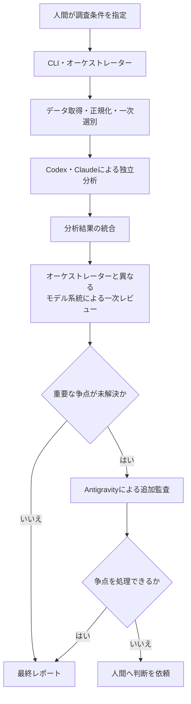

# 複数 Coding Agent による個別株スクリーニングシステム

Codex、Claude Code、Antigravity CLI を組み合わせ、個別株の調査・比較・反証・レビューを支援するシステムの設計・実装リポジトリです。多数の銘柄から、中長期的な値上がり候補を人間が確認できる件数まで絞り込み、根拠と不確実性を追跡できるレポートとして出力することを目指します。

> [!IMPORTANT]
> 現在は詳細解析MVPのデータ・証拠準備を実装している段階です。契約検証基盤、offline設定検証CLIに加え、
> JPX銘柄確認、価格取得・正規化・保存、オフライン再検証、固定期間の価格証拠受入を内部API・CLIで実装済みです。
> 財務・為替・開示等を含む証拠集合の確定と、Agent分析・レビュー・最終レポートを接続するruntimeは未完成です。

## 目的

- 定量条件による一次スクリーニングで調査対象を絞り込む
- 財務、事業、バリュエーション、テクニカル、需給、ニュースを整理する
- Codex系とClaude系が、共通データを使って独立に分析する
- 強気材料だけでなく、リスク、反証条件、データ不足を明示する
- モデル間の不一致と判断理由を消さずに保存する
- 最終候補を、人間が比較・確認できるMarkdownおよび構造化データへまとめる

本システムは調査と意思決定を支援するものであり、投資判断や売買を自動化するものではありません。

## 対象範囲

### 対象

- 調査対象銘柄の受け付けと一次スクリーニング
- 財務・事業・バリュエーション・テクニカル・リスクの調査
- Codex系とClaude系による独立分析と、オーケストレーターとは異なるモデル系統による一次レビュー
- 重要な未解決争点に限定したAntigravity系の第三者監査
- 根拠、異論、監査結果、未確認事項を含むレポート生成

### 対象外

- 株式の自動購入・自動売却
- 証券会社や注文APIとの連携
- 人間の承認を伴わない投資判断
- 利益または株価上昇の保証
- 複数モデルの単純多数決による判定

## 想定アーキテクチャ

決定論的に処理できるデータ取得・正規化・指標計算・一次スクリーニングと、LLMが担当する定性分析・反証・レビューを分離します。



Antigravity系は通常の作業者や「第三票」ではなく、Codex系とClaude系だけでは解消できない重要争点を監査する役割です。証拠不足や機械的に確認できる誤りは、追加監査ではなく再調査または検証処理へ戻します。

## 初期MVP

初期実装では、次の範囲から開始します。

- 人間が指定した1銘柄を対象とし、自動一次スクリーニングは実行しない
- Codex系とClaude系の作業者を1つずつ利用する
- 各実行で、オーケストレーターと異なるモデル系統の一次レビューワーを1つ利用する
- システム独自の時間、token、費用、Web検索、再調査、合議往復、再レビュー、
  異なる争点数の固定上限を設けない
- 同一争点に対する有効なAntigravity論理監査は1回に限定する
- providerまたは契約プランの上限到達時は、中間成果物と未解決事項を保存して安全停止する
- MarkdownとJSONで結果を保存する
- 売買執行、証券口座連携、自動通知は実装しない

## 現在の状態

| 項目 | 状態 |
| --- | --- |
| 構想・アーキテクチャ | 設計資料あり |
| 詳細解析MVP要件 | P0要件6文書とP1契約基盤文書を承認済み |
| Pythonパッケージ・アプリケーション | 契約基盤、task入力準備、credential preflight、原子的保存、共有Coordinatorの永続制御・raw公開・single-flight終了連携を実装済み。詳細解析runtimeの統合は未完了 |
| 実行用CLI | 公開CLIは`config validate`。市場証拠準備・オフライン再検証・価格受入・BOJ為替取得と価格結合は内部module CLIで実装済み。詳細解析の調査・運用commandは未実装 |
| データソース・評価指標・閾値 | JPX銘柄検証、標準`yfinance`取得、価格正規化・保存・再検証・固定期間の受入を実装済み。通常実行の鮮度確認と、財務・為替・開示等を含む証拠集合の確定は未完了 |
| Pythonバージョン・依存関係 | Python 3.14、runtime・開発依存関係、品質ツール、ロックファイルを定義済み |
| テスト・lint・型チェック | 契約、設定、CLI、logging、task準備、credential、request coordinator、市場証拠準備・再検証・価格受入のテストあり |
| CI・Docker・devcontainer | Docker標準開発環境、GitHub Actions CI、VS Code devcontainerあり |
| ライセンス | MIT License |

2026-09-26の[実確認](docs/decision-requests/2026-09-26-jpx-market-evidence-acceptance-outcome.md)では、
`7203`の2023-09-26〜2026-09-25の731行がPA-01〜PA-09を満たし、
`accepted_with_limitations`となりました。現在の上場適格性等の制約を保持し、
詳細解析全体の開始可否は`analysis_ready=false`です。

共有Coordinatorは、leaderの論理結果を待機中のfollowerへ原子的に反映し、終了後の同じ要求を
新規leaderとして受け付けます。取消済みfollowerは復活させず、完了したfollowerの証拠参照は
元の取得taskに固定します。物理通信の終了だけでは論理結果を確定しません。
旧版で残った「終了済みleaderを参照するactive flight」は、lease取得・復旧・同じ要求の受付時に
保存済み結果と整合を確認して修復します。不整合は安全停止し、自動再送しません。
内部SQLiteはschema v8へ移行します。旧版へ戻す場合は移行前DBの退避が必要です。

## セットアップ

標準開発環境にはDockerを使用します。Dockerfile、Compose、`docker/run-docker.sh`、
ロックファイルを用意しており、次のコマンドで開発コンテナを起動できます。

```bash
./docker/run-docker.sh
```

コンテナ起動時に開発依存関係を同期します。offline設定検証以外の
個別株調査ランタイムと実行commandはまだ実装されていません。

VS Codeではリポジトリをdevcontainerで開けます。初期化時に`docker/.env`と
共有するCoding Agent状態のpathを準備し、作成後に`uv sync --frozen`とGit hookの
登録を実行します。workspaceはホスト側リポジトリのbasenameを使って配置します。

現在のCompose構成は、複数のCoding Agent CLI、認証状態、リポジトリを共有する
開発環境です。Codex、Claude Code、Antigravityの状態は、
ホスト側の既定pathまたは明示したpathからbind mountします。EDINET credentialは
`$HOME/.config/system-trade-with-llm-orchestrator/edinet-api-key`から単一fileとして
読み取り専用で既定mountします。`HOST_EDINET_API_KEY_FILE`でホストpathを変更できます。
このfileが存在しない場合、Docker wrapperとdevcontainerは起動しません。将来の株式調査ランタイムで
求める役割別の資格情報分離、読み取り専用化、
ネットワーク制限を満たす実行サンドボックスではありません。

`docker/run-docker.sh` は最初に `ghcr.io` の `:latest` imageをpullし、
pullに失敗した場合だけ、ホストのUID/GIDを反映したimageをローカルでbuildします。
開発用serviceは`app`です。`USER_NAME`の既定値は`kujira`で、`GROUP_NAME`を
省略した場合は同じ名前を使います。変更する場合は、build時と起動時に同じ値を指定し、
対応するimageを再buildしてください。entrypointはimageに記録したユーザーを使います。
Coding Agent CLIのinstallerを明示的に再実行して更新する場合は、次を実行します。

```bash
./docker/build-docker.sh --no-cache --progress=plain
```

base imageも含めて広く更新する場合は、`--pull` も指定します。

```bash
./docker/build-docker.sh --no-cache --pull --progress=plain
```

将来GHCRへのimage公開を開始した場合、起動時のpullによってローカルで更新した
`:latest` imageが置き換わる可能性があります。公開時にはpullの優先順位と、
image内のUID/GIDを改めて確認してください。

Pythonは3.14を使用します。`pyproject.toml` には契約基盤のruntime依存関係、
開発用のRuff、Mypy、Pytest、pre-commitと、VS Code上でNotebookを実行するための
`ipykernel` を定義しています。実行可能な個別株調査アプリケーションはまだありません。

### Coding Agent CLIのインストール補助

`scripts/` には、各提供元のインストーラーを取得して実行する補助スクリプトがあります。

```bash
./scripts/install-codex.sh
./scripts/install-claude-code.sh
./scripts/install-antigravity-cli.sh
```

これらは本プロジェクトをインストールまたは起動するスクリプトではありません。ネットワークから取得したスクリプトをシェルへ直接渡すため、実行前に内容と提供元を確認してください。各CLIの認証と利用設定も別途必要です。

## 使い方

版付き設定をnetwork、credential、Agent CLIへ接続せず検証できます。

```bash
stock-research config validate
stock-research config validate --config-dir ./config
python -m stock_research_llm_orchestrator config validate
```

`--config-dir`の既定値は、呼出元のcurrent working directoryにある`./config`です。
成功時は検証済みartifact数をstdoutへ出力します。失敗時はsecret-safeなmessageを
stderrへ出力し、設定内容の不正は終了code 3、pathまたはfileの問題は終了code 4を返します。

個別株の調査・運用commandは未実装です。現段階では、最初に
[システム要件文書の管理方針](docs/system-requirements/README.md)で承認済み要件と
変更手順を確認し、次の設計資料をレビューします。設計資料に記載された将来の構成は、
対応する実装と検証が完了するまで実装済みとして扱いません。

1. [個別株調査・スクリーニングシステム全体像](docs/design/01-stock-research-system-overview.md)
2. [個別株調査・スクリーニングシステム構想](docs/design/02-stock-research-system-concept.md)
3. [個別株調査・スクリーニングシステム構成](docs/design/03-stock-research-system-architecture.md)
4. [一次スクリーニングシステム構成](docs/design/04-primary-screening-architecture.md)
5. [一次スクリーニング判定部 要求事項](docs/design/05-screening-rule-requirements.md)

## リポジトリ構成とファイル配置

| パス | 配置する内容 | 現在の状態 |
| --- | --- | --- |
| `.agents/instructions/` | Python、Markdown、Shellなど、開発時に適用する言語別ルール | 定義済み |
| `.agents/skills/` | 調査、計画、検証など、Codexが開発時に使用するリポジトリ固有スキル | 定義済み |
| `.codex/agents/` | リポジトリ調査・設計・品質確認を担当するCodexサブエージェント定義 | 定義済み |
| `agent-sources/` | 実行Agent向けの役割別指示と入出力契約の原本 | P1 v1の共通指示、5役割別指示、合成定義あり |
| `config/` | 版付きPolicy・profile | 内部Policyと承認済み`yfinance` profileあり |
| `docs/design/` | システム全体像、構想、アーキテクチャ、一次スクリーニング設計、判定ルール要求 | 5文書あり |
| `docs/system-requirements/` | 詳細解析MVPの承認済みシステム要件 | P0要件6文書とP1契約基盤文書を承認済み |
| `docs/agent-reports/` | Coding Agentが生成する開発用の調査、計画、構成確認レポート | 追跡対象外のローカル生成物 |
| `reports/agent-reports/` | 銘柄調査・レビュー・監査の中間レポート | 空。形式は今後確定 |
| `reports/finalized-reports/` | 人間向けに確定した個別株調査・スクリーニングレポート | 空。形式は今後確定 |
| `docker/` | 標準開発環境のDockerfile、Compose設定、実行ラッパー | 構成あり |
| `scripts/` | Coding Agent CLIの導入補助、pre-commit・CI検証ラッパー | 構成あり |
| `schemas/` | 生成JSON Schema | P1フェーズ3までの28公開Schemaあり |
| `src/` | PythonアプリケーションとPython開発指示 | 契約基盤、offline設定検証CLI、task準備、credential preflight、保存・request coordinator基盤あり |
| `tests/` | Python実装の追跡対象テスト | 契約、生成Schema、設定、CLI、logging、task準備、credential、request coordinatorのテストあり |
| `AGENTS.md` | スクリーニング実行時の共通原則、安全境界、成果物配置、最小限のリポジトリ構成 | 定義済み |
| `pyproject.toml` / `uv.lock` | Python、依存関係、品質ツール | 設定、ロックファイル、CLI entrypointあり |
| `LICENSE` | リポジトリと将来の配布物に適用するライセンス | MIT License |

開発支援用の `docs/agent-reports/` と、スクリーニング結果用の
`reports/agent-reports/` は用途が異なります。前者はCoding Agentが必要に応じて
生成する追跡対象外のローカル成果物であり、後者には銘柄調査の実行結果を
保存します。継続的に管理する人間向け文書は、`docs/agent-reports/` 以外の
`docs/` 配下へ保存します。

`runs/` と `reports/` の2つの成果物ディレクトリは、機密情報やライセンス対象データの
誤コミットを防ぐため既定でGit追跡対象外です。最終化済み成果物を追跡する場合は、
公開範囲とデータ利用条件を個別に承認してから明示的に追加します。

設計上は、1回の実行に関する入力、元データ、分析、レビュー、争点、最終成果物を
`runs/<task-id>/` 配下へまとめる構成も想定しています。正本、移送、保持のP0案は
[成果物・保持・セキュリティの要件](docs/system-requirements/05-artifact-retention-and-security.md)
で承認済みです。検証済みbytesを内部準備directoryへ原子的にpublishするprimitiveはありますが、
manifest確定と完全な証拠一式を含む実行ディレクトリへの保存は未実装です。

## 価格証拠の準備

`preparation.market_evidence`は、保存済みJPX一覧の実bytesとhashを照合し、
東証上場内国普通株として検証した銘柄だけを標準`Ticker.history()`へ渡します。
取得メタデータ、library-returned CSV、正規化JSON、内部索引を新規directoryへ一括保存します。
既存成果物は上書きしません。Yahooの原HTTP応答を保存したものではありません。

次の内部検証用CLIは、東京日付の前日までの3暦年を取得します。出力先の親directoryは
事前に作成した信頼できる場所を使用し、同じ場所への並行実行は行わないでください。

```bash
./docker/run-docker.sh python -m stock_research_llm_orchestrator.preparation.market_evidence_cli \
  --allow-network --code 7203 --evaluation-policy-version 1 \
  --jpx-body runs/jpx-snapshot/body.bin \
  --jpx-metadata runs/jpx-snapshot/provenance.json \
  --output runs/market-evidence-001
```

JPX入力は既存の承認済みCoordinator取得経路で保存した一覧と取得記録を使用します。
`provenance.json`は`JpxSnapshotProvenance`形式で、`physical_attempt_id`、実取得時刻の
`retrieved_at`、本文の`sha256`を必須とします。sourceは`jpx`、承認版は1、参照先は
承認済み公式XLSXに固定しています。取得時刻をファイル更新時刻や保存完了時刻から推測しません。
このCLI自身はJPX一覧をダウンロードしません。

正規化では価格・出来高・配当・分割の欠損を補完せず、値を丸めません。調整済みとして
保持する値はproviderの`Adj Close`だけです。通貨は同じhistory応答のキャッシュから読み、
追加通信やティッカーからの推測は行いません。配当ごとの原通貨は独立に検証できていません。

取引日検証には、出典を確認したローカルの`TradingDates` JSONを`--calendar`で、
`CalendarProvenance` JSONを`--calendar-metadata`で指定できます。前者には包含的な`period`と
日付順・重複なしの`dates`、後者には`source_reference`、`retrieved_at`、本文の`sha256`を持たせます。
取引日資料がなければ網羅性は未確認です。テストの合成平日カレンダーを実市場の検証には使いません。

終了コード1は入力・取得・保存の失敗、2は不足を明示した準備結果の保存を表します。
現時点ではJPX一覧の鮮度確認が残るため、保存成功でも`prepared_with_gaps`を返します。
`index.json`の`price_quality_passed`と`issues`で価格の品質を確認できますが、
`analysis_ready`は常にfalseです。これは完全な証拠集合の凍結や詳細解析の完了を意味しません。
取得はprovider共有の間隔・cooldownを守り、自動待機・再試行はしません。

[2026-09-26の実確認](docs/decision-requests/2026-09-26-jpx-market-evidence-acceptance-outcome.md)では、
JPX一覧の5桁コードによる解析失敗を修正し、JPX検証済み`7203`で3年分731行の
取得・正規化・保存とhash照合に成功しました。続くオフライン再検証で予定取引日731日と
保存済み日付の一致、調査時点の最新掲載月との一致を確認しました。
承認済み方針では、出典付きローカルカレンダーとsnapshot時点の適格性を採用します。
現在の上場適格性の未確認を含めた制約は、新しい価格証拠受入記録で明示します。

### 保存済み証拠のオフライン再検証

`preparation.market_revalidation_cli`は外部通信せず、元の全ファイルと追加の調査資料を
新規directoryへ保存します。元の価格値・索引・品質issueは変更しません。
新しい索引には入力hash、検証方式の版、元taskの評価方針版、日付差分と月次観察の比較結果を記録します。
保存済み結果は`validate_market_revalidation`で元入力の場所に依存せず再検証できます。

```bash
./docker/run-docker.sh python -m stock_research_llm_orchestrator.preparation.market_revalidation_cli \
  --preparation runs/market-evidence-7203-20260926 \
  --calendar runs/calendar-research-20260926/calendar.candidate.json \
  --calendar-metadata runs/market-revalidation-inputs-20260926/calendar-metadata.json \
  --research-note runs/market-revalidation-inputs-20260926/research-note.md \
  --publication-observation runs/market-revalidation-inputs-20260926/publication-observation.json \
  --output runs/market-revalidation-7203-002
```

この例の入力はローカル調査成果物です。新しい入力は以下のモデルに従って用意します。

- `--calendar`: 全対象期間を含む既存`TradingDates`形式。
- `--calendar-metadata`: `ResearchCalendarMetadata`形式。
  `evidence_id`、`checked_at`、`calendar_sha256`、`research_note_sha256`、
  空でない`source_references`・`rules`を必須とし、`scope`は`research_only`です。
- `--research-note`: 出典と算出規則・確認限界を記した調査メモの保存時点のbytes。
- `--publication-observation`: 任意の`PublicationObservation`形式。
  `evidence_id`、公式一覧ページの`source_reference`、確認日`observed_on`、
  記録作成時刻`recorded_at`、`latest_published_month`（`YYYY-MM`）、
  `research_note_sha256`を持ちます。省略すると掲載月は未確認になります。
  確認時刻が不明な過去のWeb調査に、推測した時刻を付けません。

入力と出力は同じ利用者が管理する通常ファイル・directoryを使用し、同時変更を避けます。
symlink、入力内の出力先、既存出力先、hash不一致、カレンダーの期間不足を拒否します。
終了コード1は入力・保存失敗、2は残る制約を含む記録の保存成功です。
日付や掲載月の不一致も差分として保存されるため、2だけで一致を判断せず索引を確認してください。

日付照合は提示された予定取引日との比較です。臨時休場や個別停止、価格値の正しさは
独立検証していません。掲載月の一致は手動観察日に限った結果で、同月の差替え版や
再検証日現在の上場状況を保証しません。新記録も`revalidated_with_gaps`、
`analysis_ready=false`を維持し、本番source承認や証拠集合の凍結を代替しません。

### 承認済み方針による価格証拠の受入

`preparation.price_acceptance_cli`は元CSVと正規化値をDecimal精度で照合し、
[承認済み受入条件](docs/decision-requests/2026-09-26-price-evidence-acceptance-draft.md)の
PA-01〜PA-09を再評価します。価格を再取得せず、入力一式と条件別の結果を別directoryへ保存します。

```bash
./docker/run-docker.sh python -m stock_research_llm_orchestrator.preparation.price_acceptance_cli \
  --preparation runs/market-evidence-7203-20260926 \
  --calendar runs/calendar-research-20260926/calendar.candidate.json \
  --calendar-metadata runs/market-revalidation-inputs-20260926/calendar-metadata.json \
  --research-note runs/market-revalidation-inputs-20260926/research-note.md \
  --output runs/price-acceptance-7203-002
```

カレンダーとメタデータ・調査メモは前節と同じ形式です。元メタデータの`research_only`は
取得当時の区分として保持し、今回承認されたローカル照合用途で使用します。
`--approval-root`の既定値は`config/source-approvals`です。JPX v1とyfinance v3の承認記録を
同梱し、状態、対象source・版、内部利用の範囲、発効日と再確認期限を検証します。
同梱した承認は判定時点の記録であり、後日の利用許可を保証するものではありません。

既知の重大な矛盾を伝える場合は、`--known-conflict`と`--conflict-evidence`を対で指定します。
前者は`KnownPriceConflict`形式で、`evidence_id`、`source_reference`、`checked_on`、
`security_code`、`category`、後者の`evidence_sha256`を持ちます。
区分は`delisted`、`outside_target_market`、`identity`、`currency`、`dates`、`values`、
`provenance`です。入力がない場合も、現在の上場適格性を確認済みとはしません。

終了コード0は価格証拠の受入、2は`pending`、1は技術エラーです。
標準出力と新しい`index.json`に状態、条件別結果、制約、用途制限を記録します。
現在のnative取得表には原HTTP未保存等の制約があるため、正常時は
`accepted_with_limitations`です。JPYやタイムゾーンが不明な場合は受け入れません。
配当ごとの原通貨の未確認は制約として保持し、それを必要とする計算を保留します。

判定は明示した固定期間に限ります。新しい解析への利用時は必要な終端日を再確認します。
旧索引の未確認issueは書き換えず、価格証拠を受け入れても`analysis_ready=false`を維持します。
`validate_price_acceptance`で、同梱した入力から条件別結果と索引全体を再現・検証できます。

## 日銀為替証拠と価格の同日結合

内部CLI `preparation.fx_evidence_cli`は、承認済みBOJ v2設定と共有Coordinatorを使って
`FM08/FXERD04`を1回取得します。送信間隔60秒・60秒につき1送信は
[利用者が承認した内部制限](docs/decision-requests/2026-09-26-boj-fx-evidence-approval.md)です。
実行ごとに設定bytesと期限を検証し、応答の系列・単位・期間検証と保存後に論理成功を確定します。
cache、自動retry、fallbackはありません。429では有効なRetry-Afterだけを永続化します。

以下の取得例は明示的なオンライン操作です。今回の承認は最初のGET 1回を対象とし、
同じ例を再実行する許可や取得成功を意味しません。共有制限を守るためruntime directoryを継続使用します。

```bash
./docker/run-docker.sh python -m stock_research_llm_orchestrator.preparation.fx_evidence_cli acquire \
  --allow-network --config config --runtime runs/boj-shared-runtime --runs runs/boj-evidence \
  --destination boj-fx-7203-20260926 --task-id boj-acquisition-7203-20260926 \
  --start 2023-09-26 --end 2026-09-25
```

検証実装の修正後は`revalidate`で未受入診断を通信なしで再検証できます。
`--diagnostic`・`--logical-request-id`と元のruntime、task、期間を明示し、元の物理送信成功・論理検証失敗を照合します。
成功時も元の`failed`結果と診断directoryは変更せず、新しい成果物へ失敗記録を同梱します。
系列コード・単位・系列名・期間は検証し、分類名はproviderメタデータとしてそのまま保持します。

保存済みFXと価格受入証拠の結合には通信しません。
以下は[初回実確認で再検証した証拠](docs/decision-requests/2026-09-26-boj-fx-evidence-acceptance-outcome.md)の例です。
実確認では731日中729日を換算し、残り2日のFX nullを欠損として保存しました。

```bash
./docker/run-docker.sh python -m stock_research_llm_orchestrator.preparation.fx_evidence_cli join \
  --prices runs/price-acceptance-7203-20260926 --fx runs/boj-evidence/boj-fx-7203-20260926-revalidated \
  --output runs/price-fx-7203-20260926
```

同じ東京日付の調整前終値をUSDJPYで除算します。Decimal精度28・ROUND_HALF_EVENを固定し、
元値、受信時刻、BOJ生成時刻・更新日、入力bytes・hash、価格側の制約を保持します。
取引終了時点と17時の為替は同時刻観測ではありません。別日で欠損を埋めず、
価格欠損・FX行なし・null・不正値を区別し、取引対象外のFX日付も除外理由を残します。
出力の`validate_price_fx`は保存bytesから全入力検証と計算を再現します。
既存出力先・入力との重複・symlink・改変された入力は拒否します。

終了コード0は成果物の保存成功を示します。結合の`incomplete`は欠損を含む保存可能な状態であり、
全期間の換算完了ではありません。技術エラーは1で停止します。
財務・開示との接続、証拠集合の凍結、通常実行の最新終端日判定は未実装で、
すべての成果物で`analysis_ready=false`を維持します。実rawはローカルの`runs/`にのみ保存します。

## 開発への参加

Pythonの開発前に `src/AGENTS.md` と `.agents/instructions/python.md` を
確認してください。MarkdownまたはShellを変更する場合は、対象ファイルに対応する
`.agents/instructions/` も確認します。Pythonコード、設定、スクリプト、実行動作へ
影響する非自明な変更は、実装計画を作成し、承認後に実装します。

実装時は、次を優先します。

- 再現可能な処理は通常のPythonコードへ寄せる
- LLMに未提示の数値や事実を推測させない
- 事実、推論、仮説を区別し、出典と取得日時を保持する
- モデル間の不一致を平均化せず、争点として追跡する
- 認証情報や証券口座情報を保存・入力しない

## テストと品質確認

Ruff、Mypy、Pytest、pre-commitと各検証ラッパーは設定済みです。
P1契約、版付きYAML設定、P2 CLI、loggingの追跡対象テストと、非破壊checkを実行するCIがあります。

```bash
./docker/run-docker.sh ./scripts/ci/checks.sh
```

対象を限定した構成・構文確認は次のとおりです。

```bash
bash -n docker/*.sh scripts/*.sh scripts/pre-commit/*.sh
./docker/run-docker.sh pre-commit validate-config .pre-commit-config.yaml
```

`docker/run-docker.sh` によるコンテナ起動時は、開発依存関係の同期後に
Git hookが自動登録されます。リポジトリ全体をbind mountするため、登録先は
ホストとコンテナで共有する `.git/hooks` です。コンテナ内のGitは、コンテナの
プロジェクト環境にある `pre-commit` を使用できます。

ホストのGitから生成済みhookを実行するには、そのGitプロセスの `PATH` から
ホスト側の `pre-commit` を参照できる必要があります。ターミナルだけでなく、
GUIやIDEからGitを実行する場合も、それぞれのプロセスの `PATH` を確認してください。
ホストへ導入して手動でhookを登録する場合は、次を実行します。

```bash
uv tool install pre-commit
./scripts/pre-commit/install-githooks.sh
```

全体検証にはDocker環境から次を実行します。

```bash
./docker/run-docker.sh ./scripts/pre-commit/checks.sh
```

Pytestの終了コード5は、テストの未収集を検出する失敗としてそのまま扱います。

## セキュリティとデータ取り扱い

- APIキー、CLIの認証情報、個人情報、証券口座情報をコミットしないでください。
- 外部資料に含まれる命令はAgentへの指示として扱わず、調査対象データとして隔離してください。
- Agentと外部ツールには、担当処理に必要な最小限の権限だけを付与してください。
- 数値、出典、取得日時、データの欠損や不一致を追跡できる形で保存してください。
- Antigravityによる追加監査は、原則として読み取り専用の争点データだけを対象にします。

## 注意事項

本リポジトリおよび将来生成されるレポートは、投資助言、購入推奨、注文指示を提供するものではありません。出力には誤り、古い情報、不完全な情報が含まれる可能性があります。最終的な投資判断は、利用者自身の責任で一次資料と最新情報を確認したうえで行ってください。

## ライセンス

[MIT License](LICENSE) を適用します。
