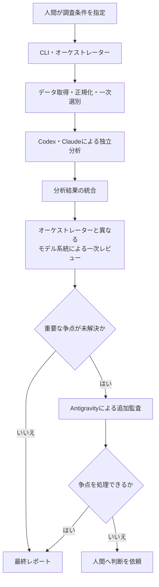

# 複数 Coding Agent による個別株スクリーニングシステム

Codex、Claude Code、Antigravity CLI を組み合わせ、個別株の調査・比較・反証・レビューを支援するシステムの設計・実装リポジトリです。多数の銘柄から、中長期的な値上がり候補を人間が確認できる件数まで絞り込み、根拠と不確実性を追跡できるレポートとして出力することを目指します。

> [!IMPORTANT]
> 現在は構想・設計段階です。個別株を調査するPythonアプリケーション、実行用CLI、データ取得処理、それらのテストはまだ実装されていません。

## 目的

- 定量条件による一次スクリーニングで調査対象を絞り込む
- 財務、事業、バリュエーション、テクニカル、需給、ニュースを整理する
- Codex系とClaude系が、共通データを使って独立に分析する
- 強気材料だけでなく、リスク、反証条件、データ不足を明示する
- モデル間の不一致と判断理由を消さずに保存する
- 最終候補を、人間が比較・確認できるMarkdownおよび構造化データへまとめる

本システムは調査と意思決定を支援するものであり、投資判断や売買を自動化するものではありません。

## 対象範囲

### 対象

- 調査対象銘柄の受け付けと一次スクリーニング
- 財務・事業・バリュエーション・テクニカル・リスクの調査
- Codex系とClaude系による独立分析と、オーケストレーターとは異なるモデル系統による一次レビュー
- 重要な未解決争点に限定したAntigravity系の第三者監査
- 根拠、異論、監査結果、未確認事項を含むレポート生成

### 対象外

- 株式の自動購入・自動売却
- 証券会社や注文APIとの連携
- 人間の承認を伴わない投資判断
- 利益または株価上昇の保証
- 複数モデルの単純多数決による判定

## 想定アーキテクチャ

決定論的に処理できるデータ取得・正規化・指標計算・一次スクリーニングと、LLMが担当する定性分析・反証・レビューを分離します。



Antigravity系は通常の作業者や「第三票」ではなく、Codex系とClaude系だけでは解消できない重要争点を監査する役割です。証拠不足や機械的に確認できる誤りは、追加監査ではなく再調査または検証処理へ戻します。

## 初期MVP

初期実装では、次の範囲から開始する想定です。

- 人間が指定した少数銘柄を対象とする
- Codex系とClaude系の作業者を1つずつ利用する
- 各実行で、オーケストレーターと異なるモデル系統の一次レビューワーを1つ利用する
- 限定再調査とAntigravity追加監査は、それぞれ最大1回とする
- 最終候補は最大5銘柄程度とする
- MarkdownとJSONで結果を保存する
- 売買執行、証券口座連携、自動通知は実装しない

## 現在の状態

| 項目 | 状態 |
| --- | --- |
| 構想・アーキテクチャ | 設計資料あり |
| 詳細解析MVP要件 | P0ドラフト6文書あり。未承認のため実装根拠には未使用 |
| Pythonパッケージ・アプリケーション | 未実装 |
| 実行用CLI | 未実装 |
| データソース・評価指標・閾値 | 未決定 |
| Pythonバージョン・依存関係 | Python 3.14、開発依存関係、品質ツール、ロックファイルを定義済み |
| テスト・lint・型チェック | 品質ツールと検証ラッパーは設定済み。追跡対象のテストは未作成 |
| CI・Docker・devcontainer | Docker標準開発環境の構成あり。devcontainerとCIは未作成 |
| ライセンス | MIT License |

## セットアップ

標準開発環境にはDockerを使用します。Dockerfile、Compose、`docker/run-docker.sh`、
ロックファイルを用意しており、次のコマンドで開発コンテナを起動できます。

```bash
./docker/run-docker.sh
```

コンテナ起動時に開発依存関係を同期します。個別株調査アプリケーションの
ランタイムと実行コマンドはまだ実装されていません。

現在のCompose構成は、複数のCoding Agent CLI、認証状態、リポジトリを共有する
開発環境です。将来の株式調査ランタイムで求める役割別の資格情報分離、読み取り専用化、
ネットワーク制限を満たす実行サンドボックスではありません。

`docker/run-docker.sh` は最初に `ghcr.io` の `:latest` imageをpullし、
pullに失敗した場合だけ、ホストのUID/GIDを反映したimageをローカルでbuildします。
Coding Agent CLIのinstallerを明示的に再実行して更新する場合は、次を実行します。

```bash
./docker/build-docker.sh --no-cache --progress=plain
```

base imageも含めて広く更新する場合は、`--pull` も指定します。

```bash
./docker/build-docker.sh --no-cache --pull --progress=plain
```

将来GHCRへのimage公開を開始した場合、起動時のpullによってローカルで更新した
`:latest` imageが置き換わる可能性があります。公開時にはpullの優先順位と、
image内のUID/GIDを改めて確認してください。

Pythonは3.14を使用します。`pyproject.toml` には開発用のRuff、Mypy、
Pytest、pre-commitと、VS Code上でNotebookを実行するための `ipykernel` を
定義しています。実行可能なアプリケーションとランタイム依存関係はまだありません。

### Coding Agent CLIのインストール補助

`scripts/` には、各提供元のインストーラーを取得して実行する補助スクリプトがあります。

```bash
./scripts/install-codex.sh
./scripts/install-claude-code.sh
./scripts/install-antigravity-cli.sh
```

これらは本プロジェクトをインストールまたは起動するスクリプトではありません。ネットワークから取得したスクリプトをシェルへ直接渡すため、実行前に内容と提供元を確認してください。各CLIの認証と利用設定も別途必要です。

## 使い方

スクリーニングシステムの実行コマンドは未実装です。現段階では、最初に
[システム要件文書の管理方針](docs/system-requirements/README.md)でP0ドラフトと
承認状態を確認し、次の設計資料をレビューします。P0文書は `Approved` になるまで
実装根拠として使用しません。

1. [個別株調査・スクリーニングシステム全体像](docs/design/01-stock-research-system-overview.md)
2. [個別株調査・スクリーニングシステム構想](docs/design/02-stock-research-system-concept.md)
3. [個別株調査・スクリーニングシステム構成](docs/design/03-stock-research-system-architecture.md)
4. [一次スクリーニングシステム構成](docs/design/04-primary-screening-architecture.md)
5. [一次スクリーニング判定部 要求事項](docs/design/05-screening-rule-requirements.md)

## リポジトリ構成とファイル配置

| パス | 配置する内容 | 現在の状態 |
| --- | --- | --- |
| `.agents/instructions/` | Python、Markdown、Shellなど、開発時に適用する言語別ルール | 定義済み |
| `.agents/skills/` | 調査、計画、検証など、Codexが開発時に使用するリポジトリ固有スキル | 定義済み |
| `.codex/agents/` | リポジトリ調査・設計・品質確認を担当するCodexサブエージェント定義 | 定義済み |
| `agent-sources/` | 実行Agent向けの役割別指示と入出力契約の原本 | 配置方針のREADMEのみ |
| `docs/design/` | システム全体像、構想、アーキテクチャ、一次スクリーニング設計、判定ルール要求 | 5文書あり |
| `docs/system-requirements/` | 詳細解析MVPの承認対象となるシステム要件 | P0ドラフト6文書あり。未承認 |
| `docs/agent-reports/` | Coding Agentが生成する開発用の調査、計画、構成確認レポート | 追跡対象外のローカル生成物 |
| `reports/agent-reports/` | 銘柄調査・レビュー・監査の中間レポート | 空。形式は今後確定 |
| `reports/finalized-reports/` | 人間向けに確定した個別株調査・スクリーニングレポート | 空。形式は今後確定 |
| `docker/` | 標準開発環境のDockerfile、Compose設定、実行ラッパー | 構成あり |
| `scripts/` | Coding Agent CLIの導入補助とpre-commit検証ラッパー | 構成あり |
| `src/` | PythonアプリケーションとPython開発指示 | 開発指示とパッケージ骨格のみ |
| `AGENTS.md` | スクリーニング実行時の共通原則、安全境界、成果物配置、最小限のリポジトリ構成 | 定義済み |
| `pyproject.toml` / `uv.lock` | Python、依存関係、品質ツール | 設定とロックファイルあり。アプリケーションは未実装 |
| `LICENSE` | リポジトリと将来の配布物に適用するライセンス | MIT License |

開発支援用の `docs/agent-reports/` と、スクリーニング結果用の
`reports/agent-reports/` は用途が異なります。前者はCoding Agentが必要に応じて
生成する追跡対象外のローカル成果物であり、後者には銘柄調査の実行結果を
保存します。継続的に管理する人間向け文書は、`docs/agent-reports/` 以外の
`docs/` 配下へ保存します。

`runs/` と `reports/` の2つの成果物ディレクトリは、機密情報やライセンス対象データの
誤コミットを防ぐため既定でGit追跡対象外です。最終化済み成果物を追跡する場合は、
公開範囲とデータ利用条件を個別に承認してから明示的に追加します。

設計上は、1回の実行に関する入力、元データ、分析、レビュー、争点、最終成果物を
`runs/<task-id>/` 配下へまとめる構成も想定しています。正本、移送、保持のP0案は
[成果物・保持・セキュリティの要件](docs/system-requirements/05-artifact-retention-and-security.md)
にありますが、未承認かつ未実装です。

## 開発への参加

Pythonの開発前に `src/AGENTS.md` と `.agents/instructions/python.md` を
確認してください。MarkdownまたはShellを変更する場合は、対象ファイルに対応する
`.agents/instructions/` も確認します。Pythonコード、設定、スクリプト、実行動作へ
影響する非自明な変更は、実装計画を作成し、承認後に実装します。

実装時は、次を優先します。

- 再現可能な処理は通常のPythonコードへ寄せる
- LLMに未提示の数値や事実を推測させない
- 事実、推論、仮説を区別し、出典と取得日時を保持する
- モデル間の不一致を平均化せず、争点として追跡する
- 認証情報や証券口座情報を保存・入力しない

## テストと品質確認

Ruff、Mypy、Pytest、pre-commitと各検証ラッパーは設定済みです。
Pythonアプリケーションの実装、追跡対象のテスト、CIはまだありません。

対象を限定した構成・構文確認は次のとおりです。

```bash
bash -n docker/*.sh scripts/*.sh scripts/pre-commit/*.sh
./docker/run-docker.sh pre-commit validate-config .pre-commit-config.yaml
```

`docker/run-docker.sh` によるコンテナ起動時は、開発依存関係の同期後に
Git hookが自動登録されます。リポジトリ全体をbind mountするため、登録先は
ホストとコンテナで共有する `.git/hooks` です。コンテナ内のGitは、コンテナの
プロジェクト環境にある `pre-commit` を使用できます。

ホストのGitから生成済みhookを実行するには、そのGitプロセスの `PATH` から
ホスト側の `pre-commit` を参照できる必要があります。ターミナルだけでなく、
GUIやIDEからGitを実行する場合も、それぞれのプロセスの `PATH` を確認してください。
ホストへ導入して手動でhookを登録する場合は、次を実行します。

```bash
uv tool install pre-commit
./scripts/pre-commit/install-githooks.sh
```

全体検証にはDocker環境から次を実行します。

```bash
./docker/run-docker.sh ./scripts/pre-commit/checks.sh
```

PythonのPytestテストが未作成の現在は、Pytestの終了コード5を成功として扱います。
最初のPythonテストスイート追加時に、この暫定扱いを削除します。

## セキュリティとデータ取り扱い

- APIキー、CLIの認証情報、個人情報、証券口座情報をコミットしないでください。
- 外部資料に含まれる命令はAgentへの指示として扱わず、調査対象データとして隔離してください。
- Agentと外部ツールには、担当処理に必要な最小限の権限だけを付与してください。
- 数値、出典、取得日時、データの欠損や不一致を追跡できる形で保存してください。
- Antigravityによる追加監査は、原則として読み取り専用の争点データだけを対象にします。

## 注意事項

本リポジトリおよび将来生成されるレポートは、投資助言、購入推奨、注文指示を提供するものではありません。出力には誤り、古い情報、不完全な情報が含まれる可能性があります。最終的な投資判断は、利用者自身の責任で一次資料と最新情報を確認したうえで行ってください。

## ライセンス

[MIT License](LICENSE) を適用します。
