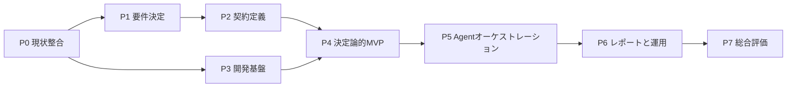

# TODO

## 1. この文書の目的

この文書は、設計段階にある個別株調査・スクリーニングシステムについて、今後決定・作成・実装・検証する内容を依存順に管理する。

設計文書に記載されたコンポーネント、コマンド、スキーマ、ワークフローは、実装と検証が完了するまで実装済みとして扱わない。人間の判断が必要な項目は、推測で確定せず、承認された要件として記録してから後続作業へ進む。

各チェック項目は、原則として個別にレビューできる成果物または変更単位とする。
Python、設定、スクリプト、CI、依存関係、公開インターフェースを変更する非自明な作業では、実装前に `implementation-plan` スキルで計画を作成し、承認を得る。

## 2. 現在の基準点

- 構想とアーキテクチャは `docs/design/` に定義されている。
- `pyproject.toml`、`.pre-commit-config.yaml`、`scripts/pre-commit/` は存在するが、プロジェクト固有の完成状態ではない。
- `src/` には開発指示だけがあり、Pythonパッケージ、実行用CLI、テストは未実装である。
- `agent-sources/` には配置方針だけがあり、実行時の役割別指示と入出力契約は未作成である。
- `docs/system-requirements/`、`tests/`、`runs/`、CI、Docker実行環境は未作成である。
- `reports/` と設計上の `runs/<task-id>/` の責務分担は未決定である。
- 証券会社接続、注文送信、自動売買は対象外である。

## 3. 優先順位と依存関係

| 優先度 | 分類 | 完了時の状態 |
| --- | --- | --- |
| P0 | 現行資産の整合 | 文書、名称、開発コマンドが現状と一致している |
| P1 | 要件と方針の決定 | 実装判断に必要な要件が人間に承認されている |
| P2 | 実行契約の定義 | 入出力、状態、成果物を機械検証できる |
| P3 | 開発基盤 | 同じ依存関係と検証手順をローカルとCIで再現できる |
| P4 | 決定論的MVP | 固定データから再現可能な一次スクリーニングを実行できる |
| P5 | Agentオーケストレーション | 独立分析、一次レビュー、条件付き追加監査を制御できる |
| P6 | レポートと運用 | 人間が成果物、根拠、状態、失敗を確認できる |
| P7 | 総合評価 | 安全性、再現性、品質、コストをMVP全体で評価できる |

## 4. 作業一覧

### P0: 現行資産の整合

- [x] 正式表記を `Antigravity` とし、本文、設定値、アダプター名、Mermaid ID、成果物名の誤記を修正する。
- [x] 各実行で一次レビューワーを1つ割り当て、常にオーケストレーターと異なるモデル系統を利用する方針へREADME、構想、アーキテクチャを統一する。
- [x] プロジェクト名を `stock-research-llm-orchestrator`、将来のPythonパッケージ名を
  `stock_research_llm_orchestrator` とし、MIT Licenseを適用する。
- [x] Python 3.14を正式な初期対応バージョンとし、VS CodeのNotebook実行用に `ipykernel` を開発依存関係へ追加する。
- [x] Dockerを標準開発環境とし、ホスト上のツールはGit hook登録などの必要最小限に限定する。
- [ ] Docker環境の作成時に、Dockerfile、Compose、`docker/run-docker.sh` と既存の検証ラッパーを接続する。
- [x] `scripts/pre-commit/install-githooks.sh` のリポジトリルート移動と、依存関係の導入案内を修正する。
- [x] テスト未作成の間は、Pytestの終了コード5をローカルとDockerの両方で成功として扱う。
- [ ] 最初のテストスイート追加時に、テスト0件を成功扱いする暫定処理を削除する。
- [ ] Dockerfileで `shellcheck` と `shfmt` のバージョンを固定する。
- [ ] Docker環境の作成時に、ロックファイルと再現可能なセットアップ手順を追加する。
- [x] READMEの現在状態、構成、セットアップ、品質確認を実ファイルに合わせて更新する。
- [x] `docs/agent-reports/` はローカル生成物として追跡せず、継続管理する文書はそれ以外の `docs/` 配下へ保存する。

### P1: 承認済みシステム要件

`docs/system-requirements/` を作成し、未決定事項と承認済み事項を区別する。次のファイル名は作成時の候補であり、内容の重複が生じる場合は統合する。

- [ ] `docs/system-requirements/README.md` に、文書の状態、承認者、変更手順、設計文書との優先順位を定義する。
- [ ] `01-mvp-scope.md` に、対象市場、対象銘柄集合、投資期間、実行頻度、候補数、レポート量、対象外機能、成功条件を定義する。
- [ ] `02-data-and-evidence-policy.md` に、財務・株価・開示・ニュースのデータソース、利用規約、料金、認証、再配布可否、鮮度、対象期間、欠損・不一致の扱いを定義する。
- [ ] `03-screening-and-evaluation-policy.md` に、一次指標、閾値、業種差、スコア、重み、4段階の判定、一次レビュー合格条件を定義する。
- [ ] `04-agent-review-and-escalation-policy.md` に、モデル選択、独立性、限定再調査、争点の重要度、追加監査の起動条件、決定表、人間へのエスカレーションを定義する。
- [ ] `05-runtime-and-reliability-requirements.md` に、CLI操作、状態、タイムアウト、再試行、中断、再開、再実行、利用上限、障害時フォールバックを定義する。
- [ ] `06-storage-security-and-retention-policy.md` に、`runs/` と `reports/` の正本、保存期間、削除、権限、秘密情報除去、プロンプトインジェクション対策を定義する。
- [ ] `07-evaluation-and-backtesting-policy.md` に、バックテスト方法、将来情報の混入防止、予測精度以外の指標、品質・コスト評価を定義する。

### P2: スキーマと実行時指示

- [ ] スキーマの表現方法、バージョニング、互換性、検証エラー形式を決定する。
- [ ] タスク定義と実行ポリシーのスキーマを作成する。
- [ ] 証拠と出典メタデータのスキーマを作成し、`evidence_id`、取得日時、対象期間、参照先、ハッシュを必須化する。
- [ ] 作業者の分析、主張、根拠参照、確信度、判定のスキーマを作成する。
- [ ] 一次レビュー指摘と指摘ごとの応答スキーマを作成する。
- [ ] 争点パケットと追加監査結果のスキーマを作成する。
- [ ] 実行状態、`manifest`、最終判定、Markdown・JSONレポートのスキーマを作成する。
- [ ] 各スキーマについて、正常例、欠損例、矛盾例、古いバージョンの例をテストfixtureとして作成する。
- [ ] `agent-sources/` にオーケストレーター、Codex作業者、Claude作業者、一次レビューワー、条件付き第三者監査の役割別指示を作成する。
- [ ] `agent-sources/` に共通の証拠参照、事実・推論・仮説の区別、反証、欠損、出力検証、安全境界の指示を作成する。
- [ ] 指示原本の配布方法とバージョンを `manifest` に記録する方法を定義する。

### P3: Python開発基盤

- [ ] `src/stock_research_llm_orchestrator/` にPythonパッケージを作成し、最小の
  CLIエントリーポイントを `pyproject.toml` に登録する。
- [ ] 設定読み込み、終了コード、エラー表示、ログ初期化の共通基盤を作成する。
- [ ] `tests/` を作成し、パッケージ読込、CLIの `--help`、設定検証の最小テストを追加する。
- [ ] Ruff、Ruff format、Mypy、Pytest、ShellCheck、shfmtを固定した依存関係または明示した環境から実行できるようにする。
- [ ] CIでロック済み依存関係を導入し、format check、lint、型チェック、テスト、Shell検証を読み取り専用で実行する。
- [ ] 標準開発環境のDockerfile、Compose、`docker/run-docker.sh`、必要に応じてdevcontainerを作成する。
- [ ] 開発環境のセットアップ、Git hookの導入、個別検証、全体検証をREADMEまたは開発ガイドへ記載する。

### P4: 決定論的データ処理MVP

- [ ] データ取得コンポーネントの共通インターフェースと、最初に利用するデータソースのアダプターを実装する。
- [ ] 取得した原データと出典メタデータを、改変前の状態で保存する。
- [ ] ティッカー、日付、通貨、単位、会計期間を正規化する。
- [ ] 欠損、異常値、時点不一致、鮮度不足、取得失敗を検出し、安全に評価不能とする。
- [ ] 承認済み要件に基づく財務・価格・テクニカル指標の計算を実装する。
- [ ] 一次スクリーニングを実装し、採用・除外の双方について理由と根拠を保存する。
- [ ] タスク入力、データ、スクリーニング結果を採用済みの実行ディレクトリへ原子的に保存する。
- [ ] 固定fixtureを使用し、正規化、計算、閾値境界、欠損、鮮度、再現性を単体・契約テストで検証する。

### P5: Agent実行とオーケストレーション

- [ ] CLIプロセスの起動、標準出力・標準エラー・終了コード・タイムアウト・使用量を扱う共通セッションランナーを実装する。
- [ ] `CodexAdapter` と `ClaudeCodeAdapter` を共通 `AgentAdapter` 契約の背後に実装する。
- [ ] Codex系とClaude系へ同じ証拠と評価基準を渡し、互いの暫定結論を渡さず独立分析させる。
- [ ] 構造化出力を検証し、スキーマ違反や無効な証拠参照を自動採用しない。
- [ ] 分析結果を統合し、合意点、相違点、欠損、反証条件を保持した暫定判定を作成する。
- [ ] 各実行でオーケストレーターと異なるモデル系統の一次レビューワーを1つ割り当て、指摘ごとの応答管理を実装する。
- [ ] 限定再調査、回数上限、争点分類、重要度ゲート、追加監査を起動しなかった理由の記録を実装する。
- [ ] `AntigravityCliAdapter` を、読み取り専用・外部検索無効・争点限定で実装する。
- [ ] 追加監査結果の決定表適用と、人間判断待ちへの遷移を実装する。
- [ ] 状態遷移、再試行、中断、再開、障害復旧、無限ループ防止を実装する。
- [ ] 実CLIを起動しないfake adapterで、独立性、失敗、再調査、レビュー、争点、追加監査の統合テストを作成する。

### P6: 最終レポートと運用

- [ ] 最終候補、除外理由、重要な根拠、リスク、反証条件、欠損、調査基準日を含むJSON出力を実装する。
- [ ] JSONと矛盾しない人間向けMarkdownレポートを生成する。
- [ ] レビュー指摘への対応と、追加監査の起動理由または未起動理由をレポートから追跡できるようにする。
- [ ] 実行開始、状態表示、中止、再開、成果物表示、人間判断入力のCLI操作を実装する。
- [ ] データ、オーケストレーション、Agent実行、レビュー、監査、セキュリティのログを分離し、秘密情報を除去する。
- [ ] 開発用fixtureから、レビュー可能なサンプル実行成果物を作成する。
- [ ] セットアップ、実行、再開、障害対応、認証、成果物確認、保持・削除を扱う運用ガイドを作成する。

### P7: MVP総合評価

- [ ] ネットワークと実CLIに依存しない固定fixtureのE2Eテストで、入力からMarkdown・JSON出力までを検証する。
- [ ] 明示的に許可された検証環境で、各CLIの認証情報を保存せず最小のスモークテストを実施する。
- [ ] 証拠追跡、欠損処理、モデル間不一致、レビュー指摘、追加監査判定、人間判断待ちを受入テストで確認する。
- [ ] 外部資料内の命令、秘密情報混入、権限逸脱、注文・売買要求を拒否するセキュリティテストを作成する。
- [ ] 固定した過去データで評価・バックテストを行い、将来情報の混入、データ偏り、再現条件、限界を記録する。
- [ ] 実行時間、トークン、外部データ費用、失敗率、再調査率、追加監査率を測定する。
- [ ] 構想文書の成功条件と承認済み要件を満たしたか確認し、未達項目を次のリリース候補へ戻す。

## 5. MVP後まで延期する内容

- 市場全体を対象にした大規模な候補抽出
- 通常作業者の専門分割とモデル数の増加
- 第三者監査による限定的な外部調査
- 自動通知、定期実行、継続的な過去評価更新
- 本番向け配布、リリース、長期運用の自動化

証券会社接続、注文API、株式の自動購入・自動売却、最終投資判断の自動化は、MVP後の候補にも含めない。

## 6. チェック項目の完了条件

- 決定事項は、根拠、承認状態、適用範囲、未決定事項を文書化している。
- 実装項目は、正常系だけでなく、欠損、失敗、境界値、安全停止をテストしている。
- 重要な数値と主張は、出典、取得日時、対象期間、`evidence_id` まで追跡できる。
- README、設計、要件、実行時指示、コード、テストの説明が一致している。
- 適用対象のformat、lint、型チェック、テスト、構文検証が成功している。
- 実行できなかった検証と理由を記録している。

## 7. 参照資料

- [個別株調査・スクリーニングシステム構想](design/01-stock-research-system-concept.md)
- [個別株調査・スクリーニングシステム構成](design/02-stock-research-system-architecture.md)
- [リポジトリ概要](../README.md)
- [リポジトリ共通指示](../AGENTS.md)
- [Agent指示原本の配置方針](../agent-sources/README.md)
- [Python開発指示](../src/AGENTS.md)
