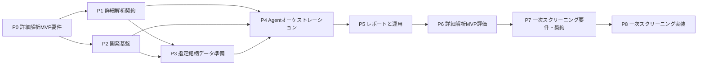

# TODO

## 1. この文書の目的

この文書は、設計段階にある個別株調査・スクリーニングシステムについて、今後決定、作成、実装、検証する作業を依存順に管理する。

最初のMVPでは、人間が一次絞り込みを行い、具体的な銘柄をシステムへ渡す。その銘柄について、証拠データの準備、詳細解析、レビュー、条件付き追加監査、レポート生成を実行できる仕組みを優先して構築する。

自動の一次スクリーニングはスコープから削除しない。詳細解析MVPの完成と評価を先行させた後、UniverseからCandidate Poolまでを決定論的に処理する後続フェーズとして実装する。

`docs/design/` に記載されたコンポーネント、コマンド、スキーマ、成果物、
ワークフローは、実装と検証が完了するまで実装済みとして扱わない。設計上の
未決定事項は推測で確定せず、人間が承認した詳細要件として
`docs/system-requirements/` に記録してから実装する。

この文書には原則として未完了の作業だけを残す。完了済みの変更は、現在の基準点とGit履歴で確認する。

Python、設定、スクリプト、CI、依存関係、公開インターフェースを変更する非自明な作業では、実装前に `implementation-plan` スキルで計画を作成し、承認を得る。

## 2. 現在の基準点

- システムは設計段階であり、設計の責務は `docs/design/` の5文書に分割されている。
- Dockerを標準開発環境とし、ロック済み依存関係、Git hook、既存の品質確認を実行できる。
- `src/stock_research_llm_orchestrator/` にはPythonパッケージ骨格があるが、アプリケーションと実行用CLIは未実装である。
- `docs/system-requirements/` のP0要件6文書は`Approved 1.0`である。追跡対象の
  テスト、CI、`runs/` は未作成である。
- `agent-sources/` には配置方針だけがあり、実行時の役割別指示と入出力契約は未作成である。
- `runs/<task-id>/` を実行履歴の正本、`reports/` を任意の参照用コピーとし、いずれも
  ローカル保存してGit追跡しない方針である。
- 証券会社接続、注文送信、自動売買、最終投資判断の自動化は対象外である。

## 3. 優先順位と依存関係

P2は、未決定の公開インターフェースを先取りしない範囲でP1と並行して進められる。P7以降へ進む前にP6までを完了し、人間が指定した銘柄を詳細解析できるMVPの有効性と運用可能性を評価する。

| 優先度 | 分類 | 完了時の状態 |
| --- | --- | --- |
| P0 | 詳細解析MVP要件 | 人間が指定した銘柄を解析するための方針とMVP境界が承認されている |
| P1 | 詳細解析契約 | 入力、証拠、分析、レビュー、争点、監査、状態を機械検証できる |
| P2 | 開発基盤 | 最小CLI、テスト、CIを同じ依存関係で検証できる |
| P3 | 指定銘柄データ準備 | 指定銘柄の検証済み証拠データを再現可能に準備できる |
| P4 | Agentオーケストレーション | 独立分析、一次レビュー、条件付き追加監査を制御できる |
| P5 | レポートと運用 | 人間が根拠、状態、失敗、最終成果物を確認できる |
| P6 | 詳細解析MVP評価 | 指定銘柄の入力から最終レポートまでを安全に評価できる |
| P7 | 一次スクリーニング要件・契約 | UniverseからCandidate Poolまでの方針と入出力が承認されている |
| P8 | 一次スクリーニング実装 | 決定論的な候補抽出を詳細解析の入力へ接続できる |

## 4. 作業一覧

### P0: 詳細解析MVP要件の承認

P0は2026-08-28に完了した。以下は承認時の決定・文書反映状況を示す。

P0課題の状態は次のとおりである。未完了項目は表示順に進める。

1. [x] U-03: source構成、私的利用、外部非公開、Web取得可能な公開情報に限定した
   外部Agent処理の方針を承認する。
2. [x] U-04: Web探索を固定回数で打ち切らず、観点充足とmaterialな新情報の有無で完了を判断し、
   providerまたは外部サービスのエラー時は未完了として安全停止する方針を承認する。
3. [x] U-06: 再調査・合議・異なる争点数に固定上限を設けず、同一争点のAntigravity監査だけを
   1回に制限する方針を承認する。
4. [x] U-05: MVPではシステム独自のtimeout、token・費用・回数上限、自動再試行を設けず、
   configで選択されたAgentのpreflightと実測記録を行う方針を承認する。
5. [x] U-08: `runs/`と`reports/`をローカル保存し、Git追跡、無期限保持、固定保持期限、
   削除機能を要求しない方針を承認する。
6. [x] U-07: リポジトリ所有者1名による開発・利用を前提とし、RBAC、職務分離、承認・
   `Finalized`ゲートを設けない方針を承認する。
7. [x] 要件READMEと01〜06を最終レビューし、状態を`Approved`、版を`1.0`、承認日と
   発効日を2026-08-28へ更新する。実装根拠は版`1.0`を最初に含むcommitまたはそのtagで特定する。

U-03〜U-08の方針判断は完了した。U-09〜U-15はP1で機械検証可能な契約へ具体化するため、
P0承認の阻害課題へ混在させない。

要件トピック別の状態は次のとおりである。

- [x] `docs/system-requirements/` に、文書の状態、承認者、変更手順、設計文書との責務分担と
  整合確認方法を定義する。ADRは判断理由と代替案を記録し、承認済みの仕様は対応する
  system requirementsへ反映する。
- [x] MVPの入力を人間が指定した1銘柄とし、銘柄識別子と市場を
  定義する。初期MVPは東京証券取引所に上場する内国現物株を対象とし、MIC `XTKS`と
  `Asia/Tokyo`を使用する。中期・長期を既定の投資評価期間とし、単一期間の指定を必須にしない。
  タスク受付時刻は監査情報としてシステムが記録するが、利用可能な情報の打ち切り時刻には
  しない。証拠集合の凍結時刻、版、最終鮮度確認時刻を別々に記録する。
- [x] MVPでは自動の一次スクリーニングとLLM簡易調査を実行せず、指定銘柄をCodex・Claudeの詳細解析へ渡す境界を定義する。
- [x] 財務、バリュエーション、事業、テクニカル、リスク・反証の5観点について、MVPで必要な入力と評価方針を定義する。
- [x] 財務、株価、開示、ニュースのデータソース、利用規約、料金、認証、再配布可否、
  外部Agent提供者への処理目的の移送可否、鮮度、対象期間、欠損・不一致の扱いを定義する。
- [x] モデル選択、独立性、一次レビュー合格条件、限定再調査、争点重要度、追加監査の起動条件、監査結果の適用決定表、人間へのエスカレーションを定義する。Antigravityは通常作業者や多数決の第三票にしない。
- [x] 後段分析の4段階評価、評価可否と、再調査、追加監査、人間判断待ち、失敗を
  含む実行状態を別の概念として定義する。
- [x] CLI操作、事前確認、固定timeout・自動再試行を設けない方針、中断、再開、再実行、
  provider制約、障害時の安全停止、認証方式を定義する。
- [x] 外部リクエストを共有Coordinatorへ集約するアーキテクチャ方針を決定し、
  ADR-0001と対応するsystem requirementsを同期する。
- [x] provider別キュー、rate limit、cooldown、cache、single-flight、実行時lease、
  再開時checkpoint、監査ログのP0方針を確定する。provider固有の運用値はP1で定義する。
- [x] `runs/<task-id>/`を実行履歴の正本、`reports/`を任意の参照用コピーとし、いずれも
  ローカル保存を既定にする。Git追跡、無期限保持、固定保持期限、削除専用機能を要求しない。
- [x] 秘密情報除去、プロンプトインジェクション対策、外部コンテンツとAgent指示の分離を定義する。
- [x] 人間向け文書を日本語のMarkdown、Agent用および機械可読成果物の
  自然言語を英語とする対象読者別の言語・形式を定義する。CLI表示は英語を許容し、
  人間向け文書の明示的なタスク単位言語上書きと、日本語以外の原文引用に対する
  日本語要約を定義する。
- [x] 人間が確認可能なレポート量、調査時間の観測、証拠追跡性、品質、コスト記録に関するMVP成功条件を定義する。

### P1: 詳細解析の契約と実行時指示

- [x] スキーマの表現方法、バージョニング、互換性、検証エラー形式を決定する。Pydanticモデルを
  契約定義の正本、生成JSON SchemaをAgent提示用契約、JSONを交換・保存形式、版付きテンプレートから
  生成するMarkdownを人間向け最終成果物とし、ADR-0002とsystem requirements 07へ記録した。
- [ ] `task_id`、タイムゾーン付き`task_accepted_at`、市場、対象銘柄、中期・長期を既定とする
  投資評価期間、評価Policy Version、制約を持つ詳細解析タスク契約を作成する。通常実行では
  単一期間の指定を必須にせず、利用可能情報を任意時刻で打ち切る指定を受け付けない。
- [ ] `evidence_set_version`、`evidence_frozen_at`、`freshness_checked_at`、
  `analysis_completed_at`を持つ証拠集合・実行契約を作成し、重要な新規情報の採用時に
  影響成果物を無効化して再実行できるようにする。
- [ ] 銘柄識別子、名称、通貨、セクターを表す銘柄情報の契約を作成する。
- [ ] 原データ、出典メタデータ、正規化済みデータ、計算済み指標を分離し、`evidence_id`、取得日時、対象期間、参照先、ハッシュ、データ版、計算ロジック版を追跡できる契約を作成する。
- [ ] 指定銘柄、調査条件、共通証拠、出典メタデータを作業者へ渡す `research_context` を定義する。
- [ ] Agent別の検索語、検索機能、実行日時、返却URL、スニペット、候補資料、支持・反証対象を
  保存する検索記録と、候補資料の検証・採否を保存する契約を作成する。
- [ ] 検証済み追加証拠の和集合と発見元を保持し、相手の暫定結論を含めず両作業者へ
  差し戻す共通証拠更新契約を作成する。
- [ ] `AgentAdapter` の必須・任意メソッド、各CLIの非対話実行、製品固有の構造化出力を共通契約へ変換する方法を定義する。
- [ ] 作業者の期間別分析、主張、事実・推論・仮説、根拠参照、確信度、評価可否、
  4段階評価と、期間横断要約、エントリー・撤退参考情報の契約を作成する。
- [ ] 統合結果と、期間別の合意点、相違点、欠損、反証条件、暫定判定、期間横断要約の
  契約を作成する。
- [ ] 一次レビュー指摘と指摘ごとの応答契約を作成する。
- [ ] 争点分類、機械的な起動ゲート、争点パケット、追加監査結果、適用決定表の契約を作成する。
- [ ] 実行状態、再調査、監査、人間判断、解析完了、中断、取消、失敗の
  状態遷移と `manifest` を定義する。
- [ ] 最終判定、日本語の人間向けMarkdown、英語の機械可読JSON、ログ、成果物間の
  参照契約と、人間向け文書のタスク単位言語上書き設定を作成する。
- [ ] 各契約について、正常、欠損、矛盾、無効な証拠参照、スキーマ違反、旧バージョンのfixtureを作成する。
- [ ] `agent-sources/` にオーケストレーター、Codex作業者、Claude作業者、一次レビューワー、条件付き第三者監査の役割別指示を作成する。
- [ ] `agent-sources/` に証拠参照、事実・推論・仮説、反証、欠損、出力検証、安全境界の共通指示を作成する。
- [ ] 指示原本の配布方法、バージョン、実際に適用した設定を `manifest` に記録する方法を定義する。
- [ ] 外部リクエストについて、論理要求と物理要求、request fingerprint、source profile、
  適用したrate gate、待機、エラー、cooldown、cache hit、single-flight、使用量を追跡する契約を作成する。

### P2: 最小開発基盤

- [ ] 最小のCLIエントリーポイントを `pyproject.toml` に登録する。
- [ ] 設定読み込み、終了コード、エラー表示、ログ初期化の共通基盤を作成する。
- [ ] 追跡対象の `tests/` を作成し、パッケージ読込、CLIの `--help`、設定検証の最小テストを追加する。
- [ ] 最初のテストスイート追加と同時に、Pytestの終了コード5を成功扱いする暫定処理を削除する。
- [ ] CIでロック済み依存関係を導入し、format check、lint、型チェック、テスト、Shell検証を読み取り専用で実行する。

### P3: 指定銘柄のデータ・証拠準備

- [ ] EDINET API Version 2の利用登録とAPIキー取得を行い、採用するAgent CLIを含む認証情報の
  保管、実行環境への注入、更新・失効、漏えい時対応を運用ガイドへ記載する。秘密値はGit、
  文書、ログ、Agent入力へ保存しない。
- [ ] 人間が指定した1銘柄を読み込み、銘柄識別子と市場を検証する。
- [ ] 初期MVPの東証上場内国株の市場データを取得する`yfinance`アダプターと、将来の米国株・
  国内他市場へ拡張できる共通取得インターフェースを実装する。
- [ ] 東証上場内国株の代表fixtureで、銘柄識別、最低3年の日次価格・出来高、調整前後価格、
  配当・株式分割、通貨、`Asia/Tokyo`、欠損、取得失敗を検証する。米国株fixtureは
  対応市場の拡張時に追加する。
- [ ] 日本銀行時系列統計データ検索APIから`FM08`・`FXERD04`の日次USD/JPYを取得し、
  同一東京日付の東証終値と結合してドル換算系列を計算する。片方が欠損・未公表の場合は
  別日の為替値で補完せず、ドル換算値を未確定または欠損とする。
- [ ] 取得した原データと出典メタデータを改変前の状態で保存する。
- [ ] ティッカー、日付、通貨、単位、会計期間を正規化し、原データと計算済み指標を分離して保存する。
- [ ] 詳細解析に必要な財務、価格、テクニカル指標を、バージョン付きロジックで計算する。
- [ ] 欠損、異常値、時点不一致、鮮度不足、取得失敗を検出し、条件不適合と評価不能を混同しない。
- [ ] `published_at`、`first_available_at`、`updated_at`、`retrieved_at`とデータ版を区別し、
  証拠集合の版と凍結時刻を追跡する。通常分析ではタスク開始後の重要情報を除外せず、
  解析完了直前の鮮度確認と、重要な訂正・更新による影響成果物の再実行を検証する。
- [ ] 決定論的なHTTP取得を共有Coordinator経由に限定し、provider別制限、共有cooldown、
  cache、single-flightを適用する。`yfinance`は調整済みSessionを注入して`threads=False`で
  実行し、未調整の直接通信へフォールバックしない。
- [ ] 重要な数値と資料を共通の `evidence_id` で参照できる証拠集合を生成する。
- [ ] タスク、指定銘柄、原データ、正規化済みデータ、計算済み指標、出典メタデータ、`manifest` を採用済みの実行ディレクトリへ原子的に保存する。
- [ ] 固定fixtureで、銘柄入力、取得、正規化、計算、時点整合、欠損、鮮度、証拠参照、再現性を単体・契約テストする。

### P4: Agent実行とオーケストレーション

- [ ] CLIプロセスの標準出力、標準エラー、終了コード、providerエラー、使用量を扱う共通セッションランナーを実装する。
- [ ] `CodexAdapter` と `ClaudeCodeAdapter` を共通 `AgentAdapter` 契約の背後に実装する。
- [ ] Codex系とClaude系へ同じ対象銘柄、初期共通証拠、評価基準、Web探索Policyを渡し、
  互いの検索結果と暫定結論を渡さず、Agent内蔵Web検索で独立探索・分析させる。
- [ ] 両作業者の候補資料を承認済み取得・検証工程へ渡し、検証済み資料の和集合を
  共通追加証拠として差し戻して、影響範囲を独立再分析させる。
- [ ] オーケストレーター、一次レビューワー、Antigravityを含む全Agentに、担当処理で
  必要なWeb検索を許可する。`material`な新規資料は検証後に影響を受ける作業者へ提示し、
  限定的な応答機会を与える。
- [ ] Agent内蔵Web検索をCoordinatorの開始許可と候補URL検証の対象にし、物理的な
  rate controlが必要なのに適用不能な提供者はbrokered searchへ切り替えるか安全停止する。
  独立探索中はキュー、cooldown、使用量などの通信制御状態だけを共有し、検索語、結果、
  cache内容、暫定結論を共有しない。
- [ ] 構造化出力を検証し、スキーマ違反、無効な証拠参照、自然文との矛盾を自動採用しない。
- [ ] 分析結果を期間別に統合し、合意点、相違点、欠損、リスク、反証条件を保持した
  期間別の暫定判定と、評価を持たない期間横断要約を作成する。
- [ ] 各実行でオーケストレーターと異なるモデル系統の一次レビューワーを1つ割り当て、
  指摘ごとの構造化応答と再確認を反復できるようにする。合議往復数には固定上限を設けず、
  往復数、変更内容、解消・未解決指摘、使用量を実測値として記録する。
- [ ] `high`または`critical`の指摘は、修正後のレビューワー確認、レビューワーによる撤回・
  重要度引下げ、Policyに従う追加監査、または人間判断でのみ終結させる。オーケストレーターの
  単独棄却を終結条件にせず、未解決のまま解析完了へ進めない。
- [ ] 限定再調査と合議往復を別々に計数し、争点分類、重要度ゲート、
  追加監査を起動しなかった理由の記録を実装する。
- [ ] 中立な争点パケットを生成し、証拠、重要度、機密情報、監査済み状態を機械検証する。
- [ ] `AntigravityCliAdapter` を、読み取り専用、争点限定、同一争点1回までとし、
  必要なWeb検索を許可して未検証情報を監査根拠へ直接採用しない条件で実装する。
- [ ] 追加監査結果の決定表適用と、人間判断待ちへの遷移を実装する。
- [ ] 状態遷移、エラー記録、中断、再開、手動再実行、provider制約、安全停止を実装する。
  Agent処理の途中でトークン利用枠へ到達した場合は、未完了出力を完成扱いせず、
  中間状態と未処理事項を保存して停止できるようにする。
- [ ] 実CLIを起動しないfake adapterで、独立探索、候補資料の検証・棄却、共通証拠への統合、
  差し戻し後の再分析、複数回の合議と再レビュー、providerエラーによる途中停止、失敗、争点、
  追加監査、人間判断の統合テストを作成する。

### P5: 最終レポートと運用

- [ ] 対象銘柄について、中期・長期の投資仮説、財務、事業、バリュエーション、期間別評価、
  評価可否、確信度、重要な根拠、リスク、反証条件、監視条件、欠損、モデル間不一致、
  期間横断要約、エントリー・撤退参考情報、タスク受付時刻、証拠集合の版・凍結時刻、
  最終鮮度確認時刻を含むJSON出力を実装する。
- [ ] 英語のJSONおよびAgent用成果物と矛盾せず、人間が確認可能な情報量の日本語Markdownを
  直接生成する。日本語以外の原文引用には、引用と区別できる日本語要約を添える。
- [ ] レビュー指摘への対応と、追加監査の起動理由または未起動理由を最終成果物から追跡できるようにする。
- [ ] 出力が投資助言、購入推奨、注文指示、収益保証ではないことを明示する。
- [ ] 実行開始、状態表示、中断、取消、再開、成果物表示、人間判断入力のCLI操作を実装する。
- [ ] データ、Web探索、オーケストレーション、Agent実行、レビュー、監査、セキュリティの
  ログを分離し、秘密情報を除去する。
- [ ] Coordinatorについて、論理要求と物理要求、provider別待機、適用gate、cooldown、
  error、cache hit、single-flight、拒否、安全停止、実行時leaseを監査・計測できるようにする。
- [ ] 定義済みのローカル保存方針に従い、実行成果物を `runs/` と `reports/` の適切な保存先へ移送または確定する。
- [ ] 人間向けレポートを`AnalysisCompleted`の成果物として保存し、利用者が必要に応じて
  再調査または再実行を開始できるようにする。`Finalized`承認ゲートは設けない。
- [ ] 実行中・再開対象の成果物をローカルに保持し、古い成果物は利用者が通常の
  ファイル操作で整理できるようにする。
- [ ] 開発用fixtureから、人間が指定した銘柄を対象とするレビュー可能なサンプル実行成果物を作成する。
- [ ] セットアップ、銘柄指定、実行、再開、障害対応、認証、成果物確認、
  ローカル保存と任意の整理を扱う運用ガイドを作成する。

### P6: 詳細解析MVP総合評価

- [ ] ネットワークと実CLIに依存しない固定fixtureのE2Eテストで、具体的な銘柄を含むタスク入力からMarkdown・JSON出力までを検証する。
- [ ] 明示的に許可された検証環境で、各CLIの認証情報を保存せず最小のスモークテストを実施する。
- [ ] 証拠追跡、欠損処理、モデル間不一致、レビュー指摘、追加監査判定、人間判断待ちを受入テストで確認する。
- [ ] 外部資料内の命令、秘密情報混入、権限逸脱、注文・売買要求を拒否するセキュリティテストを作成する。
- [ ] 承認済みのpoint-in-timeデータまたは固定fixtureで過去時点の詳細解析を評価し、
  将来情報の混入、モデル知識による汚染可能性、データ偏り、再現条件、限界を記録する。
  この評価モードを通常のMVP実行として公開しない。
- [ ] 実行時間、トークン、外部データ費用、失敗率、再調査率、追加監査率を測定する。
- [ ] 人間が指定した銘柄について、根拠を追跡できる詳細解析とレビュー可能なレポートを安定して生成できるか確認する。
- [ ] 構想文書の成功条件と承認済みMVP要件を満たしたか確認し、未達項目を次のリリース候補へ戻す。

### P7: 一次スクリーニング要件と契約

- [ ] 詳細解析MVPの人間指定入力を維持したまま、Candidate Poolを同じ詳細解析入口へ渡す統合境界を定義する。
- [ ] 東証内Universeの指定・取得方法、対象市場区分、実行頻度、Candidate Poolの件数上限を定義する。
- [ ] 最低流動性、各Screenの必須・選好・除外条件、具体的な閾値、市場・業種補正、Sector Percentileの算出単位を承認する。
- [ ] Forward指標、業績予想、Momentum、Earnings Revision、Screen内スコアとランキングを利用する範囲を決定する。
- [ ] Candidate Poolの件数上限を超えた場合の制御方法を決定し、Screen間のスコアを直接比較しないことと後段の優先順位付けを両立させる。
- [ ] Screenの `PASS / FAIL / NOT_EVALUABLE` と後段分析の4段階評価を別の概念として定義し、設計内の図、例、用語を整合させる。
- [ ] `task_id`、基準日、Universe、有効Screen、Policy Version、出力条件を持つスクリーニングタスク契約を作成する。
- [ ] Universeの銘柄識別子、市場、取得元、重複処理、基準日を表す契約を作成する。
- [ ] Common Filterの通過、除外、評価不能と、その理由を保存する契約を作成する。
- [ ] `security`、`metrics`、`policy` を受け取る共通Screenインターフェースを定義する。
- [ ] `PASS / FAIL / NOT_EVALUABLE`、使用値、条件、理由、警告、Policy Version、
  任意のScreen内スコアを持つ `ScreeningResult` を定義する。
- [ ] いずれかのScreenを通過した銘柄と、通過したすべてのScreen属性を保持するCandidate Pool契約を作成する。
- [ ] Screen処理ロジックと具体的な閾値を分離する、バージョン付きPolicy構成を定義する。
- [ ] 一次スクリーニングの成果物配置とシステム全体の `runs/<task-id>/` 構成を統合し、`manifest` の必須項目を定義する。
- [ ] 正常、欠損、古いデータ、時点不一致、閾値境界、業種内比較、複数Screen通過、旧スキーマのfixtureを作成する。

### P8: 決定論的な一次スクリーニング実装

- [ ] Universeを読み込み、Universe生成とScreen判定を分離する。
- [ ] 一次スクリーニングで利用するデータを共通取得し、各Screenで重複取得しない。
- [ ] 一次スクリーニングに必要な追加指標と業種内相対指標を、バージョン付きロジックで計算する。
- [ ] 欠損、異常値、重複、時点不一致、鮮度不足、取得失敗を検出し、条件不適合の `FAIL` とデータ不足の `NOT_EVALUABLE` を分離する。
- [ ] 最低流動性などの最小限のCommon Filterを実装し、Screen固有の条件を共通除外へ混在させない。
- [ ] 配当・株主還元の水準、持続可能性、財務健全性、安定性を扱うDividend Screenを実装する。
- [ ] 売上・利益・FCFの成長、収益性、資本効率、成長の質を扱うQuantitative Growth Screenを実装する。
- [ ] 同業・過去との相対Valuation、収益力、財務悪化とValue Trapの兆候を扱うValue Screenを実装する。
- [ ] 3つのScreenを共通インターフェースの背後で独立に実行し、他Screenの結果を入力にせず、Screen内でLLMを利用しない。
- [ ] 具体的な閾値をコードへ埋め込まず、バージョン付きPolicyから読み込む。
- [ ] 1つ以上のScreenを通過した銘柄をCandidate Poolへ統合し、すべての通過属性、理由、使用値を保持する。
- [ ] タスク、Universe、Common Filter、Screen結果、Candidate Pool、`manifest` を採用済みの実行ディレクトリへ原子的に保存する。
- [ ] Candidate Poolの各銘柄をP1で定義した個別の詳細解析タスクへ変換し、人間が指定した銘柄と同じ解析フローへ渡す。
- [ ] 固定fixtureで、時点整合、閾値境界、欠損、鮮度、Screen独立性、Candidate Pool統合、詳細解析への接続、再現性を単体・契約・E2Eテストする。
- [ ] 固定した過去データで一次スクリーニングを評価し、将来情報の混入、データ偏り、Candidate件数、再現条件、限界を記録する。

## 5. 後続リリースまで延期する内容

- 市場全体を対象にした大規模なUniverse取得と候補抽出
- Thematic / Structural Growth用のテーマExposure生成
- 追加Screenと複雑なScreen内スコアリング
- 通常作業者の専門分割とモデル数の増加
- 完了済みの複数の銘柄別分析を入力とし、比較作業者の分析後にオーケストレーターが
  統合する銘柄間比較ワークフロー
- 第三者監査による限定的な外部調査
- 自動通知、定期実行、継続的な過去評価更新
- 本番向け配布、リリース、長期運用の自動化

証券会社接続、注文API、株式の自動購入・自動売却、最終投資判断の自動化は、後続リリースの候補にも含めない。

## 6. チェック項目の完了条件

- 決定事項は、根拠、承認状態、適用範囲、未決定事項を文書化している。
- 実装項目は、正常系だけでなく、欠損、失敗、境界値、安全停止をテストしている。
- 重要な数値と主張は、出典、取得日時、対象期間、`evidence_id` まで追跡できる。
- Screen判定、後段評価、実行状態を混同せず、それぞれの契約に従っている。
- 人間指定とCandidate Poolのどちらから開始しても、同じ詳細解析契約と安全境界を利用している。
- README、設計、要件、実行時指示、コード、テストの説明が一致している。
- 適用対象のformat、lint、型チェック、テスト、構文検証が成功している。
- 実行できなかった検証と理由を記録している。

## 7. 参照資料

- [個別株調査・スクリーニングシステム全体像](design/01-stock-research-system-overview.md)
- [個別株調査・スクリーニングシステム構想](design/02-stock-research-system-concept.md)
- [個別株調査・スクリーニングシステム構成](design/03-stock-research-system-architecture.md)
- [一次スクリーニングシステム構成](design/04-primary-screening-architecture.md)
- [一次スクリーニング判定部 要求事項](design/05-screening-rule-requirements.md)
- [リポジトリ概要](../README.md)
- [リポジトリ共通指示](../AGENTS.md)
- [Agent指示原本の配置方針](../agent-sources/README.md)
- [Python開発指示](../src/AGENTS.md)
