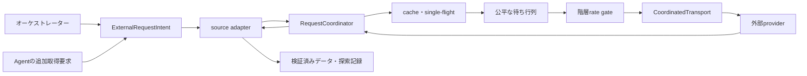
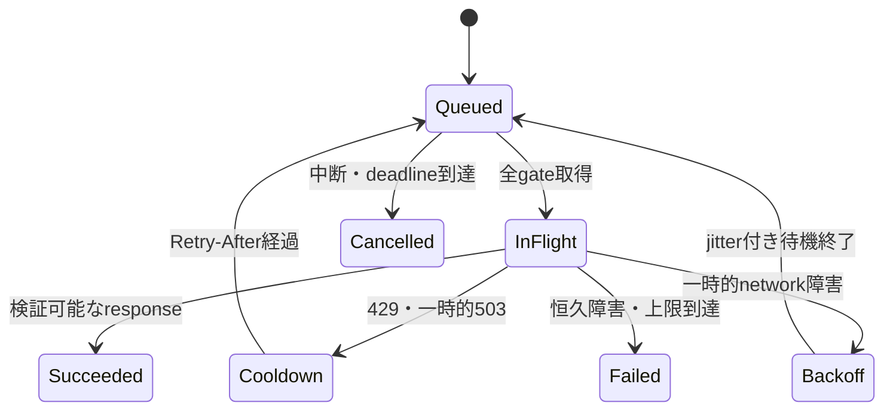

# ADR-0001: 外部リクエストを共有Coordinatorで調整する

| 項目 | 値 |
| --- | --- |
| 状態 | Accepted |
| 決定日 | 2026-08-23 |
| 適用範囲 | 詳細解析MVPと将来の一次スクリーニングにおける外部データ取得・Web検索 |
| 実装状態 | 未実装 |

## コンテキスト

複数のAgentは独立した分析とWeb探索を行う。各Agentや各データソースアダプターが独自に
外部リクエストと再試行を行うと、短時間に同じ提供者へ要求が集中する可能性がある。

現在の要件は、タスク単位のAPI呼び出し上限、指数バックオフ、再試行上限、cache利用、
論理要求IDを定めている。一方、次は未定義である。

- Agent、タスク、processをまたぐ送信タイミングの調整
- provider、認証情報、送信元IPを共有するrate limit
- 同一要求の実行中重複排除
- `Retry-After`を受けた場合のprovider全体の停止
- 再起動後も維持するcooldownと利用量
- 大量取得と単一銘柄解析の公平な待ち行列

分析の独立性は維持する必要があるが、同じ株価・開示データをAgentごとに取得する必要はない。
独立性の対象は、検索語、探索結果、暫定結論、推論過程であり、通信制御状態ではない。

### 対象となる外部アクセス

直接取得する次のsourceは、物理requestを`RequestCoordinator`で制御する。

- `yfinance`を介したYahoo Financeの市場データ
- EDINET API Version 2の書類一覧と書類取得
- SEC `data.sec.gov`とEDGAR文書取得
- 日本銀行時系列統計データ検索API
- 発行体IR、適時開示、ニュース元ページ
- 将来追加する承認済みデータAPI

Agent内蔵Web検索は、Agent CLI内部の物理requestをローカルから観測できない場合がある。
この場合は、Agent実行の開始許可、同時実行数、検索利用枠を制御し、候補URLの検証取得を
`RequestCoordinator`へ戻す。観測不能な内部通信を物理request単位で制御できるとは扱わない。

## 決定

### 1. 外部接続の直前に共有`RequestCoordinator`を置く

外部へ直接送信するすべての決定論的データ取得は、計画する`RequestCoordinator`を経由する。
Agent、source adapter、retry処理が`RequestCoordinator`を迂回して直接送信することを禁止する。



`RequestCoordinator`は次を担当する。

- source承認とrequest分類の検証
- 論理要求IDとfingerprintの発行
- cache判定と`single-flight`
- API回数、時間、費用の予約と精算
- provider別の待ち行列とタスク間の公平制御
- 同時実行数、送信間隔、rate、burst、cooldownの適用
- cancellation、timeout、retryの制御
- 物理attemptと利用量の監査記録
- limiter状態とcooldownの永続化

### 2. MVPは単一実行環境・単一Coordinator所有者とする

MVPでは、1つのオーケストレーターprocessが、Agent subprocessとsource adapterを起動する。
同じ実行環境で外部アクセス可能なオーケストレーターを複数同時起動しない。

起動時にSQLite transactionで単一行のruntime leaseを取得し、既に有効な所有者がいる場合は
オンライン処理を開始しない。
leaseは定期更新し、異常終了後は期限切れと状態照合を経て引き継ぐ。

これにより、待ち行列とin-flight制御はprocess内で一元化しながら、再起動に必要な状態だけを
SQLiteへ永続化できる。複数host・複数CoordinatorはMVP対象外とし、必要になった時点で
中央queueまたは分散leaseを持つserviceへ置き換えるADRを作成する。

### 3. process内schedulerとSQLite永続状態を組み合わせる

実装時は、Python標準ライブラリの`asyncio`をschedulerと待ち合わせの第一候補とし、
`sqlite3`を永続状態の第一候補とする。HTTP clientや`yfinance`固有の依存関係はsource adapterへ
閉じ込める。

SQLiteファイルはGit管理外の`<runtime-state>/request-coordinator.sqlite3`へ置く。
正確なruntime state pathはP1の設定契約で決定する。

最低限、次の状態を永続化する。

| 状態 | 主な項目 |
| --- | --- |
| runtime lease | `owner_id`、`acquired_at`、`expires_at` |
| 論理要求 | ID、fingerprint、task・role、状態、queue時刻、期限、結果参照 |
| 物理attempt | `attempt_id`、回数、開始・終了、結果分類、追加費用、結果不明状態 |
| rate state | rate key、token残量、最終補充時刻、`next_allowed_at`、in-flight数 |
| cooldown | rate key、理由、開始時刻、終了時刻、根拠response |
| 利用上限 | scope、resource、予約量、実測量、精算状態 |
| single-flight | fingerprint、leader request、consumer、結果参照 |

取得本文や大きなresponseをSQLiteへ保存しない。本文は証拠保存Policyに従う既存の成果物領域へ
保存し、Coordinatorは参照、hash、鮮度判定だけを保持する。

process内では単調増加時計を待機時間に使う。永続化ではUTCの期限を保存し、再起動時は
tokenを満杯へ戻さず、保存済み期限とsource Policyから保守的に復元する。

### 4. requestは複数のrate gateをすべて取得する

requestは1つの合成キーではなく、該当するすべてのgateを送信直前に取得する。

| gate | キー例 | 役割 |
| --- | --- | --- |
| global | `global:external_egress` | ランタイム全体の安全上限 |
| egress | `egress:default` | 同じIP・NATからの合計制御 |
| provider | `provider:yahoo_finance` | service全体の制御 |
| origin | `origin:example.co.jp` | 発行体サイトとredirect先の制御 |
| credential | `credential:edinet-primary` | 同じaccount・API keyの合計制御 |
| operation | `provider:yahoo_finance:history` | endpointや処理種別ごとの差 |
| task | `task:<task_id>:data_api` | タスク単位のハード上限 |
| role | `task:<task_id>:role:<role>:web_search` | Agent探索の利用枠 |

credential keyには、人間が定義した非秘密aliasだけを使用する。秘密値、hash化した秘密値、
cookie、tokenをrate keyやログへ含めない。

redirect先のoriginが変わる場合は、追従前にsource承認とorigin gateを再評価する。

### 5. source profileで制御値を与える

コードへprovider固有の数値を分散して埋め込まない。承認済みsource profileに次を持たせる。

| 項目 | 意味 |
| --- | --- |
| `rate_domain` | 同じ利用上限を共有するprovider範囲 |
| `credential_scope` | 認証情報単位の集約方法 |
| `egress_scope` | 送信元IP・NAT単位の集約方法 |
| `max_concurrency` | 同時に送信できる物理request数 |
| `min_interval` | 同じrate domainで次を送るまでの最短間隔 |
| `rate`、`window`、`burst` | 時間窓とburstの上限 |
| `daily_hard_limit` | 日次の物理request上限 |
| `cache_policy` | cache可否、TTL、認証scope、鮮度条件 |
| `batch_policy` | batch可否と最大件数 |
| `retry_policy` | retry対象、最大attempt、最大待機時間 |
| `policy_version` | 適用したsource Policy版 |

具体的な数値は、公式条件と実行主体を確認したソース承認記録から読み込む。数値を確認できない
sourceは`max_concurrency = 1`、`burst = 1`を上限とし、正の`min_interval`が承認されるまで
オンライン利用を開始しない。実測だけを理由に自動緩和しない。

token bucketで平均rateとburstを制御し、semaphoreで`max_concurrency`を制御する。
`min_interval`とprovider cooldownは`next_allowed_at`で制御する。日次上限とタスク上限は
送信前にhard limitとして予約する。

#### source別の初期方針

- Yahoo Financeは`yfinance`のライブラリ名ではなく、`provider:yahoo_finance`へ集約する。
  [`yfinance`公式説明](https://ranaroussi.github.io/yfinance/)で数値rate limitを確認できないため、
  承認済みの正の`min_interval`と`max_concurrency = 1`を初期条件にする。
- SECは、機械数にかかわらず利用者合計で毎秒10request以下とする現行指針をprovider・egress
  gateへ適用する。実際の設定には安全余裕を持たせ、数値をコードへ固定しない。
  ([SEC Developer Resources](https://www.sec.gov/about/developer-resources))
- EDINETはprovider・credential・egress gateを必須とする。正確なrate scopeと数値を
  公式条件で確認し、source profileが承認されるまでオンライン取得しない。
- 日本銀行APIは認証情報を使わないため、provider・egress gateで集約する。高頻度アクセスを
  避け、取得済みの日次時系列を鮮度Policyの範囲で再利用する。
- 発行体サイトはprovider共通値にまとめず、正規化したoriginごとに直列化する。
  利用規約とrobots条件を確認できないoriginへ自動取得しない。
- Agent内蔵Web検索はprovider account、task、roleの利用枠を予約する。物理request数を
  観測できない場合は、検索可能なAgent実行数を保守的に制限する。

### 6. 待ち行列はprovider内FIFOとタスク間round-robinを使う

sourceごとに待ち行列を分け、異なるproviderへの要求は並行可能にする。同一provider内では
各タスクのqueueを到着順で処理し、active task間をround-robinする。

- 1タスクあたりのqueued request数とin-flight数に上限を持つ。
- retryは`not_before`を付けて同じタスクqueueの末尾へ戻す。
- retryを常に新規requestより優先しない。
- queue待機、backoff、cooldownを工程とタスクのtimeoutへ含める。
- deadlineまでにpermitを取得できないrequestは送信せず、timeoutとして記録する。
- 中断されたqueued requestは取消し、未使用の予約量を解放する。

MVPではpriority queueを導入せず公平性を優先する。運用者の緊急操作は外部requestを必要としない
設計にし、将来priorityが必要になった場合はstarvation防止条件とともに別途決定する。

### 7. cacheと`single-flight`をrate制御より先に適用する

request fingerprintは少なくとも次を含む。

- providerとoperation
- HTTP methodまたはadapter operation
- 結果へ影響する正規化済みparameter
- 認証scopeの非秘密alias
- source Policy版
- `as_of_cutoff`とpoint-in-time条件
- response形式と調整条件

fingerprintが同じin-flight requestは1つのleaderへまとめ、consumerは結果を待つ。consumerごとの
論理要求ID、task、Agent role、発見元は失わない。

cacheは、利用条件、認証scope、鮮度、対象期間、point-in-time条件を満たす場合だけ再利用する。
stale cacheや利用条件が異なるcacheを暗黙に返さない。

初回独立探索中のAgent内蔵Web検索は、他Agentの検索結果cacheを利用しない。独立探索の完了後、
同じ候補URLを検証する直接取得は1回へまとめ、全発見元を証拠メタデータへ残す。

### 8. retryは必ずCoordinatorへ戻す

source adapter内で`sleep`して直接再送しない。retry可能な結果は`RequestCoordinator`へ返し、
新しい物理attemptとして利用量を予約してqueueへ戻す。



- `429`またはretry可能な`503`に有効な`Retry-After`がある場合、その期限を優先する。
- `Retry-After`がrequestのdeadlineを超える場合は待機後のretryを予約せず、上限到達として停止する。
- `Retry-After`は該当provider、credential、egressのうち、responseから判定できるrate domainへ
  共有cooldownとして適用する。
- `Retry-After`がない一時障害は、上限付き指数バックオフとfull jitterを使う。
- `401`、`403`の認証・権限拒否、入力不正、利用規約・robots拒否は自動retryしない。
- network送信後に結果が不明なattemptは`unknown`として保存し、照合前に再送しない。
- attempt上限またはdeadline到達時は、未承認sourceや別credentialへ切り替えない。

### 9. `yfinance`は制御sessionを注入し、内部並列を無効にする

`YahooFinanceAdapter`では次を必須とする。

1. 固定した`yfinance`版を使用する。
2. `download()`または`Ticker`へ、物理requestごとにpermitを取得する`CoordinatedSession`を渡す。
3. `threads=False`を明示し、`yfinance`内部の独立した並列送信を無効にする。
4. `auto_adjust`、`actions`、`ignore_tz`など結果へ影響する引数を明示する。
5. 1論理操作から発生した物理attempt数を記録する。

`CoordinatedSession`は、固定版`yfinance`が要求するsession interfaceと互換なproxyまたはsubclassとし、
送信直前にprovider permitを取得する。session注入で全物理送信を捕捉できることをintegration testで
証明できない版は採用しない。

高水準の`yfinance`呼び出しを1 requestと仮定する実装や、捕捉不能時に直接接続へfallbackする実装を
禁止する。

### 10. Agent内蔵Web検索はsession admissionで制御する

Agent CLI内の物理HTTP requestを観測できない場合、origin単位の厳密なrate制御を実現したと
扱わない。代わりに`AgentAdapter`で次を制御する。

- 検索可能なAgent実行の同時数
- task、role、provider accountごとの検索回数と検索語数
- Agent実行前の最大利用量予約
- providerが返すusage、rate-limit、retry情報
- cooldown中の検索可能Agent実行の新規開始拒否

Agentが発見した候補URLは、本文を直接共通証拠へ追加せず、Coordinator配下の検証取得へ戻す。

provider-levelの物理request制御が必須で、Agent CLIがそれを公開しない場合、その内蔵検索を使わず、
Coordinator配下のbrokered search toolだけを許可する。

### 11. Coordinator障害時は外部接続を停止する

`RequestCoordinator`、SQLite state、source profileの検証に失敗した場合、adapterやAgentが直接接続へ
fallbackしてはならない。現在状態を保存し、対象工程を停止する。

連続したrate-limitまたはprovider障害が承認閾値を超えた場合はcircuitをopenにし、新規requestを
失敗させずqueueへ無期限に残すのではなく、source一時停止として記録する。cooldownまたは人間による
再開条件を満たすまで新規送信しない。

## 計画する実装配置

次は実装時の配置案であり、現在は存在しない。

```text
src/stock_research_llm_orchestrator/external_requests/
├── models.py
├── coordinator.py
├── scheduler.py
├── limiter.py
├── store.py
├── transport.py
└── source_profiles.py
```

| ファイル | 計画する責務 |
| --- | --- |
| `models.py` | intent、logical request、physical attempt、fingerprint、結果分類 |
| `coordinator.py` | cache確認、予約、queue投入、送信、精算のユースケース |
| `scheduler.py` | provider別queue、round-robin、deadline、cancellation |
| `limiter.py` | token bucket、semaphore、`next_allowed_at`、cooldown |
| `store.py` | SQLite transaction、runtime lease、再起動時復元 |
| `transport.py` | 直接HTTP送信と`CoordinatedSession`の共通境界 |
| `source_profiles.py` | 承認済みsource profileの読込と検証 |

source adapterは別moduleから`RequestCoordinator`を利用し、`limiter.py`やSQLiteを直接操作しない。

## 監査と可観測性

論理要求と物理attemptを分離して記録する。

| 分類 | 記録項目 |
| --- | --- |
| 帰属 | `task_id`、role、agent run、logical request ID、physical attempt ID |
| rate | provider、rate domain、非秘密credential alias、適用Policy版 |
| queue | enqueue、permit取得、待機時間、deadline、取消理由 |
| cache | hit、miss、stale、拒否理由、single-flightのleader・consumer |
| response | 結果分類、status、latency、bytes、timeout、結果不明 |
| retry | `Retry-After`、backoff、jitter、cooldown期限、attempt回数 |
| budget | 予約量、実測量、精算、残量、上限拒否 |

URL query、cookie、API key、token、認証header、秘密値を含むresponse本文をログへ記録しない。
送信先は承認済みのprovider・origin aliasを優先し、必要な場合だけsanitized URLを記録する。

運用メトリクスには次を含める。

- provider別の物理request rate、in-flight数、queue長、最古の待機時間
- `429`・`503`件数、retry率、cooldown回数と継続時間
- cache hit率、stale拒否率、single-flight統合率
- task別の待機時間とdispatch数
- API回数、時間、費用の利用率
- cancellation、deadline超過、circuit openの件数

query文字列や認証情報をmetric labelに使用しない。高cardinalityな`task_id`や`request_id`は
監査ログだけに保存し、集計メトリクスのlabelへ含めない。

## 要件と設計への反映

このADRを永続的な決定の正本とする。実装前に次の順序で既存文書へ反映する。

1. `04-cli-and-runtime-operations.md`へ共有調整、queue、cooldown、永続化を追加する。
2. `02-data-source-and-evidence-policy.md`へsource profileの承認項目を追加する。
3. `03-agent-review-and-audit-policy.md`へ通信制御状態と探索内容の共有境界を追加する。
4. `05-artifact-retention-and-security.md`へSQLite state、cache、監査ログの保持条件を追加する。
5. `docs/TODO.md`へP1の契約、P3の直接取得、P4の検索制御、P5の監視を追加する。
6. 要件承認後に`docs/design/`とAgent向け指示を追随更新する。

要件文書が`Draft`の間は、このADRを実装済みまたは運用承認済みの挙動として扱わない。

## 結果

### 利点

- 複数Agent・複数タスクの集中送信とretry stormを一か所で防げる。
- source別条件とタスク別ハード上限を同時に適用できる。
- cacheと`single-flight`により、待機だけでなく物理request数自体を削減できる。
- 分析独立性を維持しながら、決定論的データを共通化できる。
- cooldown、試行回数、利用量を再起動後も維持できる。
- source adapterごとの独自retry・sleepを排除し、監査しやすくなる。

### 欠点

- `RequestCoordinator`が外部アクセスの単一障害点になる。
- source profile、永続状態、fairness、cache判定の実装とテストが必要になる。
- 単一Coordinator leaseにより、MVPではオンライン処理の水平並列化を制限する。
- `yfinance`やAgent内蔵検索で物理requestを完全に観測できない可能性がある。
- 保守的な初期値により、現在のデータ取得15分上限を満たせない可能性がある。

## 検討した代替案

### Agent・adapterごとに`sleep`する

採用しない。別Agent、別task、別processの要求を把握できず、同時retryを防げない。

### 全外部requestを1本のglobal queueで直列化する

採用しない。異なるproviderまで相互に待たせ、必要以上に処理時間を延ばす。global safety gateは持つが、
通常のscheduleはprovider別にする。

### providerごとに固定semaphoreだけを置く

採用しない。同時実行数は制御できるが、時間窓、burst、`Retry-After`、タスク間公平性、再起動後の
集中送信を制御できない。

### 最初からRedis・Celeryなどの分散queueを導入する

MVPでは採用しない。現在の単一実行環境には運用負荷が大きい。複数hostが必要になった時点で、
SQLiteと単一ownerを置き換える後続ADRを作成する。

## 検証条件

実装は、少なくとも次を満たすまで完了としない。

1. 同一requestを同時投入しても物理送信が1回になる。
2. 同一providerの間隔、rate、burst、同時数を固定時計で検証できる。
3. 異なるproviderは並行して進められる。
4. 複数taskが同じprovider・credential・egress gateを共有する。
5. `429 Retry-After`で同一rate domain全体が停止する。
6. retryがjitter付きでqueueへ戻り、直接再送されない。
7. queue待機とcooldownが工程timeoutへ含まれる。
8. 中断時にqueued requestとretryを止め、in-flight結果を正しく精算する。
9. 再起動でcooldown、attempt、利用量、runtime leaseがリセットされない。
10. `yfinance`の全物理送信が`CoordinatedSession`を通り、`threads=False`になる。
11. 初回独立探索で他Agentの検索内容・結果が見えない。
12. 大量taskが別taskをstarvationさせない。
13. ログに秘密情報が含まれない。
14. Coordinator障害時に直接接続へfallbackしない。

## 未決定事項

このADRは機構を決定するが、次の運用値はソース承認とP1契約で決定する。

- providerごとのrate、window、burst、`min_interval`、`max_concurrency`
- sourceごとのcache TTL、batch上限、retry対象
- 詳細解析と一次スクリーニングの相対的な重み
- runtime stateの正確な保存先と保持期間
- circuit breakerの失敗閾値とhalf-open条件
- 採用する固定`yfinance`版とsession互換性
- Agent CLIごとの検索利用量取得方法

## 参照

- [CLIと実行運用の要件](../system-requirements/04-cli-and-runtime-operations.md)
- [データソースと証拠の方針](../system-requirements/02-data-source-and-evidence-policy.md)
- [Agentレビューと追加監査の方針](../system-requirements/03-agent-review-and-audit-policy.md)
- [成果物の保持とセキュリティ](../system-requirements/05-artifact-retention-and-security.md)
- [yfinance.download API reference](https://ranaroussi.github.io/yfinance/reference/api/yfinance.download.html)
- [SEC Developer Resources](https://www.sec.gov/about/developer-resources)
- [RFC 6585: Additional HTTP Status Codes](https://www.rfc-editor.org/info/rfc6585/)
- [RFC 9110: HTTP Semantics](https://www.rfc-editor.org/info/rfc9110/)
