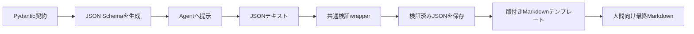

# ADR-0002: Pydanticを契約定義の正本としJSONで交換する

| 項目 | 値 |
| --- | --- |
| 状態 | Accepted |
| 決定日 | 2026-08-31 |
| 要件との整合確認日 | 2026-08-31 |
| 適用範囲 | 詳細解析MVPの設定、Agent間契約、機械可読成果物、検証、人間向け最終成果物 |
| 実装状態 | 未実装 |

## コンテキスト

詳細解析MVPは、task、証拠、分析、レビュー、争点、監査、状態および最終結果を複数のAgent、
オーケストレーター、CLI、保存層の間で受け渡す。必須フィールド、型、列挙値および値域を
機械検証できる一方、人間が実行途中の内容を通常のテキストツールで確認できる必要がある。

人間が編集する設定にはYAMLが適する。Agent間通信と保存成果物には、製品やPythonクラスに
依存しないJSONテキストが適する。人間による最終確認には、構造化データを直接読むよりも、
固定した構成の日本語Markdownが適する。

JSON Schemaを手書きの正本にすると、Python内の型と検証処理を別に保守する必要がある。
PydanticモデルとJSON Schemaを独立して編集すると、両者が不一致になる危険がある。

## 決定

契約定義の正本を、版付きPydanticモデルとする。PydanticモデルからJSON Schema Draft
2020-12互換のスキーマを決定論的に生成し、Agentへ渡す構造化出力仕様および契約レビュー用の
生成物としてGit管理する。生成JSON Schemaは手作業で編集しない。

形式ごとの責務は次のとおりとする。

| 対象 | 形式 | 位置づけ |
| --- | --- | --- |
| 人間が編集する実行設定 | YAML | 入力表現。安全なJSON互換データへ読み込み後に検証する |
| フィールド、型、制約 | Pydanticモデル | 契約定義の正本 |
| Agentへ提示する出力契約 | 生成JSON Schema | Pydantic契約の配布・レビュー用表現 |
| Agent間通信と機械可読成果物 | JSONテキスト | 交換形式および実行データの正本 |
| 人間が検収する最終成果物 | Markdown | 版付きテンプレートから生成する人間向け最終成果物 |

pickleその他のPython固有バイナリ形式を、Agent間通信、契約配布または永続成果物に使用しない。
PydanticオブジェクトはPython process内の検証済み表現に限定する。

### バージョニングと互換性

- 各契約に安定した`schema_id`と正の整数の`schema_version`を持たせる。
- 公開済みのPydantic契約と生成JSON Schemaを変更せず、検証規則を変更する場合は新しい
  `schema_version`を作成する。
- `schema_version`をアプリケーション版、Policy版または`evidence_set_version`と混同しない。
- 検証wrapperは`schema_id`と`schema_version`の組でモデルを選び、未対応版を安全側に拒否する。
- MVPでは暗黙の変換、自動migrationおよび未知フィールドの無視を行わない。
- Pydanticモデルは未知フィールドを原則として拒否する。拡張が必要な箇所は、契約内に明示した
  拡張用フィールドとして定義する。
- 旧版からのmigrationが必要になった場合は、元成果物を上書きしない明示的で決定論的な変換として
  別途承認する。

### 検証

共通検証wrapperは、JSONまたはYAML parserとPydanticを直接各consumerへ露出させず、次を一元化する。

1. YAMLをcustom tagのないJSON互換データとして安全に読み込む、またはJSONをparseする。
2. `schema_id`と`schema_version`から正しいPydanticモデルを選ぶ。
3. 必須フィールド、型、列挙値、値域、未知フィールドおよび成果物内条件を検証する。
4. 証拠参照、成果物間整合、状態遷移、Policyおよびセキュリティを専用validatorへ委譲する。
5. 検証済みデータだけをJSONテキストとして保存し、後続処理へ渡す。
6. library固有エラーを、共通の版付き検証エラー契約へ変換する。

検証エラーは少なくとも、エラー契約版、category、安定したcode、対象成果物、`schema_id`、
`schema_version`、instance path、schema path、人間向けmessageおよび秘密情報を含まないcontextを持つ。
categoryはschema、semantic、reference、state transition、policyおよびsecurityを区別する。
consumerはmessageの文面ではなくcodeで分岐する。

### Markdown

人間向け最終Markdownは、検証済み機械可読JSONと共通証拠から、版付きテンプレートに従って生成する。
Markdown生成時に新しい事実、評価、証拠または推奨を追加しない。保存前に、評価、数値、欠損、
反証および証拠参照が機械可読成果物と一致することを検証する。Markdownから機械可読結果を
再構成しない。

## 結果

Python内部では型安全な検証済みモデルを利用でき、Agent間通信、保存、障害調査では可読なJSONを
維持できる。人間はテンプレート化されたMarkdownを最終成果物として確認できる。一方、Pydanticの
版と生成処理が契約へ影響するため、依存関係を固定し、生成JSON Schemaの再現性をCIで検証する
必要がある。

## 検討した代替案

- 手書きJSON Schemaを契約定義の正本にする: Python型と検証処理の重複を避けにくいため採用しない。
- PydanticモデルとJSON Schemaを別々に編集する: 契約の不一致を防げないため採用しない。
- JSONだけを保存して検証しない: 必須項目、型および参照の不備を安全に拒否できないため採用しない。
- MarkdownをAgent間の正本にする: 機械検証と安定した再処理に適さないため採用しない。
- pickleで交換・保存する: 人間による確認、他製品との相互運用および安全な読み込みに適さないため
  採用しない。

## 検証条件

1. Pydantic契約から生成したJSON SchemaがGit管理された生成物と一致する。
2. YAML設定とJSON成果物の正常、欠損、型違反、未知フィールドおよび未対応版を検証できる。
3. Pydantic固有エラーを共通検証エラー契約へ変換できる。
4. Agent入出力と保存成果物にpickleその他のPython固有バイナリ形式が存在しない。
5. 同じ検証済みJSONから、版付きテンプレートに従うMarkdownを再現可能に生成できる。
6. Markdownと機械可読成果物の重要項目の不一致を保存前に検出できる。

## 参照

- [機械可読契約と人間向け成果物の要件](../system-requirements/07-machine-readable-contracts.md)
- [言語と対象読者の方針](../system-requirements/06-language-and-audience-policy.md)
- [個別株調査・スクリーニングシステム構成](../design/03-stock-research-system-architecture.md)
