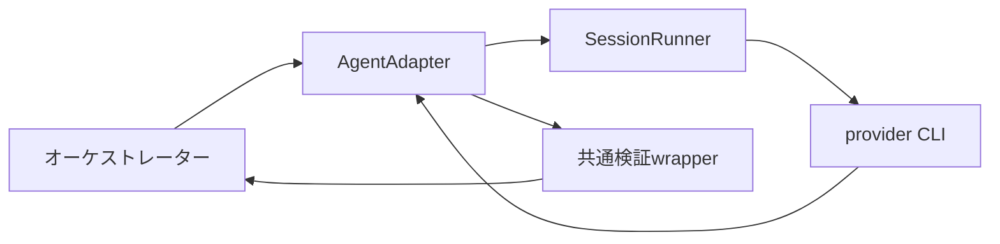

# ADR-0003: AgentAdapterとsession継続境界を標準化する

| 項目 | 値 |
| --- | --- |
| 状態 | Accepted |
| 決定日 | 2026-08-31 |
| 要件との整合確認日 | 2026-08-31 |
| 適用範囲 | Codex、Claude Code、Antigravityの非対話実行、session継続、構造化出力変換 |
| 実装状態 | 未実装 |

## コンテキスト

詳細解析MVPは、Codex、Claude Code、Antigravityを共通オーケストレーションから起動する。
製品ごとに、CLI引数、session ID、構造化出力、エラー、使用量および再開方法が異なる。
製品固有処理をworkflowへ埋め込むと、task状態、process状態およびprovider session状態が混在する。

レビュー差し戻しでは、作業者が過去の分析理由と証拠利用を保持したsessionを継続する利点がある。
一方、新しいtask、別の役割または独立分析で過去sessionを継続すると、前taskの情報や他Agentの
暫定結論が混入する。session継続の可否をproviderや作業者へ無制限に委ねず、システムが安全境界を
判定する必要がある。

2026-08-31時点の公式CLI文書では、候補とする3製品がsession IDによる非対話再開を提供している。

- Codex: `codex exec resume [SESSION_ID]`
- Claude Code: `--resume`。必要な場合は`--fork-session`を併用できる
- Antigravity: headless modeの`--conversation <conversation-id>`

## 決定

`AgentAdapter`はprovider固有のCLI起動とresponse envelopeを共通契約へ変換する。process lifecycleは
`SessionRunner`、task lifecycleと成果物採否はオーケストレーターが担当する。

### 公開操作

MVPの全Adapterは次を必須とする。

- `capabilities`: 対応CLI版、非対話実行、構造化出力、resume、status、cancel、使用量取得可否を返す
- `preflight`: 選択したCLI、版、認証、model、非対話実行、構造化出力、native resumeを確認する
- `start`: 新しいprovider sessionと`agent_run`を開始してhandleを返す
- `resume`: 指定したprovider sessionを継続し、新しい`agent_run`を開始する
- `get_status`: 1つの`agent_run`のprocess状態を返す
- `cancel`: 1つの`agent_run`へ冪等な取消要求を送る
- `collect`: 終端runのprocess結果、provider出力、使用量および成果物参照を回収する

provider固有のnative forkは任意操作とし、`capabilities`で明示する。native forkがない場合、
オーケストレーターは検証済み成果物を新規sessionへ渡す`reconstructed_fork`を選択できる。
`native_fork`、`reconstructed_fork`および履歴を引き継がない`new`を区別して記録する。

### 責務分離

`SessionRunner`はsubprocess起動、標準出力・標準エラー、終了code、時刻、OS processの状態、
取消および資格情報の対象processへの直接注入を担当する。

`AgentAdapter`はcommand構築、provider session ID、capability、preflight、provider固有response・error・
usageの共通形式への変換を担当する。構造化出力は共通のraw JSONまで変換し、自然文からの推測修復、
暗黙の型変換または業務上の採否判断を行わない。

オーケストレーターはtask checkpoint、session mode選択、Agent間の独立性、証拠・Policy・schemaの
検証、状態遷移および成果物採否を担当する。Pydantic、証拠参照、状態、Policyおよびsecurityの検証は
ADR-0002の共通検証wrapperで行う。

### sessionとrun

`logical_session_id`、`provider_session_id`および`agent_run_id`を分離する。同じprovider sessionを
resumeするたびに新しい`agent_run_id`を発行し、親run、入力版、出力、終了状態および使用量を個別に
記録する。provider sessionをtask ID、実行履歴または成果物の正本にしない。

正常系では1つのlogical sessionを直列実行する。複数のレビュー指摘は1つのfeedback packetへまとめ、
1回のresumeで差し戻す。active runが存在するlogical sessionへのstart、resumeまたはfork要求はqueueへ
積まず、`session_busy`として拒否する。MVPではsession専用の永続queueを設けない。

### session更新Policy

同一task、同一役割、同一の論理Agentおよび同じ処理目的を継続するレビュー差し戻し、再レビュー、
同一争点の補足、検証済み共通証拠追加後の再分析は`resume`を既定とする。

新しい`task_id`、別銘柄、別役割、別の独立分析者、異なるmodel family、安全境界・処理目的の変更では
`new`を必須とする。同じ履歴から別案を派生させる場合は`native_fork`または
`reconstructed_fork`を使用する。Policyが複数のsession modeを許可した場合だけ、オーケストレーターが
理由codeと説明を記録して選択する。

Codex作業者、Claude作業者、一次レビューワー、オーケストレーターおよびAntigravityは、互いの
provider sessionをresumeしない。Antigravityの未完了runを同一`logical_audit_id`と同一目的でresumeする
処理は、2回目の論理監査に数えない。完了後に問いまたは監査目的を追加する処理は別監査として扱う。

### session設定

logical session開始時に、YAML設定からprovider、model、effort相当値、役割指示、permission、workspace、
検索Policyおよび出力契約を確定する。同じlogical session内ではこれらを変更しない。変更が必要な場合は、
session更新Policyに従ってforkまたはnewを選択する。

resume時には現在のtask、役割、処理目的、feedback、証拠集合版、変更証拠、Policy版および出力契約版を
明示する。providerの会話履歴より、現在の検証済みtask入力と成果物を優先する。

### 失敗とMVP境界

native resumeに失敗した場合は、未処理事項とエラーを保存して`Failed`とする。新規sessionへ自動fallback
しない。必要な再実行は人間が明示的に開始する。

MVPではprovider sessionのcontext圧縮、context欠落またはcontext window不足に対する専用検出、
予防的fork、自動要約または自動再構成を設けない。実測で問題が発生した場合に要件を追加する。

使用量は、CLIから容易に取得できる項目だけを実験的に記録する。token、費用、所要時間、turn数の
取得可否と、run値かsession累積値かは実装前の調査TODOで確認する。取得不能な値を`0`としない。

## 結果

レビュー差し戻しでprovider sessionの文脈を再利用しながら、task、役割および独立分析の境界を維持できる。
process、provider session、taskの状態が分離され、provider固有処理をAdapter内へ閉じ込められる。一方、
native resumeは3つの候補AdapterのMVP必須能力となり、実装時に対応CLI版と非対話動作を固定して検証する
必要がある。

## 検討した代替案

- すべて新規sessionで実行する: レビュー差し戻しで文脈を再構成する負担が大きいため採用しない。
- session継続をAgentへ無制限に委ねる: task間混入と独立性違反を機械的に防げないため採用しない。
- resumeを任意機能にする: 候補3製品が対応し、MVPでレビュー差し戻しに使用するため採用しない。
- resume失敗時にnewへ自動fallbackする: 文脈欠落を成功として扱う危険があるため採用しない。
- 同一sessionの要求を永続queueで処理する: 正常フローは直列であり、MVPには不要なため採用しない。
- context圧縮をMVPで予防制御する: 問題の発生が未確認であり、初期実装を複雑にするため採用しない。

## 検証条件

1. 3つの候補CLIについて、固定した対応版で非対話startとsession ID指定resumeを確認できる。
2. 同じlogical sessionの各resumeに別の`agent_run_id`が付与され、親runを追跡できる。
3. レビュー指摘を1つのfeedback packetにまとめ、同じ作業者sessionへ差し戻せる。
4. 新task、別役割または独立分析で過去provider sessionのresumeを拒否できる。
5. active runがあるlogical sessionへの重複要求を`session_busy`として拒否し、queueを作らない。
6. logical session内のmodel、effort、permission、workspaceおよび契約設定が変化しない。
7. resume失敗時にnewへfallbackせず、未処理事項を保存して`Failed`となる。
8. Adapterのraw JSONを共通検証wrapperへ渡し、無効な出力を自動採用しない。

## 参照

- [AgentAdapterとsession継続の要件](../system-requirements/08-agent-adapter-and-session-continuation.md)
- [ADR-0002](0002-use-pydantic-contracts-and-json-interchange.md)
- [Codex developer commands](https://learn.chatgpt.com/docs/developer-commands?surface=cli)
- [Claude Code CLI reference](https://code.claude.com/docs/en/cli-usage)
- [Antigravity headless mode](https://www.antigravity.google/docs/cli/headless/)
