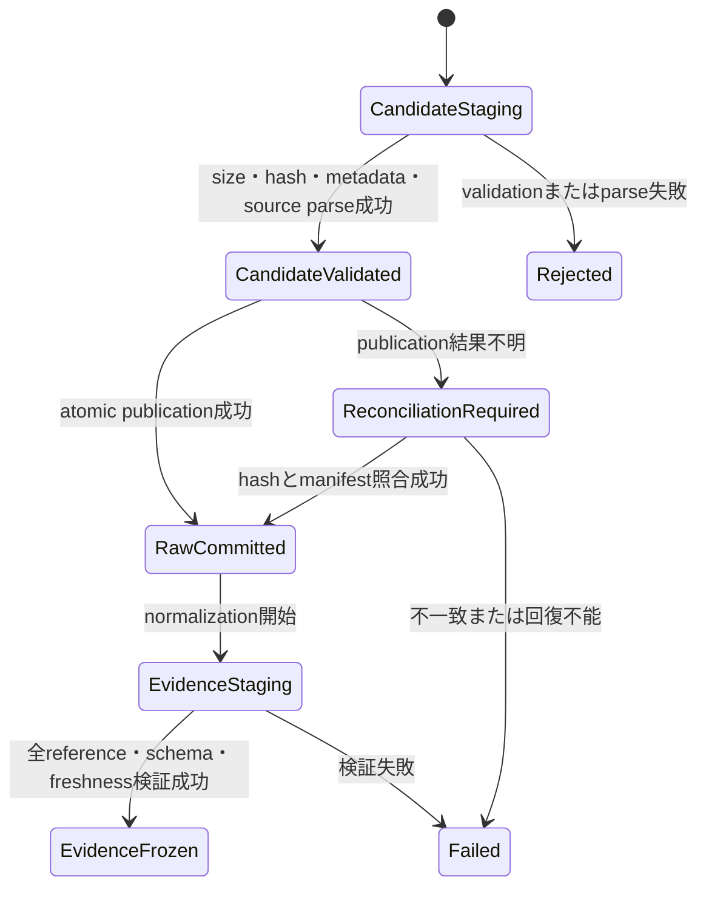

# ADR-0005: 本番外部request runtimeとraw artifact公開境界を確定する

| 項目 | 値 |
| --- | --- |
| 状態 | Accepted |
| 提案日 | 2026-09-21 |
| 決定日 | 2026-09-21 |
| 決定者 | リポジトリ所有者 |
| 適用範囲 | 詳細解析MVPの決定論的な外部データ取得 |
| 要件との整合確認日 | 2026-09-21 |
| 対応仕様 | 要件04版1.1・要件05版1.3 |
| 実装状態 | Phase 3A・3BとPhase 3Cのattempt recoveryを実装。queue・cooldown recovery以降は未実装 |

## コンテキスト

ADR-0001と承認済み要件は、単一orchestrator process、SQLite runtime lease、provider別queue、
rate gate、cache、single-flight、再起動時復元、rawとnormalized evidenceの分離を要求している。
一方、production runtimeの所有者、SQLite配置・version、lease回復、request cardinality、
raw candidateからcommitted artifactへのtransactionは実装可能な粒度で確定していない。

現在の`Coordinator`は同期・memory-only・fake transport専用であり、production classではない。
`publish_preparation`も専用directoryをatomic renameする内部helperであり、`runs/<task-id>/`、
manifest、raw acquisition bundleの正本を実装していない。

本ADRでは、外部source固有adapterへ進む前に必要なPackage A〜Dを一括して決定する。
要件04・05を同じ変更単位で更新し、差異がある状態で実装を開始しない。

## 決定案

### Package A: runtime ownershipとSQLite

#### Process ownership

- 1つのorchestrator processが1つのproduction Coordinator worker loopを所有する。
- source adapterとtransportは同一process内のCoordinator APIだけを使用する。
- 同じrepository runtime rootに対するonline ownerはSQLiteの単一runtime leaseで1つに限定する。
- CLI processの終了とCoordinator lifecycleを一致させ、独立daemonはMVPでは採用しない。

#### Runtime rootと権限

- runtime stateはrepository root直下のGit非追跡`runs/.runtime/`へ保存する。
- SQLiteは`runs/.runtime/request-coordinator.sqlite3`、lock・一時fileも同じfilesystemへ置く。
- applicationは既存directoryのownerとmodeを検証し、symlink、非directory、group/other書込み可能なrootを拒否する。
- directoryはownerだけが使用できる`0700`、新規SQLiteとsidecarは`0600`を要求する。
- credential値、response body、raw bytesはSQLiteへ保存しない。

#### Schemaとmigration

- SQLite schemaのownerはproduction Coordinator packageとする。
- `PRAGMA user_version`とschema metadata tableの両方を使用し、既知versionの一致を検証する。
- migrationは明示的、一方向、transactional、versionごとのPython migrationとして実装する。
- unknown newer version、metadata不一致、integrity check失敗、migration失敗はonline処理前にfail-closedする。
- MVPは自動downgrade、破損DBの自動修復、別DBへのsilent replacementを行わない。
- backup専用機能は実装しない。利用者が通常のfile backupを行えるよう、停止状態でSQLiteとartifactを一組として扱う。

#### Cleanup

- runtime state、audit、cooldown、未完了requestを自動削除しない。
- terminal taskのqueue reservationとsingle-flight membershipはtransactionで解放するが、監査rowは保持する。
- 利用者によるfile削除は許容するが、再開保証はしない。

### Package B: lease、fencing、回復、cancellation

#### Leaseとclock

- lease rowは固定key、random owner token、generation、acquired/heartbeat/expires timestampを持つ。
- wall-clockは監査・expiryにUTCを使用し、process内interval測定にはmonotonic clockを使用する。
- lease durationはversioned runtime policyで設定し、初期値を30秒、heartbeatを10秒とする。
- heartbeatはlease durationの3分の1以下でなければ設定不正として起動を拒否する。
- wall-clock rollback、未来過ぎるheartbeat、期限計算不能を検出した場合は送信を停止する。

#### Fencingとtakeover

- lease取得・takeoverごとにgenerationを増加させ、mutationとphysical attemptへgenerationを記録する。
- transport permit発行直前とphysical result確定時にowner tokenとgenerationを再検証する。
- 有効leaseがある場合はonline起動を拒否する。
- expired leaseのtakeoverは、未完了attemptを照合して保守的状態へ移した後だけ許可する。

#### Unknown physical outcome

- `permit issued`または`physical started`の後、結果確定前にownerを失ったattemptは`unknown`とする。
- `unknown` attemptは同じtask内で自動再送しない。
- providerにidempotency・status照会がない限り、成功・失敗を推測せずtaskを`Failed`または`Suspended`へ移す。
- 人間が新しいtaskとして再実行するまで、同じlogical requestの再送を禁止する。

#### Cancellation

- queued requestの取消は送信前にterminal `cancelled`とし、queueとsingle-flight consumerを解放する。
- single-flight followerの取消はleaderを取り消さず、そのconsumerだけを解除する。
- leader取消は未送信ならleaderを取消し、残るconsumerから新leaderをtransactionally選ぶ。
- in-flight attemptの取消は新しい送信を止めるが、通信を成功扱いにしない。結果を回収できなければ`unknown`とする。
- process強制終了を安全な取消として扱わない。

### Package C: request API、cardinality、queue、gate

#### API ownership

- production APIは`enqueue(logical request)`、`poll/status(handle)`、`cancel(handle, reason)`、
  `claim next physical attempt`、`record physical result`の責務を分離する。
- callerはphysical transportを直接取得せず、Coordinatorが発行したpermit/attempt contextだけをtransportへ渡す。
- logical resultは1つのlogical requestにつき1つとし、0件以上のphysical attemptとresponseを参照できる。

#### Cardinality

- cache hitはphysical attempt 0件、single-flight followerも自身のphysical attempt 0件とする。
- 通常送信はlogical request 1件にphysical attempt最大1件とする。
- redirect、cookie、crumb、pagination、document downloadなどprovider library内の追加通信は、
  1 logical request配下の複数physical attemptとして個別にpermit・監査・raw referenceを持つ。
- MVPは自動retryしないため、失敗attempt後の追加attemptを同じlogical requestへ作らない。

#### Fingerprintとkey derivation

- fingerprintはsource ID・approval/profile version、operation、canonical non-secret parameters、
  target period、freshness policy、credential scope alias、egress scopeをcanonical JSON化してSHA-256とする。
- URL query、header、cookie、API key、token、raw credential、秘密由来hashをfingerprintへ含めない。
- gate keyはglobal、egress、provider/rate domain、origin、非秘密credential alias、operation、task、roleを使う。
- credential aliasは設定artifactの非秘密識別子だけを許可し、値から導出しない。

#### Queueとbackpressure

- provider/rate domainごとにtask内FIFO、active task間round-robinを使う。
- global queue boundとprovider queue boundをversioned runtime policyで必須にする。
- 初期値はglobal 1024、provider 256、task/provider 64とし、超過時は永続queueへ無制限に積まず`queue_full`で拒否する。
- queue bound変更は実測と要件変更で行い、adapterが独自queueを持たない。

#### Gate order

1. source approval/profile・request shape・runtime leaseを検証する。
2. cache eligibilityを評価する。
3. single-flightへleader/follower登録する。
4. queueへ登録してfairness順を待つ。
5. globalからroleまでの全該当gateをtransactionally予約する。
6. transport permitとphysical attempt IDを発行する。
7. response分類、cooldown、usage、auditを確定する。

gate stateまたはpolicyが欠損・矛盾する場合は送信せずfail-closedする。

### Package D: raw artifact lifecycle

#### State model

#### Pathとschema identity

- 正本は`runs/<task-id>/`とし、外部取得ごとに
  `acquisitions/<logical-request-id>/<physical-attempt-id>/`を使用する。
- candidateは同じfilesystemの`runs/<task-id>/.staging/acquisitions/<attempt-id>/`へ置く。
- committed raw bundleはexact body file、sanitized response metadata、request metadata、SHA-256 receiptを含む。
- schema identityはartifact metadataへ記録し、body自体がJSONであってもprovider raw schemaとpublic contractを混同しない。
- filenameはsystem-generated IDだけを使い、URL、ticker、credential aliasを埋め込まない。

#### Stage、validate、commit

1. transportはsize limitを適用しながらexact bytesをcandidateへ書き、同時にSHA-256を計算する。
2. status、content type、encoding、compression、byte count、request/attempt referenceを検証する。
3. source adapterがbounded candidateからsource-native parseを行う。parse失敗時もrawをcommitted artifactにしない。
4. validatorはstagingからbytesを読み直し、receiptとmetadataを検証する。
5. directoryを同一filesystemのatomic renameでraw committed locationへ公開する。
6. SQLite transactionはcommitted path、hash、size、schema、publication generationを記録する。
7. committed raw referenceが検証できた後だけnormalizationを開始する。

#### Publication failureとreconciliation

- rename前の失敗はcandidateをinvalidとして扱い、新規処理で再利用しない。
- rename後・SQLite commit前のcrashはdirectory receiptとDB stateを照合する。
- hash、path、generation、logical/physical IDが完全一致した場合だけcommitをforward-repairする。
- DBだけがcommittedを示しdirectoryがない場合、または内容不一致の場合はtaskを失敗させる。
- 既存committed raw bundleを上書き、部分更新、in-place修正しない。

#### Normalized evidenceとmanifest

- normalized evidenceはcommitted raw referenceだけを入力にする。
- evidence stagingでschema、provenance、freshness、missing、source approvalを検証する。
- frozen evidence bundleとmanifestは全referenceとhashが解決した場合だけatomicに確定する。
- raw、normalized、manifestのpublication generationを記録し、別generationの混在を拒否する。

## 検討した代替案

### Coordinatorを別daemonにする

複数CLIから共有しやすいが、MVPの単一process要件を超え、認証・lifecycle・deploymentが増えるため採用しない。

### SQLiteへresponse bodyを保存する

transactionは単純になるが、大容量・利用条件・秘密情報・破損影響がruntime stateへ集中するため採用しない。

### Expired leaseを即時takeoverして未完了requestを再送する

可用性は高いが、送信済みか不明なrequestを重複送信し得るため採用しない。

### Parse前にraw bundleをcommittedとして公開する

取得失敗の調査には便利だが、不正・過大・未対応formatを正本へ昇格させるため採用しない。
必要な失敗情報はsanitized auditとhash・size metadataへ限定する。

## セキュリティと障害境界

- filesystem root、SQLite、schema、clock、lease、policy、source bindingの異常時は外部送信前に停止する。
- secretをSQLite、fingerprint、path、log、metric、artifact metadataへ含めない。
- external responseとfilenameを信頼せず、pathはsystem-generated IDだけから構築する。
- raw candidateはAgent inputへ直接渡さず、committed rawから生成した検証済みevidenceだけを渡す。
- Coordinator障害時にadapter、library、transportがdirect connectionへfallbackしない。

## 要件文書へ反映した変更

同じ変更単位で次を行った。

- `docs/system-requirements/04-cli-and-runtime-operations.md`を版1.1へ更新し、Package A〜Cのruntime path、
  schema/migration、lease/fencing/recovery、cancellation、cardinality、queue bound、gate orderを規定する。
- `docs/system-requirements/05-artifact-retention-and-security.md`を版1.3へ更新し、Package Dのcandidate、raw commit、
  reconciliation、normalized/frozen publication、path・mode・generationを規定する。
- 本ADRを`Accepted`とし、決定日、要件との整合確認日、対応versionを記録する。
- ADR-0001のP1未決定項目をADR-0005参照へ置き換え、production実装完了とは表現しない。

## 承認項目

リポジトリ所有者は次を一括承認するか、修正点を指定する。

1. `runs/.runtime/`と`runs/<task-id>/`をruntime stateとartifact正本にする。
2. 単一process owner、30秒lease、10秒heartbeat、generation fencingを採用する。
3. unknown physical outcomeを自動再送せず、人間による新task再実行を要求する。
4. logical request 1件に通常attempt最大1件、library内追加通信は複数attemptとして記録する。
5. global 1024、provider 256、task/provider 64を初期queue boundにする。
6. cache、single-flight、queue、gate、permitの順序を採用する。
7. raw lifecycleをcandidate stage、validate/parse、atomic commit、reconciliationの順にする。
8. normalized evidenceとmanifestをcommitted raw referenceから別transactionで凍結する。
9. unknown schema、破損、不整合、clock rollback、publication不一致をfail-closedする。

## 承認後の検証条件

1. 2つのownerが同じruntime rootを同時に取得できない。
2. stale generationのmutationとtransport resultを拒否する。
3. expired lease後のunknown attemptを再送せず回復できる。
4. queued、follower、leader、in-flight cancellationを固定clockで検証できる。
5. cache hitとsingle-flight followerがphysical attemptを作らない。
6. queue boundとtask間round-robinを固定fixtureで検証できる。
7. permitなし、stale permit、欠損gateでtransportが送信しない。
8. raw staging、atomic commit、rename後crash、DB/artifact不一致を回復または安全停止できる。
9. committed raw以外からnormalized evidenceを作れない。
10. SQLite、log、path、artifact metadataへcredential値とraw response bodyを保存しない。

## 参照

- [ADR-0001](0001-centralize-external-request-coordination.md)
- [CLIと実行運用の要件](../system-requirements/04-cli-and-runtime-operations.md)
- [成果物・保持・セキュリティの要件](../system-requirements/05-artifact-retention-and-security.md)
- [データソースと証拠の方針](../system-requirements/02-data-source-and-evidence-policy.md)
- [本番データ取得基盤の再設計](../agent-reports/plans/2026-09-21-production-data-acquisition-reassessment-implementation-plan.md)
