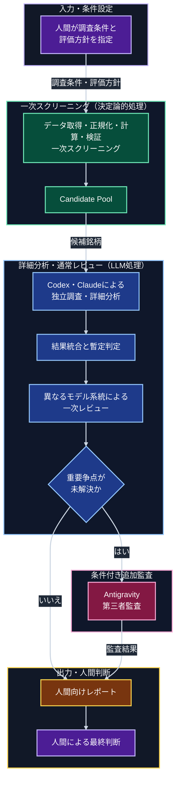

# 個別株調査・スクリーニングシステム全体像

## 1. 文書の位置づけ

本書は、個別株調査・スクリーニングシステムの目的、全体フロー、主要な責務境界、および設計文書間の関係を俯瞰するための入口である。

本書は詳細な仕様や要求事項の正本ではない。各領域の定義は、後続の構想書、全体アーキテクチャ、一次スクリーニング構成、判定ルール要求を参照する。

本システムは現在設計段階にあり、本書に記載するコンポーネント、処理、データ契約、成果物、および実行フローは実装済みの動作を示すものではない。

## 2. システムの目的

本システムは、個別株の調査・比較・反証・レビューを支援し、中長期的な値上がり候補を人間が確認できる件数と情報量まで絞り込むことを目的とする。

主な役割は次のとおりである。

- 再現可能なデータ取得、正規化、計算、検証、一次スクリーニングを決定論的なプログラムで行う
- Codex 系と Claude 系が、共通データを使って独立に調査・分析する
- 分析結果の一致点、不一致、根拠、反証、リスク、データ不足を保持する
- オーケストレーターと異なるモデル系統が一次レビューを行う
- 通常系で解消できない重要争点だけを Antigravity 系の第三者監査へ送る
- レビュー後の候補と判断材料を、人間が確認可能なレポートへまとめる

本システムは投資判断や売買を自動化しない。証券会社への接続、注文送信、自動購入、自動売却は対象外とし、最終的な購入判断は人間が行う。

## 3. 基本原則

- 数値取得、計算、検証、一次スクリーニングは、可能な限り決定論的に実行する
- LLM は、検証可能なデータと参照元に基づく調査、定性分析、比較、反証、レビュー、レポート作成を担当する
- 未提示の財務数値、価格、日付、企業情報をモデルの記憶から補完しない
- 重要な事実には、出典、取得日時、対象期間、証拠識別子を関連付ける
- 事実、推論、仮説を区別し、モデル間の不一致や未解決事項を消さずに保存する
- データ不足、取得失敗、評価不能を、条件不適合や問題なしとして扱わない
- Agentと外部ツールには、担当する役割に必要な権限とデータだけを与える

## 4. 全体フロー

| 区分 | 配色 | 実行内容 |
| --- | --- | --- |
| 入力・人間判断 | 紫 | 人間による条件設定と最終判断 |
| 一次スクリーニング | 緑 | 通常コードによる決定論的な処理 |
| 詳細分析・通常レビュー | 青 | Codex 系と Claude 系によるLLM処理 |
| 条件付き追加監査 | 赤紫 | 重要な未解決争点に限定したAntigravity第三者監査 |
| 出力 | 黄 | 人間が確認するレポートの生成 |

Antigravity 系は通常作業者や多数決の第三票ではない。一次レビューと限定的な再調査を経ても、最終結果へ影響する重要争点が残る場合にだけ、独立した第三者監査を担当する。

## 5. 主要な責務境界

### 5.1 人間

- 調査条件、投資方針、評価方針、制約を設定する
- 未解決争点と最終レポートを確認する
- 追加調査や差し戻しを指示する
- 最終的な購入判断を行う

### 5.2 決定論的な処理

- 対象銘柄集合を準備する
- データを取得、正規化、計算、検証する
- 共通除外と戦略別Screenを適用する
- 後段の調査対象となるCandidate Poolを生成する

### 5.3 LLMによる調査・レビュー

- Codex 系と Claude 系が独立した調査と分析を行う
- オーケストレーターが結果を統合し、一致点と相違点を整理する
- オーケストレーターと異なるモデル系統が一次レビューを行う
- 事実確認で解消できる問題は、限定的な再調査へ戻す
- 重要な未解決争点だけを、条件付きでAntigravity第三者監査へ送る

### 5.4 成果物と最終判断

- 入力、データ、分析、レビュー、争点、監査結果、判定理由を追跡可能な形で保存する
- 人間向けレポートには、候補理由だけでなく、リスク、反証、データ不足、未解決事項を含める
- 出力は調査と意思決定の支援材料として扱い、投資助言、購入推奨、注文指示、収益保証として扱わない

## 6. 一次スクリーニングの位置づけ

一次スクリーニングは、多数の銘柄から後段のLLM調査へ渡す候補を決定論的に抽出するサブシステムである。初期構想では、次の独立したScreenを想定する。

- `Dividend Screen`
- `Growth Screen`
- `Value Screen`

各Screenは、銘柄を総合的に優良または不良と判定するものではなく、Screenごとの投資仮説に該当するかを判定する。同一銘柄が複数Screenを通過してよい。

一次スクリーニングはCandidate Poolの生成までを担当する。競争優位性、成長の持続性、リスク、反証、投資仮説の妥当性、候補間の優先順位などは、後段のLLM調査と人間の確認で扱う。

## 7. 設計文書の責務

| 文書 | 責務 | 詳細の正本となる内容 |
| --- | --- | --- |
| 本書 | 全体像と文書案内 | 目的、全体フロー、主要な責務境界の要約 |
| [02-stock-research-system-concept.md](02-stock-research-system-concept.md) | システム構想 | 背景、目的、スコープ、基本方針、ユースケース、品質原則、システム全体のMVPと成功条件 |
| [03-stock-research-system-architecture.md](03-stock-research-system-architecture.md) | システム全体のアーキテクチャ | 役割、コンポーネント、モデル配置、実行フロー、データ契約、状態遷移、成果物、障害、安全境界 |
| [04-primary-screening-architecture.md](04-primary-screening-architecture.md) | 一次スクリーニングのアーキテクチャ | UniverseからCandidate Poolまでの処理、入出力、Policy管理、成果物、後段LLMとの境界 |
| [05-screening-rule-requirements.md](05-screening-rule-requirements.md) | Screen判定ルールの要求 | 共通インターフェース、判定状態、戦略別の評価観点、スコアリング、Policy構成 |

文書間で同じテーマを扱う場合は、次の粒度で責務を分ける。

| テーマ | 構想 | 全体アーキテクチャ | 一次スクリーニング | Screen判定ルール |
| --- | --- | --- | --- | --- |
| 処理フロー | 概念上の段階と目的 | コンポーネント間の実行フローと状態 | 一次スクリーニング内部の処理段階 | 1つのScreen内の判定フロー |
| 入出力 | 必要な情報と成果の考え方 | システム全体のデータ契約と成果物 | スクリーニングタスク、結果、Candidate Pool | `ScreeningResult`と判定理由 |
| 品質 | システム全体の品質原則 | 全体構成で品質を担保する仕組み | スクリーニング基盤の再現性と説明可能性 | 判定ルールとPolicyの品質 |
| MVP | システム全体の初期境界 | 全体アーキテクチャの初期構成 | 一次スクリーニング基盤の初期範囲 | 初期Screenと判定要素 |

詳細文書間に矛盾がある場合、本書の要約だけで解消してはならない。影響する文書、相違点、未決定事項を記録し、人間の判断を求める。

## 8. 現在の設計状態

現在は設計段階であり、各領域の未決定事項は後続の詳細文書で管理する。

システム全体のMVP、一次スクリーニング基盤のMVP、Screen判定ルールのMVPは、それぞれの文書が担当範囲に応じて定義している。これらの実装順序と統合方法は、詳細設計と要件承認の過程で確定する。

承認された詳細要件は、確定後に `docs/system-requirements/` で管理する。
