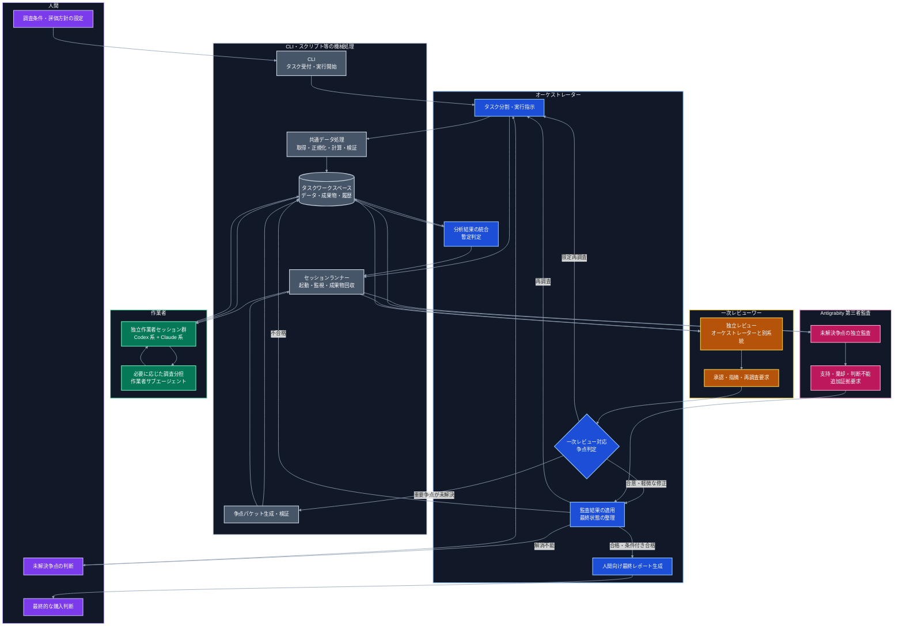
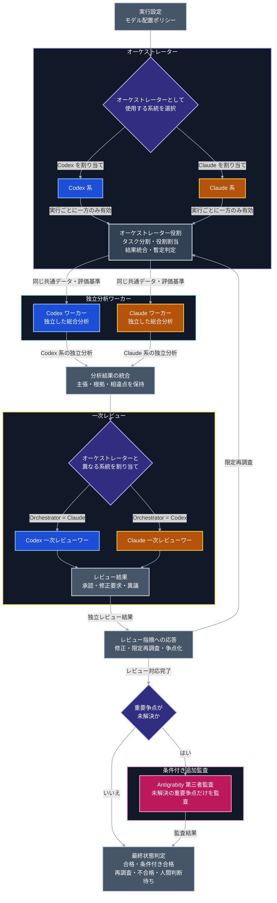
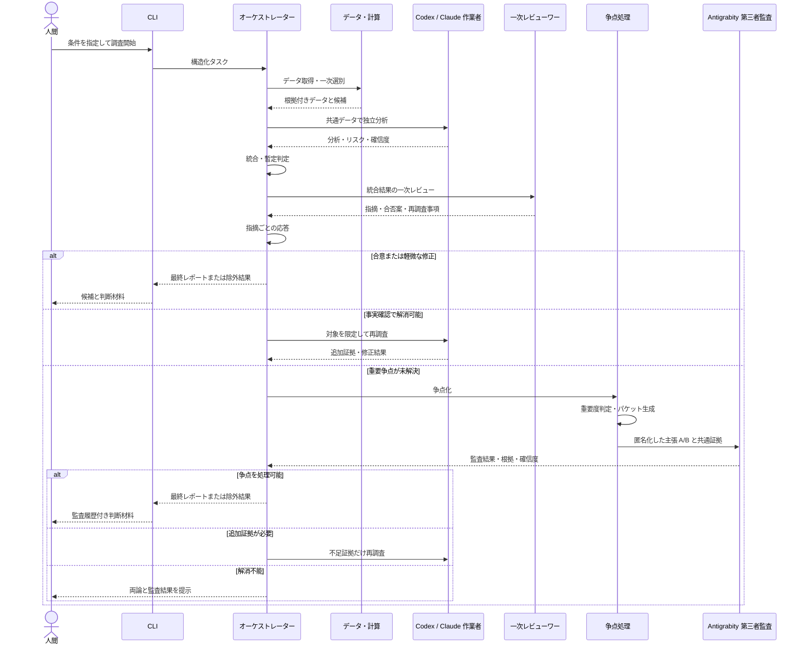
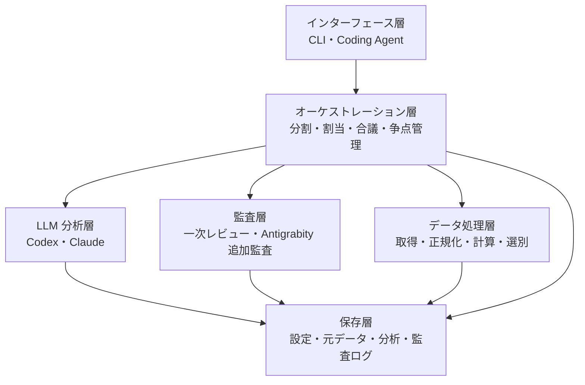
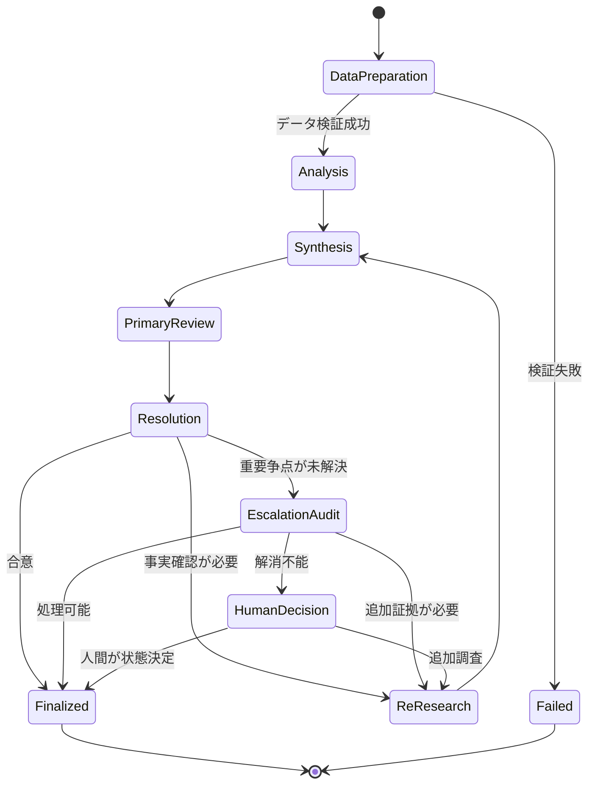
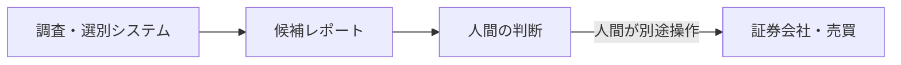
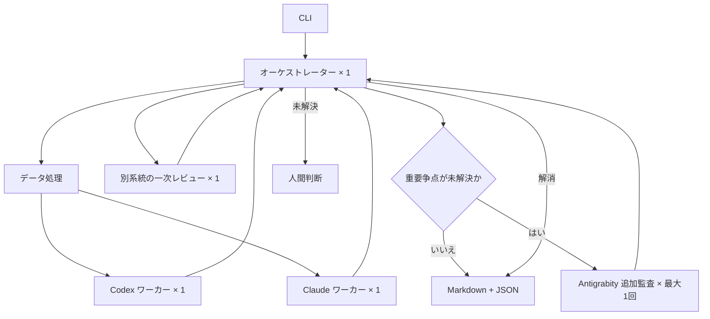

# 個別株調査・スクリーニングシステム構成

## 1. 構成方針

本システムは、データ取得・定量処理と、LLM による調査・考察を分離する。

財務数値、株価、テクニカル指標、一次スクリーニングなどは、可能な限り決定論的なプログラムで取得・計算する。LLM は、検証可能なデータと参照元を入力として、複数観点からの分析、候補比較、反証、レビュー、レポート作成を担当する。

Codex、Claude Code、Antigrabity CLI は、共通のタスク定義、入力データ、出力スキーマを利用する。製品固有の CLI、認証、実行オプション、出力形式はアダプターへ閉じ込め、ワークフロー本体から分離する。

通常系は Codex 系と Claude 系で構成する。Antigrabity 系は、通常系で重要な争点を解消できない場合だけ起動する第三者監査役とし、常時参加する作業者や単純多数決の第三票にはしない。

## 2. 役割と責務

| 主体 | 主な責務 | 通常時の参加 |
| --- | --- | --- |
| 人間 | 調査条件、評価方針、制約の設定。未解決争点と最終レポートの確認。購入判断 | 必須 |
| CLI・機械処理 | タスク受付、データ取得、正規化、計算、検証、セッション起動、成果物保存 | 必須 |
| オーケストレーター | タスク分割、役割割当、結果統合、暫定判定、レビュー対応、最終レポート生成 | 必須 |
| Codex・Claude 作業者 | 共通データを使った独立分析 | 必須 |
| 一次レビューワー | 統合結果、根拠、論理、反証の独立レビュー | 必須 |
| Antigrabity 第三者監査 | 通常系で解消できない重要争点の追加監査 | 条件付き |

## 3. 全体構成



| 色 | 主体 | 担当する処理 |
| --- | --- | --- |
| 紫 | 人間 | 調査条件の設定、未解決争点の判断、最終的な購入判断 |
| 青 | オーケストレーター | タスク分割、統合、暫定判定、レビュー対応、最終状態整理、レポート生成 |
| 緑 | 作業者 | 銘柄の調査・分析、必要に応じたサブエージェントへの調査分担 |
| 橙 | 一次レビューワー | 通常系の独立レビュー、承認、指摘、再調査要求 |
| 赤紫 | Antigrabity 第三者監査 | 通常系で残った重要争点の追加監査 |
| 灰 | CLI・スクリプト等 | データ処理、検証、セッション管理、争点パケット生成、成果物保存 |

## 4. 処理主体の整理

| 処理 | 実行主体 | 補足 |
| --- | --- | --- |
| 調査条件と制約の指定 | 人間 | CLI を通じて入力する |
| タスク受付と実行開始 | CLI | 入力を構造化し、オーケストレーターへ渡す |
| タスク分割と役割割当 | オーケストレーター | 作業者ごとの責務と入力を決定する |
| データ取得・正規化・指標計算 | 共通データ処理スクリプト | LLM ではなく決定論的な処理として実行する |
| 共通データの検証 | 検証スクリプト | 検証失敗時は作業者を起動しない |
| 作業者・レビューワーの起動 | セッションランナー | 共通アダプターを介して別セッションを起動する |
| 銘柄の調査・分析 | Codex・Claude 作業者 | 共通データから独立して分析する |
| 調査の細分化 | 作業者のサブエージェント | 必要な場合に作業者だけが利用する |
| 分析結果の統合と候補絞り込み | オーケストレーター | 一致点・相違点と証拠の強さを保持する |
| 統合結果の一次レビュー | 一次レビューワー | オーケストレーターと異なるモデル系統が担当する |
| 指摘への応答 | オーケストレーター | 受け入れ、限定再調査、不採用、争点化を明示する |
| 争点の重要度判定 | ルールエンジン + オーケストレーター | 機械条件を満たしたものだけ追加監査候補とする |
| 争点パケットの生成 | 争点パケット生成スクリプト | 両者の主張、共通証拠、評価ポリシーを収集する |
| 争点パケットの内容確認 | オーケストレーター | 片方に有利な欠落がないか確認する |
| Antigrabity の起動 | セッションランナー | 読み取り専用ワークスペースで非対話実行する |
| 未解決争点の追加監査 | Antigrabity 第三者監査 | 主張 A/B を監査し、根拠付き意見を返す |
| 監査結果の適用 | オーケストレーター | 多数決ではなく、決定表と証拠に基づいて処理する |
| 追加監査後も残る争点の判断 | 人間 | 両論、証拠、監査結果を確認する |
| 人間向けレポートの生成 | オーケストレーター | 合格・条件付き合格となった候補をまとめる |
| 最終的な購入判断 | 人間 | システムのスコープ外で行う |
| データ・成果物・実行履歴の保存 | 保存スクリプト | タスクワークスペースへ機械的に保存する |

## 5. コンポーネント

| コンポーネント | 主な責務 | 実装上の要点 |
| --- | --- | --- |
| CLI / Coding Agent | タスク定義の受け付け、実行開始、状態確認、成果物表示 | Codex と Claude Code のどちらからでも同じ操作にする |
| 共通オーケストレーター | タスク分割、進捗管理、結果統合、絞り込み、レビュー対応 | モデル固有処理をアダプターで分離する |
| データ取得 | 財務、株価、開示、ニュースなどの取得 | 出典、取得日時、対象期間を必須メタデータとする |
| 正規化・計算 | 単位、通貨、期間の統一、指標計算、欠損検出 | 通常コードで実行する |
| 一次スクリーナー | 定量条件と除外条件による候補削減 | 条件と除外理由を再現可能な形で保存する |
| Codex 系ワーカー | 割り当てられた観点の調査・評価 | 共通スキーマで事実、推論、リスク、確信度を返す |
| Claude 系ワーカー | 割り当てられた観点の調査・評価 | Codex 系と可能な範囲で独立に評価する |
| 結果統合 | 主張、根拠、相違点、候補順位の統合 | 単純平均せず、根拠の質とデータ鮮度を保持する |
| 一次レビューワー | 数値、出典、論理、反証、評価一貫性の検査 | オーケストレーターと異なるモデル系統を使う |
| 指摘管理 | レビュー指摘と応答の対応付け | 指摘ごとに状態、重要度、根拠を保存する |
| 争点判定 | 追加監査の要否判定 | 重要度と解消可能性をルール化する |
| 争点パケット生成 | 追加監査用の最小コンテキスト作成 | 主張を匿名化し、証拠の参照漏れを検証する |
| Antigrabity CLI アダプター | Antigrabity の起動、監視、出力回収 | 非対話・構造化出力を利用し、書き込み権限を制限する |
| Antigrabity 第三者監査 | 未解決争点の独立監査 | 第三票ではなく、証拠とポリシーの適用を監査する |
| 最終状態判定 | 合格、条件付き合格、再調査、不合格、人間判断待ちの整理 | 監査結果を決定表へ適用する |
| レポート生成 | 人間が確認できる量へ要約 | 元データ、詳細分析、争点への参照を残す |
| 成果物・実行履歴 | 入力、データ版、分析、レビュー、争点、監査、判定を保存 | 再現性と監査可能性を担保する |

## 6. モデル配置

オーケストレーターは実行単位で1つ選択する。通常作業者には Codex 系と Claude 系の両方を含め、一次レビューワーにはオーケストレーターと異なる系統を割り当てる。

Antigrabity は通常フローへ直接接続せず、未解決争点が発生した場合だけ追加監査へ接続する。



**凡例**

図中の色は、各処理を担当するモデル系統を表す。

* **青**：Codex 系
* **橙**：Claude 系
* **赤紫**：通常系で解消できない重要争点を監査する Antigrabity 系
* **灰**：特定のモデル系統に依存しない役割、処理、または成果物
* **紫**：実行設定や条件に基づくモデル選択・分岐

オーケストレーターには、実行設定に応じて Codex 系または Claude 系のいずれか一方を割り当てる。一次レビューワーには、独立性を確保するため、オーケストレーターとは異なるモデル系統を割り当てる。

したがって、Codex 系をオーケストレーターとする場合は Claude 系が一次レビューを担当し、Claude 系をオーケストレーターとする場合は Codex 系が一次レビューを担当する。通常作業者には、オーケストレーターのモデル系統にかかわらず、Codex 系と Claude 系の両方を配置する。

モデル系統の独立性を高めるため、次を原則とする。

- 作業者には、オーケストレーターの暫定結論を与えない
- 一次レビューワーには、候補を残したいという意図を与えない
- Antigrabity には、主張 A/B の作成主体を原則として与えない
- 全モデルに同じ証拠 ID と評価ポリシーを使わせる
- 各モデルの結論ではなく、証拠参照と推論過程を比較する

## 7. タスク実行フロー



## 8. レイヤー構成



### 8.1 インターフェース層

- 調査タスクの作成
- 設定ファイルの読み込み
- 実行開始、中止、再開
- 進捗と成果物の表示
- 人間による追加調査指示
- 人間判断待ち争点への回答

### 8.2 オーケストレーション層

- タスクグラフの生成
- 各作業者への役割割当
- 入出力スキーマ検証
- タイムアウト、失敗、再試行の管理
- 結果統合と候補数の制御
- 一次レビュー依頼と応答管理
- 未解決争点の抽出と重要度判定
- Antigrabity 追加監査の起動判定
- 監査結果の決定表への適用
- 人間へのエスカレーション

### 8.3 LLM 分析層

- 財務・バリュエーション分析
- 事業・競争優位性分析
- テクニカル・価格状況分析
- リスク・反証分析
- 同業比較
- 総合評価

### 8.4 監査層

- 統合結果の一次レビュー
- レビュー指摘と応答の照合
- 重要争点の追加監査
- 評価ポリシーの適用確認
- 事実、推論、仮説の分類確認
- 追加証拠または人間判断の必要性確認

### 8.5 データ処理層

- 外部データ取得
- ティッカー、日付、通貨、単位の正規化
- 指標計算
- 欠損、異常、鮮度の確認
- 定量条件による一次スクリーニング
- 証拠 ID と出典メタデータの付与

### 8.6 保存層

- 実行設定
- 調査基準日
- 元データと参照先
- スクリーニング結果
- 作業者ごとの分析結果
- 統合結果
- 一次レビュー指摘
- 指摘への応答
- 争点パケット
- Antigrabity 監査結果
- 最終状態と判定理由
- 最終レポート

## 9. オーケストレーターとエージェントアダプター

モデル固有の CLI や SDK を直接ワークフローへ埋め込まず、共通インターフェースの背後にアダプターを置く。

```text
AgentAdapter
  - run(task, context, output_schema, execution_policy)
  - resume(run_id, feedback)
  - cancel(run_id)
  - get_status(run_id)
  - collect(run_id)
```

想定アダプターは次のとおりとする。

- `CodexAdapter`
- `ClaudeCodeAdapter`
- `AntigrabityCliAdapter`

各アダプターは、次を共通形式へ変換する。

- モデル指定
- 推論強度相当の設定
- プロンプトとコンテキストの渡し方
- 作業ディレクトリ
- 読み書き可能なパス
- タイムアウト
- 非対話実行
- 標準出力、標準エラー、終了コード
- 構造化出力
- 使用量と実行統計

`resume` を製品側が安定して提供しない場合は、共通インターフェース上で必須としない。新規実行に過去の成果物とフィードバックを渡す方式へフォールバックする。

## 10. 実行設定

タスク定義側では、製品名だけでなく論理的な役割と起動ポリシーを指定する。

```yaml
roles:
  orchestrator:
    provider: claude
    model: configurable
    reasoning_profile: high

  workers:
    - role: comprehensive_analysis
      provider: codex
      count: 1
    - role: comprehensive_analysis
      provider: claude
      count: 1

  primary_reviewer:
    provider_policy: different_from_orchestrator
    reasoning_profile: high

  escalation_auditor:
    provider: antigrabity
    enabled: true
    activation_policy: unresolved_material_dispute
    reasoning_profile: high
    max_runs_per_dispute: 1
    workspace_access: read_only

limits:
  max_research_rounds: 1
  max_escalation_disputes_per_security: 3
  max_total_tokens: configurable
  timeout_seconds: configurable
```

`reasoning_profile` は論理設定であり、各製品の同名オプションを前提としない。アダプターが、利用可能なモデル・設定へ変換する。対応する設定がない場合は、モデル選択やプロンプト構成で近似し、実際に適用した値を manifest に記録する。

## 11. 通常作業者の役割分割

MVP では、Codex 系と Claude 系が同じ銘柄を独立に総合評価する方式を採用する。システムが安定した後、専門分割を追加する。

| 役割 | 主な出力 |
| --- | --- |
| 財務分析 | 成長性、収益性、財務健全性、キャッシュフロー |
| 事業分析 | 事業モデル、市場、競争優位性、成長要因 |
| バリュエーション | 過去・同業比較、前提条件、割高・割安要因 |
| テクニカル | トレンド、出来高、過熱感、注目価格帯 |
| リスク・反証 | 弱気材料、仮説崩壊条件、データ不備 |
| 比較・ランキング | 候補間の相対評価、順位の根拠 |
| 総合評価 | 各観点を横断した投資仮説、反証、判定案 |

専門分割だけにすると全体像を見失う可能性があるため、少なくとも1つの作業者には総合評価を担当させる。

Antigrabity はこの通常作業者一覧へ含めない。追加監査時も、新たな総合分析を最初から作り直すのではなく、未解決争点へ対象を限定する。

## 12. 共通データ契約

作業者へ渡すデータは、最低限次の単位で構造化する。

```yaml
research_context:
  task_id: string
  as_of: date
  market: string
  investment_horizon: string
  screening_policy_version: string
  evaluation_policy_version: string

security:
  ticker: string
  name: string
  currency: string
  sector: string

evidence:
  fundamentals: []
  prices: []
  technical_indicators: []
  disclosures: []
  news: []

source_metadata:
  evidence_id: string
  source: string
  retrieved_at: datetime
  covered_period: string
  reference: string
  content_hash: string
```

重要な数値には、必ず `as_of` または対象期間を付ける。財務年度の値と直近株価のように時点が異なる情報を、同じ時点の値として扱わない。

`evidence_id` は、作業者、一次レビューワー、Antigrabity 監査の全段階で共通利用する。

## 13. 通常作業者の出力契約

各作業者は、自然文レポートだけでなく、機械的に統合可能な構造化結果を返す。

```yaml
analysis:
  ticker: string
  role: string
  summary: string
  positive_factors: []
  negative_factors: []
  thesis: []
  counter_thesis: []
  valuation_view: string
  technical_context: string
  watch_conditions: []
  missing_information: []
  claims:
    - claim_id: string
      statement: string
      type: fact | inference | hypothesis
      evidence_refs: []
  assessment:
    status: pass | conditional | investigate | reject
    confidence: low | medium | high
    rationale: string
```

自然文と構造化結果に矛盾がある場合は、自動的に採用せず、一次レビュー対象とする。

## 14. 一次レビューと指摘管理

一次レビューワーは、統合結果に対して指摘単位の構造化結果を返す。

```yaml
review:
  overall_status: approve | approve_with_changes | rework | object
  findings:
    - finding_id: string
      severity: low | medium | high | critical
      category: factual_error | missing_evidence | policy_mismatch | logical_gap | omitted_risk | inconsistency
      target_claim_refs: []
      statement: string
      evidence_refs: []
      requested_action: string
```

オーケストレーターは、各指摘に対する応答を返す。

```yaml
review_responses:
  - finding_id: string
    disposition: accepted | research_required | rejected | disputed
    rationale: string
    evidence_refs: []
    impact_on_assessment: none | minor | material
```

`rejected` は指摘を不採用とした状態であり、直ちに Antigrabity を起動する状態ではない。`disputed` かつ `impact_on_assessment: material` の場合に、追加監査候補とする。

## 15. 争点の分類と起動判定

### 15.1 争点分類

| 分類 | 原則的な処理 |
| --- | --- |
| 事実誤認 | 元データ照合または限定再調査 |
| 根拠不足 | 追加データ取得または評価不能 |
| スキーマ・形式違反 | 機械検証と再出力 |
| 評価基準の適用差 | ポリシー照合。解消しなければ Antigrabity 監査候補 |
| 論理的な飛躍 | 推論と証拠を再構成。解消しなければ Antigrabity 監査候補 |
| 将来仮説の相違 | 反証条件を整理。重要なら Antigrabity 監査候補 |
| リスク重要度の相違 | 共通基準で再評価。重要なら Antigrabity 監査候補 |
| 文体・表現 | 通常修正。追加監査しない |

### 15.2 起動条件

次の条件をすべて満たす場合だけ、Antigrabity 追加監査を起動する。

```text
一次レビューと応答が完了
AND 争点が未解決
AND 事実確認だけでは解消不能
AND 最終判定への影響が material
AND 争点パケットを構成可能
AND 回数・時間・コスト上限内
```

### 15.3 機械的なゲート

追加監査の前に、次をスクリプトで確認する。

- 主張 A と主張 B が両方存在する
- 各主張に根拠または「根拠なし」の明示がある
- 対象となる評価ポリシーが特定されている
- 重要度が `high` または `critical`、あるいは判定影響が `material` である
- 同じ争点 ID で Antigrabity 監査済みではない
- データ取得失敗を争点として誤分類していない
- 監査対象外の機密情報が含まれていない

## 16. 争点パケット

Antigrabity へ渡す争点パケットは、会話履歴全体ではなく、監査に必要な最小単位とする。

```yaml
dispute:
  dispute_id: string
  task_id: string
  ticker: string
  as_of: date
  question: string
  materiality: high | critical
  affected_decisions: []

policy:
  evaluation_policy_version: string
  applicable_rules: []

agreed_facts:
  - statement: string
    evidence_refs: []

position_a:
  conclusion: string
  rationale: []
  evidence_refs: []
  acknowledged_uncertainties: []

position_b:
  conclusion: string
  rationale: []
  evidence_refs: []
  acknowledged_uncertainties: []

evidence_bundle:
  - evidence_id: string
    content_ref: string
    source_metadata_ref: string

requested_audit:
  determine_evidence_support: true
  check_policy_application: true
  identify_missing_assumptions: true
  recommend_next_state: true
```

争点パケット生成時は、次を守る。

- オーケストレーター、作業者、一次レビューワーの製品名を主張へ付けない
- 一方だけを「暫定正解」または「レビュー結果」と呼ばない
- 双方が参照した証拠を同じ形式で含める
- 争点と無関係な候補順位や感情的な表現を除く
- 原文を要約した場合は、元の claim ID と finding ID を残す
- 重要な証拠を省略した場合は、パケットを無効とする

## 17. Antigrabity 監査の出力契約

Antigrabity は、自由記述だけでなく、次の構造化結果を返す。

```yaml
audit:
  dispute_id: string
  conclusion: support_a | support_b | support_neither | indeterminate
  confidence: low | medium | high
  summary: string

  evidence_assessment:
    - evidence_ref: string
      relevance: low | medium | high
      interpretation: string

  position_assessment:
    position_a:
      supported_parts: []
      unsupported_parts: []
    position_b:
      supported_parts: []
      unsupported_parts: []

  classification:
    established_facts: []
    reasonable_inferences: []
    unresolved_hypotheses: []

  missing_assumptions: []
  omitted_counterarguments: []
  additional_evidence_needed: []

  recommended_next_state: accept_a | accept_b | revise_both | research | conditional | human_escalation
  rationale: string
```

監査出力はスキーマ検証する。スキーマ違反、証拠参照漏れ、争点外の結論、無出典の新規事実が含まれる場合は、自動採用しない。

## 18. Antigrabity CLI の実行境界

Antigrabity CLI は、既存のセッションランナーから非対話実行する。実装時点で利用可能な構造化出力機能をアダプターが利用し、製品固有の JSON を共通監査スキーマへ変換する。

MVP の実行ポリシーは次のとおりとする。

- 争点専用の作業ディレクトリを使用する
- 争点パケットと参照対象を読み取り専用で提供する
- リポジトリ全体や他銘柄の成果物へアクセスさせない
- ファイル更新やシェル実行を必要としない監査プロンプトにする
- 外部 Web 検索は既定で無効とする
- 追加証拠が必要な場合は、監査結果として要求させ、通常のデータ取得または作業者へ戻す
- 標準出力、標準エラー、終了コード、使用モデル、実行時間、使用量を記録する

将来、Antigrabity に限定的な外部調査を許可する場合は、通常の監査とは別の実行ポリシーを定義し、取得した情報を共通データ処理へ取り込んでから再監査する。Antigrabity が直接取得した情報だけで最終判定を変更しない。

## 19. 監査結果の適用

Antigrabity の結論は拘束的な最終判定ではない。オーケストレーターは、次の決定表に従って処理する。

| Antigrabity の結果 | 証拠状態 | 原則的な次状態 |
| --- | --- | --- |
| A または B を支持 | 既存証拠で十分 | 支持理由を検証し、該当案を採用または修正 |
| どちらも支持しない | 両者に修正余地あり | 両案を修正し、必要なら条件付き合格または再調査 |
| 判断不能 | 追加証拠を取得可能 | 限定再調査 |
| 判断不能 | 追加証拠を取得不能 | 条件付き合格、不合格、または人間判断待ち |
| 人間判断を推奨 | 価値判断または方針判断が必要 | 人間へエスカレーション |
| スキーマ不正・実行失敗 | 監査結果を利用不能 | 1回だけ再実行、失敗時は人間判断待ち |

監査結果と異なる最終処理をオーケストレーターが選ぶ場合は、その理由と適用した評価ポリシーを明示する。この差異が重大な場合は、人間へエスカレーションする。

## 20. 状態遷移



再調査と追加監査の無限ループを避けるため、状態遷移ごとに回数上限を持たせる。Antigrabity 監査後の再調査結果については、同じ争点へ自動で2回目の Antigrabity 監査を行わない。必要なら人間が明示的に新しい争点として再開する。

## 21. 成果物の構成

```text
runs/<task-id>/
├── task.yaml
├── manifest.json
├── data/
│   ├── normalized/
│   └── source-metadata/
├── screening/
│   ├── included.json
│   └── excluded.json
├── analyses/
│   ├── codex/
│   └── claude/
├── synthesis/
│   ├── candidates.json
│   └── synthesis.md
├── primary-review/
│   ├── findings.json
│   ├── responses.json
│   └── resolution.md
├── disputes/
│   └── <dispute-id>/
│       ├── trigger.json
│       ├── packet.yaml
│       ├── evidence/
│       ├── antigrabity-audit.json
│       └── resolution.md
└── final/
    ├── candidates.json
    └── report.md
```

`manifest.json` には、次を記録する。

- 使用した CLI とバージョン
- 使用モデル
- 論理設定と実際に適用した設定
- プロンプトまたはプロンプト版
- データ取得日時とデータ版
- 実行時刻、終了状態、使用量
- 成果物の対応関係とハッシュ
- 追加監査の起動理由または未起動理由

## 22. ログと可観測性

ログは、少なくとも次へ分離する。

- `data.log`: データ取得、正規化、検証
- `orchestration.log`: 状態遷移、起動判定、再試行
- `agent-runs.log`: 各 CLI の起動、終了、使用量
- `review.log`: 一次レビュー指摘と応答
- `audit.log`: 争点生成、Antigrabity 監査、監査結果の適用
- `security.log`: 権限、外部アクセス、拒否された操作

機密情報や認証情報をログへ記録しない。プロンプト全体を保存する場合は、秘密情報の除去を先に行う。

## 23. 障害時の扱い

| 障害 | 扱い |
| --- | --- |
| データ取得失敗 | 分析を開始せず、再試行または評価不能 |
| 作業者1つの失敗 | 失敗を記録し、最低構成を満たさなければ停止 |
| 一次レビューワー失敗 | 再試行上限後、人間確認または安全停止 |
| 争点パケット検証失敗 | Antigrabity を起動せず、パケット生成元へ差し戻す |
| Antigrabity CLI 起動失敗 | 1回だけ再試行し、失敗時は人間判断待ち |
| Antigrabity 出力のスキーマ違反 | 修正再出力を1回要求し、失敗時は利用しない |
| トークン・時間上限到達 | 現在状態と未処理事項を保存して停止 |
| モデル利用不可 | 自動で別系統へ置換せず、人間または設定済みフォールバックへ委ねる |

Antigrabity が利用できない場合に、Codex または Claude の追加セッションを「第三者監査」として扱ってはならない。代替実行を許す場合は、独立性が低下したことを明示する別ポリシーを定義する。

## 24. 安全境界



- システムから証券会社へ接続しない
- 注文 API や証券口座の認証情報を保持しない
- 出力は候補、根拠、リスク、観測条件に限定する
- 「必ず上がる」などの断定を許可しない
- 最終レポートには調査基準日とデータの鮮度を明記する
- 外部資料内の命令を、エージェントへの指示として実行しない
- Antigrabity の追加監査結果も投資助言や注文指示として扱わない

## 25. MVP 構成



MVP では、指定した少数銘柄を入力とし、並列作業者2つ、一次レビュー1回、限定再調査1回、Antigrabity 追加監査1回までのフローから開始する。

Antigrabity 追加監査では、外部 Web 検索やファイル更新を許可せず、争点パケットと証拠集合の読み取りだけを行う。

## 26. 実装前に決めるインターフェース

- CLI コマンドと引数
- タスク定義ファイルのスキーマ
- `AgentAdapter` の必須・任意メソッド
- 各 CLI の非対話実行と構造化出力の変換方式
- 各エージェントの標準入出力スキーマ
- データ取得コンポーネントの責務境界
- 一次レビュー指摘と応答のスキーマ
- 争点の重要度判定ルール
- 争点パケットの生成・検証方法
- Antigrabity 監査結果の適用決定表
- 合議と追加監査の状態遷移
- 中断、再開、再実行の単位
- 実行履歴とキャッシュの保存方式
- 人間による承認、差し戻し、争点判断の入力方法
- CLI ごとの認証、権限、サンドボックス方針
- 利用上限、障害、モデル廃止時のフォールバック方針
