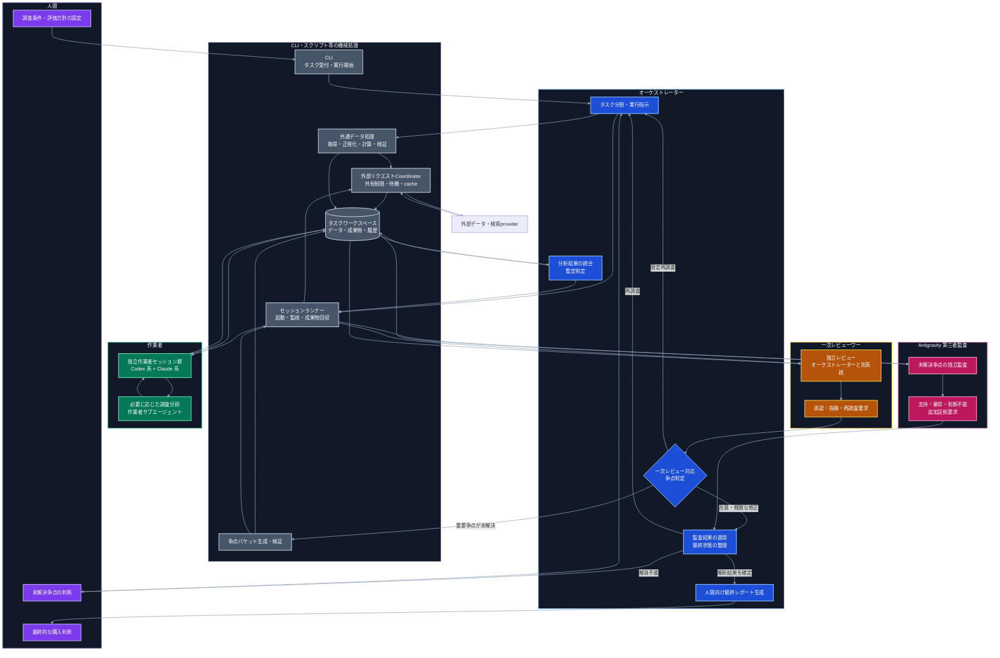
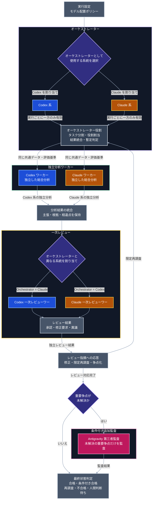
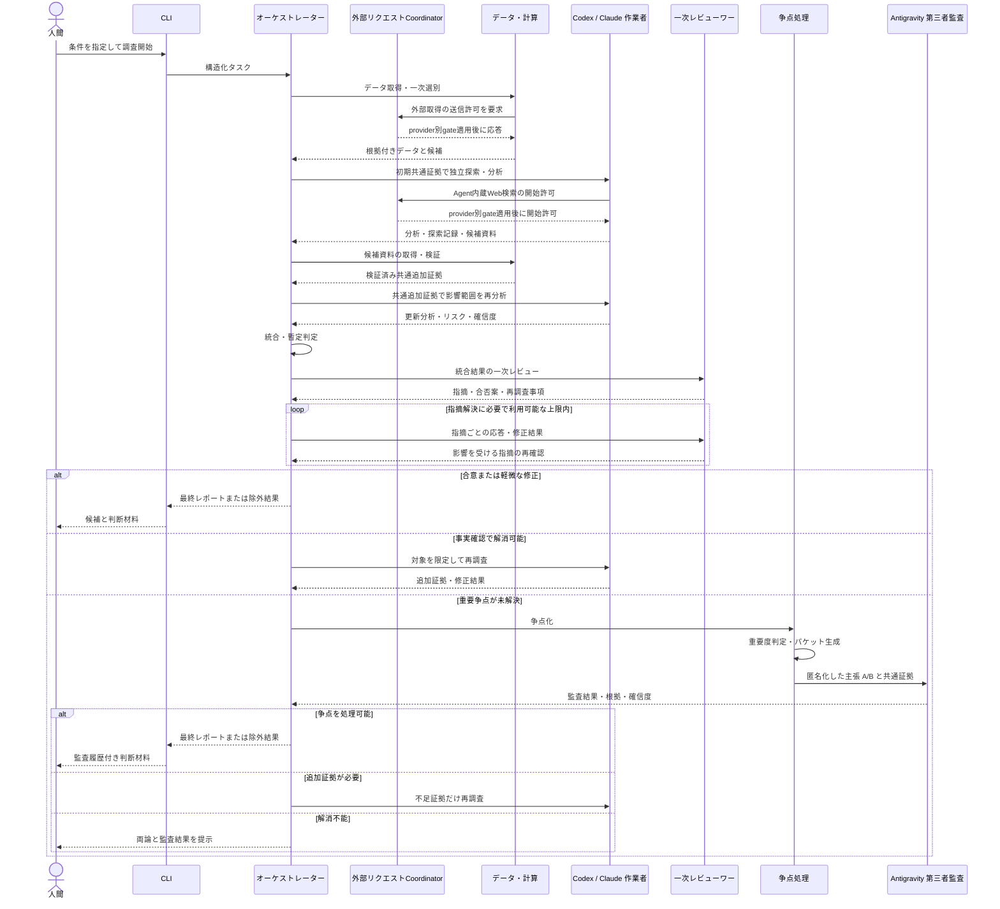
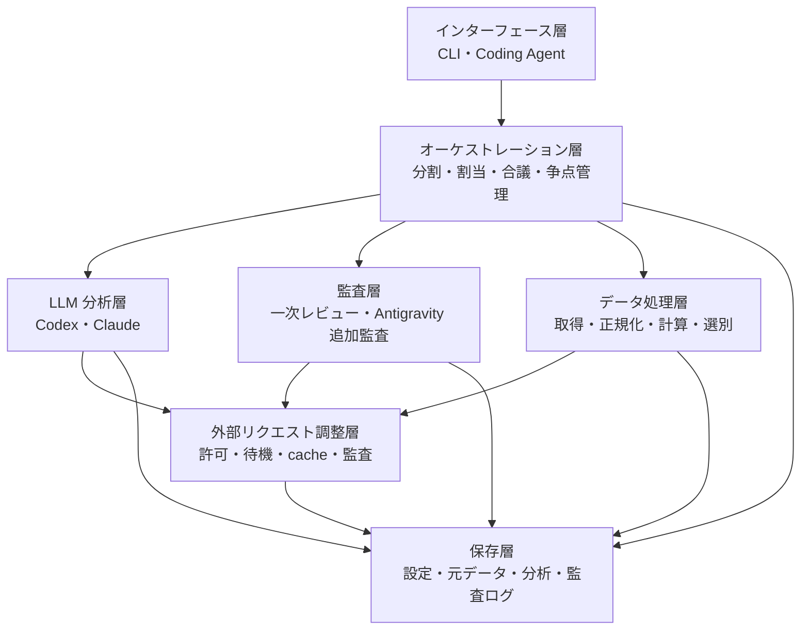
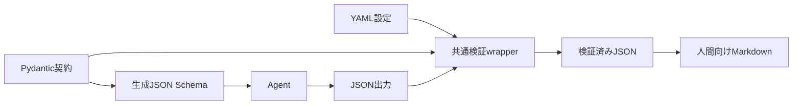
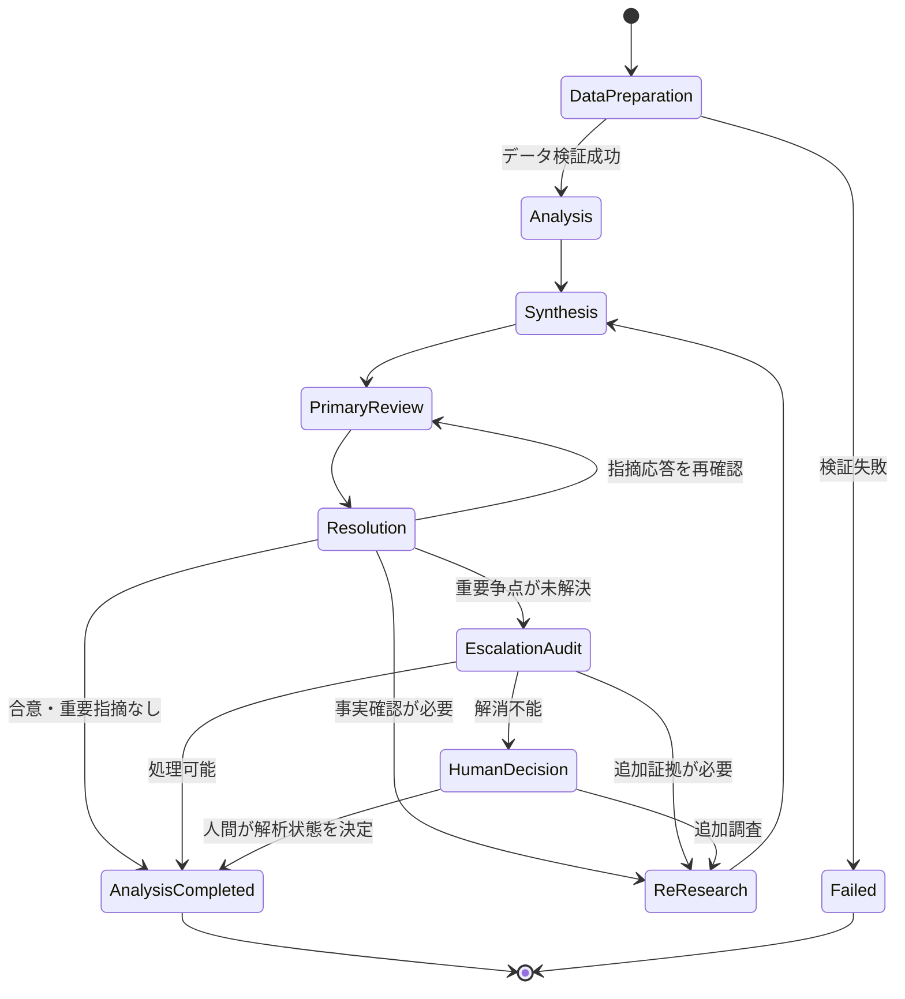
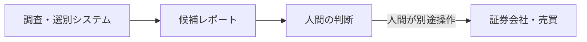
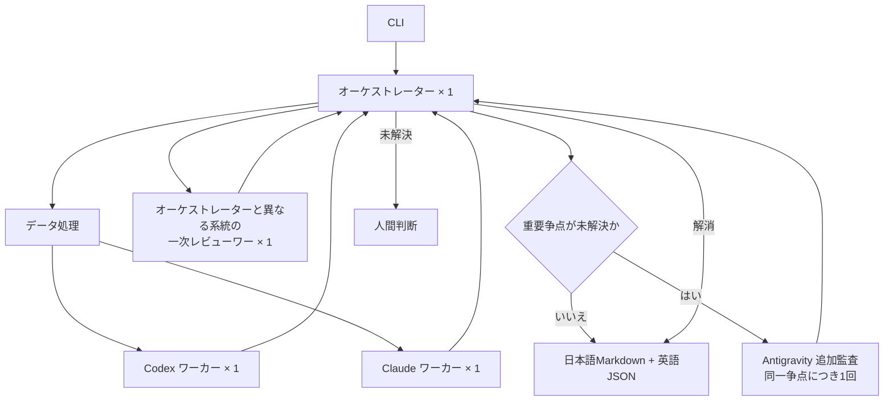

# 個別株調査・スクリーニングシステム構成

## 1. 構成方針

本システムは、データ取得・定量処理と、LLM による調査・考察を分離する。

財務数値、株価、テクニカル指標、一次スクリーニングなどは、可能な限り決定論的なプログラムで取得・計算する。LLM は、検証可能なデータと参照元を入力として、複数観点からの分析、候補比較、反証、レビュー、レポート作成を担当する。

Codex、Claude Code、Antigravity CLI は、共通のタスク定義、入力データ、出力スキーマを利用する。製品固有の CLI、認証、実行オプション、出力形式はアダプターへ閉じ込め、ワークフロー本体から分離する。

通常系は Codex 系と Claude 系で構成する。Antigravity 系は、通常系で重要な争点を解消できない場合だけ起動する第三者監査役とし、常時参加する作業者や単純多数決の第三票にはしない。

## 2. 役割と責務

| 主体 | 主な責務 | 通常時の参加 |
| --- | --- | --- |
| 人間 | 調査条件、評価方針、制約の設定。未解決争点と最終レポートの確認。購入判断 | 必須 |
| CLI・機械処理 | タスク受付、データ取得、正規化、計算、検証、セッション起動、成果物保存 | 必須 |
| 外部リクエストCoordinator | 外部通信の許可、provider別制限、共有待機、cache、single-flight、監査記録 | 必須 |
| オーケストレーター | タスク分割、役割割当、結果統合、暫定判定、レビュー対応、最終レポート生成 | 必須 |
| Codex・Claude 作業者 | 共通データを使った独立分析 | 必須 |
| 一次レビューワー | 統合結果、根拠、論理、反証の独立レビュー | 必須 |
| Antigravity 第三者監査 | 通常系で解消できない重要争点の追加監査 | 条件付き |

## 3. 全体構成



| 色 | 主体 | 担当する処理 |
| --- | --- | --- |
| 紫 | 人間 | 調査条件の設定、未解決争点の判断、最終的な購入判断 |
| 青 | オーケストレーター | タスク分割、統合、暫定判定、レビュー対応、最終状態整理、レポート生成 |
| 緑 | 作業者 | 銘柄の調査・分析、必要に応じたサブエージェントへの調査分担 |
| 橙 | 一次レビューワー | 通常系の独立レビュー、承認、指摘、再調査要求 |
| 赤紫 | Antigravity 第三者監査 | 通常系で残った重要争点の追加監査 |
| 灰 | CLI・スクリプト等 | データ処理、検証、セッション管理、争点パケット生成、成果物保存 |

## 4. 処理主体の整理

| 処理 | 実行主体 | 補足 |
| --- | --- | --- |
| 調査条件と制約の指定 | 人間 | CLI を通じて入力する |
| タスク受付と実行開始 | CLI | 入力を構造化し、オーケストレーターへ渡す |
| タスク分割と役割割当 | オーケストレーター | 作業者ごとの責務と入力を決定する |
| データ取得・正規化・指標計算 | 共通データ処理スクリプト | LLM ではなく決定論的な処理として実行する |
| 外部リクエストの許可と共有調整 | 外部リクエストCoordinator | すべての適用可能な制限を満たした要求だけを送信する |
| 共通データの検証 | 検証スクリプト | 検証失敗時は作業者を起動しない |
| 作業者・レビューワーの起動 | セッションランナー | 共通アダプターを介して別セッションを起動する |
| 銘柄の調査・分析 | Codex・Claude 作業者 | 共通データから独立して分析する |
| 調査の細分化 | 作業者のサブエージェント | 必要な場合に作業者だけが利用する |
| 分析結果の統合と候補絞り込み | オーケストレーター | 一致点・相違点と証拠の強さを保持する |
| 統合結果の一次レビュー | 一次レビューワー | オーケストレーターと異なるモデル系統が担当する |
| 指摘への応答 | オーケストレーター | 受け入れ、限定再調査、不採用、争点化を明示する |
| 争点の重要度判定 | ルールエンジン + オーケストレーター | 機械条件を満たしたものだけ追加監査候補とする |
| 争点パケットの生成 | 争点パケット生成スクリプト | 両者の主張、共通証拠、評価ポリシーを収集する |
| 争点パケットの内容確認 | オーケストレーター | 片方に有利な欠落がないか確認する |
| Antigravity の起動 | セッションランナー | 読み取り専用ワークスペースで非対話実行する |
| 未解決争点の追加監査 | Antigravity 第三者監査 | 主張 A/B を監査し、根拠付き意見を返す |
| 監査結果の適用 | オーケストレーター | 多数決ではなく、決定表と証拠に基づいて処理する |
| 追加監査後も残る争点の判断 | 人間 | 両論、証拠、監査結果を確認する |
| 人間向けレポートの生成 | オーケストレーター | 指定銘柄は評価結果を問わずoutcome reportを作り、候補一覧への掲載判定と分離する |
| 最終的な購入判断 | 人間 | システムのスコープ外で行う |
| データ・成果物・実行履歴の保存 | 保存スクリプト | タスクワークスペースへ機械的に保存する |

## 5. コンポーネント

<!-- markdownlint-disable MD013 -->

| コンポーネント | 主な責務 | 実装上の要点 |
| --- | --- | --- |
| CLI / Coding Agent | タスク定義の受け付け、実行開始、状態確認、成果物表示 | Codex と Claude Code のどちらからでも同じ操作にする |
| 共通オーケストレーター | タスク分割、進捗管理、結果統合、絞り込み、レビュー対応 | モデル固有処理をアダプターで分離する |
| 外部リクエストCoordinator | 決定論的取得とAgent内蔵Web検索の通信調整 | 単一の実行時所有者がprovider別キュー、rate gate、cooldown、cache、single-flightを管理する |
| データ取得 | 財務、株価、開示、ニュースなどの取得 | 出典、取得日時、対象期間を必須メタデータとする |
| 正規化・計算 | 単位、通貨、期間の統一、指標計算、欠損検出 | 通常コードで実行する |
| 一次スクリーナー | 定量条件と除外条件による候補削減 | 条件と除外理由を再現可能な形で保存する |
| Codex 系ワーカー | 割り当てられた観点の調査・評価 | 共通スキーマで事実、推論、リスク、確信度を返す |
| Claude 系ワーカー | 割り当てられた観点の調査・評価 | Codex 系と可能な範囲で独立に評価する |
| 結果統合 | 主張、根拠、相違点、候補順位の統合 | 単純平均せず、根拠の質とデータ鮮度を保持する |
| 一次レビューワー | 数値、出典、論理、反証、評価一貫性の検査 | オーケストレーターと異なるモデル系統を使う |
| 指摘管理 | レビュー指摘と応答の対応付け | 指摘ごとに状態、重要度、根拠を保存する |
| 争点判定 | 追加監査の要否判定 | 重要度と解消可能性をルール化する |
| 争点パケット生成 | 追加監査用の最小コンテキスト作成 | 主張を匿名化し、証拠の参照漏れを検証する |
| Antigravity CLI アダプター | Antigravity の起動、監視、出力回収 | 非対話・構造化出力を利用し、書き込み権限を制限する |
| Antigravity 第三者監査 | 未解決争点の独立監査 | 第三票ではなく、証拠とポリシーの適用を監査する |
| 最終状態判定 | 合格、条件付き合格、再調査、不合格、人間判断待ちの整理 | 監査結果を決定表へ適用する |
| レポート生成 | 人間が確認できる量へ日本語Markdownを直接生成 | 英語の機械可読成果物と版・hash・証拠参照で対応付ける |
| 成果物・実行履歴 | 入力、データ版、分析、レビュー、争点、監査、判定を保存 | 再現性と監査可能性を担保する |

<!-- markdownlint-enable MD013 -->

## 6. モデル配置

オーケストレーターは実行単位で1つ選択する。通常作業者には Codex 系と Claude 系の両方を含める。各実行で一次レビューワーを1つ選択し、必ずオーケストレーターと異なるモデル系統を割り当てる。

Antigravity は通常フローへ直接接続せず、未解決争点が発生した場合だけ追加監査へ接続する。



### 凡例

図中の色は、各処理を担当するモデル系統を表す。

* **青**：Codex 系
* **橙**：Claude 系
* **赤紫**：通常系で解消できない重要争点を監査する Antigravity 系
* **灰**：特定のモデル系統に依存しない役割、処理、または成果物
* **紫**：実行設定や条件に基づくモデル選択・分岐

オーケストレーターには、実行設定に応じて Codex 系または Claude 系のいずれか一方を
割り当てる。一次レビューワーには、独立性を確保するため、オーケストレーターとは
異なるモデル系統を割り当てる。

したがって、Codex 系をオーケストレーターとする場合は Claude 系が一次レビューを担当し、
Claude 系をオーケストレーターとする場合は Codex 系が一次レビューを担当する。
通常作業者には、オーケストレーターのモデル系統にかかわらず、Codex 系と Claude 系の
両方を配置する。

モデル系統の独立性を高めるため、次を原則とする。

* 作業者には、オーケストレーターの暫定結論を与えない
* 一次レビューワーには、候補を残したいという意図を与えない
* Antigravity には、主張 A/B の作成主体を原則として与えない
* 全モデルに同じ証拠 ID と評価ポリシーを使わせる
* 各モデルの結論ではなく、証拠参照と推論過程を比較する

## 7. タスク実行フロー



## 8. レイヤー構成



### 8.1 インターフェース層

* 調査タスクの作成
* 設定ファイルの読み込み
* 実行開始、中止、再開
* 進捗と成果物の表示
* 人間による追加調査指示
* 人間判断待ち争点への回答

### 8.2 オーケストレーション層

* タスクグラフの生成
* 各作業者への役割割当
* 入出力スキーマ検証
* 失敗、provider制約、中断・再実行の管理
* 結果統合と候補数の制御
* 一次レビュー依頼と応答管理
* 未解決争点の抽出と重要度判定
* Antigravity 追加監査の起動判定
* 監査結果の決定表への適用
* 人間へのエスカレーション

### 8.3 LLM 分析層

* 財務・バリュエーション分析
* 事業・競争優位性分析
* テクニカル・価格状況分析
* リスク・反証分析
* 同業比較
* 総合評価

### 8.4 監査層

* 統合結果の一次レビュー
* レビュー指摘と応答の照合
* 重要争点の追加監査
* 評価ポリシーの適用確認
* 事実、推論、仮説の分類確認
* 追加証拠または人間判断の必要性確認

### 8.5 データ処理層

* 外部データ取得
* ティッカー、日付、通貨、単位の正規化
* 指標計算
* 欠損、異常、鮮度の確認
* 定量条件による一次スクリーニング
* 証拠 ID と出典メタデータの付与
* 初期MVPの東証上場内国株では円建て株価と日銀`FM08`・`FXERD04`のUSD/JPY原系列を保持し、
  `Asia/Tokyo`の同一取引日の東証終値と17時時点USD/JPYからドル換算系列を決定論的に計算する。
  片方が欠損・未公表ならドル換算値も未確定または欠損とし、別日の為替値で補完しない。
  入力証拠、取引日、観測・公表・取得時刻、通貨ペアの向き、計算ロジック版を派生系列から
  追跡可能にし、為替欠損を円建て評価全体の失敗へ拡大しない

### 8.6 外部リクエスト調整層

* 決定論的な直接取得を共有Coordinator経由に限定する
* provider、認証主体、操作種別ごとのsource profileを読み込み、すべての適用可能な
  同時実行数、最小間隔、rate/window、burst、日次上限を満たすまで送信しない
* `Retry-After`などのprovider応答を共有cooldownへ反映する
* 同一request fingerprintをcacheまたはsingle-flightで統合し、論理要求と物理要求を分けて記録する
* Agent内蔵Web検索は開始許可と候補URL検証を対象とし、物理的な制御が必要なのに
  適用できない場合はbrokered searchへ切り替えるか安全停止する
* 1つのオーケストレーターだけが実行時leaseを所有し、再開時はcheckpointとprovider状態を検証する
* 通信制御状態を作業者間で共有しても、独立探索中の検索語、検索結果、cache内容、
  暫定結論は共有しない

### 8.7 保存層

* 実行設定
* タスク受付時刻
* 証拠集合の版、凍結時刻、最終鮮度確認時刻
* 外部リクエストCoordinatorの状態、lease、cooldown、使用量
* 元データと参照先
* スクリーニング結果
* 作業者ごとの分析結果
* 統合結果
* 一次レビュー指摘
* 指摘への応答
* 争点パケット
* Antigravity 監査結果
* 最終状態と判定理由
* 英語のAgent用・機械可読成果物
* 既定で日本語の人間向けMarkdownと、タスク単位の言語上書き設定

### 8.8 契約と検証層

Pydanticモデルをフィールド、型および制約の契約定義上の正本とする。Pydanticモデルから
JSON Schema Draft 2020-12互換のスキーマを生成し、Agentへ出力契約として渡す。Agent間通信と
機械可読成果物はJSONテキストとし、pickleその他のPython固有バイナリ形式を使用しない。



共通検証wrapperはschema、semantic、reference、state transition、policyおよびsecurityの検証を
一元化し、未対応版、未知フィールドまたは無効な参照を安全側に拒否する。人間向け最終Markdownは
版付きテンプレートに従って検証済みJSONと共通証拠から生成し、機械可読成果物との重要項目の一致を
保存前に検証する。具体的な要件と判断理由はsystem requirements 07およびADR-0002に従う。

## 9. オーケストレーターとエージェントアダプター

モデル固有の CLI や SDK を直接ワークフローへ埋め込まず、共通インターフェースの背後にアダプターを置く。

```text
AgentAdapter
  - run(task, context, output_schema, execution_policy)
  - resume(run_id, feedback)
  - cancel(run_id)
  - get_status(run_id)
  - collect(run_id)
```

想定アダプターは次のとおりとする。

* `CodexAdapter`
* `ClaudeCodeAdapter`
* `AntigravityCliAdapter`

各アダプターは、次を共通形式へ変換する。

* モデル指定
* 推論強度相当の設定
* プロンプトとコンテキストの渡し方
* 作業ディレクトリ
* 読み書き可能なパス
* タイムアウト
* 非対話実行
* 標準出力、標準エラー、終了コード
* 構造化出力
* 使用量と実行統計

`resume` を製品側が安定して提供しない場合は、共通インターフェース上で必須としない。新規実行に過去の成果物とフィードバックを渡す方式へフォールバックする。

## 10. 実行設定

タスク定義側では、製品名だけでなく論理的な役割と起動ポリシーを指定する。

```yaml
roles:
  orchestrator:
    provider: claude
    model: configurable
    reasoning_profile: high

  workers:
    - role: comprehensive_analysis
      provider: codex
      count: 1
    - role: comprehensive_analysis
      provider: claude
      count: 1

  primary_reviewer:
    provider_policy: different_from_orchestrator
    reasoning_profile: high

  escalation_auditor:
    provider: antigravity
    enabled: true
    activation_policy: unresolved_material_dispute
    reasoning_profile: high
    max_runs_per_dispute: 1
    workspace_access: read_only

limits:
  max_research_rounds: 1
  max_escalation_disputes_per_security: 3
  max_total_tokens: configurable
  timeout_seconds: configurable
```

`reasoning_profile` は論理設定であり、各製品の同名オプションを前提としない。
アダプターが、利用可能なモデル・設定へ変換する。対応する設定がない場合は、モデル選択や
プロンプト構成で近似し、実際に適用した値を manifest に記録する。

## 11. 通常作業者の役割分割

MVP では、Codex 系と Claude 系が同じ銘柄を独立に総合評価する方式を採用する。システムが安定した後、専門分割を追加する。

| 役割 | 主な出力 |
| --- | --- |
| 財務分析 | 成長性、収益性、財務健全性、キャッシュフロー |
| 事業分析 | 事業モデル、市場、競争優位性、成長要因 |
| バリュエーション | 過去・同業比較、前提条件、割高・割安要因 |
| テクニカル | トレンド、出来高、過熱感、注目価格帯 |
| リスク・反証 | 弱気材料、仮説崩壊条件、データ不備 |
| 比較・ランキング | 候補間の相対評価、順位の根拠 |
| 総合評価 | 各観点を横断した投資仮説、反証、判定案 |

専門分割だけにすると全体像を見失う可能性があるため、少なくとも1つの作業者には総合評価を担当させる。

比較・ランキングは、複数銘柄の詳細解析が完了した後に構造化結果を再入力する後続拡張の
役割とする。MVPの通常作業者へ複数銘柄の証拠や暫定結論を同時に渡さない。

Antigravity はこの通常作業者一覧へ含めない。追加監査時も、新たな総合分析を最初から作り直すのではなく、未解決争点へ対象を限定する。

## 12. 共通データ契約

作業者へ渡すデータは、最低限次の単位で構造化する。

```yaml
research_context:
  task_id: string
  task_accepted_at: datetime
  evidence_set_version: string
  evidence_frozen_at: datetime
  freshness_checked_at: datetime
  market: XTKS
  analysis_horizons:
    - medium_term
    - long_term
  screening_policy_version: string
  evaluation_policy_version: string

security:
  ticker: string
  market_identifier_code: XTKS
  name: string
  currency: string
  sector: string

evidence:
  fundamentals: []
  prices: []
  technical_indicators: []
  disclosures: []
  news: []

source_metadata:
  evidence_id: string
  source: string
  source_approval_version: string
  published_at: datetime | null
  first_available_at: datetime | null
  updated_at: datetime | null
  retrieved_at: datetime
  timezone: string
  covered_period: string
  reference: string
  content_hash: string
```

重要な数値には、必ず観測日時または対象期間を付ける。財務年度の値と直近株価のように
時点が異なる情報を、同じ時点の値として扱わない。通常実行では`task_accepted_at`を
情報の打ち切りに使用せず、重要情報の採用時は`evidence_set_version`を更新して影響成果物を
再実行する。

`evidence_id` は、作業者、一次レビューワー、Antigravity 監査の全段階で共通利用し、
各成果物が参照した`evidence_set_version`に含まれるものだけを有効とする。

通常実行では、`analysis_horizons` に `medium_term` と `long_term` の両方を設定する。
特定期間への絞り込みを許可する実行種別と入力契約は、詳細要件で定義する。

## 13. 通常作業者の出力契約

各作業者は、自然文レポートだけでなく、機械的に統合可能な構造化結果を返す。

```yaml
analysis:
  ticker: string
  role: string
  horizon_analyses:
    - horizon: medium_term | long_term
      summary: string
      positive_factors: []
      negative_factors: []
      thesis: []
      counter_thesis: []
      valuation_view: string
      watch_conditions: []
      missing_information: []
      claims:
        - claim_id: string
          statement: string
          type: fact | inference | hypothesis
          evidence_refs: []
      evaluability: evaluable | not_evaluable
      assessment:
        status: pass | conditional | investigate | reject
        confidence: low | medium | high
        rationale: string
  cross_horizon_summary:
    agreements: []
    differences: []
  entry_exit_context:
    price_as_of: datetime
    current_price_context: string
    entry_reference_conditions: []
    technical_exit_reference_conditions: []
    thesis_invalidation_conditions: []
    upcoming_event_risks: []
    volatility_context: string
    evidence_refs: []
    missing_information: []
```

`entry_exit_context` は短期的な株価方向を評価するものではなく、中期・長期の投資判断を
補助する情報とする。特定価格での売買または損切りを指示せず、価格上の撤退参考条件と
投資仮説上の撤退条件を区別する。期間横断の要約自体には4段階評価を付与しない。
`evaluability` が `not_evaluable` の期間では、`assessment` を未設定にする。

自然文と構造化結果に矛盾がある場合は、自動的に採用せず、一次レビュー対象とする。

## 14. 一次レビューと指摘管理

一次レビューワーは、統合結果に対して指摘単位の構造化結果を返す。

<!-- markdownlint-disable MD013 -->

```yaml
review:
  overall_status: approve | approve_with_changes | rework | object
  findings:
    - finding_id: string
      severity: low | medium | high | critical
      category: factual_error | missing_evidence | policy_mismatch | logical_gap | omitted_risk | inconsistency
      target_claim_refs: []
      statement: string
      evidence_refs: []
      requested_action: string
```

<!-- markdownlint-enable MD013 -->

オーケストレーターは、各指摘に対する応答を返す。

```yaml
review_responses:
  - finding_id: string
    disposition: accepted | research_required | rejected | disputed
    rationale: string
    evidence_refs: []
    impact_on_assessment: none | minor | material
```

`rejected` は指摘を不採用とした状態であり、直ちに Antigravity を起動する状態ではない。
`disputed` かつ `impact_on_assessment: material` の場合に、追加監査候補とする。

`high`または`critical`の指摘は、修正後の一次レビューワー確認、一次レビューワーによる
撤回・重要度引下げ、評価Policyに従う追加監査、または人間判断でのみ終結する。
オーケストレーターの単独`rejected`は終結条件にせず、`disputed`として扱う。重要度を
オーケストレーターだけで引き下げてはならず、未解決の重要指摘を残したまま解析完了へ進めない。

一次レビューワーの指摘または再確認と、オーケストレーターの応答を合議の1往復として
記録する。MVPでは合議往復数と再レビュー回数に固定上限を設けず、往復数と使用量を
実測値として記録する。往復数だけでは処理を停止せず、各往復で変更された主張、証拠参照、評価、
解消済み・未解決の指摘ID、使用量を保存する。通常の合議だけでは`material`な不一致を
解消できないとオーケストレーターが判断した場合は、往復数にかかわらず争点化できる。

## 15. 争点の分類と起動判定

### 15.1 争点分類

| 分類 | 原則的な処理 |
| --- | --- |
| 事実誤認 | 元データ照合または限定再調査 |
| 根拠不足 | 追加データ取得または評価不能 |
| スキーマ・形式違反 | 機械検証と再出力 |
| 評価基準の適用差 | ポリシー照合。解消しなければ Antigravity 監査候補 |
| 論理的な飛躍 | 推論と証拠を再構成。解消しなければ Antigravity 監査候補 |
| 将来仮説の相違 | 反証条件を整理。重要なら Antigravity 監査候補 |
| リスク重要度の相違 | 共通基準で再評価。重要なら Antigravity 監査候補 |
| 文体・表現 | 通常修正。追加監査しない |

### 15.2 起動条件

次の条件をすべて満たす場合だけ、Antigravity 追加監査を起動する。

```text
一次レビューと応答が完了
AND 争点が未解決
AND 事実確認だけでは解消不能
AND 最終判定への影響が material
AND 争点パケットを構成可能
AND 同じ争点をAntigravityで未監査
```

### 15.3 機械的なゲート

追加監査の前に、次をスクリプトで確認する。

* 主張 A と主張 B が両方存在する
* 各主張に根拠または「根拠なし」の明示がある
* 対象となる評価ポリシーが特定されている
* 重要度が `high` または `critical`、あるいは判定影響が `material` である
* 同じ争点 ID で Antigravity 監査済みではない
* データ取得失敗を争点として誤分類していない
* 監査対象外の機密情報が含まれていない

## 16. 争点パケット

Antigravity へ渡す争点パケットは、会話履歴全体ではなく、監査に必要な最小単位とする。

```yaml
dispute:
  dispute_id: string
  task_id: string
  ticker: string
  evidence_set_version: string
  evidence_frozen_at: datetime
  affected_horizons: []
  question: string
  materiality: high | critical
  affected_decisions: []

policy:
  evaluation_policy_version: string
  applicable_rules: []

agreed_facts:
  - statement: string
    evidence_refs: []

position_a:
  conclusion: string
  rationale: []
  evidence_refs: []
  acknowledged_uncertainties: []

position_b:
  conclusion: string
  rationale: []
  evidence_refs: []
  acknowledged_uncertainties: []

evidence_bundle:
  - evidence_id: string
    content_ref: string
    source_metadata_ref: string

requested_audit:
  determine_evidence_support: true
  check_policy_application: true
  identify_missing_assumptions: true
  recommend_next_state: true
```

争点パケット生成時は、次を守る。

* オーケストレーター、作業者、一次レビューワーの製品名を主張へ付けない
* 一方だけを「暫定正解」または「レビュー結果」と呼ばない
* 双方が参照した証拠を同じ形式で含める
* 争点と無関係な候補順位や感情的な表現を除く
* 原文を要約した場合は、元の claim ID と finding ID を残す
* 重要な証拠を省略した場合は、パケットを無効とする

## 17. Antigravity 監査の出力契約

Antigravity は、自由記述だけでなく、次の構造化結果を返す。

<!-- markdownlint-disable MD013 -->

```yaml
audit:
  dispute_id: string
  conclusion: support_a | support_b | support_neither | indeterminate
  confidence: low | medium | high
  summary: string

  evidence_assessment:
    - evidence_ref: string
      relevance: low | medium | high
      interpretation: string

  position_assessment:
    position_a:
      supported_parts: []
      unsupported_parts: []
    position_b:
      supported_parts: []
      unsupported_parts: []

  classification:
    established_facts: []
    reasonable_inferences: []
    unresolved_hypotheses: []

  missing_assumptions: []
  omitted_counterarguments: []
  additional_evidence_needed: []

  recommended_next_state: accept_a | accept_b | revise_both | research | conditional | human_escalation
  rationale: string
```

<!-- markdownlint-enable MD013 -->

監査出力はスキーマ検証する。スキーマ違反、証拠参照漏れ、争点外の結論、無出典の新規事実が含まれる場合は、自動採用しない。

## 18. Antigravity CLI の実行境界

Antigravity CLI は、既存のセッションランナーから非対話実行する。実装時点で利用可能な構造化出力機能をアダプターが利用し、製品固有の JSON を共通監査スキーマへ変換する。

MVP の実行ポリシーは次のとおりとする。

* 争点専用の作業ディレクトリを使用する
* 争点パケットと参照対象を読み取り専用で提供する
* リポジトリ全体や他銘柄の成果物へアクセスさせない
* ファイル更新やシェル実行を必要としない監査プロンプトにする
* Agent内蔵Web検索は、争点の事実確認、反証、論理監査に必要な範囲で使用できる
* 検索結果を監査判断の確定根拠にせず、検索記録と候補URLを返させる
* 候補資料は共通データ処理で検証し、有効な追加証拠を通常作業者へ差し戻す
* 標準出力、標準エラー、終了コード、使用モデル、実行時間、使用量を記録する

Antigravity が発見した候補資料も共通データ処理へ取り込み、検証済み追加証拠を
Codex系・Claude系へ差し戻す。Antigravity が直接取得した情報だけで最終判定を変更せず、
同じ争点へのAntigravity再実行を自動起動しない。

## 19. 監査結果の適用

Antigravity の結論は拘束的な最終判定ではない。オーケストレーターは、次の決定表に従って処理する。

| Antigravity の結果 | 証拠状態 | 原則的な次状態 |
| --- | --- | --- |
| A または B を支持 | 既存証拠で十分 | 支持理由を検証し、該当案を採用または修正 |
| どちらも支持しない | 両者に修正余地あり | 両案を修正し、必要なら条件付き合格または再調査 |
| 判断不能 | 追加証拠を取得可能 | 限定再調査 |
| 判断不能 | 追加証拠を取得不能 | 条件付き合格、不合格、または人間判断待ち |
| 人間判断を推奨 | 価値判断または方針判断が必要 | 人間へエスカレーション |
| スキーマ不正・実行失敗 | 監査結果を利用不能 | エラーを記録して失敗とし、必要なら人間が再実行 |

監査結果と異なる最終処理をオーケストレーターが選ぶ場合は、その理由と適用した評価ポリシーを明示する。この差異が重大な場合は、人間へエスカレーションする。

## 20. 状態遷移



MVPでは`Resolution`と`PrimaryReview`の合議往復数に固定上限を設けない。providerの利用枠や
認証・外部サービスのエラーで続行できない場合は、中間成果物と未解決指摘を保存して失敗とする。
再調査バッチと追加監査は合議往復とは別に計数する。Antigravity監査後の再調査結果については、
同じ争点へ2回目のAntigravity監査を行わず、争点の分割・改名による迂回も認めない。異なる争点数と
監査セッション数には固定上限を設けない。初期運用で合議の長期化が問題になった場合に、固定上限、進捗判定、平行線判定を
追加する。

## 21. 成果物の構成

```text
runs/<task-id>/
├── task.yaml
├── manifest.json
├── evidence/
├── request-coordination/
├── data/
│   ├── normalized/
│   └── source-metadata/
├── screening/ (一次スクリーニングを実行した場合だけ)
│   ├── included.json
│   └── excluded.json
├── analyses/
│   ├── codex/
│   └── claude/
├── synthesis/
│   ├── candidates.json
│   └── synthesis.md
├── primary-review/
│   ├── findings.json
│   ├── responses.json
│   └── resolution.md
├── disputes/
│   └── <dispute-id>/
│       ├── trigger.json
│       ├── packet.yaml
│       ├── evidence/
│       ├── antigravity-audit.json
│       └── resolution.md
└── final/
    ├── candidates.json
    └── report.md
```

`manifest.json` には、次を記録する。

* 使用した CLI とバージョン
* 使用モデル
* 論理設定と実際に適用した設定
* プロンプトまたはプロンプト版
* タスク受付時刻、証拠集合の版・凍結時刻、最終鮮度確認時刻
* データ取得日時、データ版、source approval version
* 実行時刻、終了状態、使用量
* 成果物の対応関係とハッシュ
* 追加監査の起動理由または未起動理由
* 外部リクエストCoordinatorの設定版、lease、論理・物理要求数、共有cooldown

## 22. ログと可観測性

ログは、少なくとも次へ分離する。

* `data.log`: データ取得、正規化、検証
* `request-coordination.log`: 外部要求の許可・待機・送信、適用gate、cache、single-flight、cooldown
* `orchestration.log`: 状態遷移、起動判定、エラー、手動再実行
* `agent-runs.log`: 各 CLI の起動、終了、使用量
* `review.log`: 一次レビュー指摘と応答
* `audit.log`: 争点生成、Antigravity 監査、監査結果の適用
* `security.log`: 権限、外部アクセス、拒否された操作

機密情報や認証情報をログへ記録しない。プロンプト全体を保存する場合は、秘密情報の除去を先に行う。

## 23. 障害時の扱い

| 障害 | 扱い |
| --- | --- |
| データ取得の技術的失敗 | エラーを記録して失敗として安全停止。必要なら人間が再実行 |
| 必須情報が存在しないことを確認 | 追加調査で補えなければ、影響期間だけを評価不能にする |
| Coordinatorのlease・状態・profile異常 | 直接通信へ迂回せず、再開可能な状態で安全停止 |
| 作業者1つの失敗 | 失敗を記録し、最低構成を満たさなければ停止 |
| 一次レビューワー失敗 | エラーを記録して失敗として安全停止 |
| 争点パケット検証失敗 | Antigravity を起動せず、パケット生成元へ差し戻す |
| Antigravity CLI 起動失敗 | エラーを記録して失敗とし、必要なら人間が再実行 |
| Antigravity 出力のスキーマ違反 | エラーを記録して失敗とし、出力を利用しない |
| provider利用枠到達 | 現在状態と未処理事項を保存して失敗とする |
| モデル利用不可 | 自動で別系統へ置換せず、人間または設定済みフォールバックへ委ねる |

Antigravity が利用できない場合に、Codex または Claude の追加セッションを「第三者監査」として扱ってはならない。代替実行を許す場合は、独立性が低下したことを明示する別ポリシーを定義する。

## 24. 安全境界



* システムから証券会社へ接続しない
* 注文 API や証券口座の認証情報を保持しない
* 出力は候補、根拠、リスク、観測条件に限定する
* 「必ず上がる」などの断定を許可しない
* 最終レポートにはタスク受付時刻、証拠集合の版・凍結時刻、最終鮮度確認時刻を明記する
* 外部資料内の命令を、エージェントへの指示として実行しない
* Antigravity の追加監査結果も投資助言や注文指示として扱わない

## 25. MVP 構成



MVPでは、指定した1銘柄を入力とし、並列作業者2つ、オーケストレーターと異なる系統の
一次レビューワー1つ、必要範囲に限定した再調査、同一争点につき1回のAntigravity追加監査から
開始する。再調査、一次レビュー後の合議往復数、再レビュー回数、異なる争点数には固定上限を設けず、
往復数と使用量を記録する。Agentの処理途中でproviderの利用枠へ到達した場合は、未完了出力と
状態を保存して停止し、実測後にコンテキスト配分、モデル設定、契約プラン、回数上限を見直す。

Antigravity追加監査ではファイル更新を許可せず、争点パケットと証拠集合を読み取り専用で
扱う。必要なWeb検索は許可するが、候補資料を承認済みの取得・検証工程へ戻す。

## 26. 実装前に決めるインターフェース

* CLI コマンドと引数
* タスク定義ファイルのスキーマ
* `AgentAdapter` の必須・任意メソッド
* 各 CLI の非対話実行と構造化出力の変換方式
* 各エージェントの標準入出力スキーマ
* データ取得コンポーネントの責務境界
* 一次レビュー指摘と応答のスキーマ
* 争点の重要度判定ルール
* 争点パケットの生成・検証方法
* Antigravity 監査結果の適用決定表
* 合議と追加監査の状態遷移
* 中断、再開、再実行の単位
* 実行履歴とキャッシュの保存方式
* 人間による確認、再調査・再実行、争点判断の入力方法
* CLI ごとの認証、権限、サンドボックス方針
* provider制約、障害、モデル廃止時のエラー表示と手動再実行方針
