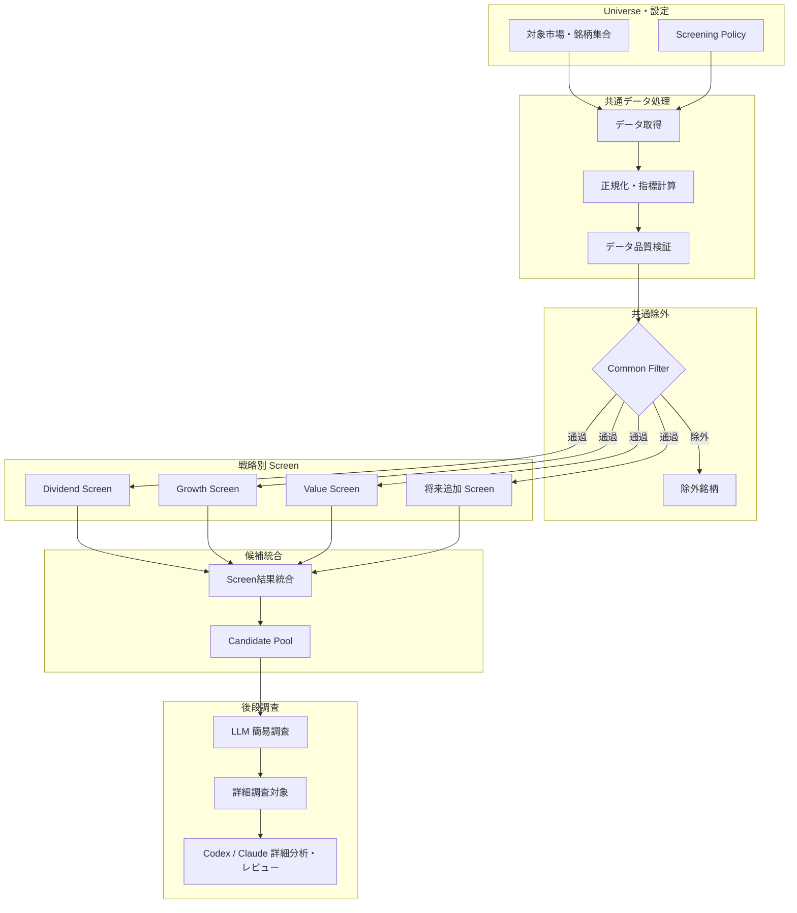
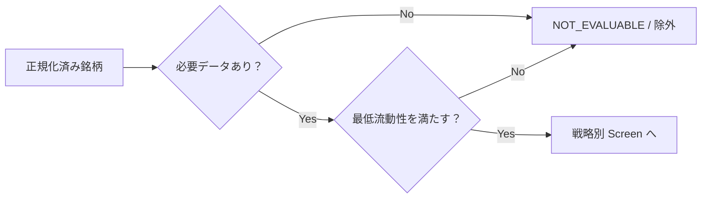
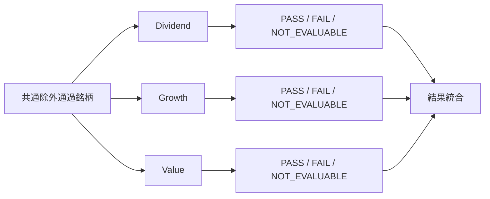
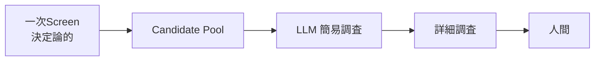

# 一次スクリーニングシステム構成

## 1. 文書の位置づけ

本書は、個別株調査システムにおける「一次スクリーニング」の全体構成、責務、処理フロー、入出力、および後段の LLM 調査システムとの境界を整理する。

一次スクリーニングの目的は、対象市場に含まれる多数の銘柄から、あらかじめ定義した投資戦略ごとの条件に合致する銘柄を決定論的に抽出し、LLM が調査する候補数を実用的な範囲まで削減することである。

## 2. 基本方針

- 一次スクリーニングでは最終的な投資判断を行わない
- 「良い企業か」を単一スコアで判定せず、投資戦略ごとに独立した Screen を持つ
- 初期候補は `Dividend`、`Growth`、`Value`
- 同一銘柄が複数 Screen を同時に通過してよい
- Screen の判定自体は原則として通常コードで決定論的に実行する
- PASS / FAIL だけでなく、判定理由と使用した値を保存する
- Screen 条件はコードへ埋め込まず、Policy / 設定として外部化する
- 後段 LLM には「どの Screen を、なぜ通過したか」を含めて渡す

## 3. 全体構成



## 4. 処理段階

### 4.1 Universe 生成

人間または設定から調査対象となる銘柄集合を指定する。

例：

- 東証 Prime
- 東証全市場
- S&P 500
- NASDAQ
- 特定業種
- 任意のティッカー一覧

Universe 生成と Screen 判定は分離する。

### 4.2 共通データ取得

各 Screen が利用する可能性のあるデータを一度取得し、共通データセットとして再利用する。

初期候補：

- 銘柄基本情報
- セクター・業種
- 時価総額
- 売上高、営業利益、純利益
- EPS
- ROE / ROIC
- 営業 CF / FCF
- 有利子負債
- 株価・出来高
- 配当・配当性向
- 自社株買い
- 業績予想
- 過去数年の財務推移

### 4.3 正規化・指標計算

通常コードで Screen 用の派生指標を作る。

例：

- 売上 3年 CAGR
- EPS 3年 CAGR
- FCF Margin
- 配当利回り
- FCF Payout Ratio
- 同業内 PER Percentile
- 同業内 ROIC Percentile
- 6か月 / 12か月リターン
- 利益率トレンド

元データと計算済み指標は分離して保存し、計算ロジックのバージョンを残す。

### 4.4 データ品質検証

Screen 実行前に最低限の品質を確認する。

- 必須項目の欠損
- 通貨・単位の不整合
- 日付・対象期間の不整合
- 異常値
- 重複銘柄
- 古すぎるデータ

重大な問題がある場合は `FAIL` ではなく `NOT_EVALUABLE` とし、データ不足と条件不適合を区別する。

### 4.5 共通除外

共通除外は最小限とする。



時価総額、PER、ROE など、投資仮説に依存する条件は可能な限り各 Screen 側へ持たせる。

### 4.6 戦略別 Screen

共通除外を通過した全銘柄へ各 Screen を独立に適用する。



他 Screen の結果を入力として利用しない。

### 4.7 Candidate Pool 統合

いずれか1つ以上の Screen を通過した銘柄を Candidate Pool に含める。

```text
candidate =
    dividend_pass
    OR growth_pass
    OR value_pass
    OR other_screen_pass
```

複数 Screen を通過した場合は、すべての通過属性を保持する。

## 5. 後段 LLM システムとの境界

一次スクリーニングは「機械的な候補抽出」までを責務とする。

次は後段の LLM 調査で扱う。

- 事業の競争優位性
- 成長市場との実質的な関連性
- 成長が持続する理由
- 市場期待が株価に織り込まれているか
- 財務数値の背景
- リスク・反証
- 投資仮説の妥当性
- 候補間の優先順位
- 詳細調査対象への採否



## 6. 入力

```yaml
screening_task:
  task_id: string
  as_of: date

  universe:
    market: string
    source: string

  enabled_screens:
    - dividend
    - growth
    - value

  policy_version: string

  output:
    max_candidates: optional
```

## 7. 出力

銘柄単位で各 Screen の結果と根拠を保存する。

```yaml
security:
  ticker: XXXX
  name: Example Corp.

common_filter:
  status: pass

screen_results:
  dividend:
    status: fail
    reasons:
      - code: dividend_yield_below_threshold
        value: 0.012

  growth:
    status: pass
    reasons:
      - code: revenue_cagr_3y
        value: 0.18
      - code: eps_cagr_3y
        value: 0.22

  value:
    status: pass
    reasons:
      - code: forward_pe_sector_percentile
        value: 0.18

candidate:
  selected: true
  matched_screens:
    - growth
    - value
```

## 8. Policy 管理

想定構成：

```text
config/
└── screening/
    ├── common.yaml
    ├── dividend.yaml
    ├── growth.yaml
    └── value.yaml
```

Screen の処理ロジックと具体的な閾値を分離し、閾値調整でコード変更が発生しない構成を目指す。

## 9. 成果物構成案

```text
runs/<task-id>/
└── screening/
    ├── task.yaml
    ├── manifest.json
    ├── universe.json
    ├── normalized-data/
    ├── common-filter/
    │   ├── included.json
    │   └── excluded.json
    ├── screens/
    │   ├── dividend.json
    │   ├── growth.json
    │   └── value.json
    └── candidates.json
```

`manifest.json` には、基準日、Universe、データ取得日時、データソース、計算ロジック版、Policy Version、有効 Screen、実行時刻を記録する。

## 10. 品質要件

### 再現性

- 同じデータと Policy から同じ判定を再現できる
- 条件変更時は Policy Version を更新する
- 判定に使用した実値を保存する

### 説明可能性

- 候補になった理由を確認できる
- 不通過理由も確認できる
- 複数 Screen 通過時はすべて保持する

### 拡張性

- 新しい Screen を追加しても既存 Screen を変更しない
- Screen 固有条件と共通処理を分離する
- 市場差・業種差を Policy 側で吸収できる

### フェイルセーフ

- データ不足を FAIL と同一視しない
- データ取得失敗時に古い値を暗黙利用しない
- 異常データで Screen を実行しない

### コスト

- データ取得を Screen ごとに重複しない
- 一次判定には原則 LLM を使わない
- 後段 LLM に渡す候補数を削減する

## 11. MVP

MVP では次に限定する。

- Universe は人間が指定
- 共通データ取得・正規化を1系統実装
- Common Filter を実装
- Dividend / Growth / Value Screen
- 各 Screen は `PASS / FAIL / NOT_EVALUABLE`
- 判定理由と値を JSON 保存
- いずれかの Screen を通過した銘柄を Candidate Pool に統合
- Candidate Pool を後段 LLM へ渡せる形式で出力
- Screen 内では LLM を利用しない

## 12. 今後決定する事項

- 最初に対象とする市場
- Universe の取得方法
- 財務・株価データソース
- 最低流動性条件
- 各 Screen の具体的な条件と閾値
- 市場別・業種別の補正
- Candidate Pool の最大件数
- 業績予想データをどの段階から使用するか
- テーマ・産業 Exposure をどのように構造化するか
