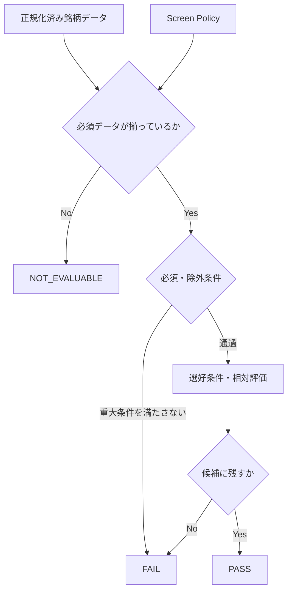
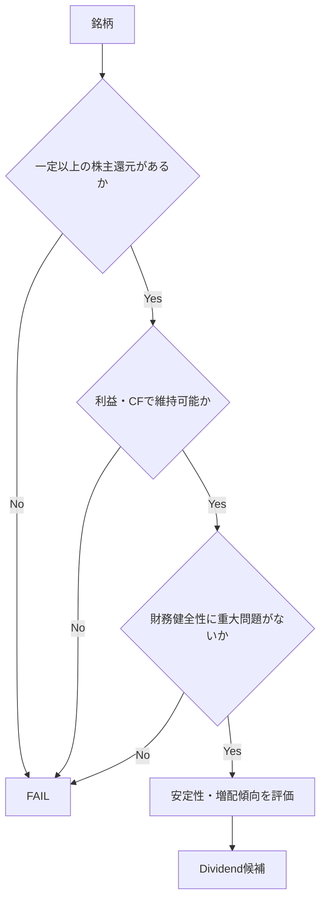
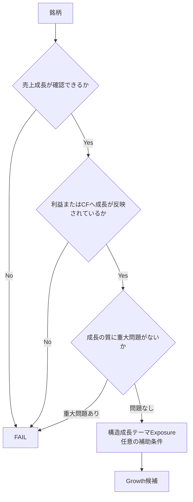
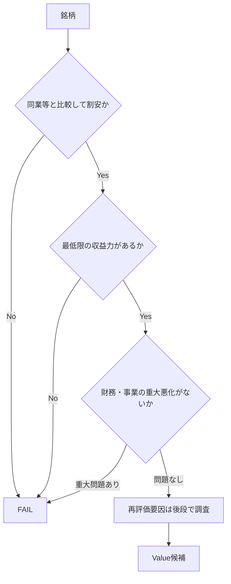
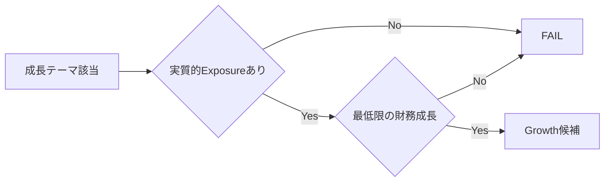
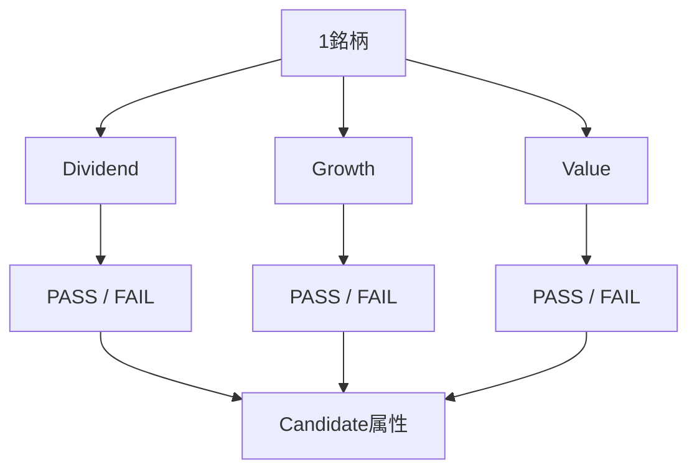

# 一次スクリーニング判定部 要求事項

## 1. 文書の位置づけ

本書は、一次スクリーニングシステムにおける各投資戦略別 Screen の共通要求事項と、初期 Screen の判定方針を整理する。

初期 MVP では次の Screen を想定する。

- Dividend Screen
- Growth Screen
- Value Screen

本書では具体的な数値閾値を最終決定するのではなく、「何を判定したいか」「条件をどのように構成するか」「どの情報を出力するか」を定義する。

## 2. Screen の役割

各 Screen は、「その銘柄が優良企業か」を総合判定するものではない。

Screen ごとに定義された投資仮説に、その銘柄が該当するかを判定する。

- `Dividend Screen`
  - 配当・自社株買いなどの株主還元を主なリターン源泉として検討する価値があるか
- `Growth Screen`
  - 売上・利益・市場拡大を主なリターン源泉として検討する価値があるか
- `Value Screen`
  - 現在の評価倍率が相対的に低く、再評価余地を検討する価値があるか

したがって、同一銘柄が複数 Screen を通過してよい。

## 3. 共通インターフェース

すべての Screen は概念上、同じインターフェースを持つ。

```text
Screen.evaluate(
    security,
    metrics,
    policy
) -> ScreeningResult
```

入力：

- 銘柄基本情報
- 正規化済み財務・株価データ
- 計算済み指標
- Screen 固有 Policy

出力：

- `pass`
- `fail`
- `not_evaluable`
- 判定理由
- 判定に使用した値
- 必要に応じた補助スコア
- 警告・注意事項

## 4. 共通判定フロー



条件は次の3種類に分ける。

### 必須条件

満たさない場合、その Screen の投資仮説が成立しにくい条件。

### 選好条件

満たすほど候補として魅力的になるが、単独では FAIL にしない条件。

### 除外条件

重大なリスクや投資仮説の前提崩壊につながる条件。

すべての条件を単純な AND 条件にすることは避ける。

## 5. 判定結果

ScreeningResult は最低限次を持つ。

```yaml
screen: growth

status: pass  # pass | fail | not_evaluable

score:
  value: 78
  scale: 0-100
  usage: ranking_only

matched_conditions:
  - metric: revenue_cagr_3y
    value: 0.18
    threshold: 0.10

failed_conditions: []

warnings:
  - operating_margin_declining

metadata:
  data_as_of: 2026-08-10
  policy_version: growth-v1
```

`data_as_of`はScreen判定に用いた数値の観測基準日であり、後段の通常詳細解析で利用可能な
情報を打ち切る時刻ではない。ScreeningResultの対象銘柄は、ticker単独ではなくMICまたは
同等の市場識別子と組み合わせて一意に識別する。

スコアを使用する場合、Screen 内の候補順位付けだけに利用する。

`Dividend Score 80` と `Growth Score 80` は同じ意味を持たないため、異なる Screen 間で直接比較しない。

---

## 6. Dividend Screen

### 6.1 目的

配当・自社株買いなどの株主還元を主要な投資仮説として検討できる銘柄を抽出する。

単純な高配当株の抽出ではなく、次の両立を重視する。

```text
現在の株主還元水準
+
株主還元の持続可能性
```

### 6.2 判定イメージ



### 6.3 確認したい指標

#### 還元水準

- 配当利回り
- 年間配当額
- 自社株買い
- Shareholder Yield

#### 持続可能性

- 配当性向
- FCF Payout Ratio
- 営業 CF
- FCF
- 利益推移

#### 財務健全性

- 有利子負債
- Net Debt / EBITDA
- 自己資本比率
- 金利負担

#### 安定性

- 減配履歴
- 連続増配年数
- 配当維持年数
- 利益・FCF の変動

### 6.4 判定方針

配当利回りだけで PASS にしない。

概念的には次を想定する。

```text
必須:
  一定以上の株主還元
  FCFが一定期間で概ねプラス
  配当性向が極端でない

選好:
  増配傾向
  自社株買い
  低レバレッジ
  利益安定

警告:
  株価急落に伴う一時的な高利回り
  配当性向が極端に高い
  FCF不足
  直近減配
```

---

## 7. Growth Screen

### 7.1 目的

売上、利益、市場拡大などを主要なリターン源泉として検討できる銘柄を抽出する。

Growth は大きく次の2種類を想定する。

1. `Quantitative Growth`
   - 実際の財務数値に成長が表れている

2. `Structural / Thematic Growth`
   - AI、半導体、データセンターなど、構造的に拡大する市場への Exposure がある

MVP では `Quantitative Growth` を決定論的 Screen の中心とし、Thematic Growth は後から追加可能な構造とする。

### 7.2 判定イメージ



### 7.3 確認したい指標

#### 成長率

- 売上 YoY
- 売上 3年 CAGR
- EPS CAGR
- 営業利益 CAGR
- FCF CAGR

#### 収益性

- 営業利益率
- FCF Margin
- ROIC
- ROE

#### 成長の質

- 増資・希薄化
- 負債増加
- 売上成長と CF の乖離
- 一時的な大型案件依存
- M&A のみによる成長

#### 補助情報

- 業績予想
- 上方・下方修正
- セクター内成長順位
- Price Momentum
- 成長市場 Exposure

### 7.4 判定方針

「売上が伸びている」だけで PASS にしない。

```text
売上成長
    ↓
利益・CFへ変換
    ↓
資本効率・財務悪化を伴っていない
```

成長率が多少低くても、利益率改善や高 ROIC を伴う場合は候補に残せるよう、すべてを単純な AND 条件にしない。

Growth Screen では PER 等の Valuation 上限を強い Hard Filter にしない。

Valuation は後段調査、または Value Screen との組み合わせで評価する。

---

## 8. Value Screen

### 8.1 目的

現在の市場評価が、同業・過去・事業収益力などに対して相対的に低く、再評価余地を検討する価値がある銘柄を抽出する。

単純な低 PER 銘柄の抽出ではなく、Value Trap をある程度除外する。

### 8.2 判定イメージ



### 8.3 確認したい指標

#### Valuation

- Forward PER
- PBR
- EV / EBITDA
- EV / Operating CF
- FCF Yield

#### 相対比較

- 同業内 Percentile
- 自社過去レンジ
- 市場全体との比較

#### 収益力

- 営業利益
- FCF
- ROE / ROIC
- 利益率

#### Value Trap の兆候

- 長期的な売上減少
- 継続的な赤字
- 財務悪化
- 大規模な希薄化
- 構造的な市場縮小

### 8.4 判定方針

絶対 PER より、同業内の相対評価を重視する。

```text
PER < 15
```

を全業種へ適用するより、

```text
Forward PER が同業下位30%
```

のような条件を優先する。

割安である理由や再評価 Catalyst の妥当性は、後段 LLM で確認する。

---

## 9. Thematic / Structural Growth の扱い

AI、半導体、データセンターなどの成長テーマを Screen に含める場合、単純なキーワード一致は避ける。

理想的には、銘柄とテーマの関係を事前に構造化する。

```yaml
theme_exposure:
  ai_infrastructure:
    exposed: true
    confidence: high
    revenue_exposure: 0.45
    source_refs:
      - ...
```

その上で Growth Screen は構造化された属性に対して決定論的に判定する。



テーマへの関連性だけで PASS にしない。

## 10. Screen 間の関係

各 Screen は独立する。



例：

```yaml
ticker: EXAMPLE

matched_screens:
  - growth
  - value

screen_results:
  dividend:
    status: fail
  growth:
    status: pass
  value:
    status: pass
```

複数 Screen を通過したからといって、自動的に単一 Screen 通過銘柄より優先するとは限らない。優先順位付けは別工程で行う。

## 11. Screen 内スコアリング

PASS / FAIL だけでは候補数が多くなる場合、Screen 内で補助スコアを使用できる。

例：

```text
Growth Score
  = Revenue Growth
  + Earnings Growth
  + Profitability
  + Capital Efficiency
  + Revision / Momentum
```

ただし MVP では複雑な重み付けを避ける。

初期段階では、

1. 必須・除外条件
2. PASS / FAIL / NOT_EVALUABLE
3. PASS 内で簡単なランキング

程度から開始する。

## 12. Policy 構成案

```yaml
screen:
  name: growth
  version: v1

required_metrics:
  - revenue_cagr_3y
  - operating_income
  - free_cash_flow

hard_conditions:
  revenue_cagr_3y:
    min: 0.10

preferences:
  eps_cagr_3y:
    higher_is_better: true

  roic:
    sector_percentile:
      min: 0.50

warnings:
  dilution_3y:
    max: 0.10

ranking:
  enabled: true
```

Screen の処理ロジックと具体的な閾値は可能な限り分離する。

## 13. 共通品質要件

### 判定根拠の保存

すべての判定について、使用した値、条件、Policy Version を保存する。

### データ不足と FAIL の分離

```text
FAIL
= データはあるが条件を満たさない

NOT_EVALUABLE
= 判定に必要なデータが不足している
```

### 時点整合性

異なる時点の情報を暗黙に同一時点として扱わない。

- 財務年度
- 決算発表日
- 株価基準日
- 業績予想更新日

を保持する。

### 業種差への対応

同じ絶対値を全業種へ適用しにくい指標については、業種内 Percentile を利用できるようにする。

候補：

- PER
- PBR
- ROIC
- ROE
- 利益率
- 成長率

### 判定の単純性

MVP では複雑すぎる数式や多数の例外ルールを避け、「なぜ通過したか」を人間が確認できることを優先する。

## 14. MVP で実装する判定部

### Dividend

主に確認するもの：

- 配当利回り
- 配当性向
- FCF
- 配当履歴
- 財務健全性

### Growth

主に確認するもの：

- 売上成長
- 利益成長
- FCF
- 利益率
- ROIC

### Value

主に確認するもの：

- PER / PBR / EV 系指標
- 同業内相対評価
- FCF
- 最低限の収益力
- 財務悪化の有無

具体的な数値閾値は別途検討し、Policy ファイルに定義する。

## 15. 今後決定する事項

- Dividend Screen の配当利回り基準
- 配当性向・FCF Payout の上限
- Growth Screen の売上・利益成長率
- Growth における利益率・ROIC の扱い
- Value Screen で利用する Valuation 指標
- Sector Percentile の算出単位
- Forward 指標を利用する範囲
- Momentum / Earnings Revision を Screen に入れるか、後段評価にするか
- テーマ Exposure の生成方法
- Screen 内スコアの有無
- PASS 件数が多すぎる場合の Candidate 数制御
- バックテスト方法
- 市場ごとの Policy 分離方法
