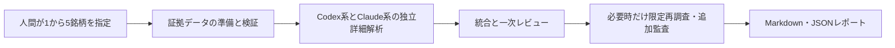

# 詳細解析MVPの範囲と成功条件

| 項目 | 内容 |
| --- | --- |
| 文書状態 | Draft |
| 文書オーナー | 未指定 |
| 承認者 | 未指定 |
| 版 | 0.1-draft |
| 作成日 | 2026-08-18 |
| 承認日 | 未承認のため未設定 |
| 発効日 | 未承認のため未設定 |

## 1. 目的

人間が指定した少数銘柄を、共通の証拠を使うCodex系・Claude系の独立分析へ渡し、
レビュー可能なMarkdown・JSONレポートへまとめる詳細解析MVPの境界を定める。

## 2. MVP入力

### 2.1 必須入力

| 項目 | ドラフト要件 |
| --- | --- |
| 銘柄数 | 1タスクにつき1銘柄以上5銘柄以下 |
| 銘柄識別 | ティッカーだけでなく、市場を一意に示すMICまたは同等の市場識別子を必須とする |
| 対象市場 | 1タスクにつき1市場。最初に対応する市場は承認前に1つ選ぶ |
| 投資期間 | `medium_term`（12か月以上24か月未満）または `long_term`（24か月以上60か月以下） |
| 調査基準時刻 | `as_of_cutoff`、IANAタイムゾーン、取引カレンダーを指定する |
| 評価Policy Version | 適用した評価方針の版を必須とする |

名称、通貨、セクターなど、入力識別後に確定する属性はデータ準備段階で検証する。
入力スキーマ、列挙値、エラー形式はP1で定義する。

`as_of_cutoff` はUTCオフセット付きRFC 3339形式とする。その時刻以下に初めて公衆が
利用可能になった情報だけを判断材料にする。
日付だけの入力を許す場合は、市場ごとに承認した締切時刻とタイムゾーンから
`as_of_cutoff` を一意に導出する。公表時刻または初回利用可能時刻を確認できない情報は、
将来情報が混入しない保守的な規則を適用できる場合だけ使用する。

### 2.2 入力検証

- 銘柄数上限、重複、市場識別子、`as_of_cutoff`、市場タイムゾーン、投資期間を
  分析開始前に検証する。
- 銘柄を一意に解決できない場合は推測せず、入力修正待ちにする。
- `as_of_cutoff` より後に初めて利用可能になった情報を通常分析へ混入させない。
- 将来情報の混入が判明した場合は、対象成果物を無効として再生成する。

## 3. MVP境界

MVPに含めるものは次のとおりとする。

- 指定銘柄の検証済み証拠データ準備
- Codex系作業者1つとClaude系作業者1つによる独立した総合分析
- 統合、一次レビュー、限定再調査、条件付き追加監査
- 人間判断待ちを含む安全停止
- 根拠、反証、欠損、不一致を追跡できる最終レポート

MVPに含めないものは次のとおりとする。

- Universe取得と自動一次スクリーニング
- 一次スクリーニング後のLLM簡易調査
- 証券会社接続、注文送信、自動売買、最終投資判断の自動化
- 自動通知、定期実行、通常作業者の専門分割、モデル数の増加

指定銘柄は一次スクリーニングを通過したものとして扱わない。詳細解析MVPは、
人間が指定した銘柄を同じ入口から受け付けるだけであり、候補選定理由を生成しない。

## 4. 5観点の分析要件

| 観点 | MVPで必要な入力 | 評価方針 |
| --- | --- | --- |
| 財務 | 損益、貸借、キャッシュフロー、主要KPI、会計期間、通貨・単位 | 成長性、収益性、財務健全性、キャッシュ創出力、異常・継続性を分けて評価する |
| バリュエーション | 時点整合した株価、株式数、企業価値入力、過去値、比較対象 | 過去・同業比較と前提感応度を示す |
| 事業 | 開示資料、事業区分、市場・競争、経営方針、主要リスク | 事実、推論、将来仮説を分離し、成長要因と仮説崩壊条件を対で示す |
| テクニカル | 時点整合した日次価格・出来高、調整方法、計算ロジック版 | トレンド、変動性、過熱感、注目価格帯を補助評価する |
| リスク・反証 | 弱気材料、欠損、出典不一致、イベント、各観点の反証条件 | 強気仮説を独立に反証し、重大リスク、監視条件、評価不能事項を明示する |

重要な数値と主張は、出典、取得日時、対象期間、`evidence_id` まで追跡できなければ
最終レポートへ確定情報として掲載しない。

有効な `evidence_id` は、`manifest` 内で一意に解決でき、保存内容または承認済みの
外部参照のハッシュと一致し、ソース承認と `as_of_cutoff` の検証に成功したものとする。
P1では主張ごとにID、種別、重要度、証拠参照を持つ契約を定義する。

## 5. 評価と実行状態の分離

銘柄の後段評価は次の4段階とする。

| 評価 | 意味 |
| --- | --- |
| 合格 | 現在の証拠とPolicyで主要条件を満たし、重大な未解決事項がない |
| 条件付き合格 | 主要条件をおおむね満たすが、明示した条件・欠損・監視事項が残る |
| 再調査 | 判断に必要な証拠または検証が不足し、限定再調査で解消可能である |
| 不合格 | Policy上の重要条件を満たさない、または反証により仮説を維持できない |

4段階評価とは別に、評価可否を `evaluable` または `not_evaluable` として保存する。
必須証拠が不足していても上限内の限定再調査で解消可能な場合は、`evaluable` の
`再調査` とする。取得不能、利用条件違反、または上限到達により必須証拠を確保できない
場合は `not_evaluable` とし、4段階評価を未設定にする。`not_evaluable` を
`条件付き合格`、`不合格`、または一次スクリーニングの `NOT_EVALUABLE` へ自動変換しない。

評価可否と4段階評価は、`実行中`、`追加監査中`、`人間判断待ち`、`失敗`、`中断`、
`利用上限到達` などの実行状態とは別に保存する。解析が完了していない場合、
4段階評価を確定値として外部へ提示しない。

各銘柄の機械可読結果は、合格、不合格、評価不能を含めて保存する。人間向けの
候補一覧には `合格` と `条件付き合格` だけを掲載し、`不合格` と `not_evaluable` は
理由、欠損、反証を別区分で示す。`再調査` は未完了として扱い、解消または上限到達まで
最終化しない。

## 6. 成功条件

次は承認候補となる初期目標であり、固定fixtureと許可された試行で測定する。

| 分類 | ドラフト成功条件 |
| --- | --- |
| 人間が確認する銘柄数 | 1タスク最大5銘柄を超えない |
| レポート量 | 編集SLO。要約10件、各観点5項目、本文4,000字程度を目安とする |
| 調査時間 | 5銘柄タスクの開始から解析完了・レビュー可能状態まで120分以内を初期SLOとし、実測後に再承認する。ハードタイムアウトは別に定める |
| 証拠追跡性 | 解析完了時に、最終レポートの重要な数値・事実主張の100%に有効な `evidence_id` がある |
| 品質 | 最終化時に未解決の `critical` または `high` の一次レビュー指摘が0件である |
| 不確実性 | 欠損、出典不一致、モデル間不一致、反証条件が非表示のまま最終化されない |
| 再現可能性 | 保持期間内は処理を再構成でき、削除後は再実行可否と追跡性を区別する |
| コスト | 権威ある実測値と推定値を区別して使用量を記録し、呼び出し前の予約を含む承認済み方式でハード上限を超えない |
| 安全 | 証券会社へ接続せず、秘密情報や外部資料内の命令をAgent指示として扱わない |

金額ベースのタスク上限は、採用データソースとモデルが決まった時点で承認する。
金額上限が未設定のまま実ネットワーク・実CLIを使うMVP評価を開始してはならない。

## 7. 承認前の未決定事項

- 最初に対応する市場
- 市場ごとの既定の `as_of_cutoff` 導出規則と、同日時間外公表の扱い
- 5銘柄タスクの120分目標が現実的かを確認する試行条件
- 120分SLOより長く、終了処理の余裕を持つハードタイムアウト
- 本文4,000字程度という上限目安の妥当性
- タスク単位の金額、トークン、外部API呼び出し上限

## 8. 参照資料

- [システム構想の初期MVPと成功条件](../design/02-stock-research-system-concept.md#13-初期-mvp)
- [システム構成のMVP](../design/03-stock-research-system-architecture.md#25-mvp-構成)
- [Agent・レビュー・追加監査の方針](03-agent-review-and-audit-policy.md)
