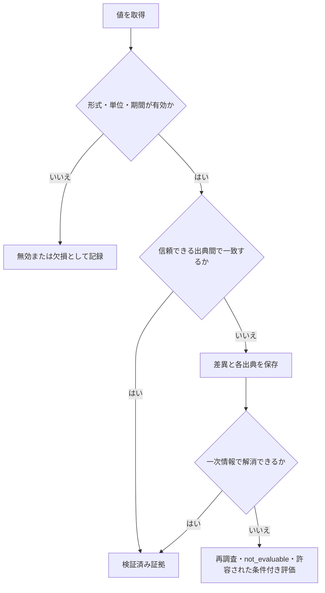

# データソースと証拠の方針

| 項目 | 内容 |
| --- | --- |
| 文書状態 | Approved |
| 文書オーナー | リポジトリ所有者 |
| 承認者 | リポジトリ所有者 |
| 版 | 1.6 |
| 作成日 | 2026-08-18 |
| 外部条件の確認日 | 2026-08-24 |
| 変更提案日 | 2026-09-26 |
| 直前の承認版 | 1.5（2026-09-26承認・発効） |
| 承認日 | 2026-09-26 |
| 発効日 | 2026-09-26 |

> [!IMPORTANT]
> version 1.6は、価格証拠の受入条件と許容制約を追加する。5.1節と6.3節を参照する。
> 出典付きローカルカレンダーとsnapshot時点の銘柄適格性を採用する。
> 固定期間の内部受入API・CLIは実装済み。既存成果物の状態は変更しない。
> version 1.5は、yfinanceの通信を標準ライブラリへ委任し、HTTP単位の制御・監査を
> ライブラリ呼び出し単位の過剰アクセス防止へ置き換える。6.2節を参照する。
> version 1.2の全source容量上限撤廃は維持する。
> version 1.1で承認した再調査回数の固定上限なし方針は維持する。外部利用条件は変更しない。

## 1. 目的

詳細解析MVPで利用する財務、株価、為替、開示、ニュースについて、選定基準、利用条件、
鮮度、対象期間、欠損・不一致、認証、保存・再配布の原則を定める。

### 1.1 version 1.1変更提案

- 変更理由: version 1.0の「上限内の限定再調査」が、P0で承認した再調査回数の
  固定上限なし方針と一致しないため。
- 影響範囲: 必須データ不足時の評価可否判定と、P1で定義する再調査・実行状態契約。
- 互換性への影響: 実装済み契約はまだ存在しない。P1の初期契約では固定回数フィールドを
  必須にせず、再調査の目的、結果、使用量および安全停止理由を記録する。
- 外部条件への影響: データソースの利用条件、認証、費用または保存方針は変更しないため、
  外部条件の確認日は更新しない。

## 2. 選定原則

1. 法定開示、取引所、発行体の一次情報を優先する。
2. 数値取得と計算は決定論的な処理を優先し、LLMに数値を推測させない。
3. 利用規約、契約プラン、料金、認証、再配布をソースごとに承認する。
4. 無償であることを、再配布や商用利用が許可されていることと同一視しない。
5. 利用条件を確認できないソースは本番相当のMVP評価に採用しない。
6. すべてのAgentは、担当処理で必要な情報が不足している場合にWeb検索を使用できる。
   検索結果を検証済み共通証拠へ直接追加せず、元資料の取得・検証工程を通す。
7. 外部へ直接送信する決定論的なデータ取得と候補URLの検証取得は、共有
   `RequestCoordinator`を経由する。source adapterによる直接送信を許可しない。

## 3. データソース方針

初期MVPの東証上場内国株と将来拡張の米国株の市場データ取得には`yfinance`を使用する。実装上の採用方針と、
本番相当のMVP評価で利用できる承認状態は区別し、Yahoo Financeデータの利用条件を
ソース承認記録で確認するまでは実データを利用した評価を開始しない。

<!-- markdownlint-disable MD013 -->

| 区分 | 候補 | ドラフト判断 |
| --- | --- | --- |
| 日本の法定開示 | EDINET API Version 2 | 日本市場のMVP採用ソース |
| 米国の法定開示・XBRL | SEC `data.sec.gov` | 米国市場の第一候補 |
| 日本株・米国株の市場データ | `yfinance`（Yahoo Finance） | 株価、出来高、配当、株式分割、銘柄メタデータの取得に使用する。利用開始にはソース承認を必要とする |
| 日本株向け為替 | 日本銀行時系列統計データ検索API | USD/JPY日次時系列のMVP採用ソース。APIキー不要。利用開始にはソース承認を必要とする |
| ニュース・反証材料の調査 | Agent内蔵Web検索 | 全Agentが必要時に使用し、検証済み資料だけを共通証拠へ追加する。別の検索APIキーは使用しない |
| 発行体ニュース | 発行体IR・適時開示 | 日本市場のMVP採用ソース |

<!-- markdownlint-enable MD013 -->

ソースごとの確認事項は次のとおりである。

- EDINET API Version 2は、利用登録とAPIキーを必要とする。利用規約、料金、
  取得文書ごとの権利を確認する。
- SEC `data.sec.gov`の公開データAPIはAPIキーを必要としない。宣言済み
  User-Agent、Fair Access、出典表示、アクセス制限を守る。
- `yfinance`はYahoo Financeの公開APIへアクセスする非公式のオープンソースライブラリであり、
  Yahooによる提携、承認、検証を受けたサービスではない。ライブラリは研究・教育目的を掲げ、
  Yahoo Finance APIのデータは個人利用を前提としているため、利用主体、用途、保存、再配布、
  Yahoo Finance APIのデータは個人利用の範囲で使用し、外部Agentへは公開Webから取得可能な
  情報または必要最小限の派生証拠だけを渡す。成果物はローカル利用を前提とする。
- ソースメタデータでは、Yahoo Financeをデータ提供元、固定した`yfinance`版と取得関数・
  主要引数を取得手段として分けて記録する。`yfinance`のApache License 2.0を、取得した
  Yahoo Financeデータの保存、再配布、公開を許可するライセンスとして扱わない。
- `yfinance`のAPI、Yahoo側の応答形式、取得可能項目、レート制限は変更され得る。
  ライブラリ版、ティッカー、取得引数、取得日時を記録し、適合するキャッシュを使う。
  取得エラーは自動再試行せず、必要なら人間が再実行する。
  `auto_adjust`、配当、株式分割、タイムゾーン、通貨を暗黙の既定値に依存させない。
- `yfinance`から得た財務項目は補助データとして扱う。最終レポートの重要な財務数値は、
  日本株ではEDINET、米国株ではSEC、または発行体開示で検証し、一次資料と不一致の場合は
  自動的に`yfinance`の値を採用しない。
- News APIは利用しない。Developerプランでは必要な対象期間と実行用途を満たせず、
  有償プランはMVPの費用要件に適合しない。
- 日本銀行時系列統計データ検索APIは、APIキーや利用者登録なしでJSONまたはCSVを取得できる。
  USD/JPYには外国為替市況`FM08`の東京市場17時時点の日次系列`FXERD04`を使用する。
  この系列は1米ドル当たりの円で表すBid・Askの中間値で、1998年1月5日以降の履歴を取得できる。
  高頻度アクセスを避ける。APIを使用したサービスを公開する場合は、日銀の指定する連絡と
  クレジット表示を行う。ローカル実行用スクリプトのソースコードだけを公開し、ホスト型の
  取得・配信を行わない間は、公開サービスとして扱わない。
- Agent内蔵Web検索は、Codex系・Claude系、オーケストレーター、一次レビューワー、
  Antigravityを含む各Agentが、担当処理に必要なニュース、一次資料、反証材料を
  調査するために使用できる。検索サービスとの個別API契約は追加しない。
  Agent CLI内部の物理requestを観測できない場合は、Agent実行の開始許可、同時実行数、
  task・role・provider accountごとの同時実行と利用状況を制御・記録する。provider単位の物理request制御が
  必須でAgent CLIが対応しない場合は、内蔵検索を使わずCoordinator配下の検索toolだけを許可する。
  Codex系・Claude系の初回独立分析では、互いの検索結果と暫定結論を共有しない。
  検索語、実行Agent、検索機能、実行日時、返却URL、見出し、スニペット、候補資料が
  支持または反証し得る主張を、Agent別の探索記録として保存する。
- 検索結果、スニペット、Agentの要約は証拠ではない。オーケストレーターは元資料を
  Coordinator配下の承認済み取得工程で取得し、出典、公表・更新日時、取得日時、利用条件、
  参照先、内容ハッシュを検証する。有効な資料の和集合だけを版付き共通証拠へ追加し、
  両作業者へ相手の暫定結論を伏せたまま差し戻す。
- 発行体IR・適時開示は、URL、見出し、公表日時を優先して保存する。本文の保存や
  自動取得は、各サイトの利用規約とrobotsの条件を確認してから行う。

公式情報の確認先は次のとおりである。

- [EDINET](https://disclosure2.edinet-fsa.go.jp/WEEK0010.aspx)
- [SEC EDGAR Application Programming Interfaces](https://www.sec.gov/search-filings/edgar-application-programming-interfaces)
- [SEC Accessing EDGAR Data](https://www.sec.gov/search-filings/edgar-search-assistance/accessing-edgar-data)
- [yfinance documentation](https://ranaroussi.github.io/yfinance/)
- [yfinance.download API reference](https://ranaroussi.github.io/yfinance/reference/api/yfinance.download.html)
- [yfinance GitHub repository](https://github.com/ranaroussi/yfinance)
- [Yahoo Developer API Terms of Use](https://legal.yahoo.com/us/en/yahoo/terms/product-atos/apiforydn/index.html)
- [日本銀行時系列統計データ検索API機能利用マニュアル](https://www.stat-search.boj.or.jp/info/api_manual.pdf)
- [日本銀行API機能利用時の留意点](https://www.stat-search.boj.or.jp/info/api_notice.pdf)
- [日本銀行USD/JPY日次時系列](https://www.stat-search.boj.or.jp/ssi/mtshtml/fm08_d_1.html)
- [JPX内国株の売買制度・取引時間](https://www.jpx.co.jp/equities/trading/domestic/01.html)

外部条件は変更され得るため、採用時と各リリース評価前に再確認する。

初期MVPのソース構成は、`yfinance`、EDINET API Version 2、日本銀行時系列統計データ検索API、
発行体IR・適時開示、Agent内蔵Web検索で確定する。SEC `data.sec.gov`は将来の米国市場対応時に
使用し、初期MVPの必須ソースにはしない。利用はリポジトリ所有者による私的な内部分析に限定し、
成果物を外部公開しない。外部Agentへ渡せる情報は、対象AgentがWeb検索で取得可能な公開情報と、
その公開情報から作成した必要最小限の検証済み証拠・派生値に限定する。既に確認した各ソースの
利用条件、出所表示、取得頻度、保存・引用上の制約には従い、公開情報であることだけを理由に
制約を無視しない。この方針をP0のsource選定・外部移送判断とし、具体的なsource profile値と
機械可読な承認記録はP1およびU-05で定義する。

## 4. ソース承認記録

各ソースは次を記録し、すべて確認済みで有効な承認状態になってから利用可能とする。

| 記録項目 | 要件 |
| --- | --- |
| 承認状態・版 | `draft`、`approved`、`suspended`、`expired`、`rejected`を区別し、承認記録の版を持つ |
| 承認者・有効期間 | 承認者、発効日、再確認期限、失効・停止理由を記録する |
| 提供者・サービス・データセット | 正式名称と対象データを記録する |
| 公式参照先 | API仕様、利用規約、料金、ライセンスのURLと、確認した文書の版またはハッシュを記録する |
| 確認日・確認者 | 最終確認日と担当者を記録する |
| 利用主体・用途 | 個人・法人、開発・本番相当、内部利用・外部公開を区別する |
| 契約プラン・費用 | 固定費、従量費、無料枠、上限を記録する |
| 認証 | APIキー、User-Agentなどを記録し、秘密値自体は保存しない |
| 再配布・派生物 | 原データ、引用、集計値、レポートの許可範囲を記録する |
| 外部処理・越境移送 | 送信を許可するAgent提供者・製品、目的、データ区分、処理地域、再委託条件を記録する |
| 提供者の保持・学習 | 入力・出力の保持期間、学習利用、削除・オプトアウト条件を記録する |
| 鮮度・対象期間 | 更新頻度、遅延、取得可能な履歴を記録する |
| 障害条件 | レート制限、停止、欠損時の代替可否を記録する |

利用規約、料金、API仕様、提供データ、外部処理条件の変更を検知した場合は承認を
`suspended` とし、再確認が完了するまで新規取得とAgentへの送信を開始しない。

取得時と各外部送信時に、適用したソース承認記録の版を記録する。`suspended`、`expired`、
`rejected`となったソースの既存証拠は自動削除しないが、新しいAgent送信、解析再開、レポート生成、
外部共有に使う前に、その操作が現在の承認状態で許可されるか再検証する。許可されない場合は、
対象証拠を新しい処理へ使用せず、安全停止または承認済み証拠による再生成を行う。

### 4.1 source profile

直接取得を行う各sourceは、ソース承認記録に対応する版付きsource profileを持つ。
source profileは少なくとも次を定める。

<!-- markdownlint-disable MD013 -->

| 項目 | 要件 |
| --- | --- |
| rate scope | `rate_domain`、非秘密の`credential_scope`、`egress_scope`を定める |
| 送信制御 | `max_concurrency`、`min_interval`、`rate`、`window`、`burst`を定める |
| 再利用 | 利用条件、認証scope、鮮度、対象期間を含む`cache_policy`と`batch_policy`を定める |
| エラー | 自動再試行を無効にし、providerのcooldown、エラー記録、手動再実行条件を定める |
| 版 | 承認した`policy_version`と対応するソース承認記録を示す |

<!-- markdownlint-enable MD013 -->

公式条件から具体値を確認できないsourceは、`max_concurrency = 1`、`burst = 1`を上限とし、
正の`min_interval`が承認されるまでオンライン利用を開始しない。provider固有値をsource adapterへ
分散して埋め込まず、実測だけを理由に自動緩和しない。

requestはglobal、egress、provider、origin、credential、operation、task、roleのうち該当する
すべてのrate gateを送信直前に取得する。credential gateには人間が定義した非秘密aliasだけを使い、
秘密値またはそのhashをprofile、rate key、ログへ含めない。redirect先のoriginが変わる場合は、
追従前にsource承認とorigin gateを再評価する。
ただしyfinanceの標準取得には6.2節の呼び出し単位の例外を適用する。

## 5. MVPで必要な鮮度と対象期間

通常のMVP実行では、最新の検証済み共通証拠集合を分析に使用する。次の対象期間と鮮度は、
採用した `evidence_set_version` と `evidence_frozen_at` を基準に判定する。タスク受付後に
公衆が利用可能になった情報も、取得・検証に成功した場合は使用できる。

<!-- markdownlint-disable MD013 -->

| データ | 最低対象期間 | 鮮度要件 |
| --- | --- | --- |
| 年次財務 | 証拠凍結時点で公表済みの直近5期 | 最新年次報告を含む。未公表の通期推計を実績として扱わない |
| 四半期・半期財務 | 証拠凍結時点で公表済みの直近8期間 | 最新公表分を含み、年次値との期間重複を識別する |
| 日次価格・出来高 | 証拠凍結時点まで最低3年 | 調整前後、休場日、通貨、タイムゾーンを記録する |
| USD/JPY日次時系列 | 証拠凍結時点まで最低3年 | 1米ドル当たりの円、Bid・Askの中間値、17時の観測時刻、`Asia/Tokyo`、休場日を記録する |
| 開示 | 証拠凍結時点で公表済みの直近3年と最新の重要開示 | 公表・更新日時と訂正・差替えを追跡する |
| ニュース | 証拠凍結時点で公表済みの直近12か月 | 直近30日を重点確認し、記事の公表・更新日時を区別する |

<!-- markdownlint-enable MD013 -->

ソース側の契約または取得可能期間がこの条件を満たさない場合は、別ソースを承認するか、
不足を明示する。必須データについて、承認済みソースからmaterialな新情報を取得できる可能性があり、
取得・検証の目的が明確な間は、影響期間を`evaluable`の`再調査`とする。MVPでは再調査回数に
システム独自の固定上限を設けず、各再調査の目的、対象、追加証拠、結果、未解決事項および
使用量を記録する。取得不能、利用条件違反、またはmaterialな新情報を追加取得できる見込みが
ないために必須データを確保できない場合だけ、影響期間を`not_evaluable`とする。任意データの不足だけが
評価Policy上許容される場合に限り、欠損を明示した条件付き評価を許可する。通信や認証などの
技術障害は評価可否へ変換せず、実行状態を`Failed`または再開可能な停止状態にする。

### 5.1 日次価格証拠の受入

2026-09-26承認の[価格証拠受入方針](../decision-requests/2026-09-26-price-evidence-acceptance-draft.md)に従う。
価格証拠を受け入れるには、以下をすべて満たさなければならない。

- 証券コードと`XTKS`、JPX snapshot時点の適格性、providerの取得symbolが一致する。
- 承認済みの取得方法・利用範囲に適合し、取得元・版・引数・取得時刻を保持する。
- 最低3暦年の対象期間全体について、出典付き予定取引日と日付が一致する。
  重複・範囲外・欠落・余剰を許容せず、日数だけで判断しない。
- OHLC・調整済み終値・出来高・配当・分割の必須値に欠損・非有限値がなく、
  価格の正値、出来高の非負整数、配当・分割の非負値、OHLC大小関係を検証する。
  providerの分割値0はイベントなしとして保持する。
- `JPY`と`Asia/Tokyo`をメタデータで確認し、調整前後とactionの提供値を区別する。
- 原取得表・正規化値・出典・JPX一覧・カレンダー・hash・判定版を追跡でき、
  銘柄・市場・通貨・日付・数値・来歴に既知の重大な矛盾がない。

3暦年は排他的終了日から3年前を開始日とし、うるう日は既存の境界処理に従う。
通常実行への利用時は、証拠凍結時点の直近完了取引日まで含むことを再確認する。
固定期間の受入結果を、後日の実行で最新データとして無条件に再利用しない。

カレンダーにはJPX現物市場休業日規則と内閣府の公表祝日・休日によるローカル資料を採用し、
出典・確認日・算出規則・hashを保持する。毎実行時の自動取得や臨時休場の網羅調査は必須にしない。
日付差分や休場情報が見つかった場合は根拠付きの別版で修正し、解決まで受入を保留する。
この採用は新しいネットワーク経路や外部配布の許可ではない。

月次一覧の基準日を保持し、月次運用で更新を確認する。毎実行時の最新掲載月の再確認と
月末後の上場変更の網羅追跡は必須にせず、未確認事項を制約として残せる。
既知の上場廃止・対象外市場への移行・銘柄不一致は受入保留とし、未確認扱いで無視しない。

原HTTP本文の未保存、調整済み終値以外の調整済みOHLC未提供、配当原通貨の独立検証未実施、
他providerとの未照合は、明示したうえで価格証拠を制約付きで受け入れられる。
不足入力を必要とする後続計算は別に保留し、補間・推定で条件を満たしたことにしない。
財務・為替・開示等の必須証拠や、詳細解析全体の鮮度確認・開始条件は変更しない。

## 6. 証拠の取り扱い

- 原データ、出典メタデータ、正規化済みデータ、計算済み指標を分離する。
- 重要な証拠へ一意な `evidence_id` を付ける。
- 出典、`published_at`、`first_available_at`、`updated_at`、`retrieved_at`、対象期間、
  タイムゾーン、参照先、内容ハッシュ、データ版を記録する。
- 通常のMVPでは取得時に検証した現在の内容を使用し、使用した内容ハッシュと証拠集合版を
  固定する。取得後に訂正・差替えを発見した場合は別の証拠版として検証し、materialな変更なら
  影響を受ける成果物を再実行する。
- 計算値は入力証拠、計算ロジック版、単位、丸め方法まで追跡可能にする。
- Agent別の検索記録、検証で棄却した候補資料、採用した共通証拠を分離して保存する。
  片方だけが発見した資料も、検証に成功した場合は発見元を保持したまま共通証拠へ追加する。
- 日本株のドル換算価格とリターンは、円建て株価とUSD/JPYの原系列を保持したまま、
  ローカルの決定論的処理で算出する。`Asia/Tokyo`の取引日`D`について、東証終値`D`と
  日銀`FXERD04`の同じ東京日付`D`の17時時点USD/JPYだけを結合する。株価または為替の
  一方が欠損・未公表の場合はドル換算値も未確定または欠損とし、前後日の為替値で
  自動補完しない。各系列の実際の観測時刻、公表時刻、取得時刻は別に保持する。
- 利用規約で本文保存が許可されない場合は、URL、見出し、公表日時、取得日時、
  許可された抜粋または派生値だけを保存する。
- ライセンス上公開できない原データを、Git、最終レポート、Agent向け不要な入力へ含めない。
- 取得済み証拠の訂正・差替えを上書きせず、各内容ハッシュ、取得日時、採用した証拠集合版を
  保持する。
- 通常のMVPにおける過去価格の調整は、証拠凍結時点で公表済みの株式分割などを反映し、
  調整ロジック版とコーポレートアクションの出典を記録する。
- 過去時点の解析は、承認済みのpoint-in-timeデータまたは固定fixtureを使う評価モードに
  限定する。現在のWebページ、検索結果、モデルの記憶だけから過去時点を再構成しない。
- `yfinance`で取得した市場データはローカルの決定論的処理で保存、正規化、計算し、
  外部Agentへは承認済み用途に必要な最小限の証拠と計算済み指標だけを送信する。
  不要な全銘柄データ、不要な全期間の時系列を送信しない。
- 外部Agent提供者への送信は再配布・公開とは別に承認し、許可された提供者、製品、
  データ区分、地域、保持・学習条件に一致しない場合は既定で拒否する。
- request fingerprintには、provider、operation、結果へ影響する正規化済みparameter、
  非秘密の認証scope alias、source Policy版、対象期間・観測条件、response形式を含める。
  同一fingerprintの実行中requestは`single-flight`で1回の物理送信へまとめ、各consumerの
  logical request ID、task、role、発見元を保持する。

### 6.1 取得・展開・解析の容量上限

全sourceと共通transportにおいて、応答bytes、アーカイブの展開量・圧縮率・member数、
XBRLのfact件数・値長など、資源消費量だけを理由とするアプリケーション独自の容量上限を設けない。
OOMの可能性は所有者が受容する。OS・実行環境のメモリ設定変更や、OOM時の自動再試行は行わない。

形式・encoding・path安全性・hash・記録長との一致・意味的整合性の検証、rate・queue・timeout等の
通信制御、秘密情報保護、live acceptanceは維持する。容量上限撤廃はlive有効化の承認ではない。
判断理由、代替案、受容するリスク、検証条件は[ADR-0006](../decisions/0006-remove-source-response-capacity-limits.md)に記録する。

### 6.2 yfinance標準取得と保存

ユーザー承認に基づき、標準取得は固定版yfinanceの`Ticker.history()`へ通信を任せる。
独自Sessionの注入、補助URLの直接呼び出し、HTTPごとの形式検証・permit・監査記録を必須にしない。
旧profile v3の物理送信制御は互換経路だけに適用し、新しい呼び出し制御と同一視しない。

過剰アクセス防止として共有provider状態を永続化し、同時取得1件、取得完了から次回まで最低10秒、
429を含む失敗後15分停止を適用する。通信前の予約で異常終了後の即時再送も防ぐ。
制限中の待機・自動再試行を行わず、yfinanceの一般network retryを0にする。
認証切替等のライブラリ内部動作は許容し、HTTPごとの送信数・間隔・Retry-Afterは観測しない。
これらはローカル運用値であり、provider公表の上限ではない。

補助応答本文、cookie jar、crumb、consent tokenはメモリ内だけで扱い、rawファイル、
一時ファイル、ログ、Agent入力、ライブラリの永続cookieキャッシュへ保存しない。
全ヘッダー、クエリ付きURL、トークン本文のhashも保存しない。補助HTTP監査情報の保存義務を撤廃する。

分析用の取得データはyfinanceの戻り値をCSVとして保存し、提供元、取得日時、取得関数・引数、
ライブラリ版、対象期間、timezone、データhashを記録する。Yahooの原HTTP応答とは区別する。
空データや不正な表構造は失敗とし、欠損を推定で埋めない。ソース承認と分析対象のJPX適格性検証は維持する。

詳細な制限・コマンド・互換性は[標準取得への移行決定](../decision-requests/2026-09-26-yfinance-native-history-policy.md)を参照する。

### 6.3 価格証拠の受入記録

必須条件を満たす場合は`accepted`、許容制約が残る場合は`accepted_with_limitations`とする。
必須条件の不足・不一致は`pending`とし、理由と再確認対象を記録する。
通信・読込・保存失敗は技術エラーとして区別し、銘柄の評価不可へ変換しない。

判定には入力hash、対象期間、判定日時、受入方針版、元taskの評価方針版、
条件ごとの結果、制約と制限する用途を含める。元の証拠と検証結果は上書きせず、
別成果物として保存する。価格証拠の受入だけで`analysis_ready=true`にしない。

これらの受入状態は固定期間を対象とする内部判定API・CLIへ実装済みである。
通常実行の最新終端日確認と詳細解析開始判定への接続は後続作業とする。
既存の`prepared_with_gaps`・`revalidated_with_gaps`は当時の記録として維持する。

## 7. 欠損・不一致・異常値

- 欠損を0、前期値、推計値で自動補完しない。
- 条件不適合による `不合格` と、データ不足による `not_evaluable` を区別する。
- 通貨、単位、会計期間、株式分割、訂正開示、調整価格を検証する。
- USD/JPYは基準通貨・決済通貨、中間値、17時の観測時刻を検証する。東証休業日は
  結合対象の株価がないためドル換算値を作らない。東証取引日に日銀`FXERD04`が欠損する場合は
  その日のドル換算値を欠損とし、別日の値で補完しない。
- 出典間の差異を平均化して消さず、採用値と採用理由を記録する。
- 重要値が解消不能な場合、その値に依存する主張を確定しない。
- LLMが証拠にない数値を出力した場合、推定値として残さず検証エラーにする。

## 8. 認証と費用

- APIキーやトークンは環境または承認済み秘密情報ストアから注入し、タスクやログへ保存しない。
- 実行前に認証状態を確認し、利用可能なら契約プランと残り利用枠も確認する。残量を
  取得できない場合はwarningとする。
- 料金のあるソースはタスク単位の推定費用と実費を記録する。
- 無料枠超過時に自動で有償利用へ切り替えない。
- 認証失敗時に別の個人アカウントや未承認ソースへ自動切替しない。

## 9. P1で定義する事項

- EDINET・SEC・発行体開示から取得する財務項目と、`yfinance`の補助データとの照合規則
- Agent内蔵Web検索の検索記録と、元ページの取得・証拠化に使う機械可読契約
- 各source profileの具体的なrate、cache、batch、cooldownおよびエラー処理
