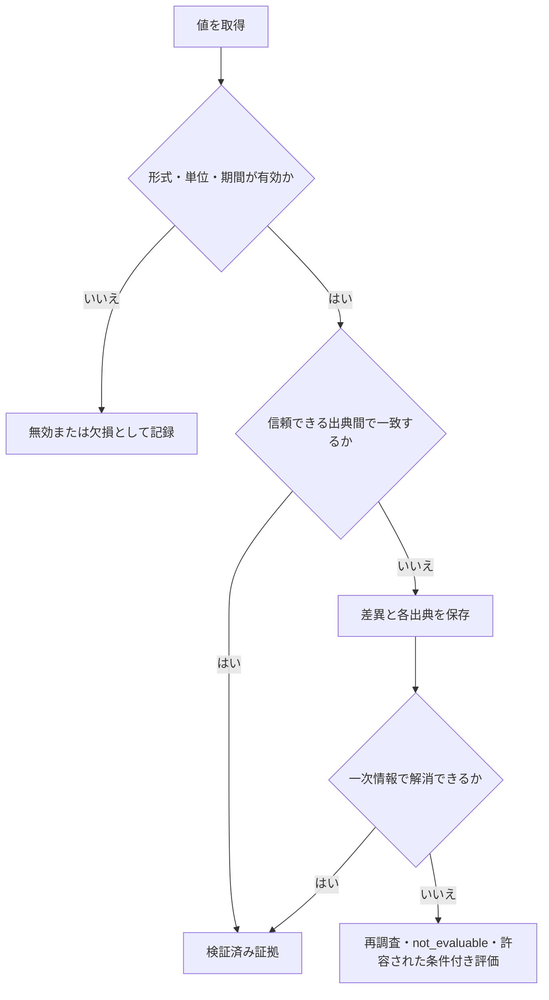

# データソースと証拠の方針

| 項目 | 内容 |
| --- | --- |
| 文書状態 | Draft |
| 文書オーナー | 未指定 |
| 承認者 | 未指定 |
| 版 | 0.1-draft |
| 作成日 | 2026-08-18 |
| 外部条件の確認日 | 2026-08-23 |
| 承認日 | 未承認のため未設定 |
| 発効日 | 未承認のため未設定 |

## 1. 目的

詳細解析MVPで利用する財務、株価、為替、開示、ニュースについて、選定基準、利用条件、
鮮度、対象期間、欠損・不一致、認証、保存・再配布の原則を定める。

## 2. 選定原則

1. 法定開示、取引所、発行体の一次情報を優先する。
2. 数値取得と計算は決定論的な処理を優先し、LLMに数値を推測させない。
3. 利用規約、契約プラン、料金、認証、再配布をソースごとに承認する。
4. 無償であることを、再配布や商用利用が許可されていることと同一視しない。
5. 利用条件を確認できないソースは本番相当のMVP評価に採用しない。
6. すべてのAgentは、担当処理で必要な情報が不足している場合にWeb検索を使用できる。
   検索結果を検証済み共通証拠へ直接追加せず、元資料の取得・検証工程を通す。

## 3. データソース方針

日本株・米国株の市場データ取得には`yfinance`を使用する。実装上の採用方針と、
本番相当のMVP評価で利用できる承認状態は区別し、Yahoo Financeデータの利用条件を
ソース承認記録で確認するまでは実データを利用した評価を開始しない。

<!-- markdownlint-disable MD013 -->

| 区分 | 候補 | ドラフト判断 |
| --- | --- | --- |
| 日本の法定開示 | EDINET API Version 2 | 日本市場の第一候補 |
| 米国の法定開示・XBRL | SEC `data.sec.gov` | 米国市場の第一候補 |
| 日本株・米国株の市場データ | `yfinance`（Yahoo Finance） | 株価、出来高、配当、株式分割、銘柄メタデータの取得に使用する。利用開始にはソース承認を必要とする |
| 日本株向け為替 | 日本銀行時系列統計データ検索API | USD/JPY日次時系列のMVP候補。APIキー不要 |
| ニュース・反証材料の調査 | Agent内蔵Web検索 | 全Agentが必要時に使用し、検証済み資料だけを共通証拠へ追加する。別の検索APIキーは使用しない |
| 発行体ニュース | 発行体IR・適時開示 | 条件確認後に採用判断 |

<!-- markdownlint-enable MD013 -->

ソースごとの確認事項は次のとおりである。

- EDINET API Version 2は、利用登録とAPIキーを必要とする。利用規約、料金、
  取得文書ごとの権利を確認する。
- SEC `data.sec.gov`の公開データAPIはAPIキーを必要としない。宣言済み
  User-Agent、Fair Access、出典表示、アクセス制限を守る。
- `yfinance`はYahoo Financeの公開APIへアクセスする非公式のオープンソースライブラリであり、
  Yahooによる提携、承認、検証を受けたサービスではない。ライブラリは研究・教育目的を掲げ、
  Yahoo Finance APIのデータは個人利用を前提としているため、利用主体、用途、保存、再配布、
  外部Agent提供者への送信、派生値の公開範囲を承認前に確認する。
- ソースメタデータでは、Yahoo Financeをデータ提供元、固定した`yfinance`版と取得関数・
  主要引数を取得手段として分けて記録する。`yfinance`のApache License 2.0を、取得した
  Yahoo Financeデータの保存、再配布、公開を許可するライセンスとして扱わない。
- `yfinance`のAPI、Yahoo側の応答形式、取得可能項目、レート制限は変更され得る。
  ライブラリ版、ティッカー、取得引数、取得日時を記録し、キャッシュと制限付き再試行を使う。
  `auto_adjust`、配当、株式分割、タイムゾーン、通貨を暗黙の既定値に依存させない。
- `yfinance`から得た財務項目は補助データとして扱う。最終レポートの重要な財務数値は、
  日本株ではEDINET、米国株ではSEC、または発行体開示で検証し、一次資料と不一致の場合は
  自動的に`yfinance`の値を採用しない。
- News APIは利用しない。Developerプランでは必要な対象期間と実行用途を満たせず、
  有償プランはMVPの費用要件に適合しない。
- 日本銀行時系列統計データ検索APIは、APIキーや利用者登録なしでJSONまたはCSVを取得できる。
  USD/JPYには外国為替市況`FM08`の東京市場17時時点の日次系列`FXERD04`を使用する候補とし、
  高頻度アクセスを避ける。APIを使用したサービスを公開する場合は、日銀の指定する連絡と
  クレジット表示を行う。ローカル実行用スクリプトのソースコードだけを公開し、ホスト型の
  取得・配信を行わない間は、公開サービスとして扱わない。
- Agent内蔵Web検索は、Codex系・Claude系、オーケストレーター、一次レビューワー、
  Antigravityを含む各Agentが、担当処理に必要なニュース、一次資料、反証材料を
  調査するために使用できる。検索サービスとの個別API契約は追加しない。
  Codex系・Claude系の初回独立分析では、互いの検索結果と暫定結論を共有しない。
  検索語、実行Agent、検索機能、実行日時、返却URL、見出し、スニペット、候補資料が
  支持または反証し得る主張を、Agent別の探索記録として保存する。
- 検索結果、スニペット、Agentの要約は証拠ではない。オーケストレーターは元資料を
  承認済み取得工程で取得し、出典、公表・更新日時、取得日時、`as_of_cutoff`、利用条件、
  参照先、内容ハッシュを検証する。有効な資料の和集合だけを共通証拠へ追加し、両作業者へ
  相手の暫定結論を伏せたまま差し戻す。
- 発行体IR・適時開示は、URL、見出し、公表日時を優先して保存する。本文の保存や
  自動取得は、各サイトの利用規約とrobotsの条件を確認してから行う。

公式情報の確認先は次のとおりである。

- [EDINET](https://disclosure2.edinet-fsa.go.jp/WEEK0010.aspx)
- [SEC EDGAR Application Programming Interfaces](https://www.sec.gov/search-filings/edgar-application-programming-interfaces)
- [SEC Accessing EDGAR Data](https://www.sec.gov/search-filings/edgar-search-assistance/accessing-edgar-data)
- [yfinance documentation](https://ranaroussi.github.io/yfinance/)
- [yfinance.download API reference](https://ranaroussi.github.io/yfinance/reference/api/yfinance.download.html)
- [yfinance GitHub repository](https://github.com/ranaroussi/yfinance)
- [Yahoo Developer API Terms of Use](https://legal.yahoo.com/us/en/yahoo/terms/product-atos/apiforydn/index.html)
- [日本銀行時系列統計データ検索API機能利用マニュアル](https://www.stat-search.boj.or.jp/info/api_manual.pdf)
- [日本銀行API機能利用時の留意点](https://www.stat-search.boj.or.jp/info/api_notice.pdf)

外部条件は変更され得るため、採用時と各リリース評価前に再確認する。

## 4. ソース承認記録

各ソースは次を記録し、すべて確認済みで有効な承認状態になってから利用可能とする。

| 記録項目 | 要件 |
| --- | --- |
| 承認状態・版 | `draft`、`approved`、`suspended`、`expired`、`rejected`を区別し、承認記録の版を持つ |
| 承認者・有効期間 | 承認者、発効日、再確認期限、失効・停止理由を記録する |
| 提供者・サービス・データセット | 正式名称と対象データを記録する |
| 公式参照先 | API仕様、利用規約、料金、ライセンスのURLと、確認した文書の版またはハッシュを記録する |
| 確認日・確認者 | 最終確認日と担当者を記録する |
| 利用主体・用途 | 個人・法人、開発・本番相当、内部利用・外部公開を区別する |
| 契約プラン・費用 | 固定費、従量費、無料枠、上限を記録する |
| 認証 | APIキー、User-Agentなどを記録し、秘密値自体は保存しない |
| 再配布・派生物 | 原データ、引用、集計値、レポートの許可範囲を記録する |
| 外部処理・越境移送 | 送信を許可するAgent提供者・製品、目的、データ区分、処理地域、再委託条件を記録する |
| 提供者の保持・学習 | 入力・出力の保持期間、学習利用、削除・オプトアウト条件を記録する |
| 鮮度・対象期間 | 更新頻度、遅延、取得可能な履歴を記録する |
| 障害条件 | レート制限、停止、欠損時の代替可否を記録する |

利用規約、料金、API仕様、提供データ、外部処理条件の変更を検知した場合は承認を
`suspended` とし、再確認が完了するまで新規取得とAgentへの送信を開始しない。

## 5. MVPで必要な鮮度と対象期間

通常のMVP実行では、タスク受付時にシステムが固定した現在時刻を `as_of_cutoff` とする。
次の対象期間は、その時刻までに初めて公衆が利用可能になった証拠を基準に判定する。
取得処理が `as_of_cutoff` より後に完了しても、締切時点の内容または版と
`first_available_at` を検証できる証拠は利用できる。`retrieved_at` だけで採否を決めない。

<!-- markdownlint-disable MD013 -->

| データ | 最低対象期間 | 鮮度要件 |
| --- | --- | --- |
| 年次財務 | `as_of_cutoff` 以前に利用可能な直近5期 | 最新年次報告を含む。未公表の通期推計を実績として扱わない |
| 四半期・半期財務 | `as_of_cutoff` 以前に利用可能な直近8期間 | 最新公表分を含み、年次値との期間重複を識別する |
| 日次価格・出来高 | `as_of_cutoff` まで最低3年 | 調整前後、休場日、通貨、タイムゾーンを記録する |
| USD/JPY日次時系列 | `as_of_cutoff` まで最低3年 | 通貨ペアの向き、Bid・Ask・Midの別、観測時刻、タイムゾーン、休場日を記録する |
| 開示 | `as_of_cutoff` 以前に利用可能な直近3年と最新の重要開示 | 公表・初回利用可能日時と訂正・差替えを追跡する |
| ニュース | `as_of_cutoff` 以前に利用可能な直近12か月 | 直近30日を重点確認し、記事の公表・更新日時を区別する |

<!-- markdownlint-enable MD013 -->

ソース側の契約または取得可能期間がこの条件を満たさない場合は、別ソースを承認するか、
不足を明示する。必須データの不足は `not_evaluable` とし、任意データの不足だけが
評価Policy上許容される場合に限り条件付き評価とする。

## 6. 証拠の取り扱い

- 原データ、出典メタデータ、正規化済みデータ、計算済み指標を分離する。
- 重要な証拠へ一意な `evidence_id` を付ける。
- 出典、`published_at`、`first_available_at`、`updated_at`、`retrieved_at`、対象期間、
  タイムゾーン、参照先、内容ハッシュ、データ版を記録する。
- `published_at` が `as_of_cutoff` 以前でも、取得した内容が締切後に更新されており、
  締切時点の版を検証できない場合は通常分析へ使用しない。
- 計算値は入力証拠、計算ロジック版、単位、丸め方法まで追跡可能にする。
- Agent別の検索記録、検証で棄却した候補資料、採用した共通証拠を分離して保存する。
  片方だけが発見した資料も、検証に成功した場合は発見元を保持したまま共通証拠へ追加する。
- 日本株のドル換算価格とリターンは、円建て株価とUSD/JPYの原系列を保持したまま、
  ローカルの決定論的処理で算出する。USD/JPYは1米ドル当たりの円へ正規化し、株価の
  観測時刻と同一またはそれ以前の最新の承認済み観測値だけを使用する。将来時点の為替を
  過去の株価へ適用しない。
- 利用規約で本文保存が許可されない場合は、URL、見出し、公表日時、取得日時、
  許可された抜粋または派生値だけを保存する。
- ライセンス上公開できない原データを、Git、最終レポート、Agent向け不要な入力へ含めない。
- `as_of_cutoff` 後の訂正・差替えで当時の版を上書きせず、旧版と利用可能期間を保持する。
- 過去価格の調整では、`as_of_cutoff` 後に初めて利用可能になった株式分割などの
  コーポレートアクションを混入させない。
- 過去時点の解析は、承認済みのpoint-in-timeデータまたは固定fixtureを使う評価モードに
  限定する。現在のWebページ、検索結果、モデルの記憶だけから過去時点を再構成しない。
- `yfinance`で取得した市場データはローカルの決定論的処理で保存、正規化、計算し、
  外部Agentへは承認済み用途に必要な最小限の証拠と計算済み指標だけを送信する。
  不要な全銘柄データ、不要な全期間の時系列を送信しない。
- 外部Agent提供者への送信は再配布・公開とは別に承認し、許可された提供者、製品、
  データ区分、地域、保持・学習条件に一致しない場合は既定で拒否する。

## 7. 欠損・不一致・異常値

- 欠損を0、前期値、推計値で自動補完しない。
- 条件不適合による `不合格` と、データ不足による `not_evaluable` を区別する。
- 通貨、単位、会計期間、株式分割、訂正開示、調整価格を検証する。
- USD/JPYは基準通貨・決済通貨、Bid・Ask・Midの別、観測時刻を検証する。株式市場と
  外国為替市場の営業日差を欠損として識別し、承認済み規則なしに先の観測値または
  長期間前の値で補完しない。
- 出典間の差異を平均化して消さず、採用値と採用理由を記録する。
- 重要値が解消不能な場合、その値に依存する主張を確定しない。
- LLMが証拠にない数値を出力した場合、推定値として残さず検証エラーにする。

## 8. 認証と費用

- APIキーやトークンは環境または承認済み秘密情報ストアから注入し、タスクやログへ保存しない。
- 実行前に認証状態、契約プラン、残り上限を確認する。
- 料金のあるソースはタスク単位の推定費用と実費を記録する。
- 無料枠超過時に自動で有償利用へ切り替えない。
- 認証失敗時に別の個人アカウントや未承認ソースへ自動切替しない。

## 9. 承認前の未決定事項

- `yfinance`およびYahoo Financeデータについて、利用主体、利用目的、保存、再配布、
  外部Agent提供者への送信が利用条件を満たすか
- EDINET・SEC・発行体開示から取得する財務項目と、`yfinance`の補助データとの照合規則
- USD/JPYの採用価格種別、日次観測時刻、株価との時点整合規則
- Agent内蔵Web検索で許可する検索機能、検索範囲、検索記録の契約、
  元ページの取得・証拠化手順
- 最終レポートで公開できる派生値・引用の範囲
- 各ソースの原データ・派生値をCodex、Claude、Antigravityの提供者へ送信できる条件
