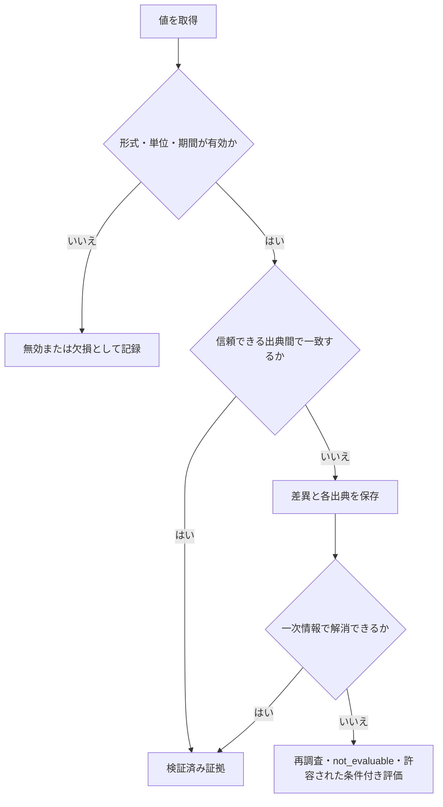

# データソースと証拠の方針

| 項目 | 内容 |
| --- | --- |
| 文書状態 | Draft |
| 文書オーナー | 未指定 |
| 承認者 | 未指定 |
| 版 | 0.1-draft |
| 作成日 | 2026-08-18 |
| 外部条件の確認日 | 2026-08-18 |
| 承認日 | 未承認のため未設定 |
| 発効日 | 未承認のため未設定 |

## 1. 目的

詳細解析MVPで利用する財務、株価、開示、ニュースについて、選定基準、利用条件、
鮮度、対象期間、欠損・不一致、認証、保存・再配布の原則を定める。

## 2. 選定原則

1. 法定開示、取引所、発行体の一次情報を優先する。
2. 数値取得と計算は決定論的な処理を優先し、LLMに数値を推測させない。
3. 利用規約、契約プラン、料金、認証、再配布、保存期間をソースごとに承認する。
4. 無償であることを、再配布や商用利用が許可されていることと同一視しない。
5. 利用条件を確認できないソースは本番相当のMVP評価に採用しない。
6. Agentによる任意のWeb検索結果を、検証済み共通証拠へ直接追加しない。

## 3. データソース候補

対象市場が未決定のため、次は採用決定ではなく比較対象である。

| 区分 | 候補 | ドラフト判断 |
| --- | --- | --- |
| 日本の法定開示 | EDINET API Version 2 | 日本市場の第一候補 |
| 米国の法定開示・XBRL | SEC `data.sec.gov` | 米国市場の第一候補 |
| 日本の価格・財務 | J-Quants API | 利用主体、必要期間・データ種別、契約プランの確認まで未採用 |
| 法人向け日本データ | J-Quants Pro | 配布・費用要件がある場合に評価 |
| ニュース索引 | News API | Developerプランはfixture開発だけの候補。12か月要件を満たす実行には未採用 |
| 発行体ニュース | 発行体IR・適時開示 | 条件確認後に採用判断 |

候補ごとの確認事項は次のとおりである。

- EDINET API Version 2は、利用登録とAPIキーを必要とする。利用規約、料金、
  取得文書ごとの権利を確認する。
- SEC `data.sec.gov`の公開データAPIはAPIキーを必要としない。宣言済み
  User-Agent、Fair Access、出典表示、アクセス制限を守る。
- 個人向けJ-Quants APIはプラン制で、V2はAPIキー認証を使う。個人の私的利用に
  限定され、取得データの第三者配信に加えて、分析結果の継続的な第三者提供にも
  制限がある。必要な履歴、財務諸表、鮮度はプランにより異なるため、利用主体、
  契約プラン、Agent提供者への処理目的の送信、公開範囲を事前に確認する。
- J-Quants Proはデータセットごとの契約・料金があり、原則はInternal Useである。
  外部配布には追加条件がある。
- News APIのDeveloperプランは開発・テスト専用である。非開発利用には有償プランが
  必要で、記事全文は提供されないため、第三者コンテンツの権利も確認する。
- 発行体IR・適時開示は、URL、見出し、公表日時を優先して保存する。本文の保存や
  自動取得は、各サイトの利用規約とrobotsの条件を確認してから行う。

公式情報の確認先は次のとおりである。

- [EDINET](https://disclosure2.edinet-fsa.go.jp/WEEK0010.aspx)
- [SEC EDGAR Application Programming Interfaces](https://www.sec.gov/search-filings/edgar-application-programming-interfaces)
- [SEC Accessing EDGAR Data](https://www.sec.gov/search-filings/edgar-search-assistance/accessing-edgar-data)
- [J-Quants](https://jpx-jquants.com/ja)
- [J-Quants Pro Terms and Conditions](https://pro.jpx-jquants.com/termsofservice)
- [News API Pricing](https://newsapi.org/pricing)
- [News API Terms](https://newsapi.org/terms)

外部条件は変更され得るため、採用時と各リリース評価前に再確認する。

## 4. ソース承認記録

各ソースは次を記録し、すべて確認済みで有効な承認状態になってから利用可能とする。

| 記録項目 | 要件 |
| --- | --- |
| 承認状態・版 | `draft`、`approved`、`suspended`、`expired`、`rejected`を区別し、承認記録の版を持つ |
| 承認者・有効期間 | 承認者、発効日、再確認期限、失効・停止理由を記録する |
| 提供者・サービス・データセット | 正式名称と対象データを記録する |
| 公式参照先 | API仕様、利用規約、料金、ライセンスのURLと、確認した文書の版またはハッシュを記録する |
| 確認日・確認者 | 最終確認日と担当者を記録する |
| 利用主体・用途 | 個人・法人、開発・本番相当、内部利用・外部公開を区別する |
| 契約プラン・費用 | 固定費、従量費、無料枠、上限を記録する |
| 認証 | APIキー、User-Agentなどを記録し、秘密値自体は保存しない |
| 再配布・派生物 | 原データ、引用、集計値、レポートの許可範囲を記録する |
| 外部処理・越境移送 | 送信を許可するAgent提供者・製品、目的、データ区分、処理地域、再委託条件を記録する |
| 提供者の保持・学習 | 入力・出力の保持期間、学習利用、削除・オプトアウト条件を記録する |
| 保存・削除 | 保存可能期間、削除義務、キャッシュ条件を記録する |
| 鮮度・対象期間 | 更新頻度、遅延、取得可能な履歴を記録する |
| 障害条件 | レート制限、停止、欠損時の代替可否を記録する |

利用規約、料金、API仕様、提供データ、外部処理条件の変更を検知した場合は承認を
`suspended` とし、再確認が完了するまで新規取得とAgentへの送信を開始しない。

## 5. MVPで必要な鮮度と対象期間

| データ | 最低対象期間 | 鮮度要件 |
| --- | --- | --- |
| 年次財務 | `as_of_cutoff` 以前に利用可能な直近5期 | 最新年次報告を含む。未公表の通期推計を実績として扱わない |
| 四半期・半期財務 | `as_of_cutoff` 以前に利用可能な直近8期間 | 最新公表分を含み、年次値との期間重複を識別する |
| 日次価格・出来高 | `as_of_cutoff` まで最低3年 | 調整前後、休場日、通貨、タイムゾーンを記録する |
| 開示 | `as_of_cutoff` 以前に利用可能な直近3年と最新の重要開示 | 公表・初回利用可能日時と訂正・差替えを追跡する |
| ニュース | `as_of_cutoff` 以前に利用可能な直近12か月 | 直近30日を重点確認し、記事の公表・更新日時を区別する |

ソース側の契約または取得可能期間がこの条件を満たさない場合は、別ソースを承認するか、
不足を明示する。必須データの不足は `not_evaluable` とし、任意データの不足だけが
評価Policy上許容される場合に限り条件付き評価とする。

## 6. 証拠の取り扱い

- 原データ、出典メタデータ、正規化済みデータ、計算済み指標を分離する。
- 重要な証拠へ一意な `evidence_id` を付ける。
- 出典、`published_at`、`first_available_at`、`updated_at`、`retrieved_at`、対象期間、
  タイムゾーン、参照先、内容ハッシュ、データ版を記録する。
- 計算値は入力証拠、計算ロジック版、単位、丸め方法まで追跡可能にする。
- 利用規約で本文保存が許可されない場合は、URL、見出し、公表日時、取得日時、
  許可された抜粋または派生値だけを保存する。
- ライセンス上公開できない原データを、Git、最終レポート、Agent向け不要な入力へ含めない。
- `as_of_cutoff` 後の訂正・差替えで当時の版を上書きせず、旧版と利用可能期間を保持する。
- 過去価格の調整では、`as_of_cutoff` 後に初めて利用可能になった株式分割などの
  コーポレートアクションを混入させない。
- 外部Agent提供者への送信は再配布・公開とは別に承認し、許可された提供者、製品、
  データ区分、地域、保持・学習条件に一致しない場合は既定で拒否する。

## 7. 欠損・不一致・異常値

- 欠損を0、前期値、推計値で自動補完しない。
- 条件不適合による `不合格` と、データ不足による `not_evaluable` を区別する。
- 通貨、単位、会計期間、株式分割、訂正開示、調整価格を検証する。
- 出典間の差異を平均化して消さず、採用値と採用理由を記録する。
- 重要値が解消不能な場合、その値に依存する主張を確定しない。
- LLMが証拠にない数値を出力した場合、推定値として残さず検証エラーにする。

## 8. 認証と費用

- APIキーやトークンは環境または承認済み秘密情報ストアから注入し、タスクやログへ保存しない。
- 実行前に認証状態、契約プラン、残り上限を確認する。
- 料金のあるソースはタスク単位の推定費用と実費を記録する。
- 無料枠超過時に自動で有償利用へ切り替えない。
- 認証失敗時に別の個人アカウントや未承認ソースへ自動切替しない。

## 9. 承認前の未決定事項

- MVP対象市場と、その市場向けの価格・財務データソース
- ニュースを自動取得するか、承認済みURLの手動入力に限定するか
- 利用主体がJ-Quantsの私的利用条件を満たすか
- 最終レポートで公開できる派生値・引用の範囲
- 各ソースの原データ・派生値をCodex、Claude、Antigravityの提供者へ送信できる条件
- ソースごとの保存期間と削除条件
