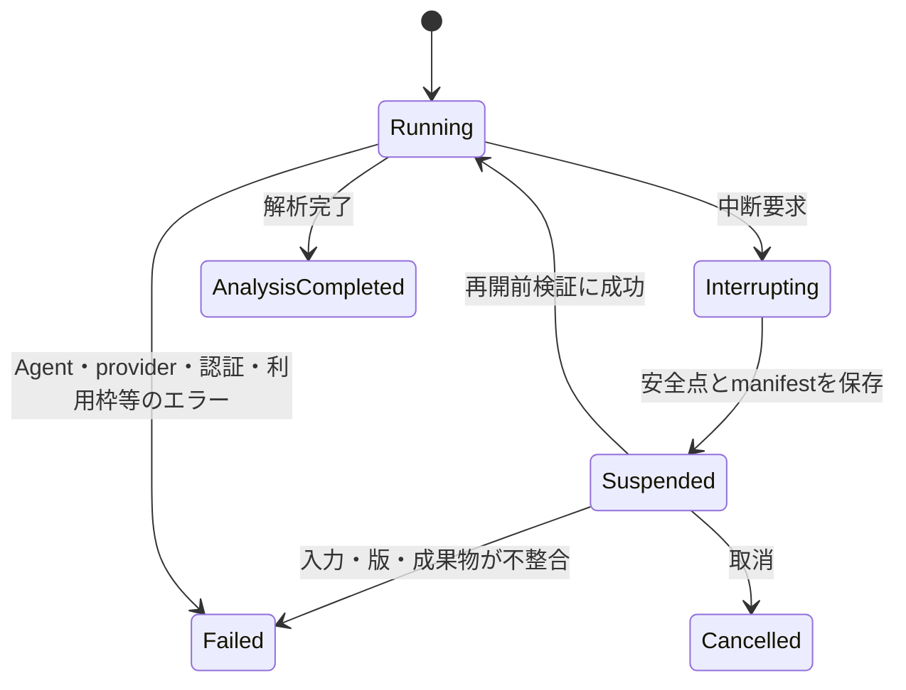

# CLIと実行運用の要件

| 項目 | 内容 |
| --- | --- |
| 文書状態 | Approved |
| 文書オーナー | リポジトリ所有者 |
| 承認者 | リポジトリ所有者 |
| 版 | 1.0 |
| 作成日 | 2026-08-18 |
| 承認日 | 2026-08-28 |
| 発効日 | 2026-08-28 |

## 1. 目的

詳細解析MVPを安全に開始、監視、中断、再開、再実行するための操作と、
事前確認、エラー処理、provider制約、利用状況の記録、認証の要件を定める。

ここで示す操作名は要件上の機能名であり、実装済みコマンドではない。
正確なCLIコマンド、引数、終了コード、設定スキーマはP1・P2で決定する。

## 2. 必須操作

<!-- markdownlint-disable MD013 -->

| 操作 | 要件 |
| --- | --- |
| タスク検証 | 外部アクセスなしで入力、Policy、設定、必要な認証種別を検証する |
| 開始 | 新しい`task_id`を発行し、`task_accepted_at`を記録して、入力と実行設定とともに開始する |
| オンライン事前確認 | configで選択されたAgentについて、CLI、対応版、認証状態、モデル、非対話実行、利用可能なら残り利用枠を確認する。必須条件の失敗はerror、残量を取得不能など確認不能な項目はwarningにする。ソース承認、source profile、`RequestCoordinator`の状態、必要な外部サービス到達性も確認する |
| 状態表示 | 現在状態、完了工程、次工程、失敗、使用量、人間判断の要否を表示する |
| 中断 | 新規外部処理を止め、進行中処理を期限内に終了させ、再開可能点を保存する |
| 取消 | タスクを再開しない終端状態へ移し、取消理由を記録して成果物を保持する |
| 再開 | 同じ`task_id`の検証済みチェックポイントから未完了工程だけを続行する |
| 再実行 | 新しい`task_id`と`task_accepted_at`を発行し、親タスク、再利用した入力・証拠、変更設定を記録する。再利用する証拠は現在のソース承認、鮮度、証拠集合版に対して再検証する |
| 人間判断 | 許可された選択肢、決定者、理由、日時を記録して状態遷移する |
| 成果物確認 | 最終・中間成果物、証拠参照、検証結果、監査の起動・未起動理由を表示する |

<!-- markdownlint-enable MD013 -->

すべての変更操作は非対話実行でも明示的な入力を受け取れるようにし、
暗黙の既定値で売買、外部公開、無制限利用を有効にしない。

CLIの状態、エラー、確認プロンプトには日本語表示を要求せず、英語を許容する。
CLIが人間の判断用または最終閲覧用の文書をファイルとして出力する場合は、
[言語と対象読者の方針](06-language-and-audience-policy.md)を適用する。

## 3. タイムアウト

MVPではtask全体およびAgent工程へシステム独自の固定timeoutを設けない。人間による中断と、
OS、CLI、providerが返すエラーは受け付ける。実測で長時間停止が問題になった場合にtimeoutを追加する。

## 4. 再試行

MVPではAgent実行、データ取得、スキーマ不正を自動再試行しない。エラー、標準出力、標準エラー、
終了code、完了工程を保存して`Failed`とする。再実行が必要な場合はリポジトリ所有者が明示的に
新しいtaskを開始する。`RequestCoordinator`はproviderが要求する`Retry-After`とcooldownを守るが、
同一task内で自動再送しない。同じ`task_id`の状態変更は同時に1つだけ許可する。

## 5. 外部リクエストの共有調整

外部へ直接送信するすべての決定論的データ取得は、外部接続の直前に置く共有
`RequestCoordinator`を経由する。Agentやsource adapterがCoordinatorを迂回して
直接送信してはならない。

MVPでは、1つのオーケストレーターprocessがAgent subprocessとsource adapterを起動し、
外部アクセス可能なオーケストレーターを同じ実行環境で複数同時起動しない。起動時にSQLite
transactionで単一行のruntime leaseを取得し、有効なownerが存在する場合はオンライン処理を
開始しない。leaseは定期更新し、異常終了後は期限切れと状態照合を経て引き継ぐ。

`RequestCoordinator`は少なくとも次を担当する。

- source承認とrequest分類の検証
- logical request IDとfingerprintの発行
- cache判定と`single-flight`
- providerが返す利用量の記録
- provider別queueとtask間の公平制御
- global、egress、provider、origin、credential、operation、task、roleのrate gate
- 同時実行数、送信間隔、rate、burst、cooldown
- cancellationとproviderのcooldown
- physical attempt、結果不明状態、利用量の監査記録
- limiter、cooldown、runtime leaseの永続化と再起動時復元

process内schedulerはprovider別queueを持ち、同じprovider内ではtaskごとのFIFOとactive task間の
round-robinを使う。異なるproviderへのrequestは、それぞれのgateを満たす場合に並行できる。
自動retry queueは設けない。providerが`Retry-After`またはcooldownを要求した場合は状態を保存し、
同一task内で再送せずエラーとして終了する。中断されたqueued requestは取り消す。

cacheと`single-flight`はrate gateより前に適用する。利用条件、認証scope、鮮度、対象期間、
source Policy版が一致しないcacheを暗黙に返さない。同一fingerprintのin-flight requestは1つの
leaderへまとめるが、consumerごとのlogical request ID、task、role、発見元を保持する。

Agent内蔵Web検索の物理requestを観測できない場合は、Agent sessionの開始許可、同時実行数、
task・role・provider accountごとの同時実行とproviderのcooldownを制御する。
物理request数を観測できない通信を、origin単位で制御できたものとして記録しない。
初回独立探索では他Agentの検索内容・結果cacheを共有せず、候補URLの検証取得だけを
Coordinator配下へ戻す。

`yfinance`は固定版を使い、全物理送信の直前にpermitを取得する`CoordinatedSession`を注入する。
`threads=False`を明示し、session注入で全物理送信を捕捉できない版を採用しない。捕捉不能時に
直接接続へfallbackしてはならない。

Coordinator、SQLite state、source profileの検証に失敗した場合は外部接続を停止し、adapterや
Agentが直接接続へfallbackしてはならない。rate limitまたはprovider障害時はproviderの
cooldownを記録して停止し、必要な再実行は人間が開始する。

## 6. 中断と再開

- 中断要求後は新しい外部呼び出しを開始しない。
- 進行中プロセスは猶予時間後に終了し、秘密情報を除去した標準出力・標準エラー、
  終了理由を保存する。安全に除去できない場合は本文を保存せず、ハッシュとメタデータだけを残す。
- 再開前に入力ハッシュ、証拠ハッシュ、Policy Version、成果物検証状態を確認する。
- 再開後に外部処理またはAgent送信を行う前に、source approval版、source profile版、
  外部移送許可、認証状態、Coordinator lease・cooldown・利用予約、証拠集合版と鮮度を再検証する。
- 既存成果物が変更されている場合は同じタスクを再開せず、原因を示して停止する。
- モデル、Policy、データを変更してやり直す場合は再開ではなく新しいタスクとして再実行する。
- 完了済み外部処理を再利用する場合は、再利用元と検証結果を`manifest`へ記録する。
- `Suspended`と人間確認を含む非終端状態、および`AnalysisCompleted`、`Failed`、`Cancelled`を
  識別する。取消はリポジトリ所有者が実行する。

## 7. 利用状況

MVPでは時間、token、費用、Web検索、再調査、異なる争点数にシステム独自の固定上限を設けない。
providerまたは契約プランが課す上限は迂回しない。configで選択されたAgentについて、preflightで
取得可能な認証状態、モデル利用可否、残り利用枠を確認し、必須条件の失敗はerror、残量取得不能は
warningとして記録する。実行中にprovider上限へ到達した場合は`Failed`とし、人間が必要に応じて
再実行する。実行時間、token、外部request、費用、再調査回数、合議回数、エラーを計測し、
実測で課題が明確になった場合に制限を追加する。

## 8. 認証

- 外部CLIとAPIの認証は実行前の事前確認で検証する。
- 認証情報をタスク定義、プロンプト、標準出力、ログ、成果物、Gitへ含めない。
- 環境変数、読み取り専用の認証状態マウント、または承認済み秘密情報ストアから、
  対象の外部接続プロセスへ直接注入する。オーケストレーターの業務ロジック、プロンプト、
  Agentのモデルコンテキストから秘密値を読み取れる状態にしない。
- Agentごとに必要最小限の認証と権限だけを提供する。
- ホストでの認証成功を、コンテナ内の認証成功とみなさない。
- 認証状態の移送可否はCLIごとにコンテナ内で確認する。
- 認証失敗時に別アカウントや個人の資格情報へ自動切替しない。

認証方式の具体的なセットアップ手順は、採用CLIとデータソースの公式仕様を
実装時点で確認し、P5の運用ガイドへ記載する。

現在のDocker Composeは複数CLIの認証状態とリポジトリを共有する開発環境であり、
この文書が求める実行時の役割別隔離を満たすスクリーニング用サンドボックスとして
扱わない。

## 9. 障害時フォールバック

<!-- markdownlint-disable MD013 -->

| 障害 | 自動処理 | 禁止する処理 |
| --- | --- | --- |
| データソース停止 | 承認済みキャッシュの鮮度を検証し、使えなければ停止する | 未承認ソースから補う |
| 通常作業者1つが失敗 | エラーを記録して`Failed`とする | 片系統だけで通常完了とする |
| 一次レビューワー失敗 | エラーを記録して`Failed`とする | オーケストレーターが自己承認する |
| Antigravity利用不能 | configで必須ならpreflightをerrorにし、任意ならwarningにする。監査開始時の失敗は`Failed`とする | Codex系・Claude系を第三者監査と表示する |
| `RequestCoordinator`または永続状態の障害 | 現在状態を保存し、外部接続を停止する | adapterまたはAgentが直接外部接続する |
| provider利用枠到達 | 現在状態、中間成果物、未完了出力、未処理事項を保存して`Failed`とする | 部分出力を完成扱いする、または上限を迂回する |
| 認証失敗 | 対象工程を開始せず、必要な認証種別だけを通知する | 秘密値をログへ出す |

<!-- markdownlint-enable MD013 -->

## 10. 監査可能性

各操作は、操作者、日時、入力版、開始前状態、終了後状態、終了コード、使用量、
生成・再利用した成果物を記録する。Web探索では、検索実行主体、検索機能、検索語、
実行日時、返却URL数、候補資料数、検証結果への参照を記録する。CLI表示用の要約と
機械可読ログを分離し、秘密情報除去後の情報だけを保存する。

外部requestはlogical requestとphysical attemptを分離し、task、role、Agent run、provider、
rate domain、非秘密credential alias、source Policy版、queue時刻、permit取得、待機時間、
cache判定、single-flightのleader・consumer、response分類、latency、error、cooldown、取得可能な
使用量を記録する。URL query、cookie、認証header、秘密値をログまたはmetric labelへ含めない。

運用メトリクスにはprovider別rate・in-flight・queue長・最古待機時間、429・503件数、
cooldown、cache hit・stale拒否・single-flight統合率、task別待機時間、取得可能な使用量、
cancellationを含める。高cardinalityな`task_id`やrequest IDは
監査ログだけに保存し、集計metric labelへ含めない。

## 11. P1・P5で定義する事項

- 正確なCLIコマンド名、引数、終了コード
- Agent CLIごとの認証状態の保管・マウント方法
- 秘密値をオーケストレーターから分離して外部接続プロセスへ渡す方式
- 同時実行を防ぐ排他方式と外部要求の照合方式
- providerごとのrate、window、burst、`min_interval`、`max_concurrency`
- sourceごとのcache TTL、batch方法、cooldown処理
- runtime stateの正確な保存先、任意backup、破損時の照合方式
- 採用する固定`yfinance`版とsession互換性
- Agent CLIごとの検索利用量取得方法
