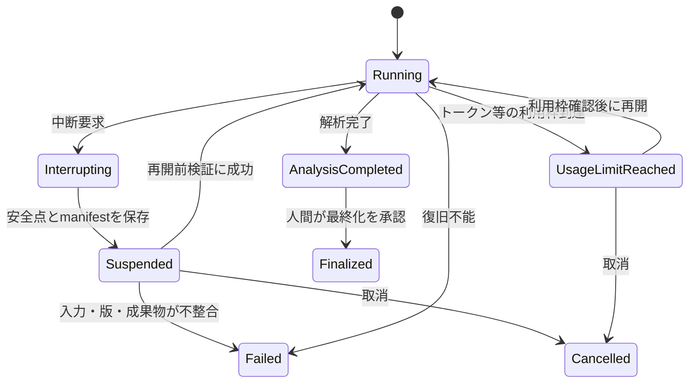

# CLIと実行運用の要件

| 項目 | 内容 |
| --- | --- |
| 文書状態 | Draft |
| 文書オーナー | 未指定 |
| 承認者 | 未指定 |
| 版 | 0.1-draft |
| 作成日 | 2026-08-18 |
| 承認日 | 未承認のため未設定 |
| 発効日 | 未承認のため未設定 |

## 1. 目的

詳細解析MVPを安全に開始、監視、中断、再開、再実行するための操作と、
タイムアウト、再試行、利用上限、障害時フォールバック、認証の要件を定める。

ここで示す操作名は要件上の機能名であり、実装済みコマンドではない。
正確なCLIコマンド、引数、終了コード、設定スキーマはP1・P2で決定する。

## 2. 必須操作

<!-- markdownlint-disable MD013 -->

| 操作 | 要件 |
| --- | --- |
| タスク検証 | 外部アクセスなしで入力、Policy、設定、必要な認証種別、利用上限を検証する |
| 開始 | 新しい`task_id`を発行し、タスク受付時の現在時刻を`as_of_cutoff`として固定して、入力と実行設定とともに開始する |
| オンライン事前確認 | `task_id` 発行後、利用上限内で認証状態、ソース承認、外部サービス到達性を確認し、成功前は分析を開始しない |
| 状態表示 | 現在状態、完了工程、次工程、失敗、使用量、人間判断の要否を表示する |
| 中断 | 新規外部処理を止め、進行中処理を期限内に終了させ、再開可能点を保存する |
| 取消 | タスクを再開しない終端状態へ移し、取消理由を記録して成果物を保持する |
| 再開 | 同じ`task_id`の検証済みチェックポイントから未完了工程だけを続行する |
| 再実行 | 新しい`task_id`と現在時刻の`as_of_cutoff`を発行し、親タスク、再利用した入力・証拠、変更設定を記録する。固定fixtureによる評価を除き、親タスクの締切時刻を引き継がない |
| 人間判断 | 許可された選択肢、決定者、理由、日時を記録して状態遷移する |
| 成果物確認 | 最終・中間成果物、証拠参照、検証結果、監査の起動・未起動理由を表示する |

<!-- markdownlint-enable MD013 -->

すべての変更操作は非対話実行でも明示的な入力を受け取れるようにし、
暗黙の既定値で売買、外部公開、無制限利用を有効にしない。

## 3. タイムアウト

次を初期既定値の承認候補とする。

| 対象 | 既定値候補 | 上限到達時 |
| --- | --- | --- |
| タスク全体 | 未決定。120分の解析時間SLOより長くする | 現在状態を保存して中断する |
| データ取得・検証 | 15分 | 再試行上限後、分析を開始せず失敗または `not_evaluable` にする |
| 通常作業者1実行 | 30分 | 失敗を記録し、必要役割数を満たせなければ停止する |
| 一次レビュー | 20分 | 1回再試行後、人間確認または安全停止にする |
| Antigravity追加監査 | 20分 | 1回再試行後、人間判断待ちにする |

タイムアウトは外部設定で短縮できる。既定値を超える設定は、タスク開始時に
明示的な許可を必要とする。全体タイムアウトには、再試行待機、中断猶予、
チェックポイント保存を含める。実測後に値を再承認する。

## 4. 再試行

- 一時的なネットワーク・レート制限は、同じ要求条件で初回失敗後に最大3回
  （初回を含めて最大4回）、指数バックオフする。
- データ取得の4xx認証・権限・入力エラーは自動再試行しない。
- Agent CLIの一時的な起動失敗は、同じモデル・設定で最大1回再試行し、初回を含めて
  最大2回実行する。
- 構造化出力のスキーマ違反は、違反箇所だけを示して修正再出力を最大1回要求する。
  起動失敗とスキーマ修正は別枠で加算せず、同じ論理処理の物理実行上限を共有する。
- 再試行ごとに原因、回数、待機時間、結果、追加費用を記録する。
- 再試行上限を工程間で共有せず、無限ループを防ぐ総上限も持つ。
- 自動再試行時に別モデル系統、別データソース、有償プランへ切り替えない。
- 試行回数、待機状態、使用量、予約済み上限をチェックポイントへ保存し、再開時に
  リセットしない。
- 外部処理ごとに論理要求IDを付け、クラッシュ時に結果が不明な要求は、提供者側の結果、
  課金、保存済み成果物を照合してから再実行する。照合できなければ自動再実行しない。
- 同じ `task_id` に対する状態変更操作は同時に1つだけ許可し、二重再開を防ぐ。

## 5. 中断と再開

- 中断要求後は新しい外部呼び出しを開始しない。
- 進行中プロセスは猶予時間後に終了し、秘密情報を除去した標準出力・標準エラー、
  終了理由を保存する。安全に除去できない場合は本文を保存せず、ハッシュとメタデータだけを残す。
- 再開前に入力ハッシュ、証拠ハッシュ、Policy Version、成果物検証状態を確認する。
- 既存成果物が変更されている場合は同じタスクを再開せず、原因を示して停止する。
- モデル、Policy、データを変更してやり直す場合は再開ではなく新しいタスクとして再実行する。
- 完了済み外部処理を再利用する場合は、再利用元と検証結果を`manifest`へ記録する。
- `Suspended`、`UsageLimitReached`、人間判断待ちを含む非終端状態と、
  `Finalized`、`Failed`、`Cancelled` の終端状態の成果物を全量保持する。
  取消は権限を持つ人間または承認済みの放棄Policyだけが実行できる。

## 6. 利用上限

タスク開始前に、少なくとも次の上限または利用枠を設定・確認する。

- タスク全体と工程ごとの時間
- 一時的な失敗に対する物理再試行回数と、Antigravity追加監査の論理・物理実行回数
- Agent内蔵Web検索の呼び出し数、検索語数、候補資料数
- 従量課金サービスの総入力・出力トークンと、サブスクリプションまたは提供者が課す利用枠
- データAPI呼び出し数
- 外部データ費用とAgent利用費用の合計
- 1タスクの銘柄数と争点数

MVPでは、一次レビュー後の合議往復数および再レビュー回数にハード上限を設けない。
10往復を使用量分析の参考値として警告・記録するが、超過だけを理由に停止しない。
将来工程のためにトークン利用枠を必ず予約することも要求せず、実行中の工程が利用可能な
トークンを使い切り、後続の再レビューまたは追加監査を開始できなくなる状態を許容する。

測定可能な上限は80%で警告する。従量課金の新規外部呼び出し前には、その呼び出しで許可する
最大トークン、API呼び出し、時間、金額を予約し、現在使用量と予約量の合計が承認済みの
金額その他のハード上限を超える場合は開始しない。完了後に予約量を権威ある実測値または
保守的な推定値へ精算し、両者を区別して記録する。

サブスクリプション型のAgent CLIなど、残り利用枠を呼び出し前に権威ある値として取得できない
サービスは、承認済みプランの範囲で実行し、途中の利用枠到達をMVPの観測対象となる停止として
許容する。停止時は、利用量、完了工程、未処理事項、未完了出力、再開に必要と見込む追加上限を
記録する。利用上限や契約プランを実行中に自動拡張せず、プロンプト、コンテキスト配分、
モデル設定、契約プラン、回数上限は実測後に人間が再検討する。

## 7. 認証

- 外部CLIとAPIの認証は実行前の事前確認で検証する。
- 認証情報をタスク定義、プロンプト、標準出力、ログ、成果物、Gitへ含めない。
- 環境変数、読み取り専用の認証状態マウント、または承認済み秘密情報ストアから、
  対象の外部接続プロセスへ直接注入する。オーケストレーターの業務ロジック、プロンプト、
  Agentのモデルコンテキストから秘密値を読み取れる状態にしない。
- Agentごとに必要最小限の認証と権限だけを提供する。
- ホストでの認証成功を、コンテナ内の認証成功とみなさない。
- 認証状態の移送可否はCLIごとにコンテナ内で確認する。
- 認証失敗時に別アカウントや個人の資格情報へ自動切替しない。

認証方式の具体的なセットアップ手順は、採用CLIとデータソースの公式仕様を
実装時点で確認し、P5の運用ガイドへ記載する。

現在のDocker Composeは複数CLIの認証状態とリポジトリを共有する開発環境であり、
この文書が求める実行時の役割別隔離を満たすスクリーニング用サンドボックスとして
扱わない。

## 8. 障害時フォールバック

| 障害 | 自動処理 | 禁止する処理 |
| --- | --- | --- |
| データソース停止 | 承認済みキャッシュの鮮度を検証し、使えなければ停止する | 未承認ソースから補う |
| 通常作業者1つが失敗 | 1回再試行し、Codex系・Claude系の両方が揃わなければ停止する | 片系統だけで通常完了とする |
| 一次レビューワー失敗 | 1回再試行し、人間確認または安全停止にする | オーケストレーターが自己承認する |
| Antigravity利用不能 | 起動不能を記録し、人間判断待ちにする | Codex系・Claude系を第三者監査と表示する |
| 利用上限到達 | 現在状態、中間成果物、未完了出力、未処理事項を保存して停止する | 部分出力を完成扱いする、または上限を自動拡張する |
| 認証失敗 | 対象工程を開始せず、必要な認証種別だけを通知する | 秘密値をログへ出す |

## 9. 監査可能性

各操作は、操作者、日時、入力版、開始前状態、終了後状態、終了コード、使用量、
生成・再利用した成果物を記録する。Web探索では、検索実行主体、検索機能、検索語、
実行日時、返却URL数、候補資料数、検証結果への参照を記録する。CLI表示用の要約と
機械可読ログを分離し、秘密情報除去後の情報だけを保存する。

## 10. 承認前の未決定事項

- 正確なCLIコマンド名、引数、終了コード
- 120分SLOより長いタスク全体タイムアウト、各工程の既定値、中断猶予時間
- トークン、API呼び出し、金額の具体的な上限
- Agent CLIごとの認証状態の保管・マウント方法
- 秘密値をオーケストレーターから分離して外部接続プロセスへ渡す方式
- 人間判断を入力できる操作者の認可方法
- 取消と放棄Policy、同時実行を防ぐ排他方式、外部要求の照合方式
