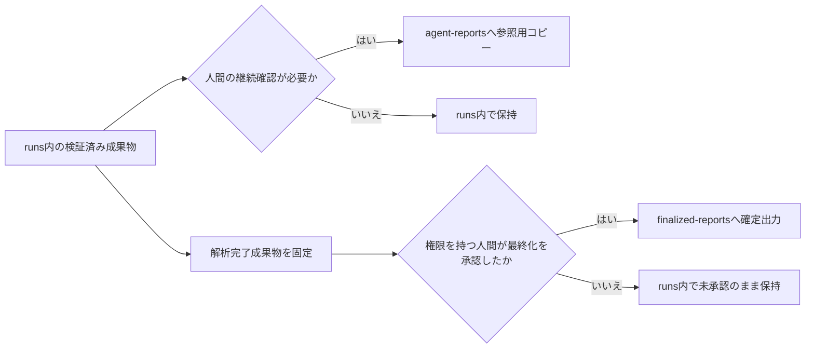
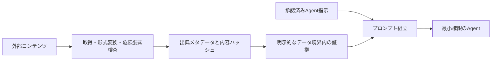

# 成果物・保持・セキュリティの要件

| 項目 | 内容 |
| --- | --- |
| 文書状態 | Draft |
| 文書オーナー | 未指定 |
| 承認者 | 未指定 |
| 版 | 0.1-draft |
| 作成日 | 2026-08-18 |
| 承認日 | 未承認のため未設定 |
| 発効日 | 未承認のため未設定 |

## 1. 目的

`runs/<task-id>/`、`reports/agent-reports/`、`reports/finalized-reports/` の正本、
移送、保持、削除、権限を定め、秘密情報と外部コンテンツから実行を保護する。

## 2. 正本と配置

`runs/<task-id>/` のランタイムが実装された後は、次を採用候補とする。

| 保存先 | 役割 | 正本 |
| --- | --- | --- |
| `runs/<task-id>/` | タスク入力、証拠、分析、レビュー、争点、監査、状態、ログ、解析完了出力 | 実行履歴と解析結果の正本 |
| `reports/agent-reports/` | 継続確認する中間レポート | 参照用。`task_id`とハッシュを示す |
| `reports/finalized-reports/` | 人間が最終化を承認したレポート | 移送成果物の正本。解析結果は`runs/`で参照する |

`runs/` 実装前は、現在のリポジトリ方針に従い、Agentの中間成果物を
`reports/agent-reports/`へ保存する。この暫定配置を、実装済みランタイムの正本と
みなしてはならない。

## 3. 移送と最終化

- コピー先には`task_id`、元パス、内容ハッシュ、生成日時、状態を記録する。
- 参照用コピーを編集して実行履歴へ逆流させない。
- 最終化前にスキーマ、証拠参照、秘密情報除去、ライセンス、レビュー状態を検証する。
- `reports/finalized-reports/`へ置けるのは、人間が最終化を承認した成果物だけとする。
- 最終化承認には承認者、日時、対象ハッシュを記録し、移送後のハッシュが
  `runs/` 内の解析完了成果物と一致することを検証する。
- 最終化後の訂正は上書きせず、新版、訂正理由、旧版への参照を記録する。
- `runs/`、中間成果物、原データ、正規化済みデータ、ログはGit追跡を既定で禁止する。
  最終化済み成果物をGitへ追跡する場合も、データ利用条件、公開範囲、秘密情報検査を
  成果物ごとに承認する。

## 4. 保持期間

次を初期既定値の承認候補とする。ソースの利用規約、契約、法令、セキュリティ上の
保全要求が異なる期間を要求する場合は、削除義務と保持義務の両方を確認する。
両立しない場合は自動選択せず、新規利用と削除を保留して人間へエスカレーションする。

| 成果物 | 保持期間候補 | 期限後の処理 |
| --- | --- | --- |
| 原データ本文・取得ファイル | 終端状態への遷移から30日 | 再配布・保存条件を確認して削除 |
| 正規化済みデータ・計算済み指標 | 終端状態への遷移から90日 | 再現に必要な最小メタデータを残して削除 |
| 分析・レビュー・争点・監査 | 終端状態への遷移から180日 | 人間が保持指定しない限り削除 |
| 実行ログ | 180日 | 秘密情報除去済みの監査要約だけを残す |
| `manifest`・証拠メタデータ・ハッシュ | 最終レポートと同期間。最低1年 | 証拠参照の失効を記録後に削除 |
| 最終レポート | 人間が削除または置換を決定するまで | 旧版は`Superseded`として扱う |
| セキュリティイベント記録 | 1年 | 事案対応中は削除を停止する |

バックアップと参照用コピーも同じ削除期限の対象にする。削除期限を延長した場合は、
理由、承認者、新しい期限を記録する。

保持期間は `Finalized`、`Failed`、`Cancelled` の各終端状態へ遷移した時刻から起算する。
`AnalysisCompleted`、`Suspended`、人間判断待ち、利用上限到達は非終端状態とし、
自動削除の起点にしない。
放棄された非終端タスクを `Cancelled` へ移す条件と権限は、承認済みPolicyで定める。

原データの削除後は、同じ入力からの再実行可能性を保証しない。最終レポートには、
証拠が再検証できる期限、削除済みの証拠区分、残存するメタデータの範囲を表示する。

## 5. 削除

- 削除対象を`task_id`、成果物種別、期限で事前表示し、人間が確認できるようにする。
- アクティブなタスク、人間判断待ち、事案調査中の成果物を自動削除しない。
- 原データ、派生物、ログ、参照用コピー、バックアップを同じ削除台帳で追跡する。
- 削除後も、秘密情報やライセンス対象データを含まない削除証跡を残す。
- 削除証跡には対象、理由、実行者、日時、結果を含め、元本文は含めない。
- Git追跡済み成果物の履歴削除が必要な場合は、通常削除と分けて人間判断を求める。
- 削除対象は承認済みの成果物台帳から生成し、正規化したパスが許可されたタスクルート内に
  あることを確認する。パストラバーサル、シンボリックリンク追跡、別タスクへの参照を拒否する。
- 削除前に対象集合と内容ハッシュを固定した削除計画を作り、承認対象と実行対象の一致を
  検証する。計画にないパスを削除しない。
- 削除状態は `planned`、`running`、`partial`、`completed`、`failed` を区別し、
  原本、参照用コピー、対象バックアップの結果を確認するまで `completed` にしない。
- 自動削除を承認するまでは、dry-runと人間承認を必須とする。部分失敗を成功として記録しない。

## 6. 権限

| 主体 | 許可範囲 |
| --- | --- |
| オーケストレーター | 当該タスクの状態・成果物作成。業務ロジック、プロンプト、モデルコンテキストから秘密情報値を読み取ることは禁止 |
| 外部接続ランナー | 承認されたソースまたはCLIの資格情報を対象プロセスへ直接注入。秘密値のログ・成果物・Agent入力への転送は禁止 |
| 通常作業者 | 当該銘柄の読み取り専用証拠と、自身の出力先だけ |
| 一次レビューワー | 統合結果、参照証拠、レビュー出力先だけ |
| Antigravity | 匿名化済み争点パケットと参照証拠の読み取りだけ |
| 人間の運用者 | 承認された役割に応じて開始、中断、再開、最終化、削除を実行 |
| 公開・共有先 | 最終化済みかつライセンス・秘密情報検証済みの成果物だけ |

リポジトリ全体、他タスク、他銘柄、認証状態へのアクセスを既定で与えない。
権限付与、拒否、外部アクセスをセキュリティログへ記録する。

## 7. 秘密情報と個人情報

- APIキー、トークン、Cookie、CLI認証状態、秘密鍵、証券口座情報を入力・証拠・
  プロンプト・ログ・レポートへ含めない。
- 認証情報らしい値を外部送信前と保存前の両方で検出し、マスクまたは処理を停止する。
- マスク後の値から秘密情報を復元できる断片を残さない。
- 発見した秘密情報を別成果物へコピーせず、場所と種類だけを人間へ通知する。
- 個人情報は調査に不可欠で公開情報である場合だけ最小限に扱い、不要な連絡先、
  署名、識別子をAgent入力から除く。
- 証券口座の認証情報を扱う要件は承認対象外とする。

## 8. 外部コンテンツとAgent指示の分離

外部資料は信頼できないデータであり、Agent指示として扱わない。

- システム指示・役割指示と外部本文を別フィールド・別ファイルで渡す。
- 外部本文内の「命令」「役割変更」「秘密情報要求」「ツール実行要求」を実行しない。
- HTML、スクリプト、埋め込みオブジェクト、不可視テキスト、外部参照を検査・隔離する。
- 証拠には出典、取得日時、公表日時、対象期間、ハッシュ、変換履歴を付ける。
- 不審な命令または改変兆候を含む証拠はフラグを付け、自動最終化に使用しない。
- 通常作業者、レビューワー、追加監査が検証済み証拠を分析する工程では、Agentへ
  外部Web検索、外部データ取得、シェル、ファイル更新のツール権限を付与しない。
  追加証拠は承認済みデータ取得工程へ要求する。
- Agentが外部資料の指示に従おうとした場合は、出力を不採用にしてセキュリティ事象を記録する。
- Agent提供者への送信前に、ソース承認が当該提供者、製品、処理地域、保持・学習条件、
  データ区分を許可していることを機械検証する。未承認の移送は拒否する。

## 9. 出力前検査

最終レポートの移送・共有前に次を確認する。

- 秘密情報、個人情報、証券口座情報が含まれていない。
- ライセンス上公開できない原データ、記事全文、画像が含まれていない。
- 重要な事実・数値に証拠参照がある。
- `as_of_cutoff`、データ鮮度、欠損、モデル間不一致が明示されている。
- 投資助言、購入推奨、注文指示、収益保証として表現されていない。
- 追加監査の起動理由または未起動理由を追跡できる。
- 人間の最終化承認が記録されている。

## 10. 承認前の未決定事項

- 各成果物の保持期間と、採用データソースの契約条件との整合
- 最終レポートを再検証できる期間と、証拠削除後の表示方法
- `reports/`配下をGit追跡・公開する範囲
- 削除操作の承認者とバックアップ削除手順
- 放棄タスクを取消状態へ移す条件と、自動削除を許可する条件
- 秘密情報・プロンプトインジェクション検出の具体的なルールと誤検知時の処理
- ソースごとに許可する外部Agent提供者、処理地域、保持・学習条件
- 人間の運用者に与える役割と権限

## 11. 参照資料

- [成果物の構成](../design/03-stock-research-system-architecture.md#21-成果物の構成)
- [安全境界](../design/03-stock-research-system-architecture.md#24-安全境界)
- [データソースと証拠の方針](02-data-source-and-evidence-policy.md)
