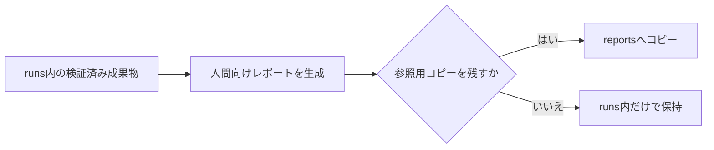
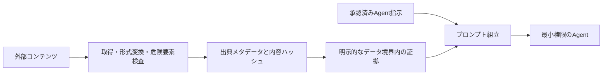

# 成果物・保持・セキュリティの要件

| 項目 | 内容 |
| --- | --- |
| 文書状態 | Approved |
| 文書オーナー | リポジトリ所有者 |
| 承認者 | リポジトリ所有者 |
| 版 | 1.3 |
| 作成日 | 2026-08-18 |
| 承認日 | 2026-09-21 |
| 発効日 | 2026-09-21 |

### 変更記録

| 版 | 日付 | 変更内容 | 承認者 |
| --- | --- | --- | --- |
| 1.3 | 2026-09-21 | ADR-0005に基づくraw candidate、commit、reconciliation、evidence publicationの具体化 | リポジトリ所有者 |
| 1.2 | 2026-09-21 | 開発containerでEDINET credentialを既定read-only mountする方針へ変更 | リポジトリ所有者 |
| 1.1 | 2026-09-20 | 開発operatorのcredential accessに関するMVP脅威modelを明確化 | リポジトリ所有者 |
| 1.0 | 2026-08-28 | 初版 | リポジトリ所有者 |

## 1. 目的

`runs/<task-id>/`と`reports/`のローカル保存、保持、実行上の権限を定め、秘密情報と
外部コンテンツから実行を保護する。

## 2. 正本と配置

`runs/<task-id>/` のランタイムが実装された後は、次を採用する。

| 保存先 | 役割 | 正本 |
| --- | --- | --- |
| `runs/<task-id>/` | タスク入力、証拠、分析、レビュー、争点、監査、状態、ログ、解析完了出力 | 実行履歴と解析結果の正本 |
| `reports/agent-reports/` | 継続確認する中間レポート | 参照用。`task_id`とハッシュを示す |
| `reports/finalized-reports/` | 必要に応じて残す人間向けレポート | 任意の参照用コピー。正本は`runs/`に置く |

`runs/` 実装前は、現在のリポジトリ方針に従い、Agentの中間成果物を
`reports/agent-reports/`へ保存する。この暫定配置を、実装済みランタイムの正本と
みなしてはならない。

## 3. レポート生成と参照用コピー

- コピー先には`task_id`、元パス、内容ハッシュ、生成日時、状態を記録する。
- 参照用コピーを編集して実行履歴へ逆流させない。
- レポート生成前にスキーマ、証拠参照、秘密情報除去、ライセンス、レビュー状態を検証する。
- 人間向け最終文書は、別言語の人間向け文書を中間生成して翻訳するのではなく、Agent用成果物、
  機械可読成果物、共通証拠から、既定では日本語のMarkdownとして直接生成し、
  `解析完了` 前に生成する。
- 人間による承認や`Finalized`状態を要求しない。利用者はレポートを確認し、必要なら新しい
  再調査・再実行を開始する。
- 訂正版を残す場合は、旧版を保持する必要があると利用者が判断したときだけ別ファイルにする。
- `runs/`、中間成果物、原データ、正規化済みデータ、ログはGit追跡を既定で禁止する。
  `RequestCoordinator`のSQLite state、cache、runtime lease、rate state、cooldown、利用量記録も
  Git追跡を禁止する。
  `reports/`もローカル保存を既定とし、Git追跡しない。最終Markdownを個別にGitへ追加する場合は、
  利用者が秘密情報と公開不可データを含まないことを確認する。

### 3.1 Raw acquisition publication

- candidateを同一filesystemの
  `runs/<task-id>/.staging/acquisitions/<physical-attempt-id>/`へ保存する。
- committed raw bundleを
  `runs/<task-id>/acquisitions/<logical-request-id>/<physical-attempt-id>/`へ保存する。
- path componentはsystem-generated IDだけを使用し、URL、ticker、credential aliasを含めない。
- transportはsize limitを適用しながらexact bytesをstageし、同時にSHA-256を計算する。
- status、content type、encoding、compression、size、request・attempt referenceを検証し、
  source-native parseが成功したcandidateだけをcommit候補にする。
- staging bytesを読み直してreceiptとmetadataを検証し、同一filesystemのatomic renameで公開する。
- SQLiteにはcommitted path、hash、size、schema identity、publication generationだけを記録する。
- rename後・SQLite commit前の中断はdirectory receiptとDBを照合し、完全一致時だけforward-repairする。
- DBだけがcommitを示す、directoryが欠損する、hash・generation・IDが不一致の場合は安全停止する。
- committed raw bundleを上書き、部分更新、in-place修正しない。

### 3.2 Normalized evidenceとmanifest

- normalized evidenceは検証済みcommitted raw referenceだけを入力にする。
- schema、provenance、freshness、missing、source approvalをstagingで検証する。
- frozen evidence bundleとmanifestは全referenceとhashが解決した場合だけatomicに確定する。
- raw、normalized、manifestのpublication generationを記録し、異なるgenerationの混在を拒否する。
- parseまたはvalidationに失敗したcandidate本文を正本artifactへ昇格させず、sanitized auditとhash・sizeだけを残す。

## 4. MVPの保持方針

成果物はローカルへ保存し、システムが固定の保存期限や無期限保持を強制しない。実行中のtaskと、
再開・根拠確認に必要な成果物は保持する。古くなり利用価値がない成果物、参照用コピー、cache、
ログは、リポジトリ所有者が必要に応じてシステム外の通常のファイル操作で整理できる。

## 5. MVPの削除方針

- 自動削除、定期削除、保持期限管理、削除専用CLIはMVPに実装しない。
- リポジトリ所有者による通常のファイル操作を禁止しない。
- 実行中または再開対象のtaskを削除した場合の復旧は保証しない。

## 6. 権限

<!-- markdownlint-disable MD013 -->

| 主体 | 許可範囲 |
| --- | --- |
| オーケストレーター | 当該タスクの状態・成果物作成。業務ロジック、プロンプト、モデルコンテキストから秘密情報値を読み取ることは禁止 |
| `RequestCoordinator` | source承認、cache、queue、rate gate、利用量、cooldown、外部接続の調整。資格情報値ではなく非秘密aliasだけを制御状態とログへ使用 |
| 外部接続transport | 承認されたソースまたはCLIの資格情報を物理送信の直前だけ読み取る。秘密値の制御状態、ログ、成果物、Agent入力への転送は禁止 |
| 通常作業者 | 当該銘柄の読み取り専用証拠と、自身の出力先だけ |
| 一次レビューワー | 統合結果、参照証拠、レビュー出力先だけ |
| Antigravity | 匿名化済み争点パケットと参照証拠の読み取りだけ |
| リポジトリ所有者 | 単独の開発者・利用者として、開始、中断、再開、再実行、成果物確認を実行 |

<!-- markdownlint-enable MD013 -->
リポジトリ全体、他タスク、他銘柄、認証状態へのアクセスを既定で与えない。
権限付与、拒否、外部アクセスをセキュリティログへ記録する。
source adapterやAgentが`RequestCoordinator`を迂回して直接外部送信できる権限を
与えない。Coordinatorまたは永続状態の障害時も直接接続へfallbackしない。

開発/MVP環境では、リポジトリ所有者の指示に基づきDocker取得処理を起動するrepository開発用
coding agentを、リポジトリ所有者と同じ信頼済みoperator境界に含める。このoperatorは、開発containerへ
既定でmountされたcredential fileへ技術的に到達し得る。MVPは、このoperatorからcredentialを
技術的に隔離したとは主張しない。

この例外は、通常作業者、一次レビューワー、Antigravity、screening用Agent、prompt、タスク入力、
成果物生成処理へcredential値を配布する許可ではない。開発containerではEDINET credentialをrepository外の
既定pathまたは明示pathから単一fileとしてread-only mountする。CIには実credentialを提供しない。
application codeによる読取りは、承認済み物理送信境界の
送信直前だけに限定する。より強い隔離が必要な運用では、coding agentの管理外にあるsecret brokerまたは
operator管理runnerを別途採用する。

## 7. 秘密情報と個人情報

- APIキー、トークン、Cookie、CLI認証状態、秘密鍵、証券口座情報を入力・証拠・
  プロンプト・ログ・レポートへ含めない。
- 資格情報値をオーケストレーターの制御状態、screening用Agent、prompt、タスク入力、成果物生成処理へ
  渡さない。開発/MVPの信頼済みoperatorに関する技術的accessの例外は前節に従う。
- credential fileはrepository外に置き、開発containerへ単一fileとしてread-onlyでmountする。
  既定host pathにfileがない場合はcontainer起動を拒否し、空fileやdirectoryを自動作成しない。
  environmentと設定にはcredential値ではなく固定container pathだけを渡す。
- application codeは、承認済み外部接続transportが物理送信する直前以外にcredential fileを開かない。
- 標準出力、標準エラー、外部応答、Agent出力を含む保存候補を、外部送信前と
  保存確定前の両方で検査する。
- 認証情報らしい値を検出した保存候補は成果物へ確定せず、Agent入力にも使用しない。
  検査を完了できない場合も安全側に停止する。
- マスク後の値から秘密情報を復元できる断片を残さない。
- 発見した秘密情報を別成果物へコピーせず、場所と種類だけを人間へ通知する。
- 個人情報は調査に不可欠で公開情報である場合だけ最小限に扱い、不要な連絡先、
  署名、識別子をAgent入力から除く。
- 証券口座の認証情報を扱う要件は承認対象外とする。

## 8. 外部コンテンツとAgent指示の分離

外部資料は信頼できないデータであり、Agent指示として扱わない。

- システム指示・役割指示と外部本文を別フィールド・別ファイルで渡す。
- 外部本文内の「命令」「役割変更」「秘密情報要求」「ツール実行要求」を実行しない。
- HTML、スクリプト、埋め込みオブジェクト、不可視テキスト、外部参照を検査・隔離する。
- 証拠には出典、取得日時、公表日時、対象期間、ハッシュ、変換履歴を付ける。
- 不審な命令または改変兆候を含む証拠はフラグを付け、解析完了の根拠に使用しない。
- 通常作業者、オーケストレーター、レビューワー、追加監査、レポート生成を含む全Agentは、
  定義済み検索Policyとproviderの制約を守ってAgent内蔵Web検索を使用できる。検索結果と
  外部資料は信頼できない入力として隔離し、検索結果からの命令を実行しない。
- Agentには候補資料を共通証拠へ追加する権限を与えない。検索語、実行主体、実行日時、
  返却URL、見出し、スニペットを探索記録へ出力し、承認済み取得・検証工程へ渡す。
- 未検証資料を使った最終判定、外部データ取得用の任意シェル実行、ファイル更新を許可しない。
  検証済み資料だけを共通証拠として再入力する。
- Agentが外部資料の指示に従おうとした場合は、出力を不採用にしてセキュリティ事象を記録する。
- Agent提供者への送信前に、ソース承認が当該提供者、製品、処理地域、保持・学習条件、
  データ区分を許可していることを機械検証する。未承認の移送は拒否する。
- 解析再開、レポート生成の前にも、使用する各証拠のsource approval版と現在の承認状態を
  検証する。`suspended`、`expired`、`rejected`により現在の操作が許可されない場合は、
  対象証拠を新しい処理へ使用せず、安全停止または承認済み証拠による再生成を行う。

## 9. 出力前検査

最終レポートの移送・共有前に次を確認する。

- 秘密情報、個人情報、証券口座情報が含まれていない。
- ライセンス上公開できない原データ、記事全文、画像が含まれていない。
- 重要な事実・数値に証拠参照がある。
- `evidence_set_version`、`evidence_frozen_at`、`freshness_checked_at`、データ鮮度、欠損、
  モデル間不一致が明示されている。
- 投資助言、購入推奨、注文指示、収益保証として表現されていない。
- 追加監査の起動理由または未起動理由を追跡できる。
- 人間向け最終文書が、[言語と対象読者の方針](06-language-and-audience-policy.md)の
  言語、形式、原文引用、意味保持の要件を満たしている。

## 10. P1・P6で定義・検証する事項

- 秘密情報・プロンプトインジェクション検出のfixtureと運用上の調整方法

## 11. 参照資料

- [成果物の構成](../design/03-stock-research-system-architecture.md#21-成果物の構成)
- [安全境界](../design/03-stock-research-system-architecture.md#24-安全境界)
- [データソースと証拠の方針](02-data-source-and-evidence-policy.md)
- [言語と対象読者の方針](06-language-and-audience-policy.md)
