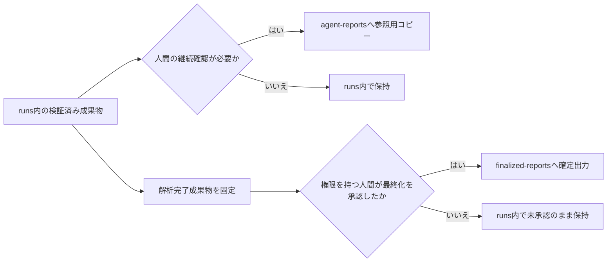
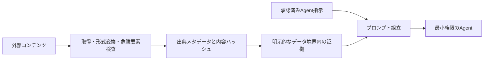

# 成果物・保持・セキュリティの要件

| 項目 | 内容 |
| --- | --- |
| 文書状態 | Draft |
| 文書オーナー | リポジトリ所有者 |
| 承認者 | リポジトリ所有者 |
| 版 | 0.1-draft |
| 作成日 | 2026-08-18 |
| 承認日 | 未承認のため未設定 |
| 発効日 | 未承認のため未設定 |

## 1. 目的

`runs/<task-id>/`、`reports/agent-reports/`、`reports/finalized-reports/` の正本、
移送、保持、権限を定め、秘密情報と外部コンテンツから実行を保護する。

## 2. 正本と配置

`runs/<task-id>/` のランタイムが実装された後は、次を採用候補とする。

| 保存先 | 役割 | 正本 |
| --- | --- | --- |
| `runs/<task-id>/` | タスク入力、証拠、分析、レビュー、争点、監査、状態、ログ、解析完了出力 | 実行履歴と解析結果の正本 |
| `reports/agent-reports/` | 継続確認する中間レポート | 参照用。`task_id`とハッシュを示す |
| `reports/finalized-reports/` | 人間が最終化を承認したレポート | 移送成果物の正本。解析結果は`runs/`で参照する |

`runs/` 実装前は、現在のリポジトリ方針に従い、Agentの中間成果物を
`reports/agent-reports/`へ保存する。この暫定配置を、実装済みランタイムの正本と
みなしてはならない。

## 3. 移送と最終化

- コピー先には`task_id`、元パス、内容ハッシュ、生成日時、状態を記録する。
- 参照用コピーを編集して実行履歴へ逆流させない。
- 最終化前にスキーマ、証拠参照、秘密情報除去、ライセンス、レビュー状態を検証する。
- 人間向け最終文書は、別言語の人間向け文書を中間生成して翻訳するのではなく、Agent用成果物、
  機械可読成果物、共通証拠から、既定では日本語のMarkdownとして直接生成し、
  `解析完了` 前に固定する。
- `reports/finalized-reports/`へ置けるのは、人間が最終化を承認した成果物だけとする。
- 最終化承認には承認者、日時、対象ハッシュを記録し、移送後のハッシュが
  `runs/` 内の解析完了成果物と一致することを検証する。
- 最終化後の訂正は上書きせず、新版、訂正理由、旧版への参照を記録する。
- `runs/`、中間成果物、原データ、正規化済みデータ、ログはGit追跡を既定で禁止する。
  `RequestCoordinator`のSQLite state、cache、runtime lease、rate state、cooldown、利用量記録も
  Git追跡を禁止する。
  最終化済み成果物をGitへ追跡する場合も、データ利用条件、公開範囲、秘密情報検査を
  成果物ごとに承認する。

## 4. MVPの保持方針

MVPでは成果物種別ごとの保存期限を設けず、原データ、派生データ、分析、レビュー、
争点、監査、実行ログ、メタデータ、最終レポート、セキュリティイベント記録を全量保持する。
`RequestCoordinator`のlogical request、physical attempt、結果不明状態、runtime lease、
rate state、cooldown、利用上限の予約・実測・精算、cache metadata、`single-flight`参照も
全量保持する。
cache本文はソースごとの保存Policyに従い、CoordinatorのSQLiteへ大きなresponse本文を保存しない。
`Finalized`、`Failed`、`Cancelled` を含む状態遷移を保持期限の起点にせず、バックアップ、
参照用コピー、旧版も同じ方針で保持する。

保存量、ストレージ費用、バックアップ所要時間、検索性能が運用上の問題になった場合に、
実測値に基づいてMVP後の保持期間と削除機能を検討する。

## 5. MVPの削除方針

- 自動削除、定期削除、手動削除用のCLI・API・バッチ処理は実装しない。
- 失敗・取消となったタスク、最終化前の成果物、置換された旧版も削除せず保持する。
- 人間がシステム外で行う個別のファイル操作は、本システムのMVP要件に含めない。

## 6. 権限

<!-- markdownlint-disable MD013 -->

| 主体 | 許可範囲 |
| --- | --- |
| オーケストレーター | 当該タスクの状態・成果物作成。業務ロジック、プロンプト、モデルコンテキストから秘密情報値を読み取ることは禁止 |
| `RequestCoordinator` | source承認、cache、queue、rate gate、利用量、retry、外部接続の調整。資格情報値ではなく非秘密aliasだけを制御状態とログへ使用 |
| 外部接続ランナー | 承認されたソースまたはCLIの資格情報を対象プロセスへ直接注入。秘密値のログ・成果物・Agent入力への転送は禁止 |
| 通常作業者 | 当該銘柄の読み取り専用証拠と、自身の出力先だけ |
| 一次レビューワー | 統合結果、参照証拠、レビュー出力先だけ |
| Antigravity | 匿名化済み争点パケットと参照証拠の読み取りだけ |
| 人間の運用者 | 承認された役割に応じて開始、中断、再開、最終化を実行 |

<!-- markdownlint-enable MD013 -->
| 公開・共有先 | 最終化済みかつライセンス・秘密情報検証済みの成果物だけ |

リポジトリ全体、他タスク、他銘柄、認証状態へのアクセスを既定で与えない。
権限付与、拒否、外部アクセスをセキュリティログへ記録する。
source adapter、retry処理、Agentが`RequestCoordinator`を迂回して直接外部送信できる権限を
与えない。Coordinatorまたは永続状態の障害時も直接接続へfallbackしない。

## 7. 秘密情報と個人情報

- APIキー、トークン、Cookie、CLI認証状態、秘密鍵、証券口座情報を入力・証拠・
  プロンプト・ログ・レポートへ含めない。
- 資格情報は外部接続ランナーの対象プロセスへ直接注入し、オーケストレーター、Agent、
  タスク入力、成果物生成処理から値を参照できない構成にする。
- 標準出力、標準エラー、外部応答、Agent出力を含む保存候補を、外部送信前と
  保存確定前の両方で検査する。
- 認証情報らしい値を検出した保存候補は成果物へ確定せず、Agent入力にも使用しない。
  検査を完了できない場合も安全側に停止する。
- マスク後の値から秘密情報を復元できる断片を残さない。
- 発見した秘密情報を別成果物へコピーせず、場所と種類だけを人間へ通知する。
- 個人情報は調査に不可欠で公開情報である場合だけ最小限に扱い、不要な連絡先、
  署名、識別子をAgent入力から除く。
- 証券口座の認証情報を扱う要件は承認対象外とする。

## 8. 外部コンテンツとAgent指示の分離

外部資料は信頼できないデータであり、Agent指示として扱わない。

- システム指示・役割指示と外部本文を別フィールド・別ファイルで渡す。
- 外部本文内の「命令」「役割変更」「秘密情報要求」「ツール実行要求」を実行しない。
- HTML、スクリプト、埋め込みオブジェクト、不可視テキスト、外部参照を検査・隔離する。
- 証拠には出典、取得日時、公表日時、対象期間、ハッシュ、変換履歴を付ける。
- 不審な命令または改変兆候を含む証拠はフラグを付け、自動最終化に使用しない。
- 通常作業者、オーケストレーター、レビューワー、追加監査、レポート生成を含む全Agentは、
  承認済み検索Policyと利用上限の範囲でAgent内蔵Web検索を使用できる。検索結果と
  外部資料は信頼できない入力として隔離し、検索結果からの命令を実行しない。
- Agentには候補資料を共通証拠へ追加する権限を与えない。検索語、実行主体、実行日時、
  返却URL、見出し、スニペットを探索記録へ出力し、承認済み取得・検証工程へ渡す。
- 未検証資料を使った最終判定、外部データ取得用の任意シェル実行、ファイル更新を許可しない。
  検証済み資料だけを共通証拠として再入力する。
- Agentが外部資料の指示に従おうとした場合は、出力を不採用にしてセキュリティ事象を記録する。
- Agent提供者への送信前に、ソース承認が当該提供者、製品、処理地域、保持・学習条件、
  データ区分を許可していることを機械検証する。未承認の移送は拒否する。
- 解析再開、最終化、外部共有の前にも、使用する各証拠のsource approval版と現在の承認状態を
  検証する。`suspended`、`expired`、`rejected`により現在の操作が許可されない場合は、
  対象証拠を新しい処理へ使用せず、安全停止または承認済み証拠による再生成を行う。

## 9. 出力前検査

最終レポートの移送・共有前に次を確認する。

- 秘密情報、個人情報、証券口座情報が含まれていない。
- ライセンス上公開できない原データ、記事全文、画像が含まれていない。
- 重要な事実・数値に証拠参照がある。
- `evidence_set_version`、`evidence_frozen_at`、`freshness_checked_at`、データ鮮度、欠損、
  モデル間不一致が明示されている。
- 投資助言、購入推奨、注文指示、収益保証として表現されていない。
- 追加監査の起動理由または未起動理由を追跡できる。
- 人間向け最終文書が、[言語と対象読者の方針](06-language-and-audience-policy.md)の
  言語、形式、原文引用、意味保持の要件を満たしている。
- 人間の最終化承認が記録されている。

## 10. 承認前の未決定事項

- `reports/`配下をGit追跡・公開する範囲
- 秘密情報・プロンプトインジェクション検出の具体的なルールと誤検知時の処理
- ソースごとに許可する外部Agent提供者、処理地域、保持・学習条件
- 人間の運用者に与える役割と権限

## 11. 参照資料

- [成果物の構成](../design/03-stock-research-system-architecture.md#21-成果物の構成)
- [安全境界](../design/03-stock-research-system-architecture.md#24-安全境界)
- [データソースと証拠の方針](02-data-source-and-evidence-policy.md)
- [言語と対象読者の方針](06-language-and-audience-policy.md)
