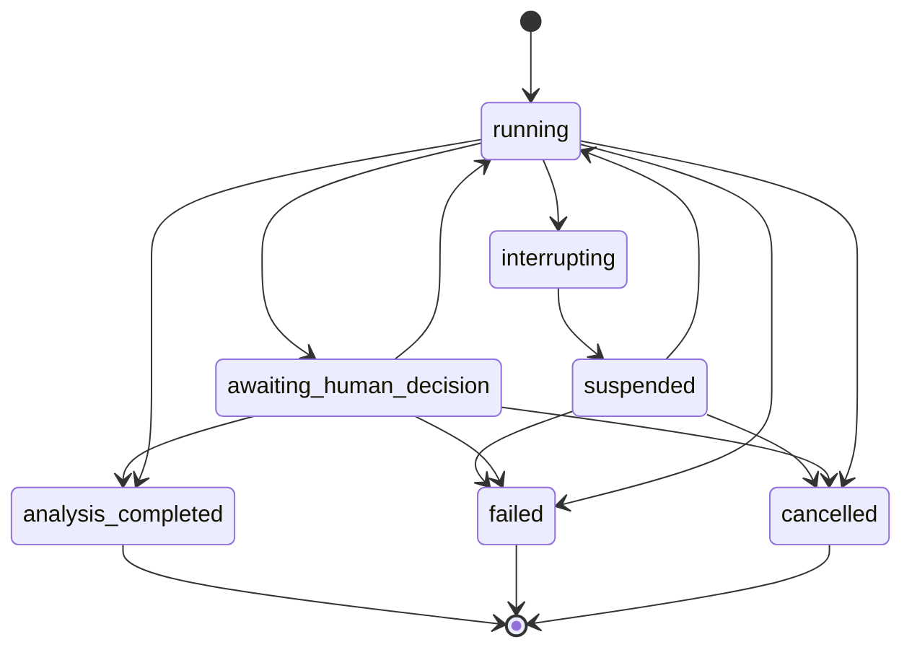

# 詳細解析契約カタログ

| 項目 | 内容 |
| --- | --- |
| 文書状態 | Approved |
| 文書オーナー | リポジトリ所有者 |
| 承認者 | リポジトリ所有者 |
| 版 | 1.0 |
| 作成日 | 2026-09-05 |
| 承認日 | 2026-09-11 |
| 発効日 | 2026-09-11 |
| 対象 | 詳細解析MVPのP1契約 |

> [!IMPORTANT]
> 本文書はP1実装の根拠として承認済みである。ただし、対応するmodel、生成schema、
> fixtureおよび検証結果が揃うまでは、
> 各TODOを完了扱いにしない。

## 1. 目的

詳細解析MVPで交換または保存する機械可読成果物について、公開契約の全一覧、配置、命名、
producer、consumer、識別子の一意性範囲、状態、検証エラー、テンプレートおよび完了証拠を定める。

本文書はartifact単位のカタログを正本とし、各fieldの型と制約は版付きPydantic model、
生成JSON Schemaおよび対応fixtureで定義する。同じfield定義を本文へ複製しない。

## 2. 適用原則

- 契約定義の正本は版付きPydantic modelとする。
- Agentへの提示、他processとの交換および保存には、Pydanticから生成したJSON Schemaと
  検証済みJSONを使う。
- 人間が編集する設定は安全なYAMLとして読み込み、JSON互換値へ変換してから同じ契約で検証する。
- 人間向けMarkdownは検証済みJSONと版付きtemplateから生成し、新しい事実、評価、証拠または
  推奨を追加しない。
- 未知field、暗黙の型変換、暗黙の版変換、自動migrationおよび未対応版を拒否する。
- 公開済みの契約版を上書きしない。意味または検証規則を変更する場合は新しい
  `schema_version`を追加する。
- 外部条件または実測が必要な値は推測せず、未確認を表す契約値または無効状態を使う。
- このカタログに記載する成果物と処理は、実装・検証が完了するまで計画上の定義として扱う。

## 3. フェーズ間の責務

<!-- markdownlint-disable MD013 -->

| フェーズ | 所有する成果物・処理 | 所有しないもの |
| --- | --- | --- |
| P1 | Pydantic契約、生成JSON Schema、validation interface、参照renderer、合成fixture、Policy、Agent指示、完了証拠 | 実データ取得、Agent CLI実行、運用CLI、保存運用 |
| P2 | 最小product CLI、共通config・error・log初期化、一般test・CI基盤 | P1契約の再定義 |
| P3 | P1契約を使う実データ取得、正規化、計算、証拠instance生成、保存 | 独自の証拠fieldまたはschema |
| P4 | P1契約を使うadapter、orchestration、状態遷移の実行、prompt合成・配布、review・audit実行 | 独自のAgent入出力または状態契約 |
| P5 | P1契約と参照rendererの運用統合、正確なCLI command、認証mount・注入、表示、保存、log、運用guide | template、最終JSON、意味的一致規則の再定義 |
| P6 | fixture E2E、実CLI smoke、security・injectionの運用検証、時間・費用・品質・使いやすさの受入評価 | P1契約の無審査変更 |

<!-- markdownlint-enable MD013 -->

### 3.1 P1とP5の境界

<!-- markdownlint-disable MD013 -->

| 関心事 | P1 | P5 |
| --- | --- | --- |
| 最終JSON | field、制約、版、参照、fixtureを定義する | 実行結果からinstanceを生成して保存する |
| Markdown | template、必須section、純粋な参照renderer、意味的一致規則を定義する | rendererを運用フローへ接続し、表示・保存する |
| CLI | 論理operationのrequest・result契約を定義する | command、引数、終了code、状態表示を実装する |
| 認証 | 秘密値を持たない`credential_alias`とpermission契約を定義する | 認証状態のmount・注入・preflightを実装する |
| 保存 | artifact参照、hash、manifest上の配置情報を定義する | `runs/`と`reports/`への確定・表示・整理を実装する |
| ログ | 機械可読eventと秘密情報除去規則を定義する | 実行ログを分離・出力・保存する |

<!-- markdownlint-enable MD013 -->

P3からP6でfield不足が判明した場合は独自表現を追加せず、新しいP1契約版を提案する。

## 4. 配置と命名

```text
src/stock_research_llm_orchestrator/
  contracts/
    base.py
    errors.py
    registry.py
    schema_generation.py
    validation/
    detailed_analysis/v1/
schemas/detailed-analysis/v1/
templates/detailed-analysis/v1/
config/policies/<policy-name>/v1.yaml
config/market-profiles/xtks/v1.yaml
config/source-approvals/<source-name>/v1.yaml
config/source-profiles/<source-name>/v1.yaml
tests/contracts/
tests/fixtures/contracts/detailed-analysis/v1/
agent-sources/detailed-analysis/v1/
```

命名規則は次のとおりとする。

- `schema_id`: `detailed-analysis.<artifact-name>`。versionを含めない永続識別子とする。
- `schema_version`: 正の整数。初期版は`1`とする。
- registry key: `(schema_id, schema_version)`。重複登録を起動時に拒否する。
- Python class: `DetailedAnalysisTaskV1`のようなPascalCaseとversion suffixを使う。
- Python module: snake_caseを使う。
- JSON Schema: `<artifact-name>.schema.json`のkebab-caseを使う。
- fixture: `<case-id>.json`とし、`valid/`と`invalid/<error-code>/`へ分ける。
- Policy: `<policy-name>/v1.yaml`とする。
- Agent指示: kebab-caseのMarkdownとし、合成定義を`instruction-set.json`に置く。
- Markdown template: `<document-name>.md.j2`とする。

生成JSON Schemaは手編集しない。生成処理はUTF-8、LF、安定したkey順、末尾改行を使用し、
再生成差分をcheckできるようにする。

## 5. 公開schema inventory

次を初期v1の公開top-level schemaの全一覧とする。nested modelは単独公開せず、外部consumerが
必要になった場合はカタログを改訂して公開契約へ追加する。

<!-- markdownlint-disable MD013 -->

| schema file | 主なproducer | 主なconsumer | 主な規範文書 |
| --- | --- | --- | --- |
| `detailed-analysis-task.schema.json` | CLI受付 | orchestrator、全Agent、保存層 | `01`、`04`、`07` |
| `evidence-set.schema.json` | data preparation | orchestrator、全Agent、reviewer | `02`、`07` |
| `research-context.schema.json` | orchestrator | worker、reviewer、auditor | `02`、`03` |
| `search-record.schema.json` | Web探索を行うAgent | orchestrator、data preparation、監査ログ | `02`、`03` |
| `common-evidence-update.schema.json` | data preparation | orchestrator、両worker | `02`、`03` |
| `agent-execution.schema.json` | AgentAdapter、SessionRunner | orchestrator、manifest、運用表示 | `04`、`08` |
| `worker-analysis.schema.json` | Codex・Claude worker | orchestrator、reviewer | `01`、`03` |
| `synthesis-result.schema.json` | orchestrator | reviewer、report generator | `03` |
| `primary-review.schema.json` | primary reviewer | orchestrator、worker、report generator | `03`、ADR-0004 |
| `review-response.schema.json` | worker、orchestrator | primary reviewer、dispute builder | `03`、ADR-0004 |
| `dispute.schema.json` | orchestrator | auditor、人間判断、report generator | `03`、ADR-0004 |
| `audit-request.schema.json` | orchestrator | Antigravity adapter | `03`、`08`、ADR-0004 |
| `audit-result.schema.json` | Antigravity adapter | orchestrator、reviewer、人間判断 | `03`、ADR-0004 |
| `human-decision.schema.json` | repository owner | orchestrator、manifest、report generator | `03`、`04` |
| `execution-manifest.schema.json` | orchestrator | CLI、保存層、監査 | `04`、`05`、`08` |
| `external-request-event.schema.json` | RequestCoordinator | orchestrator、監査ログ、運用計測 | `02`、`04`、ADR-0001 |
| `final-analysis-result.schema.json` | orchestrator | renderer、保存層、CLI | `01`、`03`、`06`、`07` |
| `validation-error.schema.json` | validation wrapper | 全consumer、CLI、監査ログ | `07`、ADR-0002 |
| `instruction-application.schema.json` | prompt composer | manifest、orchestrator、監査 | `05`、`08` |
| `operation-request.schema.json` | CLI | operation service、監査ログ | `04` |
| `operation-result.schema.json` | operation service | CLI、manifest、監査ログ | `04` |
| `detailed-analysis-policy.schema.json` | repository owner | orchestrator、全validator | `01`、`03` |
| `review-audit-policy.schema.json` | repository owner | reviewer、orchestrator、audit gate | `03`、ADR-0004 |
| `session-continuation-policy.schema.json` | repository owner | orchestrator、AgentAdapter | `08`、ADR-0003 |
| `web-research-policy.schema.json` | repository owner | 全Agent、RequestCoordinator | `02`、`03`、`05` |
| `market-profile.schema.json` | repository owner | task validator、data preparation | `01`、`02` |
| `source-approval.schema.json` | repository owner | preflight、RequestCoordinator | `02`、`05` |
| `source-profile.schema.json` | repository owner | RequestCoordinator、source adapter | `02`、`04`、ADR-0001 |

<!-- markdownlint-enable MD013 -->

`01`から`08`は`docs/system-requirements/`の同番号文書を表す。producerとconsumerは設計上の
責務であり、現時点の実装済みcomponentを示さない。

## 6. 識別子と版のscope

<!-- markdownlint-disable MD013 -->

| 識別子 | 一意性と不変条件 |
| --- | --- |
| `task_id` | 1つのrepository runtime内で一意とし、再開、失敗、解析完了後も変更しない |
| `artifact_id` | `task_id`内で一意とし、artifactの内容変更時は新IDを発行する |
| `evidence_id` | `task_id`のmanifest内で一意かつ不変とし、task外参照では`task_id`と組にする |
| `claim_id` | `task_id`内で一意とし、再分析では元IDを維持するか明示した置換関係を持つ |
| `finding_id` | `task_id`内で一意とし、分類または重要度が変わっても同じfindingでは維持する |
| `response_id` | `finding_id`内で一意とし、対象findingと親responseを参照できるようにする |
| `dispute_id` | `task_id`内で一意とし、文面・分類変更、分割・統合で監査制限を迂回しない |
| `audit_id` | repository runtime内で一意とし、1つの`dispute_id`だけを参照する |
| `human_decision_id` | `task_id`内で一意とし、決定の置換は新IDと前決定参照で記録する |
| `agent_run_id` | repository runtime内で一意とし、resumeごとに新IDと親run参照を持つ |
| `logical_session_id` | provider sessionと分離した内部IDとし、task・role・設定をまたいで再利用しない |
| `logical_request_id` | repository runtime内で一意とし、single-flight後もconsumerごとに保持する |
| `physical_attempt_id` | repository runtime内で一意とし、1回の物理送信または開始試行を表す |
| `operation_id` | repository runtime内で一意とし、requestとresultを1対1で対応させる |

<!-- markdownlint-enable MD013 -->

`schema_version`、Policy version、template version、instruction-set version、
`evidence_set_version`およびapplication versionは別々に管理する。参照側は対象のID、契約版、
内容hashを保持し、同名の最新版へ暗黙追従しない。

## 7. 状態契約

### 7.1 task execution state

初期v1は次の状態を使用し、`Finalized`は設けない。

- `running`
- `interrupting`
- `suspended`
- `awaiting_human_decision`
- `analysis_completed`
- `failed`
- `cancelled`

許可するtask-level遷移は次のとおりとする。workflow内の再調査、review、auditなどのstage遷移と、
task全体の実行状態を混同しない。



`analysis_completed`は解析成果物の生成完了であり、人間による投資判断、承認または推奨を意味しない。
`failed`と`cancelled`から同じtaskを自動再開せず、新しい操作と明示的な履歴関係を必要とする。

### 7.2 findingと監査の状態

- finding classification: `factual_error`、`insufficient_evidence`、
  `schema_or_format_error`、`policy_application_difference`、`logical_gap`、
  `future_hypothesis_difference`、`risk_materiality_difference`、`style_or_expression`
- finding lifecycle: `open`、`response_submitted`、`re_review_required`、`resolved`、
  `disputed`、`human_decision_required`
- classification pending: `classification_pending`は終端分類ではなく、review合格、監査起動、
  `analysis_completed`を禁止する一時状態とする。
- audit execution result: `invalid_output`、`execution_failed`、`cancelled`は監査意見から分離する。
- audit opinion: `support_interpretation_1`、`support_interpretation_2`、`support_neither`、
  `indeterminate_more_evidence_possible`、`indeterminate_no_more_evidence`、
  `human_judgment_required`を使用する。

同一`dispute_id`の有効な論理監査は1回だけとする。失敗、空出力または無効出力は論理監査に
数えず、自動再試行もしない。異なる争点数と監査session数にはシステム独自の固定上限を設けない。

## 8. 検証エラーカタログ

`validation-error`の`category`は次の6値とする。

- `schema`
- `semantic`
- `reference`
- `state_transition`
- `policy`
- `security`

初期v1の安定した`code`は次のとおりとする。

<!-- markdownlint-disable MD013 -->

| category | code | 意味 |
| --- | --- | --- |
| `schema` | `invalid_json` | JSONをparseできない |
| `schema` | `unsafe_yaml` | custom tag、alias制約違反または安全でないYAML構造がある |
| `schema` | `duplicate_yaml_key` | 同じmapping内に重複keyがある |
| `schema` | `non_json_yaml_value` | JSON互換でないYAML値がある |
| `schema` | `unknown_schema` | `schema_id`がregistryに存在しない |
| `schema` | `unsupported_schema_version` | `schema_version`を実装が扱えない |
| `schema` | `required_field_missing` | 必須fieldがない |
| `schema` | `type_mismatch` | strict modeで要求型と一致しない |
| `schema` | `unknown_field` | 契約にないfieldがある |
| `schema` | `constraint_violation` | 値域、形式または成果物内制約に違反する |
| `semantic` | `artifact_conflict` | 複数成果物の意味が矛盾する |
| `semantic` | `markdown_mismatch` | Markdownと機械可読成果物の重要項目が一致しない |
| `reference` | `reference_not_found` | 参照対象が存在しない |
| `reference` | `reference_type_mismatch` | 参照対象のartifact種別が一致しない |
| `reference` | `reference_version_mismatch` | 参照した契約版または成果物版が一致しない |
| `state_transition` | `transition_not_allowed` | 現状態から次状態への遷移が禁止されている |
| `state_transition` | `checkpoint_invalid` | 再開点の入力、版、hashまたは成果物が整合しない |
| `policy` | `policy_not_found` | 指定したPolicyを取得できない |
| `policy` | `policy_version_mismatch` | 適用対象とPolicy版が一致しない |
| `policy` | `policy_violation` | 検証可能なPolicy条件へ違反する |
| `security` | `secret_material_detected` | 秘密情報またはその禁止表現を検出した |
| `security` | `external_instruction_detected` | 外部資料の指示をAgent指示として混入させた |
| `security` | `permission_scope_violation` | roleへ許可していない権限または外部移送を要求した |

<!-- markdownlint-enable MD013 -->

library固有の例外型とmessageは公開分岐条件にしない。wrapperは該当するcategoryとcodeへ変換し、
instance path、取得可能なschema path、対象artifactおよび秘密情報を含まないcontextを返す。

## 9. Policy、templateおよびAgent指示

初期v1では次を版管理する。

- Policy: `detailed-analysis-policy`、`review-audit-policy`、
  `session-continuation-policy`、`web-research-policy`
- profiles: `market-profile`、`source-approval`、`source-profile`
- Markdown template: `final-report.md.j2`、`human-decision-request.md.j2`
- Agent指示: `common.md`、`orchestrator.md`、`codex-worker.md`、`claude-worker.md`、
  `primary-reviewer.md`、`antigravity-auditor.md`、`instruction-set.json`

P1の参照rendererはfilesystem、network、時刻、乱数または外部Agentへアクセスしない純粋処理とし、
同じ検証済みJSONとtemplate versionからbyte単位で同じMarkdownを生成する。P5はこのrendererを
運用へ組み込み、別のrendererまたはtemplateで意味を変更しない。

Agent指示は英語で管理する。`instruction-set.json`は共通指示、role指示、task固有入力の合成順、
各版とhashを定義し、`instruction-application`とmanifestから実際の適用内容を追跡できるようにする。

## 10. 固定上限を設けない範囲

MVPでは時間、token、費用、Web検索、再調査、合議往復、再レビュー、異なる争点数および
監査session数にシステム独自の固定上限を設けない。providerまたは契約プランが課す上限は迂回せず、
到達時は中間成果物と未解決事項を保存して安全停止する。

次は別概念であり、この方針から除外しない。

- 人間が確認できる量に抑えるための最終候補数上限
- 外部sourceを保護するrate、burst、concurrency、cooldown
- providerまたは契約プランが課す利用上限
- 人間向けレポート量の目安
- 初期運用の実測後に別途承認して導入し得る進捗判定または制約
- 同一争点につき有効な論理監査1回というADR-0004のPolicy制約

## 11. P1 TODO完了証拠

文書承認だけではTODOを完了にしない。各項目について、model、生成schema、正常・異常fixture、
自動test、producer・consumer、識別子scope、versionおよびmanifest追跡を確認する。

<!-- markdownlint-disable MD013 -->

| # | P1項目 | 主な成果物 | 追加の完了証拠 |
| ---: | --- | --- | --- |
| 1 | 詳細解析task | `task.py`、task schema | 市場、時刻、Policy、制約、既定期間、任意cutoff拒否test |
| 2 | evidence set lifecycle | `evidence.py`、`runtime.py` | 時刻順序、鮮度、material更新による無効化test |
| 3 | 銘柄情報 | `task.py` | 識別子、市場、名称、通貨、sector fixture |
| 4 | 証拠4層とprovenance | `evidence.py` | 層分離、hash、版、参照test |
| 5 | `research_context` | `research.py` | 共通証拠とsource metadataを含み相手の暫定結論を含まないfixture |
| 6 | 検索・候補資料記録 | `research.py` | 検索、候補、支持・反証対象、検証、採否test |
| 7 | 共通証拠更新 | `research.py` | 和集合、発見元、両worker配布、暫定結論除外、無効化test |
| 8 | provider usage | `agent_execution.py`、実証記録 | 3 CLIのstart・resume実証と未取得・非対応・意味未確認の区別 |
| 9 | worker analysis | `analysis.py` | 期間、claim種別、証拠、確信度、評価可否、4段階評価test |
| 10 | synthesis | `analysis.py` | 合意、相違、欠損、反証条件、期間別・横断結果test |
| 11 | primary review・response | `review.py` | finding、response、再確認、重大指摘の終結条件test |
| 12 | ADR-0004契約 | `dispute_audit.py` | 8分類、pending、materiality、1争点1監査、人間判断test |
| 13 | 状態遷移・manifest | `runtime.py` | 許可・禁止遷移、checkpoint、失敗、中断、取消test |
| 14 | 最終結果・言語 | `final_output.py`、template | JSON・Markdown・log・証拠参照・言語上書き・意味一致test |
| 15 | contract fixture | fixture index | 全公開schemaと必須failure classの網羅表 |
| 16 | 5役割の指示 | role別Markdown | 役割、入出力、schema、独立性、権限の内容確認 |
| 17 | 共通指示 | `common.md` | 証拠、区分、反証、欠損、検証、安全境界の内容確認 |
| 18 | 指示配布・適用記録 | `instructions.py`、`instruction-set.json` | 合成順、版、hash、設定、権限、schemaのmanifest追跡test |
| 19 | 外部request | `external_requests.py`、source profile | logical・physical、fingerprint、gate、wait、cache、cooldown、error、usage test |

<!-- markdownlint-enable MD013 -->

## 12. 実証が必要な残事項

次は文書だけでは確定できないため、日付付きの公式根拠または制御された最小実測を完了証拠とする。

- Codex、Claude Code、Antigravityの固定版におけるstart・resume時のusage項目と意味
- 初期source profileのrate、cache、batch、cooldownおよびerror処理の現在値
- EDINET、発行体開示、`yfinance`補助値の財務項目と照合規則
- 採用sourceの利用条件、認証、費用、保持、引用および外部Agent提供者への移送条件

確認できない値は`unknown`、`unsupported`または`not_retrieved`相当で表現し、該当sourceを
無効のままにする。推測値、自動fallbackまたは取得不能な使用量を`0`として補わない。

## 13. 承認対象

本文書の承認では、次を一体として確認する。

1. 公開schema inventoryと配置・命名
2. 識別子scope、状態および検証エラーカタログ
3. P1からP6、特にP1とP5の責務境界
4. template、Agent指示およびTODO完了証拠
5. 固定上限なし方針と、別概念として維持する制約

本文書と依存選定案は2026-09-11に承認された。P1のPython実装は、本カタログの契約と
完了証拠に従って進める。

## 14. 参照資料

- [システム要件文書の管理方針](README.md)
- [詳細解析MVPの範囲と成功条件](01-detailed-analysis-mvp-scope.md)
- [データソースと証拠の方針](02-data-source-and-evidence-policy.md)
- [Agent・レビュー・追加監査の方針](03-agent-review-and-audit-policy.md)
- [CLIと実行運用の要件](04-cli-and-runtime-operations.md)
- [成果物・保持・セキュリティの要件](05-artifact-retention-and-security.md)
- [言語と対象読者の方針](06-language-and-audience-policy.md)
- [機械可読契約と人間向け成果物の要件](07-machine-readable-contracts.md)
- [AgentAdapterとsession継続の要件](08-agent-adapter-and-session-continuation.md)
- [ADR-0001](../decisions/0001-centralize-external-request-coordination.md)
- [ADR-0002](../decisions/0002-use-pydantic-contracts-and-json-interchange.md)
- [ADR-0003](../decisions/0003-standardize-agent-adapters-and-session-continuation.md)
- [ADR-0004](../decisions/0004-structure-disputes-and-single-issue-audits.md)
