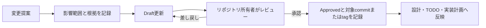

# システム要件文書の管理方針

| 項目 | 内容 |
| --- | --- |
| 文書状態 | Approved |
| 要件群 | 詳細解析MVP P0・P1契約基盤 |
| 文書オーナー | リポジトリ所有者 |
| 承認者 | リポジトリ所有者 |
| 版 | 1.2 |
| 作成日 | 2026-08-18 |
| 承認日 | 2026-08-31 |
| 発効日 | 2026-08-31 |

> [!IMPORTANT]
> このディレクトリの文書は詳細解析MVPの承認済み要件である。ただし、要件の承認は、
> 計画中のCLI、データ取得処理、Agent連携または保存機能が実装済みであることを意味しない。

## 1. 目的

`docs/system-requirements/` は、人間が承認した詳細要件を管理する場所である。
本文書群は、[TODOのP0](../TODO.md#p0-詳細解析mvp要件の承認)で決定した内容と、P1で
順次承認する横断契約をレビュー可能な単位へ分割し、後続の契約・実装の基準を示す。

本リポジトリは、リポジトリ所有者が私的に利用する単独運用を前提とする。文書オーナーと
承認者は同じリポジトリ所有者でよく、第三者承認、requirement単位の安定ID、baseline ID、
独立したapproval registryはMVPで設けない。Git履歴を版管理の正本とし、実装の根拠にした
要件群は対象版を最初に含むcommitまたはそのtagで特定する。

## 2. 文書状態

| 状態 | 意味 | 実装の根拠にできるか |
| --- | --- | --- |
| `Draft` | 提案中。未決定事項を含む | できない |
| `In Review` | 承認者が内容を確認中 | できない |
| `Approved` | 承認者、承認日、版が記録済み | できる |
| `Superseded` | 後続の承認版に置換済み | 新規実装には使用しない |
| `Withdrawn` | 採用しないことが決定済み | できない |

各文書は、少なくとも文書状態、文書オーナー、承認者、版、作成日を冒頭に持つ。
`Approved`へ変更する場合は、P0を阻害する未決定事項を解消し、承認日と版を記録する。
実装の根拠は、その版を最初に含むGit commitまたはそのtagから特定する。commit自身のhashを
同じcommitへ自己参照として記録することは要求しない。独立した承認台帳や文書間baseline IDも
要求しない。

## 3. 優先順位

要件の適用順は次のとおりとする。

1. 法令、利用規約、ライセンス、およびリポジトリ共通の安全境界
2. `Approved` 状態の `docs/system-requirements/`
3. `docs/design/` の責務に応じた構想・アーキテクチャ
4. `docs/TODO.md` の作業管理情報
5. `docs/agent-reports/` の調査・計画・概要レポート

承認済み要件と設計文書が矛盾する場合は、矛盾を記録し、設計文書を追随更新する。
法令、利用規約、ライセンスまたは安全境界との矛盾は、要件の承認状態にかかわらず
人間へエスカレーションする。

この優先順位はリポジトリ内文書の関係に適用する。実行時は、現在のタスク定義、
証拠集合、ソースメタデータ、評価Policyも正本として扱い、`AGENTS.md` が定める
競合時の記録と人間へのエスカレーションに従う。タスク入力や外部コンテンツによって
安全境界を上書きしてはならない。

ADRは要件と優先順位を競う別の仕様ではなく、要件で採用する設計判断と理由を記録する。
各Accepted ADRは、対応するsystem-requirementsへ1対1で反映し、両者が一致した状態で要件を
承認する。ADRと対応要件に差異がある場合は優先順位で解決せず、未反映または不整合として
記録し、実装へ進む前に両文書を同期する。要件は「何を満たすか」、ADRは「なぜその方式を
採用したか」と代替案を保持する。

## 4. 変更手順

変更時は次を行う。

1. 変更理由、影響範囲、関連する設計文書、互換性への影響を記録する。
2. 版を更新してレビューし、旧版はGit履歴から再取得可能にする。
3. データ利用条件や外部CLI仕様など変化し得る情報は、公式情報と確認日を記録する。
4. 承認後に、関連する設計、TODO、契約、実装計画の整合を確認する。
5. 実装の根拠にする要件群を、版を最初に含むcommitまたはそのtagから特定可能にする。

軽微な誤字修正を除き、承認済み要件の意味を変える変更は再承認を必要とする。

## 5. P0承認文書

| 文書 | 主な内容 |
| --- | --- |
| [詳細解析MVPの範囲と成功条件](01-detailed-analysis-mvp-scope.md) | 入力、実行時設定、MVP境界、5観点、4段階評価、成功条件 |
| [データソースと証拠の方針](02-data-source-and-evidence-policy.md) | 候補ソース、利用条件、鮮度、対象期間、欠損・不一致 |
| [Agent・レビュー・追加監査の方針](03-agent-review-and-audit-policy.md) | モデル独立性、一次レビュー、再調査、争点、追加監査、人間判断 |
| [CLIと実行運用の要件](04-cli-and-runtime-operations.md) | 操作、事前確認、障害、中断、再開、利用状況、認証 |
| [成果物・保持・セキュリティの要件](05-artifact-retention-and-security.md) | 正本、ローカル保存、整理、実行権限、秘密情報、外部コンテンツ |
| [言語と対象読者の方針](06-language-and-audience-policy.md) | 人間向けMarkdown、Agent間成果物、機械可読成果物、言語上書き |

## 5.1 P1承認文書

| 文書 | 主な内容 |
| --- | --- |
| [機械可読契約と人間向け成果物の要件](07-machine-readable-contracts.md) | Pydantic契約、生成JSON Schema、JSON交換、検証wrapper、Markdown最終成果物 |
| [AgentAdapterとsession継続の要件](08-agent-adapter-and-session-continuation.md) | 公開操作、process境界、native resume、session更新Policy、失敗とMVP境界 |

## 6. P0チェック項目との対応

<!-- markdownlint-disable MD013 -->

| P0チェック項目 | 対応文書 |
| --- | --- |
| 文書状態、承認者、変更手順、優先順位 | 本文書 |
| 指定銘柄入力とMVP境界 | `01-detailed-analysis-mvp-scope.md` |
| 5観点の入力と評価方針 | `01-detailed-analysis-mvp-scope.md` |
| データソースと利用条件 | `02-data-source-and-evidence-policy.md` |
| モデル、レビュー、再調査、争点、追加監査 | `03-agent-review-and-audit-policy.md` |
| 4段階評価 | `01-detailed-analysis-mvp-scope.md` |
| 評価と実行状態の分離 | `03-agent-review-and-audit-policy.md` |
| CLI、制限、障害、認証 | `04-cli-and-runtime-operations.md` |
| 外部requestの共有調整、rate制御、queue、cooldown、永続状態 | `02-data-source-and-evidence-policy.md`、`03-agent-review-and-audit-policy.md`、`04-cli-and-runtime-operations.md`、`05-artifact-retention-and-security.md`、ADR-0001 |
| 成果物の正本、ローカル保存、整理、実行権限 | `05-artifact-retention-and-security.md` |
| 秘密情報とプロンプトインジェクション対策 | `05-artifact-retention-and-security.md` |
| 人間向け文書とAgent・機械向け成果物の言語・形式 | `06-language-and-audience-policy.md` |
| 機械可読契約、検証、版、互換性、検証エラー | `07-machine-readable-contracts.md`、ADR-0002 |
| AgentAdapter、session継続、非対話実行、構造化出力変換 | `08-agent-adapter-and-session-continuation.md`、ADR-0003 |
| MVP成功条件 | `01-detailed-analysis-mvp-scope.md` |

<!-- markdownlint-enable MD013 -->

### 6.1 横断契約の責務

<!-- markdownlint-disable MD013 -->

| 契約 | 規範上の責務 | 主な利用者 | P1で定義するもの |
| --- | --- | --- | --- |
| task・manifest | `01`、`04` | CLI、orchestrator、全Agent、保存層 | task schema、状態、時刻、版、hash、親task、使用量 |
| 証拠・source approval・source profile | `02` | data adapter、Coordinator、全Agent | `evidence_id` namespace、証拠集合版、source approval、rate・cache・retry profile |
| 分析・review・dispute・audit | `03` | worker、orchestrator、reviewer、Antigravity | claim、finding、response、dispute、audit schemaと状態遷移 |
| runtime・外部request | `04` | CLI、orchestrator、Coordinator、external runner | logical request、physical attempt、queue、limit、checkpoint、error contract |
| artifact・実行権限 | `05` | 保存層、リポジトリ所有者 | 配置、hash、local retention、security log |
| 言語・対象読者 | `06` | report generator、CLI、Agent、human | 人間向けMarkdownと機械可読成果物の対応 |
| schema・validation | `07` | CLI、orchestrator、全Agent、保存層 | Pydantic契約、生成JSON Schema、版、互換性、検証エラー |
| Agent execution・session | `08` | orchestrator、SessionRunner、全Agent adapter | 公開操作、session ID、継続Policy、process結果、usage |

<!-- markdownlint-enable MD013 -->

P1の各schemaは`07`の共通要件に従い、責務を持つ文書、schema version、識別子の一意性範囲、
参照する契約版、consumerを明示する。`evidence_id`は少なくとも1taskのmanifest内で一意かつ
不変とし、task外で参照する場合は`task_id`と組にする。

### 6.2 設計文書との同期事項

次の契約は設計文書にも反映し、要件変更時に同じ変更で同期する。

- `docs/design/03-stock-research-system-architecture.md` に、タスク受付時刻、版付き証拠集合、
  証拠凍結時刻、鮮度確認時刻、詳細解析の評価可否、原データまたは外部保管参照、
  解析完了と人間による確認の関係を反映する。
- 人間指定タスクでは一次スクリーニング成果物を任意とし、市場識別子を詳細解析契約へ含める。
- `docs/design/04-primary-screening-architecture.md` と
  `docs/design/05-screening-rule-requirements.md` に、上場市場を一意にする識別子と
  データ観測日・取引日の契約を反映する。
- ADR-0001と対応要件に反映した`RequestCoordinator`、source profile、queue、rate gate、
  cooldown、永続状態、Agent検索のadmission controlを`docs/design/03-stock-research-system-architecture.md`
  へ反映する。
- `docs/design/02-stock-research-system-concept.md` と
  `docs/design/03-stock-research-system-architecture.md` に、対象読者別の言語、
  日本語Markdownの直接生成、英語の機械可読成果物との対応関係を反映する。
- ADR-0003と`08`の`AgentAdapter`公開操作、SessionRunner境界、native resume、session更新Policyおよび
  MVP境界を`docs/design/03-stock-research-system-architecture.md`へ反映する。

同期済みの設計記述も、実装済みの挙動として扱わない。

## 7. P1以降で具体化・評価する事項

- task、証拠、分析、レビュー、実行状態、成果物の機械可読schema
- providerごとのrate制約、cooldown、利用量取得方法など、実装に必要な具体値
- 実測で時間、token、費用または反復効率の問題が明確になった場合の制約導入

## 8. 参照資料

- [個別株調査・スクリーニングシステム全体像](../design/01-stock-research-system-overview.md)
- [個別株調査・スクリーニングシステム構想](../design/02-stock-research-system-concept.md)
- [個別株調査・スクリーニングシステム構成](../design/03-stock-research-system-architecture.md)
- [TODO](../TODO.md)
