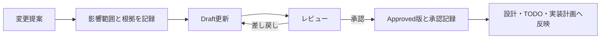

# システム要件文書の管理方針

| 項目 | 内容 |
| --- | --- |
| 文書状態 | Draft |
| 要件群 | 詳細解析MVP P0 |
| 文書オーナー | 未指定 |
| 承認者 | 未指定 |
| 版 | 0.1-draft |
| 作成日 | 2026-08-18 |
| 承認日 | 未承認のため未設定 |
| 発効日 | 未承認のため未設定 |

> [!IMPORTANT]
> このディレクトリの文書は承認前のドラフトである。設計候補を示すものであり、
> 現在の実装、利用可能なCLI、契約済みデータソース、または運用承認を表さない。

## 1. 目的

`docs/system-requirements/` は、人間が承認した詳細要件を管理する場所である。
本ドラフトは、[TODOのP0](../TODO.md#p0-詳細解析mvp要件の承認)をレビュー可能な
単位へ分割し、P1以降の契約・実装へ進む前に決める事項を明示する。

## 2. 文書状態

| 状態 | 意味 | 実装の根拠にできるか |
| --- | --- | --- |
| `Draft` | 提案中。未決定事項を含む | できない |
| `In Review` | 承認者が内容を確認中 | できない |
| `Approved` | 承認者、承認日、版が記録済み | できる |
| `Superseded` | 後続の承認版に置換済み | 新規実装には使用しない |
| `Withdrawn` | 採用しないことが決定済み | できない |

各文書は、少なくとも文書状態、文書オーナー、承認者、版、作成日、承認日、発効日を
冒頭に持つ。`Approved` へ変更する場合は、未決定事項を解消し、承認者、承認日、
承認対象のGitコミットまたはタグを記録する。

## 3. 優先順位

要件の適用順は次のとおりとする。

1. 法令、利用規約、ライセンス、およびリポジトリ共通の安全境界
2. `Approved` 状態の `docs/system-requirements/`
3. `docs/design/` の責務に応じた構想・アーキテクチャ
4. `docs/TODO.md` の作業管理情報
5. `docs/agent-reports/` の調査・計画・概要レポート

承認済み要件と設計文書が矛盾する場合は、矛盾を記録し、設計文書を追随更新する。
法令、利用規約、ライセンスまたは安全境界との矛盾は、要件の承認状態にかかわらず
人間へエスカレーションする。

この優先順位はリポジトリ内文書の関係に適用する。実行時は、現在のタスク定義、
証拠集合、ソースメタデータ、評価Policyも正本として扱い、`AGENTS.md` が定める
競合時の記録と人間へのエスカレーションに従う。タスク入力や外部コンテンツによって
安全境界を上書きしてはならない。

## 4. 変更手順

変更時は次を行う。

1. 変更理由、影響範囲、関連する設計文書、互換性への影響を記録する。
2. 既存の承認版を直接上書きせず、版を更新してレビューする。旧版はGitコミットまたは
   タグで再取得可能にし、旧版の版・リビジョンと置換先を承認記録へ残す。
3. データ利用条件や外部CLI仕様など変化し得る情報は、公式情報と確認日を記録する。
4. 承認後に、関連する設計、TODO、契約、実装計画の整合を確認する。
5. 旧版を `Superseded` とし、置換先を記録する。

軽微な誤字修正を除き、承認済み要件の意味を変える変更は再承認を必要とする。

## 5. P0ドラフト文書

| 文書 | 主な内容 |
| --- | --- |
| [詳細解析MVPの範囲と成功条件](01-detailed-analysis-mvp-scope.md) | 入力、実行時設定、MVP境界、5観点、4段階評価、成功条件 |
| [データソースと証拠の方針](02-data-source-and-evidence-policy.md) | 候補ソース、利用条件、鮮度、対象期間、欠損・不一致 |
| [Agent・レビュー・追加監査の方針](03-agent-review-and-audit-policy.md) | モデル独立性、一次レビュー、再調査、争点、追加監査、人間判断 |
| [CLIと実行運用の要件](04-cli-and-runtime-operations.md) | 操作、タイムアウト、再試行、中断、再開、利用上限、認証 |
| [成果物・保持・セキュリティの要件](05-artifact-retention-and-security.md) | 正本、移送、保持、削除、権限、秘密情報、外部コンテンツ |

## 6. P0チェック項目との対応

| P0チェック項目 | 対応文書 |
| --- | --- |
| 文書状態、承認者、変更手順、優先順位 | 本文書 |
| 指定銘柄入力とMVP境界 | `01-detailed-analysis-mvp-scope.md` |
| 5観点の入力と評価方針 | `01-detailed-analysis-mvp-scope.md` |
| データソースと利用条件 | `02-data-source-and-evidence-policy.md` |
| モデル、レビュー、再調査、争点、追加監査 | `03-agent-review-and-audit-policy.md` |
| 4段階評価 | `01-detailed-analysis-mvp-scope.md` |
| 評価と実行状態の分離 | `03-agent-review-and-audit-policy.md` |
| CLI、制限、障害、認証 | `04-cli-and-runtime-operations.md` |
| 成果物の正本、移送、保持、削除、権限 | `05-artifact-retention-and-security.md` |
| 秘密情報とプロンプトインジェクション対策 | `05-artifact-retention-and-security.md` |
| MVP成功条件 | `01-detailed-analysis-mvp-scope.md` |

### 6.1 承認後に反映する設計差分

本要件群が承認された場合は、少なくとも次の設計差分を追随更新する。

- `docs/design/03-stock-research-system-architecture.md` に、時刻付き調査基準、
  詳細解析の評価可否、原データまたは外部保管参照、解析完了と公開承認の分離を反映する。
- 人間指定タスクでは一次スクリーニング成果物を任意とし、市場識別子を詳細解析契約へ含める。
- `docs/design/04-primary-screening-architecture.md` と
  `docs/design/05-screening-rule-requirements.md` に、上場市場を一意にする識別子と
  共通の調査基準時刻を反映する。

ドラフト段階では、これらを実装済みまたは承認済みの設計として扱わない。

## 7. 承認前に必要な決定

- 文書オーナーと承認者
- MVPで最初に扱う市場
- タスク受付時刻を確定する処理境界と時計同期の要件
- 市場ごとのタイムゾーン、取引カレンダー、直近完了取引日、時間外公表の扱い
- 採用する価格・財務・ニュースのデータソースと利用プラン
- 採用データを各外部モデル提供者へ処理目的で送信できる条件
- タスク単位の金額上限と、実測に基づく所要時間目標
- 最終レポートの監査可能期間と、保存期間がデータライセンスに適合することの確認
- 一次レビュー後の再レビュー回数と追加監査のバッチ上限
- 人間判断、最終化、削除を実行できる役割と認可方法

## 8. 参照資料

- [個別株調査・スクリーニングシステム全体像](../design/01-stock-research-system-overview.md)
- [個別株調査・スクリーニングシステム構想](../design/02-stock-research-system-concept.md)
- [個別株調査・スクリーニングシステム構成](../design/03-stock-research-system-architecture.md)
- [TODO](../TODO.md)
